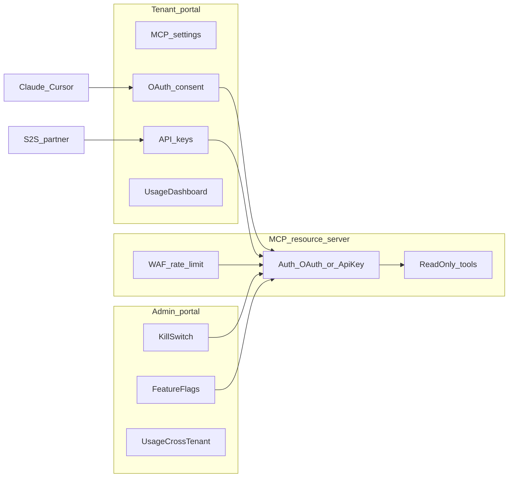

# Servidor MCP públic (SaaS multi-tenant)

> **Estat:** pla documental creat, **cap fase implementada** — veure [`STATUS.md`](./STATUS.md) (2026-09-15)  
> **Ordre d’implementació:** [`EXECUTION.md`](./EXECUTION.md)  
> **Depèn de:** Supabase Auth (OAuth 2.1 Server), RLS multi-tenant existent, `tenant-portal` + `admin-portal`  
> **Objectiu:** exposar un subconjunt de dades/tools del tenant a agents externs (Claude, Cursor, ChatGPT…) amb OAuth per usuaris i API keys per S2S, amb aïllament absolut i controls de plataforma.

| Document | Contingut |
|----------|-----------|
| [`01-architecture-and-security.md`](./01-architecture-and-security.md) | Principis, auth, jerarquia d’activació, rate limit, errors apresos |
| [`02-data-model.md`](./02-data-model.md) | DDL, feature flags, audit events, usage logs |
| [`03-phases-and-backlog.md`](./03-phases-and-backlog.md) | Epics MCP-0…MCP-12, dependències, fora d’abast |
| [`04-acceptance-and-gates.md`](./04-acceptance-and-gates.md) | Criteris d’acceptació i Go/No-Go |
| [`EXECUTION.md`](./EXECUTION.md) | Font de veritat de l’ordre real de treball (agent IA) |
| [`STATUS.md`](./STATUS.md) | Estat per epic; actualitzar durant la implementació |
| [`plan_mcp_server.md`](./plan_mcp_server.md) | Guia històrica de hardening (referència; decisions noves manen aquí) |

---

## Idea central

Un **resource server MCP** remot (Streamable HTTP, stateless) que:

1. Autentica **usuaris de l’app** via **OAuth 2.1 + PKCE** (Supabase Auth = authorization server).
2. Autentica **integracions machine** via **API keys** hashed (`mcp_live_` / `mcp_test_`).
3. **No** accepta JWT de sessió del portal (confused deputy).
4. Resol tenancy amb **URL + `mcp_client_grants`** (OAuth) o binding a la key (S2S), mai amb arguments de tool.
5. Executa tools **read-only** (MVP) amb client RLS + `WHERE tenant_id` (+ `site_id` si aplica).

---

## Decisions tancades

| Decisió | Valor |
|--------|--------|
| Modes d’auth | **OAuth usuaris** + **API keys S2S** només |
| JWT sessió portal al MCP | **Prohibit** |
| Activació | Cascada fail-closed: kill switch → flags globals → override admin per tenant → settings tenant |
| Submodes | `mcp_oauth_enabled` i `mcp_api_keys_enabled` independents (global + per tenant) |
| Tenancy OAuth | Grant table `(user_id, oauth_client_id, tenant_id, site_id?)` + URL scoped |
| Tools MVP | **Read-only**; allowlist explícita ≠ catàleg del xat intern |
| Transport | Streamable HTTP **stateless** |
| Hosting MVP | Edge Function + proxy públic estable `/mcp` (WAF); consent UI al `tenant-portal` |
| Audit cicle de vida | `data.audit_logs` |
| Telemetria requests | `mcp_usage_logs` (no audit) |
| Rate limit pre-auth | WAF / Upstash — **no** memòria local d’Edge Instances |
| Relació amb xat IA | Producte separat; veure [`../ai/chat_tools_function_calling_plan.md`](../ai/chat_tools_function_calling_plan.md) |

---

## Capes d’activació

1. `MCP_SERVER_FORCE_DISABLED` (env) — emergència.  
2. Feature flags plataforma: `mcp_enabled`, `mcp_oauth_enabled`, `mcp_api_keys_enabled`.  
3. Override per tenant (admin-portal).  
4. Settings del tenant (tenant-portal) + política d’usuaris OAuth.  
5. Credencial vàlida (grant OAuth o API key) + membresia / binding.

---

## Fora d’abast (MVP)

- Tools d’escriptura / `propose_*` sense confirmació humana.  
- Connectors MCP de tercers dins del xat intern.  
- Scopes OAuth custom de Supabase (no existents; usar grants + `allowed_tools`).  
- Billing per request MCP (es pot afegir després sobre usage logs).

---

## Referències externes

- [Makerkit — Build an MCP Server with OAuth](https://makerkit.dev/blog/tutorials/build-mcp-server-oauth)  
- [Supabase OAuth 2.1 Server](https://supabase.com/docs/guides/auth/oauth-server)  
- MCP Authorization / RFC 9728 Protected Resource Metadata
