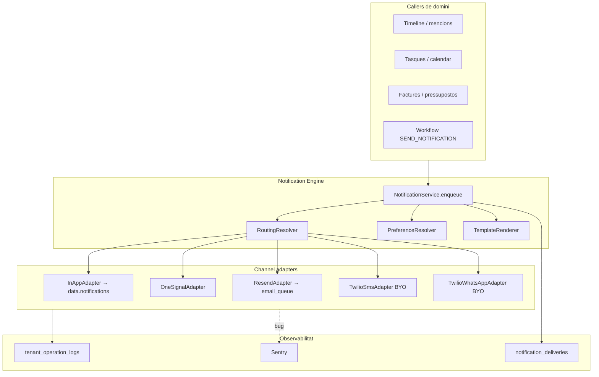

# Motor de Notificacions — Pla d'arquitectura i implementació

**Data:** 2026-06-20 (revisat després de peer review)  
**Estat:** F2 tancat (2026-06-23) — `MENTION_CREATED` via Entity Timeline F1; F3 parcial (digest push mencions, 2026-06-23)  
**Context:** [README.md](./README.md) · Roadmap [Sprint 5–6](../platform-roadmap-prioritat-2026.md)

---

## 1. Visió i principis

El **Notification Engine** és una **façana única** (`NotificationService.send()`) davant de la qual la resta de l'aplicació només demana: *«Avisa el destinatari X de l'esdeveniment Y amb aquestes dades»*. El motor resol:

- **Qui** rep (usuari intern vs contacte extern)
- **Per quin canal** (in-app, push, email, SMS, WhatsApp)
- **Com** enviar (OneSignal, Resend, Twilio BYO)
- **Què fer si falla** (log a `tenant_operation_logs`, **sense trencar** el flux principal)

### Dos mons de destinatari

| Món | Identificador | Canals típics | Proveïdor |
|-----|---------------|---------------|-----------|
| **Intern** | `profiles.id` (membre del tenant) | In-app, Push, Email | `data.notifications` + OneSignal + Resend |
| **Extern** | `contacts.id` o telèfon/email directe | SMS, WhatsApp, Email | Twilio BYO + Resend (fallback) |

> OneSignal només per usuaris interns: l'SDK gestiona device tokens; nosaltres mapegem `external_user_id = profiles.id`.

### Principis d'enginyeria

1. **Fire-and-forget des del domini** — crear comentari, tasca, factura, etc. no espera l'enviament.
2. **Errors de negoci → `tenant_operation_logs`** — credencial Twilio caducada, saldo esgotat, email rebutjat.
3. **Bugs / infra → Sentry** — via `captureException` (mai secrets ni PII completa).
4. **Idempotència preventiva amb lease** — claim abans d'enviar + `claim_expires_at` per evitar bloquejos permanents després d'un crash.
5. **Secrets BYO al Vault** — mateix patró que `tenant_ai_config` (`vault.create_secret` + `secret_id` opac a Postgres).

---

## 2. Arquitectura lògica



### Flux asíncron (des de F1 — obligatori)

```
Domini → NotificationService.enqueue() → PGMQ notification_dispatch_queue
       → Edge Function process-notification-queue → adapters → logs
```

> **Decisió revisada:** no implementar `send()` síncron a producció. Un `send()` síncron (OneSignal lent ~800ms) bloqueja la resposta HTTP del caller i la migració a cua «més endavant» rarament arriba. **F1 inclou cua mínima** (`process-notification-queue` sense retry sofisticat); F3 afegeix DLQ i reintents configurables.

El caller de domini només fa `enqueue()` i retorna; mai espera l'enviament real.

### Planificador multi-tenant del worker (obligatori amb escala)

Amb centenars de tenants, un únic `read N messages` pot deixar un tenant sorollós monopolitzant la cua. El worker `process-notification-queue` ha d'aplicar fairness:

1. Llegir batch de PGMQ via `api.read_queue_batch` (límit real per crida: 50 missatges, `visibility_timeout = 120s`).
2. Agrupar per `tenant_id`.
3. Processar en round-robin: màx 10 missatges/tenant per passada.
4. Missatges del tenant que superen el límit: **retornar-los immediatament a la cua** via `api.set_queue_message_vt(queue, msg_id, 0)` — no fer ack; la visibilitat es restaura al moment.
5. Registrar mètriques de latència per tenant (`p95 queue delay`) per detectar starvation.

> **`api.set_queue_message_vt` és l'operació clau**: sense ella, els missatges "tornats" romanen invisibles fins que expira el `visibility_timeout` original (fins a 2 min).

Sense fairness, els tenants petits patiran latències altes sota pics d'un tenant gran.

**Timeout per adapter (obligatori):** cada crida externa (OneSignal, Twilio, Resend) ha de tenir un `AbortSignal` amb timeout individual (p.ex. 25s). Sense timeout, un proveïdor lent pot bloquejar el worker fins al kill global de l'EF als 60s, deixant missatges no ackejats.

```typescript
// Patró per cada adapter:
const signal = AbortSignal.timeout(25_000);
const res = await fetch(url, { method: "POST", body, headers, signal });
// Si expira → throws DOMException('AbortError') → catch → status: failed
```

---

## 3. Fases d'implementació

| Fase | Abast | Entregables |
|------|--------|-------------|
| **F0** | Fundació SQL | Vault Twilio, `tenant_push_config` (preparada), preferències, catàleg amb `entity_type`, `notification_deliveries` **particionada**, quotes (taula buida) |
| **F1** | Motor V1 + cua | `NotificationService.enqueue()`, PGMQ + `process-notification-queue` (mínim), routing in-app + OneSignal + Resend, idempotència **preventiva**, cache credencials per invocació |
| **F2** | Externs Twilio | Adapters SMS/WhatsApp BYO, `twilio-status-callback`, UI settings tenant, smoke test + **preview de prova** |
| **F3** | Fiabilitat | DLQ, reintents configurables, quotes actives, digest/batching, quiet hours |
| **F4** | Polish | UI `/settings/notifications` completa, opt-out contactes, mètriques admin, retenció/TTL |

Alineació roadmap: **Sprint 5 = F0+F1**, **Sprint 6 = F2**.

### 3.1 Estat d'implementació (2026-06-23) — F1 tancat

| Component | Estat |
|-----------|--------|
| Migracions F0/F1 (`notification_engine_*`) | Fet |
| RPCs worker (`notification_worker_rpcs`) — escriptura `data.*` sense exposar schema | Fet |
| `NotificationService` + adapters + `process-notification-queue` | Fet |
| `QueueRunner.preprocessBatch` (fairness multi-tenant) | Fet |
| Productor `TASK_ASSIGNED` (trigger `data.tasks` INSERT/UPDATE) | Fet |
| Polish `TASK_ASSIGNED`: cos amb títol de tasca + deep link `/projects/{project_id}` | Fet |
| Camp **assignee** al `TaskForm` del tenant-portal | Fet |
| Recordatori email → **assignee** si `tasks.assignee_id` (sinó owner) | Fet |
| `MENTION_CREATED` (timeline) | **Fet** — `enqueue_entity_comment_notifications` + smoke `DEV_RUNBOOK.md` |
| **`LEAD_RECEIVED`** → motor (`submit_public_lead`) | Fet |
| **`enqueue_signing_notification`** → motor | Fet |
| UI `/settings/notifications` | Fet |
| `twilio-status-callback` + OneSignal BYO | Fet |

**F1 — cas d'ús real integrat:** `TASK_ASSIGNED` (creació/edició de tasca amb assignee diferent de l'actor).

**Decisió de producte (tasques de projecte):**

- **Creació amb assignee** → `notification_dispatch_queue` → `TASK_ASSIGNED` (in-app + push segons catàleg).
- **Recordatori abans del `due_date`** → `reminders_queue` (sense canvi d'arquitectura) → email a l'**assignee**; si no n'hi ha, al creador de l'event.
- **No** migrar recordatoris de calendari al motor de notificacions (programació temporal ≠ esdeveniment immediat).

### 3.2 Backlog F2 (restant)

| # | Item | Estat |
|---|------|--------|
| F2.1 | UI `/settings/notifications` | **Fet** |
| F2.2 | `twilio-status-callback` | **Fet** (bàsic; enllaçar StatusCallback als adapters SMS) |
| F2.3 | Twilio BYO admin | **Fet** (tab Integracions) |
| F2.4 | OneSignal BYO per tenant | **Fet** |
| F2.5 | Migrar `leads_notification_queue` | **Fet** (owners → motor; cua = postprocess) |
| F2.6 | Migrar `enqueue_signing_notification` | **Fet** |
| F2.7 | `MENTION_CREATED` | **Fet** (Entity Timeline F1 + deep link) |
| F2.8 | Smoke tests E2E | Veure `DEV_RUNBOOK.md` § Entity Timeline Fase 1 |

### 3.3 F3 parcial (2026-06-23)

| # | Item | Estat |
|---|------|--------|
| F3.1 | Digest push `MENTION_CREATED` (finestra 5 min, `digest_group_key`) | **Fet** — `notification_digest_buckets` + flush al worker |
| F3.2 | Quiet hours | Pendent |
| F3.3 | Quotes actives / DLQ | Pendent |

### Prioritats de disseny (revisió externa)

| Prioritat | Punt | Acció |
|-----------|------|--------|
| **Abans d'implementar** | Cua des de F1 | No síncron per defecte |
| **Abans d'implementar** | Idempotència preventiva | `claimDelivery` amb lease/TTL abans d'enviar |
| **Abans d'implementar** | `entity_type` al catàleg | Deep links i Timeline |
| **Abans d'implementar** | Particionament `notification_deliveries` | Des de la migració inicial |
| **Dissenyar ara, implementar després** | Webhook Twilio delivery | F2 |
| **Dissenyar ara, implementar després** | Quotes per tenant | F3 |
| **Dissenyar ara, implementar després** | `digest_group_key` | **F3.1 fet** — buckets + flush worker |
| **Dissenyar ara, implementar després** | Opt-out contactes complet | F4 |

---

## 4. Esquema de base de dades (PostgreSQL)

### 4.1 Enums

```sql
-- Migració proposada: YYYYMMDD_notification_engine_core.sql

DO $$ BEGIN
  CREATE TYPE data.notification_recipient_kind AS ENUM (
    'tenant_member',   -- profiles.id
    'contact',         -- contacts.id
    'raw_address'      -- email/telèfon directe (sense FK)
  );
EXCEPTION WHEN duplicate_object THEN NULL; END $$;

DO $$ BEGIN
  CREATE TYPE data.notification_channel AS ENUM (
    'in_app', 'push', 'email', 'sms', 'whatsapp'
  );
EXCEPTION WHEN duplicate_object THEN NULL; END $$;

DO $$ BEGIN
  CREATE TYPE data.notification_delivery_status AS ENUM (
    'pending', 'queued', 'sent', 'delivered', 'failed', 'skipped', 'cancelled'
  );
EXCEPTION WHEN duplicate_object THEN NULL; END $$;
```

### 4.2 Credencials Twilio BYO (per tenant)

Patró **Vault** (com `tenant_ai_config.ai_key_secret_id`):

```sql
CREATE TABLE data.tenant_twilio_config (
  tenant_id                uuid PRIMARY KEY REFERENCES data.tenants(id) ON DELETE CASCADE,
  account_sid              text NOT NULL,
  auth_token_secret_id     uuid NOT NULL,          -- vault.secrets.id (auth token)
  sms_from_number          text,                   -- E.164, ex: +34900111222
  whatsapp_from_number     text,                   -- whatsapp:+34900111222
  messaging_service_sid    text,                   -- opcional (Twilio Messaging Service)
  is_enabled               boolean NOT NULL DEFAULT false,
  is_verified              boolean NOT NULL DEFAULT false,
  last_verified_at         timestamptz,
  last_error_code          text,
  last_error_at            timestamptz,
  created_at               timestamptz NOT NULL DEFAULT now(),
  updated_at               timestamptz NOT NULL DEFAULT now()
);

COMMENT ON TABLE data.tenant_twilio_config IS
  'Credencials Twilio BYO per tenant. El auth token mai es guarda en clar — només secret_id al Vault.';
```

**RPC guardar (owner/manager):**

```sql
CREATE OR REPLACE FUNCTION api.upsert_tenant_twilio_config(
  p_tenant_id            uuid,
  p_account_sid          text,
  p_auth_token           text,          -- només entra per aquesta RPC; es guarda al Vault
  p_sms_from_number      text DEFAULT NULL,
  p_whatsapp_from_number text DEFAULT NULL,
  p_messaging_service_sid text DEFAULT NULL
)
RETURNS void
LANGUAGE plpgsql
SECURITY DEFINER
SET search_path = data, vault, public
AS $$
DECLARE
  v_secret_id uuid;
  v_existing  uuid;
BEGIN
  -- Validar permisos owner/manager (mateix patró que tenant_ai_config)
  IF NOT data.is_tenant_manager(p_tenant_id, auth.uid()) THEN
    RAISE EXCEPTION 'forbidden';
  END IF;

  SELECT auth_token_secret_id INTO v_existing
  FROM data.tenant_twilio_config WHERE tenant_id = p_tenant_id;

  IF v_existing IS NOT NULL THEN
    PERFORM vault.update_secret(v_existing, p_auth_token,
      'twilio_' || p_tenant_id::text, 'Twilio auth token (BYO)');
    v_secret_id := v_existing;
  ELSE
    -- Crear el secret DINS de BEGIN/EXCEPTION per fer cleanup si l'INSERT falla
    BEGIN
      v_secret_id := vault.create_secret(p_auth_token,
        'twilio_' || p_tenant_id::text, 'Twilio auth token (BYO)');
    EXCEPTION WHEN OTHERS THEN
      RAISE EXCEPTION 'No s''ha pogut crear el secret al Vault: %', SQLERRM;
    END;
  END IF;

  BEGIN
    INSERT INTO data.tenant_twilio_config (
    tenant_id, account_sid, auth_token_secret_id,
    sms_from_number, whatsapp_from_number, messaging_service_sid,
    is_enabled, updated_at
  ) VALUES (
    p_tenant_id, p_account_sid, v_secret_id,
    p_sms_from_number, p_whatsapp_from_number, p_messaging_service_sid,
    true, now()
  )
  ON CONFLICT (tenant_id) DO UPDATE SET
    account_sid = EXCLUDED.account_sid,
    auth_token_secret_id = EXCLUDED.auth_token_secret_id,
    sms_from_number = EXCLUDED.sms_from_number,
    whatsapp_from_number = EXCLUDED.whatsapp_from_number,
    messaging_service_sid = EXCLUDED.messaging_service_sid,
    is_enabled = true,
    updated_at = now();
  EXCEPTION WHEN OTHERS THEN
    -- Si l'INSERT/UPDATE falla i el secret era NOU, fer cleanup del Vault
    IF v_existing IS NULL THEN
      PERFORM vault.delete_secret(v_secret_id);
    END IF;
    RAISE;
  END;
END;
$$;
```

**RPC llegir credencials (només `service_role` / Edge Functions):**

```sql
CREATE OR REPLACE FUNCTION api.get_tenant_twilio_credentials_service(p_tenant_id uuid)
RETURNS jsonb
LANGUAGE plpgsql
SECURITY DEFINER
SET search_path = data, vault, public
AS $$
DECLARE
  v_row record;
  v_token text;
BEGIN
  IF COALESCE(auth.role(), '') <> 'service_role' THEN
    RAISE EXCEPTION 'forbidden';
  END IF;

  SELECT * INTO v_row FROM data.tenant_twilio_config
  WHERE tenant_id = p_tenant_id AND is_enabled = true;

  IF NOT FOUND THEN RETURN NULL; END IF;

  SELECT decrypted_secret INTO v_token
  FROM vault.decrypted_secrets WHERE id = v_row.auth_token_secret_id;

  RETURN jsonb_build_object(
    'account_sid', v_row.account_sid,
    'auth_token', v_token,
    'sms_from_number', v_row.sms_from_number,
    'whatsapp_from_number', v_row.whatsapp_from_number,
    'messaging_service_sid', v_row.messaging_service_sid
  );
END;
$$;
```

> **Nota:** `account_sid` pot quedar en clar (no és secret crític sol). El **auth token** sempre al Vault.

### 4.3 Preferències de notificació

Model **flexible per esdeveniment i canal**, amb herència tenant → usuari/contacte.

```sql
CREATE TABLE data.notification_event_catalog (
  event_code          text PRIMARY KEY,     -- ex: INVOICE_GENERATED, TASK_ASSIGNED
  category            text NOT NULL,        -- billing | operations | hr | system
  entity_type         text NOT NULL,        -- task | entity_comment | invoice | intervention | ...
  deep_link_template  text,                 -- ex: /tasks/{entity_id} — placeholders del payload
  default_channels    data.notification_channel[] NOT NULL DEFAULT '{in_app}',
  requires_legal      boolean NOT NULL DEFAULT false,  -- si true, email no es pot desactivar
  digest_eligible     boolean NOT NULL DEFAULT false,  -- true si es pot agrupar (MENTION_CREATED)
  description         text
);

COMMENT ON COLUMN data.notification_event_catalog.entity_type IS
  'Tipus d''entitat associat a l''esdeveniment per deep links i Timeline. Obligatori des de F0.';

CREATE TABLE data.notification_preferences (
  id                uuid PRIMARY KEY DEFAULT gen_random_uuid(),
  tenant_id         uuid NOT NULL REFERENCES data.tenants(id) ON DELETE CASCADE,
  recipient_kind    data.notification_recipient_kind NOT NULL,
  recipient_id      uuid,                 -- profiles.id o contacts.id; NULL si raw_address
  raw_email         text,
  raw_phone_e164    text,
  event_code        text REFERENCES data.notification_event_catalog(event_code),
    -- NULL = preferències globals del destinatari
  channels_enabled  data.notification_channel[] NOT NULL,
  preferred_channel data.notification_channel,  -- per contactes externs: sms | whatsapp | email
  quiet_hours       jsonb,                -- { "start": "22:00", "end": "08:00", "tz": "Europe/Madrid" }
  locale            text DEFAULT 'ca',
  created_at        timestamptz NOT NULL DEFAULT now(),
  updated_at        timestamptz NOT NULL DEFAULT now(),
  CONSTRAINT notification_preferences_subject_chk CHECK (
    (recipient_kind = 'tenant_member' AND recipient_id IS NOT NULL)
    OR (recipient_kind = 'contact' AND recipient_id IS NOT NULL)
    OR (recipient_kind = 'raw_address' AND (raw_email IS NOT NULL OR raw_phone_e164 IS NOT NULL))
  )
);

-- Membres interns
CREATE UNIQUE INDEX uq_notification_preferences_member_event
  ON data.notification_preferences (tenant_id, recipient_kind, recipient_id, event_code)
  WHERE recipient_kind = 'tenant_member' AND event_code IS NOT NULL;

CREATE UNIQUE INDEX uq_notification_preferences_member_global
  ON data.notification_preferences (tenant_id, recipient_kind, recipient_id)
  WHERE recipient_kind = 'tenant_member' AND event_code IS NULL;

-- Contactes externs (OBLIGATORI — sense això, bugs creen preferències duplicades)
CREATE UNIQUE INDEX uq_notification_preferences_contact_event
  ON data.notification_preferences (tenant_id, recipient_kind, recipient_id, event_code)
  WHERE recipient_kind = 'contact' AND event_code IS NOT NULL;

CREATE UNIQUE INDEX uq_notification_preferences_contact_global
  ON data.notification_preferences (tenant_id, recipient_kind, recipient_id)
  WHERE recipient_kind = 'contact' AND event_code IS NULL;
```

### 4.3.1 RPC de routing (F1)

Per eliminar N+1 queries al resolver, concentrar la resolució en una sola RPC amb `service_role`.

```sql
CREATE OR REPLACE FUNCTION api.resolve_notification_routing_context(
  p_tenant_id      uuid,
  p_event_code     text,
  p_recipient_id   uuid,
  p_recipient_kind data.notification_recipient_kind
)
RETURNS jsonb
LANGUAGE plpgsql
SECURITY DEFINER
SET search_path = data, public
AS $$
DECLARE
  v_prefs     jsonb;
  v_catalog   jsonb;
  v_opted_out text[] := ARRAY[]::text[];
  v_twilio_enabled boolean := false;
BEGIN
  IF COALESCE(auth.role(), '') <> 'service_role' THEN
    RAISE EXCEPTION 'forbidden';
  END IF;

  -- Preferència específica > global
  SELECT jsonb_build_object(
    'channelsEnabled',  x.channels_enabled,
    'preferredChannel', x.preferred_channel,
    'quietHours',       x.quiet_hours,
    'locale',           COALESCE(x.locale, 'ca')
  )
  INTO v_prefs
  FROM (
    SELECT channels_enabled, preferred_channel, quiet_hours, locale
    FROM data.notification_preferences
    WHERE tenant_id = p_tenant_id
      AND recipient_kind = p_recipient_kind
      AND recipient_id = p_recipient_id
      AND (event_code = p_event_code OR event_code IS NULL)
    ORDER BY (event_code = p_event_code) DESC, updated_at DESC
    LIMIT 1
  ) AS x;

  SELECT jsonb_build_object(
    'defaultChannels',  default_channels,
    'requiresLegal',    requires_legal,
    'entityType',       entity_type,
    'deepLinkTemplate', deep_link_template,
    'digestEligible',   digest_eligible
  )
  INTO v_catalog
  FROM data.notification_event_catalog
  WHERE event_code = p_event_code;

  -- Opt-outs només si el destinatari és contacte extern
  IF p_recipient_kind = 'contact' THEN
    SELECT COALESCE(array_agg(DISTINCT c.channel::text), ARRAY[]::text[])
    INTO v_opted_out
    FROM data.contact_notification_consents c
    WHERE c.tenant_id = p_tenant_id
      AND c.contact_id = p_recipient_id
      AND c.opted_out = true
      AND (c.event_code = p_event_code OR c.event_code IS NULL);
  END IF;

  SELECT EXISTS (
    SELECT 1
    FROM data.tenant_twilio_config t
    WHERE t.tenant_id = p_tenant_id
      AND t.is_enabled = true
  ) INTO v_twilio_enabled;

  RETURN jsonb_build_object(
    'prefs',            COALESCE(v_prefs, '{}'::jsonb),
    'eventMeta',        COALESCE(v_catalog, '{}'::jsonb),
    'optedOutChannels', to_jsonb(v_opted_out),
    'twilioEnabled',    v_twilio_enabled
  );
END;
$$;

REVOKE ALL ON FUNCTION api.resolve_notification_routing_context(uuid, text, uuid, data.notification_recipient_kind) FROM PUBLIC;
REVOKE ALL ON FUNCTION api.resolve_notification_routing_context(uuid, text, uuid, data.notification_recipient_kind) FROM authenticated;
REVOKE ALL ON FUNCTION api.resolve_notification_routing_context(uuid, text, uuid, data.notification_recipient_kind) FROM anon;
GRANT EXECUTE ON FUNCTION api.resolve_notification_routing_context(uuid, text, uuid, data.notification_recipient_kind) TO service_role;
```

**Resolució de preferències (ordre):**

1. Preferència específica `(recipient, event_code)`
2. Preferència global `(recipient, event_code IS NULL)`
3. `notification_event_catalog.default_channels`
4. Regles del tenant (`tenants.metadata.notification_defaults` — opcional)

### 4.4 Registre d'enviaments (outbox / auditoria)

**Escalabilitat:** amb ~20k files/dia (100 tenants × 20 usuaris × 10 events), la taula creix ~7M files/any. Particionar per rang de `created_at` **des de la migració inicial** (mensual o trimestral), amb **creació automàtica de particions futures** + partició `DEFAULT` per evitar errors d'insert quan expira el rang actual.

**Idempotència vs particionament:** a Postgres, `UNIQUE` en una taula particionada ha d'incloure la clau de partició. Per això se separen dues responsabilitats:

```sql
-- Claims petits, NO particionats — idempotència preventiva amb lease
CREATE TABLE data.notification_delivery_claims (
  tenant_id           uuid NOT NULL REFERENCES data.tenants(id) ON DELETE CASCADE,
  correlation_id      text NOT NULL,
  channel             data.notification_channel NOT NULL,
  delivery_id         uuid NOT NULL,
  claim_token         uuid NOT NULL DEFAULT gen_random_uuid(),
  status              text NOT NULL DEFAULT 'claimed' CHECK (status IN ('claimed', 'sending', 'sent', 'failed')),
  claimed_at          timestamptz NOT NULL DEFAULT now(),
  claim_expires_at    timestamptz NOT NULL DEFAULT (now() + interval '90 seconds'),
  provider_message_id text,
  last_error_code     text,
  updated_at          timestamptz NOT NULL DEFAULT now(),
  PRIMARY KEY (tenant_id, correlation_id, channel)
);

-- Cleanup periòdic: job pg_cron diari que esborra claims ja resolts i prou antics.
-- Sense cleanup, la taula creix indefinidament (~40k files/dia a 100 tenants).
CREATE INDEX idx_delivery_claims_cleanup
  ON data.notification_delivery_claims (claim_expires_at)
  WHERE status IN ('sent', 'failed');

-- Nota: afegir a pg_cron (o migració recurrent):
-- DELETE FROM data.notification_delivery_claims
-- WHERE status IN ('sent', 'failed') AND claim_expires_at < now() - interval '7 days';

-- RPC atòmica per fer claim o takeover — NO usar upsert cec des del client
CREATE OR REPLACE FUNCTION api.claim_notification_delivery(
  p_tenant_id      uuid,
  p_correlation_id text,
  p_channel        data.notification_channel,
  p_delivery_id    uuid
)
RETURNS TABLE (
  acquired         boolean,
  delivery_id      uuid
)
LANGUAGE plpgsql
SECURITY DEFINER
SET search_path = data, public
AS $$
DECLARE
  v_delivery_id uuid;
BEGIN
  IF COALESCE(auth.role(), '') <> 'service_role' THEN
    RAISE EXCEPTION 'forbidden';
  END IF;

  -- Intent d'INSERT; si ja existeix i NO ha expirat: no toca res (0 rows)
  -- Si existeix i ha expirat o ha fallat: fa takeover i retorna el nou delivery_id
  INSERT INTO data.notification_delivery_claims (
    tenant_id, correlation_id, channel, delivery_id,
    claim_token, status, claimed_at, claim_expires_at, updated_at
  )
  VALUES (
    p_tenant_id, p_correlation_id, p_channel, p_delivery_id,
    gen_random_uuid(), 'claimed', now(), now() + interval '90 seconds', now()
  )
  ON CONFLICT (tenant_id, correlation_id, channel)
  DO UPDATE SET
    -- IMPORTANT: mantenir delivery_id original en takeover per evitar duplicar fila a notification_deliveries
    claim_token      = gen_random_uuid(),
    status           = 'claimed',
    claimed_at       = now(),
    claim_expires_at = now() + interval '90 seconds',
    updated_at       = now()
  WHERE
    -- Takeover NOMÉS si ha expirat o ha fallat (no si està en curs)
    data.notification_delivery_claims.claim_expires_at < now()
    OR data.notification_delivery_claims.status = 'failed'
  RETURNING data.notification_delivery_claims.delivery_id
  INTO v_delivery_id;

  IF v_delivery_id IS NOT NULL THEN
    RETURN QUERY SELECT true, v_delivery_id;
  ELSE
    RETURN QUERY SELECT false, NULL::uuid;
  END IF;
END;
$$;

-- Historial d'auditoria — particionat per created_at
CREATE TABLE data.notification_deliveries (
  id                  uuid NOT NULL DEFAULT gen_random_uuid(),
  tenant_id           uuid NOT NULL REFERENCES data.tenants(id) ON DELETE CASCADE,
  event_code          text NOT NULL,
  correlation_id      text NOT NULL,
  recipient_kind      data.notification_recipient_kind NOT NULL,
  recipient_id        uuid,
  channel             data.notification_channel NOT NULL,
  status              data.notification_delivery_status NOT NULL DEFAULT 'pending',
  provider            text,
  provider_message_id text,
  error_code          text,
  error_message       text,
  payload_summary     jsonb NOT NULL DEFAULT '{}'::jsonb,
  entity_type         text,
  entity_id           uuid,
  digest_group_key    text,                 -- nullable; F3 agrupa per event+entity+recipient
  operation_log_id    uuid REFERENCES data.tenant_operation_logs(id) ON DELETE SET NULL,
  created_at          timestamptz NOT NULL DEFAULT now(),
  sent_at             timestamptz,
  completed_at        timestamptz,
  delivered_at        timestamptz,          -- actualitzat per webhook Twilio
  PRIMARY KEY (id, created_at)
) PARTITION BY RANGE (created_at);

CREATE TABLE data.notification_deliveries_2026_q2
  PARTITION OF data.notification_deliveries
  FOR VALUES FROM ('2026-04-01') TO ('2026-07-01');

CREATE INDEX idx_notification_deliveries_tenant_created
  ON data.notification_deliveries (tenant_id, created_at DESC);
CREATE INDEX idx_notification_deliveries_provider_message_id
  ON data.notification_deliveries (provider, provider_message_id)
  WHERE provider_message_id IS NOT NULL;
CREATE INDEX idx_notification_deliveries_pending
  ON data.notification_deliveries (status, created_at)
  WHERE status IN ('pending', 'failed');

-- Operació obligatòria: job diari que crea la següent partició (o trimestre) + retenció.
-- Recomanat: pg_cron/migració recurrent + partició DEFAULT de seguretat.
```

### 4.4.1 Gestió automàtica de particions (operativa)

```sql
-- 1) Partició DEFAULT per evitar fallades d'insert si falta una partició temporal
CREATE TABLE IF NOT EXISTS data.notification_deliveries_default
  PARTITION OF data.notification_deliveries DEFAULT;

-- 2) Funció per crear partició trimestral si no existeix
CREATE OR REPLACE FUNCTION data.create_notification_deliveries_partition(p_quarter_start date)
RETURNS void
LANGUAGE plpgsql
AS $$
DECLARE
  v_quarter_end date := (p_quarter_start + interval '3 months')::date;
  v_table_name text := 'notification_deliveries_'
    || to_char(p_quarter_start, 'YYYY')
    || '_q'
    || to_char(p_quarter_start, 'Q');
BEGIN
  IF NOT EXISTS (
    SELECT 1
    FROM pg_class c
    JOIN pg_namespace n ON n.oid = c.relnamespace
    WHERE n.nspname = 'data' AND c.relname = v_table_name
  ) THEN
    EXECUTE format(
      'CREATE TABLE data.%I PARTITION OF data.notification_deliveries FOR VALUES FROM (%L) TO (%L)',
      v_table_name,
      p_quarter_start,
      v_quarter_end
    );
  END IF;
END;
$$;

-- 3) Crear partició actual + següent en migració
SELECT data.create_notification_deliveries_partition(date_trunc('quarter', now())::date);
SELECT data.create_notification_deliveries_partition(date_trunc('quarter', now() + interval '3 months')::date);

-- 4) Requisit d'entorn: pg_cron disponible
CREATE EXTENSION IF NOT EXISTS pg_cron;

-- 5) Job trimestral per crear la partició del trimestre següent
SELECT cron.schedule(
  'notification_deliveries_partition_rollover',
  '0 3 1 1,4,7,10 *',
  $$SELECT data.create_notification_deliveries_partition(
      date_trunc('quarter', now() + interval '3 months')::date
    );$$
);
-- 6) Reconciliació de la partició DEFAULT (si rep dades fora de finestra)
CREATE OR REPLACE FUNCTION data.reconcile_notification_deliveries_default(p_limit int DEFAULT 5000)
RETURNS int
LANGUAGE plpgsql
AS $$
DECLARE
  v_moved int := 0;
  v_q date;
BEGIN
  -- Assegurar que existeixen particions per als quarters presents a DEFAULT
  FOR v_q IN
    SELECT DISTINCT date_trunc('quarter', d.created_at)::date
    FROM data.notification_deliveries_default d
    LIMIT 16
  LOOP
    PERFORM data.create_notification_deliveries_partition(v_q);
  END LOOP;

  WITH pulled AS (
    SELECT ctid, *
    FROM data.notification_deliveries_default
    ORDER BY created_at
    LIMIT GREATEST(p_limit, 1)
  ),
  deleted AS (
    DELETE FROM data.notification_deliveries_default d
    USING pulled p
    WHERE d.ctid = p.ctid
    RETURNING p.*
  )
  INSERT INTO data.notification_deliveries
  SELECT
    id, tenant_id, event_code, correlation_id, recipient_kind, recipient_id,
    channel, status, provider, provider_message_id, error_code, error_message,
    payload_summary, entity_type, entity_id, digest_group_key, operation_log_id,
    created_at, sent_at, completed_at, delivered_at
  FROM deleted;

  GET DIAGNOSTICS v_moved = ROW_COUNT;
  RETURN v_moved;
END;
$$;

-- Job cada 15 min: deixa DEFAULT buida de forma best-effort
SELECT cron.schedule(
  'notification_deliveries_default_reconcile',
  '*/15 * * * *',
  $$SELECT data.reconcile_notification_deliveries_default(5000);$$
);
```

> SLO operatiu: `notification_deliveries_default` ha d'estar buida o <100 files pendents en estat estable.

**Flux idempotència (preventiu, no reactiu, crash-safe):**

```
1. Cridar api.claim_notification_delivery(tenantId, correlationId, channel, newDeliveryId)
   → acquired=true + delivery_id → continua amb el delivery_id retornat per la BD (pot diferir del local)
   → acquired=false → skip (claim actiu, no expirat)
2. INSERT notification_deliveries (id = delivery_id retornat, status=pending)
3. UPDATE claim -> status='sending'
4. Enviar al proveïdor (amb AbortSignal timeout per adapter, p.ex. 25s)
5. UPDATE claim + delivery -> status='sent'|'failed', provider_message_id
6. ack PGMQ (per missatge individual, no per batch)
```

**Per què delivery_id ha de venir de la BD, no del client:** en un takeover d'un claim expirat, la BD retorna el `delivery_id` original del primer intent. Usar-lo evita crear un segon registre a `notification_deliveries` per la mateixa notificació.

Si l'EF mor entre el pas 3 i el 5, el lease expira en 90s i el proper worker fa takeover. El delivery pendent es detecta per `status='sending'` + `claim_expires_at` expirat.

### 4.5 Push BYO opcional (`tenant_push_config`)

OneSignal de plataforma cobreix V1 (usuaris interns, branding PiMed). Per tenants que vulguin la seva app OneSignal (branding propi), deixar la taula preparada des de F0:

```sql
CREATE TABLE data.tenant_push_config (
  tenant_id                 uuid PRIMARY KEY REFERENCES data.tenants(id) ON DELETE CASCADE,
  onesignal_app_id          text,
  onesignal_rest_key_secret_id uuid,       -- vault.secrets.id
  is_enabled                boolean NOT NULL DEFAULT false,
  created_at                timestamptz NOT NULL DEFAULT now(),
  updated_at                timestamptz NOT NULL DEFAULT now()
);

COMMENT ON TABLE data.tenant_push_config IS
  'Opcional BYO OneSignal. Si is_enabled=false o sense fila → usar ONESIGNAL_APP_ID global de plataforma.';
```

Lògica `OneSignalAdapter`: si tenant té config activa → Vault lookup; sinó → env global.

### 4.6 Quotes per tenant (disseny F0, actiu F3)

```sql
CREATE TABLE data.tenant_notification_quotas (
  tenant_id           uuid PRIMARY KEY REFERENCES data.tenants(id) ON DELETE CASCADE,
  daily_sms_limit     integer,              -- NULL = il·limitat (pla enterprise)
  monthly_sms_limit   integer,
  daily_email_limit   integer,
  updated_at          timestamptz NOT NULL DEFAULT now()
);

CREATE TABLE data.tenant_notification_usage_daily (
  usage_date         date NOT NULL,
  tenant_id          uuid NOT NULL REFERENCES data.tenants(id) ON DELETE CASCADE,
  channel            data.notification_channel NOT NULL,
  sent_count         integer NOT NULL DEFAULT 0,
  failed_count       integer NOT NULL DEFAULT 0,
  cancelled_count    integer NOT NULL DEFAULT 0,
  updated_at         timestamptz NOT NULL DEFAULT now(),
  PRIMARY KEY (usage_date, tenant_id, channel)
);

CREATE TABLE data.tenant_notification_usage_monthly (
  usage_month        date NOT NULL,        -- primer dia del mes (date_trunc('month', now()))
  tenant_id          uuid NOT NULL REFERENCES data.tenants(id) ON DELETE CASCADE,
  channel            data.notification_channel NOT NULL,
  sent_count         integer NOT NULL DEFAULT 0,
  failed_count       integer NOT NULL DEFAULT 0,
  cancelled_count    integer NOT NULL DEFAULT 0,
  updated_at         timestamptz NOT NULL DEFAULT now(),
  PRIMARY KEY (usage_month, tenant_id, channel)
);
```

Evitar `COUNT(*)` sobre `notification_deliveries` a cada missatge. El comptador ha de ser **incremental i atòmic**; el check i l'increment han de passar en la mateixa operació per evitar race conditions amb workers concurrents.

```sql
-- RPC atòmica: retorna true si s'ha incrementat (sota límit), false si s'ha cancel·lat
CREATE OR REPLACE FUNCTION api.increment_notification_usage(
  p_tenant_id uuid,
  p_channel   data.notification_channel
)
RETURNS boolean
LANGUAGE plpgsql
SECURITY DEFINER
SET search_path = data, public
AS $$
DECLARE
  v_daily_limit    integer;
  v_monthly_limit  integer;
  v_today          date := current_date;
  v_month_start    date := date_trunc('month', now())::date;
  v_ok             boolean := false;
BEGIN
  IF COALESCE(auth.role(), '') <> 'service_role' THEN
    RAISE EXCEPTION 'forbidden';
  END IF;

  -- Quotes només aplicables a canals facturables
  IF p_channel NOT IN ('sms', 'email') THEN
    RETURN true;
  END IF;

  -- Lock per tenant+channel per evitar races de quota amb workers concurrents
  PERFORM pg_advisory_xact_lock(hashtextextended('notif_quota:' || p_tenant_id::text || ':' || p_channel::text, 0));

  SELECT
    CASE
      WHEN p_channel = 'sms' THEN daily_sms_limit
      WHEN p_channel = 'email' THEN daily_email_limit
      ELSE NULL
    END,
    CASE
      WHEN p_channel = 'sms' THEN monthly_sms_limit
      ELSE NULL
    END
  INTO v_daily_limit, v_monthly_limit
  FROM data.tenant_notification_quotas
  WHERE tenant_id = p_tenant_id;

  -- Inicialitzar files de comptadors (idempotent)
  INSERT INTO data.tenant_notification_usage_daily (usage_date, tenant_id, channel, sent_count)
  VALUES (v_today, p_tenant_id, p_channel, 0)
  ON CONFLICT (usage_date, tenant_id, channel) DO NOTHING;

  IF p_channel = 'sms' THEN
    INSERT INTO data.tenant_notification_usage_monthly (usage_month, tenant_id, channel, sent_count)
    VALUES (v_month_start, p_tenant_id, p_channel, 0)
    ON CONFLICT (usage_month, tenant_id, channel) DO NOTHING;
  END IF;

  -- 1) Límit mensual SMS (si aplica)
  IF p_channel = 'sms' AND v_monthly_limit IS NOT NULL THEN
    UPDATE data.tenant_notification_usage_monthly
    SET sent_count = sent_count + 1,
        updated_at = now()
    WHERE usage_month = v_month_start
      AND tenant_id = p_tenant_id
      AND channel = p_channel
      AND sent_count < v_monthly_limit;

    IF NOT FOUND THEN
      RETURN false; -- quota mensual exhaurida
    END IF;
  END IF;

  -- 2) Límit diari (sms/email)
  UPDATE data.tenant_notification_usage_daily
  SET sent_count = sent_count + 1,
      updated_at = now()
  WHERE usage_date  = v_today
    AND tenant_id   = p_tenant_id
    AND channel     = p_channel
    AND (v_daily_limit IS NULL OR sent_count < v_daily_limit)
  RETURNING true INTO v_ok;

  IF v_ok THEN
    RETURN true;
  END IF;

  -- Si el límit diari falla després d'haver incrementat mensual SMS, revertir mensual
  IF p_channel = 'sms' AND v_monthly_limit IS NOT NULL THEN
    UPDATE data.tenant_notification_usage_monthly
    SET sent_count = GREATEST(sent_count - 1, 0),
        updated_at = now()
    WHERE usage_month = v_month_start
      AND tenant_id = p_tenant_id
      AND channel = p_channel;
  END IF;

  RETURN false;
END;
$$;
```

El worker crida `increment_notification_usage` **abans** d'enviar. Si retorna `false` → `status: cancelled` + `operation_log` + notificació in-app a l'owner. No cal llegir el comptador en un pas separat.

### 4.7 Opt-out i consentiments per contactes externs

`contacts` ja té `consent_marketing` / `consent_reminders`. Afegir model granular equivalent a `notification_preferences` per contactes:

```sql
CREATE TABLE data.contact_notification_consents (
  id                uuid PRIMARY KEY DEFAULT gen_random_uuid(),
  tenant_id         uuid NOT NULL REFERENCES data.tenants(id) ON DELETE CASCADE,
  contact_id        uuid NOT NULL REFERENCES data.contacts(id) ON DELETE CASCADE,
  channel           data.notification_channel NOT NULL,
  event_code        text REFERENCES data.notification_event_catalog(event_code),  -- NULL = global canal
  opted_out         boolean NOT NULL DEFAULT false,
  opted_out_at      timestamptz,
  opted_out_source  text,                   -- 'user_link' | 'sms_stop' | 'manager' | 'import'
  opted_out_reason  text,
  created_at        timestamptz NOT NULL DEFAULT now()
);

CREATE UNIQUE INDEX uq_contact_consents_event_specific
  ON data.contact_notification_consents (tenant_id, contact_id, channel, event_code)
  WHERE event_code IS NOT NULL;

CREATE UNIQUE INDEX uq_contact_consents_event_global
  ON data.contact_notification_consents (tenant_id, contact_id, channel)
  WHERE event_code IS NULL;
```

El routing resolver comprova consent abans d'enviar. GDPR: registrar **quan** i **com** es va fer opt-out.

### 4.8 RPC d'entrada a la cua (`api.enqueue_notification`)

Seguint el patró del projecte (`api.enqueue_email`, `pgmq.send` dins PL/pgSQL), la cua es crea i s'envia des d'una funció SQL. El caller TypeScript mai crida `pgmq.send` directament.

```sql
-- Crear la cua un cop (migració F0)
SELECT pgmq.create('notification_dispatch_queue');

CREATE OR REPLACE FUNCTION api.enqueue_notification(payload jsonb)
RETURNS bigint  -- msg_id de PGMQ
LANGUAGE plpgsql
SECURITY DEFINER
SET search_path = data, public
AS $$
DECLARE
  v_msg_id bigint;
BEGIN
  -- Permès a authenticated (per callers de domini) i service_role (worker intern)
  IF auth.role() NOT IN ('authenticated', 'service_role') THEN
    RAISE EXCEPTION 'forbidden';
  END IF;

  -- Validació mínima: tenant_id i event_type obligatoris
  IF (payload ->> 'tenantId') IS NULL OR (payload ->> 'eventType') IS NULL THEN
    RAISE EXCEPTION 'enqueue_notification: tenantId i eventType són obligatoris';
  END IF;

  SELECT pgmq.send('notification_dispatch_queue', payload) INTO v_msg_id;
  RETURN v_msg_id;
END;
$$;

GRANT EXECUTE ON FUNCTION api.enqueue_notification(jsonb) TO authenticated;
GRANT EXECUTE ON FUNCTION api.enqueue_notification(jsonb) TO service_role;
```

> **Nota:** afegir `api.enqueue_notification` a `12. Fitxers a crear` com a part de la migració F0.

### 4.9 Configuració global SaaS (Resend / OneSignal)

```sql
-- Platform-level (admin-portal / vault), fallback si no hi ha tenant_push_config:
--   ONESIGNAL_APP_ID, ONESIGNAL_REST_API_KEY  → env EF o vault global
--   RESEND_API_KEY                            → ja existent per email_queue
```

### 4.9 Esquema Prisma (referència)

El projecte usa migracions Supabase; aquest esquema és equivalent per documentació:

```prisma
model TenantTwilioConfig {
  tenantId             String   @id @db.Uuid
  accountSid           String   @map("account_sid")
  authTokenSecretId    String   @map("auth_token_secret_id") @db.Uuid
  smsFromNumber        String?  @map("sms_from_number")
  whatsappFromNumber   String?  @map("whatsapp_from_number")
  messagingServiceSid  String?  @map("messaging_service_sid")
  isEnabled            Boolean  @default(false) @map("is_enabled")
  tenant               Tenant   @relation(fields: [tenantId], references: [id])
  @@map("tenant_twilio_config")
  @@schema("data")
}

model NotificationPreference {
  id               String   @id @default(dbgenerated("gen_random_uuid()")) @db.Uuid
  tenantId         String   @map("tenant_id") @db.Uuid
  recipientKind    String   @map("recipient_kind")
  recipientId      String?  @map("recipient_id") @db.Uuid
  eventCode        String?  @map("event_code")
  channelsEnabled  String[] @map("channels_enabled")
  preferredChannel String?  @map("preferred_channel")
  @@map("notification_preferences")
  @@schema("data")
}
```

### 4.10 RLS mínim i permisos de servei

`notification_delivery_claims` i actualitzacions d'estat de `notification_deliveries` són exclusives de `service_role` (Edge Functions worker/callback). Els usuaris autenticats no hi escriuen directament.

```sql
-- Patró resumit (adaptar a funcions/rpc finals)
REVOKE ALL ON data.notification_delivery_claims FROM authenticated, anon;
REVOKE ALL ON data.notification_deliveries FROM authenticated, anon;

-- Lectura per tenant (historial) via RLS
ALTER TABLE data.notification_deliveries ENABLE ROW LEVEL SECURITY;
CREATE POLICY notification_deliveries_tenant_read
  ON data.notification_deliveries
  FOR SELECT TO authenticated
  USING (tenant_id = data.active_tenant_id());

-- Escriptura només via RPC SECURITY DEFINER o service_role
```

---

## 5. Notification Engine — Disseny del servei (TypeScript)

### 5.1 API pública

```typescript
// supabase/functions/_shared/notifications/types.ts

export type NotificationEventCode =
  | 'INVOICE_GENERATED'
  | 'QUOTE_SENT'
  | 'TASK_ASSIGNED'
  | 'MENTION_CREATED'
  | 'INTERVENTION_DISPATCHED'
  | 'SIGNING_REMINDER'
  | string;

export type NotificationRecipient =
  | { kind: 'tenant_member'; userId: string }
  | { kind: 'contact'; contactId: string }
  | { kind: 'raw_address'; email?: string; phoneE164?: string };

export type NotificationSendInput = {
  tenantId: string;
  siteId?: string | null;
  eventType: NotificationEventCode;
  recipient: NotificationRecipient;
  payload: Record<string, unknown>;       // dades per plantilla
  correlationId: string;                  // idempotent
  entityType?: string;
  entityId?: string;
  actorUserId?: string | null;
  /** Forçar canals (override preferències) — ús intern/admin */
  channelOverride?: NotificationChannel[];
};

export type NotificationSendResult = {
  ok: boolean;                            // true si almenys un canal ha exit
  deliveries: Array<{
    channel: NotificationChannel;
    status: 'sent' | 'skipped' | 'failed';
    provider?: string;
    errorCode?: string;
    operationLogId?: string;
  }>;
};
```

### 5.2 Implementació base — `NotificationService`

```typescript
// supabase/functions/_shared/notifications/notification-service.ts

import type { SupabaseClient } from "npm:@supabase/supabase-js@2";
import { createOperationLogService } from "../observability/operation-log-service.ts";
import { captureException } from "../observability/system-error-tracker.ts";
import { resolveChannels } from "./routing-resolver.ts";
import { resolveRecipientAddress } from "./recipient-resolver.ts";
import { InAppAdapter } from "./adapters/in-app-adapter.ts";
import { OneSignalAdapter } from "./adapters/onesignal-adapter.ts";
import { ResendAdapter } from "./adapters/resend-adapter.ts";
import { TwilioSmsAdapter } from "./adapters/twilio-sms-adapter.ts";
import { TwilioWhatsAppAdapter } from "./adapters/twilio-whatsapp-adapter.ts";
import type { NotificationSendInput, NotificationSendResult } from "./types.ts";

type ChannelAdapter = {
  channel: NotificationChannel;
  send(ctx: AdapterContext): Promise<AdapterResult>;
};

type AdapterContext = {
  adminClient: SupabaseClient;
  input: NotificationSendInput;
  address: ResolvedAddress;
  rendered: RenderedNotification;
};

export class NotificationService {
  private readonly operationLog;
  private readonly adapters: ChannelAdapter[];
  /** Cache per invocació EF — evita N Vault lookups en ràfegues (50 SMS = 1 lookup) */
  private readonly twilioCredentialsCache = new Map<string, TwilioCredentials | null>();
  private readonly pushConfigCache = new Map<string, PushConfig | null>();

  constructor(private readonly adminClient: SupabaseClient) {
    this.operationLog = createOperationLogService(adminClient);
    this.adapters = [
      new InAppAdapter(),
      new OneSignalAdapter(this.pushConfigCache),
      new ResendAdapter(),
      new TwilioSmsAdapter(this.twilioCredentialsCache),
      new TwilioWhatsAppAdapter(this.twilioCredentialsCache),
    ];
  }

  /** Únic punt d'entrada des del domini (F1+) */
  async enqueue(input: NotificationSendInput): Promise<{ queued: boolean; messageId?: string }> {
    // Seguir el patró del projecte: RPC api.enqueue_* que encapsula pgmq.send
    const { data, error } = await this.adminClient.rpc("enqueue_notification", {
      payload: input,
    });
    if (error) throw error;
    return { queued: true, messageId: data };
  }

  /** Cridat per process-notification-queue — no exposar als callers de domini */
  async processDelivery(input: NotificationSendInput): Promise<NotificationSendResult> {
    const deliveries: NotificationSendResult["deliveries"] = [];
    let anySuccess = false;

    const address = await resolveRecipientAddress(this.adminClient, input);
    const channels = await resolveChannels(this.adminClient, input, address);
    const rendered = await this.renderTemplate(input, address.locale ?? "ca");

    for (const channel of channels) {
      const adapter = this.adapters.find((a) => a.channel === channel);
      if (!adapter) {
        deliveries.push({ channel, status: "skipped", errorCode: "NO_ADAPTER" });
        continue;
      }

      // Idempotència PREVENTIVA — claim abans d'enviar
      const deliveryId = await this.claimDelivery(input, channel);
      if (!deliveryId) {
        deliveries.push({ channel, status: "skipped", errorCode: "ALREADY_CLAIMED" });
        continue;
      }

      try {
        const result = await adapter.send({
          adminClient: this.adminClient,
          input,
          address,
          rendered,
        });

        await this.completeDelivery(deliveryId, "sent", result.providerMessageId);
        deliveries.push({ channel, status: "sent", provider: result.provider });
        anySuccess = true;
      } catch (err) {
        // ... mateix catch que abans (operation_log + Sentry)
      }
    }

    return { ok: anySuccess, deliveries };
  }

  private async claimDelivery(input: NotificationSendInput, channel: NotificationChannel): Promise<string | null> {
    // Generar un candidate delivery_id; si és takeover, la BD retorna l'id original
    const candidateId = crypto.randomUUID();

    const { data, error } = await this.adminClient.rpc("claim_notification_delivery", {
      p_tenant_id:      input.tenantId,
      p_correlation_id: input.correlationId,
      p_channel:        channel,
      p_delivery_id:    candidateId,
    }).single();

    if (error || !data?.acquired) return null;

    // Usar SEMPRE el delivery_id que retorna la BD — pot ser l'original en cas de takeover
    const deliveryId: string = data.delivery_id;

    // Inserir a notification_deliveries només si és claim nou (no takeover)
    // En takeover, el registre ja existeix; cal UPDATE status → 'pending' si estava 'failed'
    await this.insertOrResetDelivery(deliveryId, input, channel);
    return deliveryId;
  }
}
```

> **Regla clau:** el `catch` **mai** relança l'error cap al caller de domini. El mètode retorna `ok: false` si tots els canals fallen, però el comentari/factura/intervenció ja s'ha creat.

### 5.3 Routing resolver

> **Problema N+1:** la versió naïf faria fins a 5 queries seqüencials per missatge (`loadPreferences`, `loadEventDefaults`, `loadTwilioConfig` ×2 per SMS+WhatsApp, `loadEventCatalog`). Amb 50 missatges per batch (límit de `read_queue_batch`), són fins a 250 queries al router. La solució és una sola query de context.

```typescript
// supabase/functions/_shared/notifications/routing-resolver.ts

export async function resolveChannels(
  adminClient: SupabaseClient,
  input: NotificationSendInput,
  address: ResolvedAddress,
): Promise<NotificationChannel[]> {
  if (input.channelOverride?.length) return input.channelOverride;

  // Una sola query: preferències + catàleg + opt-outs + flag Twilio
  const routingCtx = await loadRoutingContext(adminClient, input);

  const { prefs, eventMeta, twilioEnabled } = routingCtx;
  const optedOut = new Set<string>((routingCtx.optedOutChannels ?? []) as string[]);

  // 1) Canals base: prefs específiques → prefs globals → defaults catàleg
  let channels: NotificationChannel[] =
    prefs?.channelsEnabled?.length
      ? prefs.channelsEnabled
      : (eventMeta?.defaultChannels ?? []);

  // 2) Filtrar per món destinatari
  channels = channels.filter((ch) => isChannelAllowedForRecipient(ch, input.recipient.kind));

  // 3) Filtrar per disponibilitat tècnica (NO queries dins del loop)
  const available = channels.filter((ch) => {
    if (optedOut.has(ch)) return false;
    if (ch === "email")    return !!address.email;
    if (ch === "sms")      return !!address.phoneE164 && twilioEnabled;
    if (ch === "whatsapp") return !!address.phoneE164 && twilioEnabled;
    return true; // in_app, push sempre disponibles si el recipient és el tipus correcte
  });

  // 4) Preferred channel per contacte extern
  if (input.recipient.kind === "contact" && prefs?.preferredChannel) {
    const pref = prefs.preferredChannel as NotificationChannel;
    if (available.includes(pref)) return [pref, ...available.filter((c) => c !== pref)];
  }

  // 5) Fallback legal (catàleg ja carregat, sense query addicional)
  if (eventMeta?.requiresLegal && address.email && !available.includes("email")) {
    available.push("email");
  }

  return dedupe(available);
}

async function loadRoutingContext(adminClient: SupabaseClient, input: NotificationSendInput) {
  // Query única: LEFT JOIN preferències i catàleg
  const recipientId = input.recipient.kind !== "raw_address"
    ? (input.recipient as any).userId ?? (input.recipient as any).contactId
    : null;

  const { data } = await adminClient.rpc("resolve_notification_routing_context", {
    p_tenant_id:     input.tenantId,
    p_event_code:    input.eventType,
    p_recipient_id:  recipientId,
    p_recipient_kind: input.recipient.kind,
  });
  return data ?? { prefs: null, eventMeta: null, twilioEnabled: false, optedOutChannels: [] };
}
```

> La RPC `resolve_notification_routing_context` (definida a F1) fa el JOIN intern de `notification_preferences` + `notification_event_catalog` + comprovació de consentiments i retorna també `twilioEnabled`. Una sola roundtrip per missatge.

**Mapping explícit SQL -> payload TypeScript (evita bugs de claus):**

| SQL (snake_case) | Payload RPC (camelCase) |
|---|---|
| `default_channels` | `defaultChannels` |
| `requires_legal` | `requiresLegal` |
| `deep_link_template` | `deepLinkTemplate` |
| `digest_eligible` | `digestEligible` |
| `opted_out` (consent row) | `optedOutChannels[]` (agregat) |

```typescript
function isChannelAllowedForRecipient(
  channel: NotificationChannel,
  kind: NotificationSendInput["recipient"]["kind"],
): boolean {
  if (kind === "tenant_member") return ["in_app", "push", "email"].includes(channel);
  return ["email", "sms", "whatsapp"].includes(channel);
}
```

### 5.3.1 Worker `process-notification-queue` (esquelet F1)

L'esquelet ha d'usar les RPCs reals del projecte (`read_queue_batch`, `archive_queue_message`, `set_queue_message_vt`) i no wrappers inventats.

```typescript
// supabase/functions/process-notification-queue/index.ts
import { createClient } from "npm:@supabase/supabase-js@2";
import { NotificationService } from "../_shared/notifications/notification-service.ts";

const QUEUE = "notification_dispatch_queue";
const BATCH_SIZE = 50;            // read_queue_batch ja limita a 50
const VISIBILITY_TIMEOUT = 120;   // segons
const MAX_PER_TENANT = 10;

type QueueMessage = { msg_id: number; read_ct: number; message: Record<string, unknown> };

Deno.serve(async () => {
  const db = createClient(
    Deno.env.get("SUPABASE_URL")!,
    Deno.env.get("SUPABASE_SERVICE_ROLE_KEY")!,
  );
  const service = new NotificationService(db);

  const { data, error } = await db.rpc("read_queue_batch", {
    p_queue: QUEUE,
    p_count: BATCH_SIZE,
    p_vt: VISIBILITY_TIMEOUT,
  });
  if (error) throw new Error(`read_queue_batch failed: ${error.message}`);

  const messages = (data ?? []) as QueueMessage[];
  if (!messages.length) return new Response("ok:empty");

  // Fairness bàsic sense Map.groupBy (compatibilitat Deno)
  const byTenant = new Map<string, QueueMessage[]>();
  for (const msg of messages) {
    const tenantId = String(msg.message?.tenantId ?? "");
    if (!byTenant.has(tenantId)) byTenant.set(tenantId, []);
    byTenant.get(tenantId)!.push(msg);
  }

  const toProcess: QueueMessage[] = [];
  const toReturn: QueueMessage[] = [];
  for (const [, tenantMsgs] of byTenant) {
    toProcess.push(...tenantMsgs.slice(0, MAX_PER_TENANT));
    toReturn.push(...tenantMsgs.slice(MAX_PER_TENANT));
  }

  // Missatges excedents tornen visibles immediatament
  for (const msg of toReturn) {
    await db.rpc("set_queue_message_vt", {
      p_queue: QUEUE,
      p_msg_id: msg.msg_id,
      p_vt_seconds: 0,
    });
  }

  for (const msg of toProcess) {
    let shouldArchive = false;
    try {
      await service.processDelivery(msg.message as any);
      shouldArchive = true; // processDelivery registra estats terminals internament
    } catch {
      // error infra inesperat: NO arxivar, deixar expirar VT per retry natural
      shouldArchive = false;
    }

    if (shouldArchive) {
      await db.rpc("archive_queue_message", {
        p_queue: QUEUE,
        p_msg_id: msg.msg_id,
      });
    }
  }

  return new Response(`ok:processed=${toProcess.length},returned=${toReturn.length}`);
});
```

> Si en una passada cal processar >50 missatges totals, repetir cicles de lectura dins la mateixa invocació mentre hi hagi marge de temps.

### 5.3.2 Integració amb `QueueRunner` existent

El repo ja té runtime de cues a `supabase/functions/_shared/queue-runtime.ts`. Per evitar un worker "especial" difícil de mantenir, F1 ha de reutilitzar aquest runtime:

**Comparativa tècnica (detall):**

| Criteri | Worker dedicat | Extensió real de `QueueRunner` |
|---|---|---|
| Temps inicial d'implementació | més ràpid (1 fitxer nou) | lleugerament superior (toc a runtime compartit) |
| Cost de manteniment | alt: duplica cicle de batch, ack/retry/DLQ | baix: una sola maquinària de cues |
| Coherència observabilitat | risc de divergència de mètriques/audit | coherent amb cues existents (`process-email-queue`, etc.) |
| Risc de regressió | mitjà-alt: camí paral·lel fora del patró | baix-mitjà: canvia codi compartit, però controlat amb feature flag |
| Reutilització futura (altres cues) | nul·la | alta: `preprocessBatch` reusable per més cues |
| Deute tècnic | creix amb cada cua “especial” | decreix: plataforma comuna de workers |

**Conclusió tècnica:** amb l'escala prevista (centenars de tenants), mantenir una sola plataforma de workers és millor que “excepcions” per cua.

```typescript
// Extensió proposta a _shared/queue-runtime.ts (esbós)
type PreprocessBatch = (messages: QueueMessage[], ctx: { db: AdminClient; queueName: string })
  => Promise<QueueMessage[]>;

export interface QueueRunnerConfig {
  // ...
  preprocessBatch?: PreprocessBatch;
}

async runBatch(): Promise<BatchSummary> {
  let messages = await this.readBatch();
  if (this.preprocessBatch) {
    messages = await this.preprocessBatch(messages, { db: this.db, queueName: this.queueName });
  }
  // processMessage() tal com existeix avui
}
```

### 5.3.3 Decisió definitiva

**Decisió adoptada:** implementar `process-notification-queue` sobre **extensió real de `QueueRunner`** amb hook `preprocessBatch`.

**No** es farà worker dedicat fora del runtime comú.

**Regles de disseny obligatòries:**

1. `QueueRunner` manté la semàntica estàndard de `read_batch -> handler -> archive/retry/dlq`.
2. `preprocessBatch` només pot:
   - reordenar missatges,
   - retornar excedents amb `api.set_queue_message_vt(..., 0)`,
   - filtrar què es processa en aquesta passada.
3. `preprocessBatch` **no** arxiva missatges ni escriu dedup.
4. El handler de notificacions continua sent idempotent (`claim_notification_delivery`) i no trenca el flux del domini.

**Pla d'implantació curt:**

- F1.1: afegir `preprocessBatch` a `queue-runtime.ts` amb test bàsic.
- F1.2: crear `process-notification-queue` amb `QueueRunner` + preprocess fairness.
- F1.3: validar SLO per tenant (`p95 queue delay`) i absència de starvation.

### 5.4 Matriu de decisió (resum)

| Destinatari | Esdeveniment | Preferència | Canal final |
|-------------|--------------|-------------|-------------|
| `tenant_member` | TASK_ASSIGNED | push + in_app | OneSignal + `data.notifications` |
| `tenant_member` | MENTION | email desactivat | només in_app + push |
| `contact` | INTERVENTION_DISPATCHED | SMS | Twilio BYO (tenant) |
| `contact` | QUOTE_SENT | email | Resend (SaaS) |
| `contact` | INVOICE_GENERATED | cap pref | email (requires_legal) |
| `contact` | SMS | Twilio falla (saldo) | log operation_logs; **no** crash |

### 5.5 Classificació d'errors

```typescript
// supabase/functions/_shared/notifications/error-classifier.ts

export function classifyNotificationError(err: unknown): {
  errorCode: string;
  errorMessage: string;
  isBusinessError: boolean;
} {
  const message = err instanceof Error ? err.message : String(err);

  // Twilio BYO — errors esperables del tenant
  if (message.includes("20003") || message.includes("Authenticate")) {
    return { errorCode: "TWILIO_INVALID_CREDENTIALS", errorMessage: message, isBusinessError: true };
  }
  if (message.includes("21610") || message.includes("insufficient")) {
    return { errorCode: "TWILIO_INSUFFICIENT_BALANCE", errorMessage: message, isBusinessError: true };
  }

  // Resend — quota / bounces
  if (message.includes("rate_limit") || message.includes("daily_quota")) {
    return { errorCode: "RESEND_RATE_LIMIT", errorMessage: message, isBusinessError: true };
  }

  return { errorCode: "NOTIFICATION_SEND_FAILED", errorMessage: message, isBusinessError: false };
}
```

### 5.6 Exemple d'ús des del domini (timeline / intervenció)

```typescript
// Dins una Edge Function després de crear l'entitat principal

const notificationService = new NotificationService(adminClient);

// Fire-and-forget: només enqueue, mai esperar l'enviament
await notificationService.enqueue({
  tenantId,
  siteId,
  eventType: "INTERVENTION_DISPATCHED",
  recipient: { kind: "contact", contactId: intervention.contact_id },
  correlationId: `intervention:${intervention.id}:dispatched`,
  entityType: "intervention",
  entityId: intervention.id,
  actorUserId: userId,
  payload: {
    technician_name: technician.full_name,
    eta_minutes: 30,
    intervention_ref: intervention.reference,
  },
});

// El flux principal continua immediatament
await adminClient.from("interventions").update({ status: "dispatched" }).eq("id", intervention.id);
```

### 5.7 Adapter OneSignal (esbós)

```typescript
// supabase/functions/_shared/notifications/adapters/onesignal-adapter.ts

export class OneSignalAdapter implements ChannelAdapter {
  channel = "push" as const;

  constructor(private readonly pushConfigCache: Map<string, PushConfig | null>) {}

  async send(ctx: AdapterContext): Promise<AdapterResult> {
    if (ctx.input.recipient.kind !== "tenant_member") {
      throw new Error("push_only_for_tenant_members");
    }

    const config = await this.resolvePushConfig(ctx.adminClient, ctx.input.tenantId);
    // config = tenant BYO si is_enabled, sinó plataforma (ONESIGNAL_APP_ID global)

    const res = await fetch("https://api.onesignal.com/notifications", {
      method: "POST",
      headers: {
        "Content-Type": "application/json",
        Authorization: `Basic ${config.restApiKey}`,
      },
      body: JSON.stringify({
        app_id: config.appId,
        include_aliases: { external_id: [ctx.input.recipient.userId] },
        target_channel: "push",
        headings: { en: ctx.rendered.title, ca: ctx.rendered.title },
        contents: { en: ctx.rendered.body, ca: ctx.rendered.body },
        url: ctx.rendered.deepLink,   // derivat de catalog.deep_link_template + entity_id
        data: { event_type: ctx.input.eventType, correlation_id: ctx.input.correlationId },
      }),
    });
    // ...
  }

  private async resolvePushConfig(client: SupabaseClient, tenantId: string): Promise<PushConfig> {
    if (this.pushConfigCache.has(tenantId)) {
      const cached = this.pushConfigCache.get(tenantId);
      if (cached) return cached;
    }
    // lookup tenant_push_config → Vault si BYO; sinó env global
  }
}
```

### 5.8 Adapter Twilio SMS (BYO)

```typescript
// supabase/functions/_shared/notifications/adapters/twilio-sms-adapter.ts

export class TwilioSmsAdapter implements ChannelAdapter {
  channel = "sms" as const;

  constructor(private readonly credentialsCache: Map<string, TwilioCredentials | null>) {}

  async send(ctx: AdapterContext): Promise<AdapterResult> {
    const creds = await this.getCredentials(ctx.adminClient, ctx.input.tenantId);
    if (!creds) throw new Error("TWILIO_NOT_CONFIGURED");

    const statusCallback = `${Deno.env.get("SUPABASE_URL")}/functions/v1/twilio-status-callback`;

    const auth = btoa(`${creds.account_sid}:${creds.auth_token}`);
    const body = new URLSearchParams({
      To: ctx.address.phoneE164!,
      From: creds.sms_from_number ?? creds.messaging_service_sid,
      Body: ctx.rendered.smsBody ?? ctx.rendered.body,
      StatusCallback: statusCallback,   // F2: delivery receipts
    });

    const res = await fetch(
      `https://api.twilio.com/2010-04-01/Accounts/${creds.account_sid}/Messages.json`,
      { method: "POST", headers: { Authorization: `Basic ${auth}` }, body },
    );
    // ...
  }

  private async getCredentials(client: SupabaseClient, tenantId: string) {
    if (this.credentialsCache.has(tenantId)) {
      return this.credentialsCache.get(tenantId);
    }
    const { data } = await client.rpc("get_tenant_twilio_credentials_service", {
      p_tenant_id: tenantId,
    });
    this.credentialsCache.set(tenantId, data ?? null);
    return data;
  }
}
```

### 5.9 Adapter Resend (reutilitzar infra existent)

Opció A (recomanada): inserir a `data.email_queue` amb `provider = 'resend'` i deixar que `process-email-queue` enviï.

**Prioritat per urgència:** `email_queue` ja té columna `priority` (0 = normal, valors alts = més prioritat). Notificacions crítiques (`INTERVENTION_DISPATCHED`, fallback SMS→email) han d'usar `priority >= 100` per processar-se abans que recordatoris batch. Alternativa per casos extrems: enviament síncron directe a Resend (només `requires_immediate` explícit al payload).

```typescript
export class ResendAdapter implements ChannelAdapter {
  channel = "email" as const;

  async send(ctx: AdapterContext): Promise<AdapterResult> {
    const isUrgent = ["INTERVENTION_DISPATCHED", "SIGNING_REMINDER"].includes(ctx.input.eventType);

    const { error } = await ctx.adminClient.rpc("enqueue_email", {
      payload: {
        tenant_id: ctx.input.tenantId,
        to_emails: [ctx.address.email],
        subject: ctx.rendered.title,
        html_body: ctx.rendered.bodyHtml,
        idempotency_key: `${ctx.input.correlationId}:email`,
        priority: isUrgent ? 100 : 0,
        metadata: { event_type: ctx.input.eventType, source: "notification_engine" },
      },
    });
    if (error) throw error;
    return { provider: "resend", providerMessageId: ctx.input.correlationId };
  }
}
```

### 5.10 Webhook Twilio delivery receipts (F2)

Edge Function `twilio-status-callback` rep `MessageSid`, `MessageStatus` (`delivered` | `failed` | `undelivered`) i actualitza `notification_deliveries`:

```
sent → delivered   (delivered_at = now())
sent → failed      (error_code, operation_log si cal)
```

**Seguretat obligatòria del callback:** verificar `X-Twilio-Signature`, rebutjar requests sense signatura vàlida (401), aplicar finestra anti-replay (timestamp) i idempotència per `MessageSid + MessageStatus`.

Sense aquest webhook, `status` queda per sempre a `sent` i no es sap si el SMS ha arribat al dispositiu.

---

## 6. Gestió d'errors i Historial d'Operacions

### 6.1 Separació Sentry vs operation_logs

| Situació | Destí |
|----------|--------|
| Twilio credencial invàlida / sense saldo | `tenant_operation_logs` (`integration_type: sms`, `status: failed`) |
| Resend rate limit | `tenant_operation_logs` (`integration_type: email`) |
| OneSignal 500 | Sentry + operation_log |
| Bug al NotificationService (null pointer) | Sentry |
| Usuari sense email ni telèfon | `notification_deliveries.status = skipped` (sense log) |

### 6.2 Exemple de log visible per l'admin del tenant

```json
{
  "integration_type": "sms",
  "operation_code": "notification.INTERVENTION_DISPATCHED.sms",
  "status": "failed",
  "title": "No s'ha pogut enviar la notificació (sms)",
  "message": "Tècnic en camí — Intervenció #1042",
  "error_code": "TWILIO_INSUFFICIENT_BALANCE",
  "error_message": "Unable to create record: Account balance too low",
  "entity_type": "intervention",
  "entity_id": "…",
  "correlation_id": "intervention:…:dispatched",
  "external_service": "twilio",
  "is_retryable": true
}
```

La UI existent (`get_tenant_operation_logs`) ja permet filtrar per `integration_type = sms | email | push`.

### 6.3 In-app complementari

Per errors crítics, opcionalment inserir també a `data.notifications` (`severity: critical`) per owners/managers — mateix patró que `dlq_messages`.

---

## 7. Catàleg d'esdeveniments (starter)

| `event_code` | `entity_type` | Destinataris | Canals per defecte | Legal | Digest | Deep link |
|--------------|---------------|--------------|-------------------|-------|--------|-----------|
| `TASK_ASSIGNED` | `task` | member | in_app, push | no | no | `/projects/{project_id}` |
| `MENTION_CREATED` | `entity_comment` | member | in_app, push, email | no | **sí** |
| `INVOICE_GENERATED` | `invoice` | contact | email | **sí** | no |
| `QUOTE_SENT` | `quote` | contact | email | no | no |
| `INTERVENTION_DISPATCHED` | `intervention` | contact | sms, email | no | no |
| `SIGNING_REMINDER` | `signing_request` | contact / member | email, push | no | no |
| `DLQ_ERROR` | `system` | member (owner) | in_app, email | no | no |

**Deep links:** `template-renderer` resol `deep_link_template` del catàleg substituint `{entity_id}` i altres placeholders del `payload`. Exemple: `MENTION_CREATED` → `/comments/{entity_id}` o ruta contextual segons `entity_type` del comentari pare.

**Digest (F3):** esdeveniments amb `digest_eligible = true` agrupen per `digest_group_key = ${event_code}:${entity_id}:${recipient_id}` dins una finestra fixa de 5 min (des del primer esdeveniment) → **un sol push** agrupat: «5 mencions noves a l'empleat Joan Martí». In-app i email continuen immediats per menció.

**Implementació:** `data.notification_digest_buckets`, RPCs `accumulate_notification_digest` / `flush_notification_digests`; el worker difereix push i fa flush al final de cada batch (`process-notification-queue`).

---

## 8. Seguretat i compliment

- **Vault** per Twilio auth token i OneSignal REST key BYO; rotació via RPCs d'upsert.
- **RLS/policies explícites** a taules noves (`notification_preferences`, `contact_notification_consents`, `tenant_notification_quotas`, `notification_deliveries` read-only tenant, `notification_delivery_claims` només service_role).
- **Cap secret** a `payload_summary` ni `tenant_operation_logs`.
- **PII mínima** als logs: només últims 4 dígits del telèfon (`+34***22`).
- **Opt-out contactes:** `contact_notification_consents` per canal i per `event_code` (no només `contacts.sms_opt_out` inexistent); comprovació al routing resolver abans d'enviar.
- **GDPR:** preferències i consentiments exportables; canal email legal no desactivable on correspongui; registrar `opted_out_at` + `opted_out_source`.

---

## 9. Integració amb el codi existent

| Component existent | Relació |
|--------------------|---------|
| `data.notifications` | Canal `in_app` — `InAppAdapter` fa INSERT |
| `email_queue` + `process-email-queue` | Canal `email` via Resend |
| `tenant_operation_logs` + `OperationLogService` | Errors de canal |
| `enqueue_signing_notification` | Migrar gradualment a `NotificationService` |
| Automatització `SEND_NOTIFICATION` | Cridar `NotificationService.enqueue()` (F1+) |
| `docs/plans/Sentry/` | Bugs vs operation logs |

---

## 10. Checklist d'acceptació (Sprint 5–6)

- [x] Tasca assignada genera in-app (+ push si OneSignal configurat)
- [x] Menció genera in-app + push + email (Entity Timeline F1 + `DEV_RUNBOOK.md`)
- [x] Error Resend/OneSignal no trenca la creació de l'entitat origen
- [x] Caller de domini només fa `enqueue()` — cap enviament síncron
- [x] Reprocessament PGMQ no duplica enviaments (claim preventiu verificat)
- [x] Crash entre claim i send es recupera amb lease expiry (no bloqueig permanent) — 90s TTL + 120s VT per disseny
- [x] Tenant amb Twilio BYO pot enviar SMS de prova — `api.send_test_sms(phone)` + UI `/settings/notifications` (2026-06-25)
- [x] **Preview / notificació de prova** a `/settings/notifications` (com Test webhooks Timeline)
- [x] `twilio-status-callback` valida signatura i evita replay — fix bug HMAC (`"key"` → `"HMAC"`), validació per-tenant via Vault + fallback plataforma; `StatusCallback` URL inclosa als adapters SMS/WhatsApp (2026-06-25)
- [x] Error Twilio (credencial/saldo) visible a Historial d'Operacions — `notification-service.ts` fa `operationLog.log()` per tot error de canal
- [x] Cap auth token Twilio en clar a Postgres ni logs — token al Vault (`auth_token_secret_id`), desencriptat en memòria a l'Edge Function
- [x] Email urgent (`INTERVENTION_DISPATCHED`) usa `priority >= 100` a `email_queue` — `resend-adapter.ts` `URGENT_EVENTS` set
- [x] Deep link `TASK_ASSIGNED` → `/projects/{project_id}` (tenant-portal)
- [x] Worker garanteix fairness entre tenants (cap tenant pot monopolitzar la cua)
- [x] Particions futures creades automàticament + partició `DEFAULT` activa
- [x] `notification_deliveries_default` es reconcilia cada 15 min i es manté <100 files — `cron.schedule('*/15 * * * *', reconcile_notification_deliveries_default(5000))`
- [x] Quota SMS diària + mensual i quota email diària funcionen sense race en concurrència — `pg_advisory_xact_lock` per tenant+canal
- [x] Worker de notificacions implementat sobre `QueueRunner` amb hook `preprocessBatch` actiu
- [x] UI `/settings/notifications` per toggles per esdeveniment
- [x] Digest push `MENTION_CREATED` (finestra 5 min, agrupació per entitat+destinatari)

---

## 11. Decisions obertes

| # | Pregunta | Recomanació |
|---|----------|-------------|
| 1 | Push via OneSignal vs FCM directe | OneSignal (decidit) |
| 2 | Email síncron vs cua | Cua (`email_queue`) amb `priority` per urgència |
| 3 | WhatsApp V1 | SMS primer; WhatsApp mateix adapter Twilio amb `whatsapp:` prefix |
| 4 | Plantilles i18n | Taula `notification_templates` o reutilitzar `email_templates` existent |
| 5 | Quiet hours | Fase 3 — respectar `quiet_hours` al resolver |
| 6 | Digest finestra | 5 min per defecte; configurable per tenant a F4 |
| 7 | Retenció `notification_deliveries` | 12 mesos actiu; arxivar després |
| 8 | Fairness multi-tenant del worker | **Decidit:** `QueueRunner` + `preprocessBatch` (round-robin + `set_queue_message_vt`) |
| 9 | Recordatoris de tasques vs motor nou | **Decidit:** mantenir `reminders_queue`; email a assignee si `tasks.assignee_id`, sinó owner |
| 10 | Assignee al TaskForm | **Decidit:** F1 — camp al formulari; `TASK_ASSIGNED` via trigger |

---

## 12. Fitxers a crear (quan s'implementi)

```
supabase/migrations/YYYYMMDD_notification_engine_f0_core.sql
  -- Inclou:
  --   enums + taules base (catàleg, preferences, deliveries, claims, quotas, usage)
  --   pgmq.create('notification_dispatch_queue')
  --   api.enqueue_notification(jsonb)
  --   api.claim_notification_delivery(...)
  --   api.increment_notification_usage(...)
  --   data.create_notification_deliveries_partition(...) + cron.schedule(rollover)
  --   cron.schedule(reconcile DEFAULT partition)

supabase/migrations/YYYYMMDD_notification_engine_f1_worker.sql
  -- Inclou:
  --   api.resolve_notification_routing_context(...)
  --   cron.schedule(cleanup delivery_claims)
  --   ajustos RLS/policies per execució worker
  --   (usa RPCs de cua existents: api.read_queue_batch / api.archive_queue_message / api.set_queue_message_vt)

supabase/functions/_shared/notifications/
  ├── notification-service.ts
  ├── routing-resolver.ts
  ├── recipient-resolver.ts
  ├── template-renderer.ts
  ├── error-classifier.ts
  ├── types.ts
  └── adapters/
      ├── in-app-adapter.ts
      ├── onesignal-adapter.ts
      ├── resend-adapter.ts
      ├── twilio-sms-adapter.ts
      └── twilio-whatsapp-adapter.ts
supabase/functions/_shared/queue-runtime.ts              -- extensió preprocessBatch (obligatòria per aquesta cua)
supabase/functions/process-notification-queue/index.ts   -- F1 (amb fairness + AbortSignal)
supabase/functions/twilio-status-callback/index.ts       -- F2
apps/tenant-portal/src/features/settings/NotificationSettingsSection.tsx
```

---

## 13. Revisió externa incorporada (2026-06-20)

Revisió d'arquitectura amb 12 punts. Resolució:

| # | Tema | Resolució al pla |
|---|------|------------------|
| 1 | Vault lookup per cada SMS | `Map<tenantId, credentials>` per invocació EF |
| 2 | OneSignal només global | `tenant_push_config` BYO opcional des de F0 |
| 3 | Email urgent a cua lenta | `priority >= 100` a `email_queue` (columna existent) |
| 4 | Catàleg sense `entity_type` | Afegit a `notification_event_catalog` + deep links |
| 5 | Creixement `notification_deliveries` | Particionament per `created_at` des de F0 |
| 6 | Síncron per defecte | **Invertit:** cua des de F1 |
| 7 | PGMQ doble enviament | `notification_delivery_claims` amb lease/TTL + claim abans d'enviar |
| 8 | Twilio delivery receipts | `twilio-status-callback` EF (F2) |
| 9 | Quotes per tenant | `tenant_notification_quotas` (disseny F0, actiu F3) |
| 10 | Digest / batching | **F3.1 fet** — `20260706000001_notification_digest.sql` + worker flush |
| 11 | Opt-out contactes | `contact_notification_consents` (no `sms_opt_out` inexistent) |
| 12 | Preview UI | Checklist F2 — «Enviar notificació de prova» |

**Mantingut sense canvis** (ben resolt a la revisió): template renderer fora de BD, separació catàleg/plantilles/preferències, `correlation_id` estable, Resend via `email_queue`.

---

## 14. Tercera revisió incorporada (2026-06-22)

| # | Problema detectat | Resolució |
|---|-------------------|-----------|
| A | `claimDelivery` UPSERT sobreescrivia sense comprovar expirat | RPC `api.claim_notification_delivery` amb `DO UPDATE WHERE expires OR failed` |
| B | `delivery_id` desincronitzat en takeover | La RPC retorna el `delivery_id` de la BD; el client usa sempre el retornat |
| C | Race condition quotes (COUNT o UPDATE concurrent) | RPC `api.increment_notification_usage` amb lock transaccional + límits diari/mensual atòmics |
| D | Routing resolver fins a 5 queries seqüencials/missatge | RPC `resolve_notification_routing_context` (context unificat en 1 roundtrip) |
| E | `notification_delivery_claims` sense cleanup | Índex + job pg_cron setmanal (`DELETE WHERE status IN ('sent','failed') AND ...`) |
| F | Fairness PGMQ imprecisa (sense `set_vt`) | Afegit `api.set_queue_message_vt(..., 0)` per retornar missatges excedents |
| G | Timeout per adapter no definit | `AbortSignal.timeout(25_000)` a cada fetch de proveïdor |
| H | Vault orphan si INSERT falla | `BEGIN/EXCEPTION` + `vault.delete_secret` en cas d'error nou secret |
| I | Unicitat prefs per contactes absent | Índexs parcials per `recipient_kind = 'contact'` |
| J | RPC `enqueue_notification` no definida | SQL complet amb `pgmq.create` + `pgmq.send` + grants |
| K | Diagrama Mermaid inconsistent (`.send` vs `.enqueue`) | Corregit |
| L | RPC routing encara no especificada | `api.resolve_notification_routing_context` amb `service_role`, opt-out i `twilioEnabled` |
| M | Particions sense operativa concreta | Funció `create_notification_deliveries_partition`, partició `DEFAULT` i `cron.schedule` trimestral |
| N | Esquelet worker no alineat amb repo | Worker F1 amb `read_queue_batch`, `archive_queue_message` i `set_queue_message_vt` |
| O | Quotes incompletes (només SMS diari) | `tenant_notification_usage_monthly` + `increment_notification_usage` per SMS diari/mensual i email diari |
| P | Càlcul de quota amb possible race | `pg_advisory_xact_lock` per serialitzar increments per tenant+canal |
| Q | DEFAULT partition sense pla de buidat | `reconcile_notification_deliveries_default()` + cron cada 15 min |
| R | Ambigüitat d'ordre de migracions F0/F1 | Separació explícita `notification_engine_f0_core.sql` i `notification_engine_f1_worker.sql` |
| S | Worker dedicat no alineat amb runtime comú | **Decidit:** `QueueRunner` + hook `preprocessBatch` com a arquitectura final |
