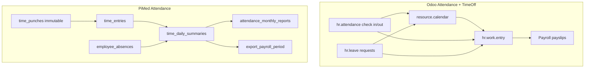
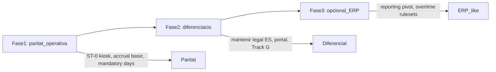

# Estudi comparatiu: Assistència / Time Off PiMed vs Odoo

**Data:** 2026-07-13  
**Abast:** Control horari, fitxatge, absències, calendari laboral, tancament mensual, export nòmina  
**Referències Odoo:** [Attendances](https://www.odoo.com/documentation/19.0/applications/hr/attendances.html), [Time Off](https://www.odoo.com/documentation/19.0/applications/hr/time_off.html), [Overtime rulesets](https://www.odoo.com/documentation/19.0/applications/hr/attendances/overtime.html)

**Informe anterior:** [estudi-empleats-pimed-vs-odoo.md](./estudi-empleats-pimed-vs-odoo.md)

---

## Context i abast

Aquest estudi compara el mòdul de **control horari i absències** d'PiMed amb les apps **Odoo Attendances** (`hr_attendance`) i **Time Off** (`hr_holidays`).

**Important:** A Odoo són dues apps separades que comparteixen `resource.calendar` com a font de veritat d'horaris i es connecten a nòmina via `hr.work.entry` (Enterprise). PiMed integra fitxatge, absències, calendari, revisió nòmina i tancament legal en un **pipeline unificat** orientat a compliance laboral espanyol.

###Referències PiMed

| Àrea | Fitxer |
|------|--------|
| Estat implementació | [`docs/plans/checkin/STATUS.md`](../checkin/STATUS.md) |
| Arquitectura | [`docs/product-design/15-time-attendance-architecture.md`](../../product-design/15-time-attendance-architecture.md) |
| Tancament mensual | [`docs/plans/checkin/plan-monthly-close-approval.md`](../checkin/plan-monthly-close-approval.md) |
| Temps efectiu (Track G) | [`docs/plans/checkin/plan-effective-work-time.md`](../checkin/plan-effective-work-time.md) |
| Confirmació període | [`docs/plans/checkin/plan-period-employee-confirm.md`](../checkin/plan-period-employee-confirm.md) |
| Feature tenant-portal | [`apps/tenant-portal/src/features/attendance/`](../../apps/tenant-portal/src/features/attendance/) |
| Portal empleat | [`apps/public-portal/features/employee-portal/`](../../apps/public-portal/features/employee-portal/) |
| Migració core | [`supabase/migrations/20260515000018_attendance_core.sql`](../../supabase/migrations/20260515000018_attendance_core.sql) |

---

## Arquitectura conceptual

### Tres capes d'estat (PiMed)

PiMed distingeix explícitament tres capes (doc 15 §15.9), sense equivalent directe a Odoo:

| Capa | Taula | Propòsit |
|------|-------|----------|
| Jornada (shift) | `time_entries` | Estat operatiu del torn |
| Dia nòmina | `time_daily_summaries` | Revisió i aprovació gestor |
| Mes legal | `attendance_monthly_reports` | Confirmació empleat, tancament, signatura |

Odoo separa `hr.attendance` (fitxatges) de `hr.work.entry` (nòmina), però no té un flux legal de **registre mensual** amb confirmació bilateral i export d'inspecció com a primera classe.

| Dimensió | Odoo | PiMed |
|----------|------|-------|
| Apps | Attendances + Time Off separades | Mòdul unificat `attendance` |
| Font horaris | `resource.calendar` | Cascada: `work_schedules` → grups → overrides → `resolve_work_day` |
| Raw immutable | `hr.attendance` editable per managers | `time_punches` immutable; correccions via `adjust_time_entry` |
| Recompute async | No (càlcul en línia) | PGMQ `attendance_recompute_queue` |
| Compliance ES | No natiu | Registre horario, inspecció, confirmació període |

---

## 1. Mètodes de fitxatge (check-in/out)

### PiMed (implementat)

| Mètode | Superfície | Estat |
|--------|------------|-------|
| Tenant portal (usuari autenticat) | `/attendance` → `PunchPage` | ✅ |
| Portal empleat (token + PIN) | `/portal/punch` → `PortalPunchPage` | ✅ |
| Ajust manual gestor | `adjust_time_entry` al dia | ✅ |
| Offline outbox | IndexedDB + drainer 30s (tenant + portal) | ✅ |
| Estació fixa / tablet | `attendance_devices` + `punch-from-station` | ❌ planificat (ST-0) |

**Tipus de fitxatge PiMed:**
- Core: `in`, `out`, `break_start`, `break_end`
- Track G (mòbil/híbrid): `day_start`, `day_end`, `travel_start`, `travel_end`

**Funcionalitats addicionals al fitxatge:**
- Pauses configurables per tenant (`tenant_pause_configs`)
- Teletreball (`RemoteWorkSwitch`)
- Geo amb consentiment GDPR (`LocationConsentDialog`, mode informatiu per defecte)
- Autocorrecció incidències (E5 — `PunchDiscrepancyDialog`)
- Protocol DMS abans de fitxar (G6)
- Recordatoris push (WS-B)

### Odoo Attendances

| Mètode | Estat | Notes |
|--------|-------|-------|
| Web systray (global) | ✅ | Icona vermell/verd a qualsevol app |
| Kiosk (URL token) | ✅ | PC/tablet/mòbil; desconnecta sessió DB |
| Badge (codi de barres) | ✅ | Badge ID auto-generat + impressió PDF |
| RFID key fob | ✅ | Lector USB |
| PIN per empleat | ✅ | Kiosk manual o selecció |
| Selecció manual al kiosk | ✅ | Cerca per nom o departament |
| Entrada manual gestor | ✅ | Empleat no pot corregir el seu propi fitxatge |
| Apps natives iOS/Android | Enterprise | Community només navegador |
| Biometria | ❌ | Només tercers |
| Offline | ⚠️ | PWA/partners limitat |

### Comparativa fitxatge

| Capacitat | PiMed | Odoo |
|-----------|-------|------|
| Fitxatge sense compte ERP | ✅ portal token + PIN + DNI | ⚠️ només kiosk (sense absències/confirmació al mateix lloc) |
| Pauses com a tipus de punch | ✅ `break_start`/`break_end` | ⚠️ dins del torn, no tipus separats |
| Punches mòbil (dia/viatge) | ✅ Track G1b | ❌ |
| Badge/RFID kiosk | ❌ planificat ST-0 | ✅ madur |
| Geo enregistrada | ✅ amb consentiment + anonimització | ⚠️ lat/lng/IP informatiu |
| Geofencing (bloqueig) | ⚠️ mode informatiu (no bloqueig) | ❌ natiu |
| Offline robust | ✅ outbox IndexedDB | ⚠️ limitat |
| Dispositiu compartit | ✅ `shared_device` al token | ✅ kiosk mode |
| Recordatoris push | ✅ cron + VAPID | ⚠️ no equivalent directe |

**Veredicte:** PiMed guanya en **portal mòbil sense compte** i **offline**. Odoo guanya en **kiosk físic** (badge, RFID, PIN industrial).

---

## 2. Perfils de treball i temps efectiu

### PiMed (Track G — implementat)

| Perfil | Motor | Descripció |
|--------|-------|------------|
| `fixed_site` | G2a | Cortesia per tram, intersecció amb horari previst |
| `mobile_peripatetic` | G2b | Només punches, time_budget, TRAVEL |
| `hybrid` | G2a.2 parcial | Schema + UI; `flex_midday` diferit |
| `delivery` | G2b extensió | Schema + UI |

- `attendance_record_policies` — polítiques JSON per àmbit (tenant, grup, empleat)
- `time_activity_segments` — WORK/TRAVEL/BREAK
- `work_logs` integració per field punch (G2c)
- Panells UI: `EffectiveTimeBucketsPanel`, `ActivitySegmentsTimeline`, `AttendanceRecordPolicyEditor`

### Odoo

- Horari fix, flexible o 2 setmanes via `resource.calendar`
- Overtime rulesets per empleat (Quantity vs Timing)
- Toleràncies employer/employee favor
- Conversió overtime → time off compensatori
- Sense perfils operatius equivalents (mòbil, repartiment, híbrid)

**Veredicte:** PiMed és **molt més profund** en models de treball reals (peripatètic, repartiment, geo cascade). Odoo és més genèric però amb **overtime rulesets** més configurables.

---

## 3. Calendari laboral, horaris i planificació

### PiMed

| Funcionalitat | Estat |
|---------------|-------|
| `work_schedules` + intervals + assignacions | ✅ |
| Festius (`holiday_calendars`, import Nager.Date) | ✅ |
| Overrides per dia (`labor_calendar_overrides`, `employee_day_overrides`) | ✅ |
| Calendar groups amb geo i política per grup | ✅ |
| `resolve_work_day` (cascada horari + festius + absències) | ✅ |
| Torns (`work_shifts`, `shift_slots`, swaps, cobertura) | ✅ backend + UI |
| Schedule planner (expected vs actuals) | ✅ |
| Portal horari mensual | ✅ `/portal/schedule` |

**Rutes tenant-portal:**
- `/attendance-mgmt/calendar` — Planificació laboral
- `/attendance-mgmt/planning/shifts` — Graella de torns
- `/attendance-mgmt/planning/schedules` — Planificador

### Odoo

| Funcionalitat | App |
|---------------|-----|
| `resource.calendar` (setmanal, 2 setmanes, flexible) | Core |
| Festius públics (manual per país) | Time Off |
| Planning app (Gantt, torns, conflictes) | Enterprise |
| Mandatory days (bloqueig vacances) | Time Off |
| Comparació planificat vs real | Planning (manual) |

### Comparativa planificació

| Capacitat | PiMed | Odoo |
|-----------|-------|------|
| Calendari laboral multi-nivell | ✅ cascada grups/overrides | ✅ resource.calendar |
| Import festius automàtic | ✅ Nager.Date | ❌ manual |
| Torns + swaps | ✅ | ✅ Planning Enterprise |
| Planner expected vs actual | ✅ | ⚠️ parcial |
| Festius obligatoris (no demanar vacances) | ❌ | ✅ Mandatory Days |
| Integració amb absències al resolver | ✅ `resolve_work_day` | ✅ calendar leaves |

**Veredicte:** Paritat alta en calendari base. PiMed millor en **cascada multi-nivell** i **import festius**. Odoo millor en **Planning Enterprise** i **mandatory days**.

---

## 4. Absències, permisos i allocations

### PiMed

**Model:** `employee_absences` amb estats `requested` → `approved`/`rejected`/`active` (no taula separada de requests).

| Funcionalitat | Estat |
|---------------|-------|
| Tipus configurables (`tenant_absence_type_configs`) | ✅ |
| Taxonomia 2 nivells + codis export (Track C1) | ✅ |
| Absències parcials (hores) | ✅ |
| IT manual (Incapacitat Temporal) | ✅ `register_it`/`close_it` |
| Entitlements vacances (`vacation_entitlements`) | ✅ |
| Sol·licitud empleat (tenant + portal) | ✅ |
| Aprovació gestor | ✅ `approve_absence` |
| `counts_as_worked` per nòmina | ✅ |
| Auto-approve injustificat (manager) | ✅ |

**Tipus sistema (seeds):** vacation, personal_days, bereavement, marriage, IT, emergències familiars, etc.

### Odoo Time Off

| Funcionalitat | Estat |
|---------------|-------|
| 6 tipus per defecte (Paid, Sick, Unpaid, Compensatory, Extra Hours, Extra Time Off) | ✅ |
| Durada: dia sencer / mig dia / hores | ✅ |
| Requereix allocation | ✅ configurable |
| Doble aprovació (Officer + Manager) | ✅ |
| Accrual plans (milestones, caps, carry-over) | ✅ molt complet |
| Allocations per grup (dept, company, tag) | ✅ |
| Mandatory days | ✅ |
| Documents adjunts obligatoris | ✅ |
| Deduct extra hours (gastar overtime) | ✅ |
| Saldo negatiu amb límit | ✅ |
| Integració payroll work entry type | ✅ Enterprise |

### Comparativa absències

| Capacitat | PiMed | Odoo |
|-----------|-------|------|
| Tipus configurables | ✅ amb export codes | ✅ molt flexible |
| Accrual / devengament automàtic | ⚠️ entitlements bàsics | ✅ motor complet |
| Carry-over any a any | ❌ | ✅ |
| IT / baixa mèdica | ✅ manual (fins INSS) | ✅ Sick Time Off |
| Absències parcials per hores | ✅ | ✅ |
| Portal autoservei absències | ✅ sense compte ERP | ❌ requereix usuari Odoo |
| Mandatory days | ❌ | ✅ |
| Compensatory from overtime | ✅ compensation ledger | ✅ hr_holidays_attendance |
| Codis export nòmina per tipus | ✅ Track C1 | ✅ work entry type |

**Veredicte:** Odoo guanya en **motor d'accrual/allocation** i **mandatory days**. PiMed guanya en **semàntica laboral espanyola** (IT, taxonomia export) i **portal absències sense compte**.

---

## 5. Fluxos de revisió, aprovació i tancament

### PiMed

| Flux | Estat | Detall |
|------|-------|--------|
| Aprovació dia nòmina | ✅ | `approve_time_day` + bulk approve |
| Revisió nòmina gestor | ✅ | `get_payroll_review_days`, `PayrollReviewDaysTable` |
| Payroll lock post-export | ✅ | `payroll_locked_at` bloqueja ajustos |
| Confirmació empleat mensual | ✅ | `confirm_attendance_month` |
| Confirmació per període (mes/setmana ISO) | ✅ | `confirm_attendance_period` |
| Tancament gestor + validació | ✅ | `validate_attendance_month_close`, `approve_attendance_month` |
| Signatura DMS informe mensual | ✅ | `link_attendance_monthly_report_signing` |
| Esmenes post-tancament (F1) | ✅ | `attendance_monthly_report_amendments` |
| Trust schedule auto-assist (E6) | ✅ | Bulk approve amb horari de confiança |
| Incidències pausa oberta | ✅ | `manager_resolve_open_pause` |

### Odoo

| Flux | Estat | Detall |
|------|-------|--------|
| Aprovació extra hours | ✅ | Auto o manager per empresa |
| Aprovació parcial overtime | ✅ | Per línia de regla |
| Work entries conflicts | ✅ | Enterprise Payroll |
| Confirmació empleat registro mensual | ❌ | No equivalent legal ES |
| Signatura informe assistència | ⚠️ | Via Sign Enterprise (genèric) |
| Doble validació vacances | ✅ | Officer + Approver |

**Veredicte:** PiMed és **molt superior** en flux legal de tancament mensual, confirmació bilateral empleat↔gestor i export d'inspecció. Odoo és superior en integració **work entries → payslip** (Enterprise).

---

## 6. Export nòmina, inspecció i compliance

### PiMed

| Export | RPC | Estat |
|--------|-----|-------|
| Període nòmina complet | `export_payroll_period` | ✅ |
| Perfil connector (D3.1) | `export_payroll_period_profile` | ✅ |
| Inspecció (només lectura) | `export_attendance_inspection` | ✅ |
| Informe mensual legal | `export_attendance_month` | ✅ |
| Compensation balance al export | inclòs | ✅ |
| Lock dies exportats | `payroll_locked_at` | ✅ |

**Perfils export:** `payroll_export_profiles` + UI a settings.

### Odoo

| Export | Estat |
|--------|-------|
| Pivot Worked vs Expected vs Difference | ✅ |
| Work entries → payslip | ✅ Enterprise |
| Registro horario legal ES | ❌ natiu |
| Export inspecció autoritat laboral | ❌ natiu |
| Hash/integritat informe mensual | ❌ |

**Veredicte:** PiMed és el **diferencial clar** per al mercat espanyol (registro horario, inspecció, confirmació legal). Odoo requereix localització/custom per compliance ES.

---

## 7. Overtime, compensació i comptadors legals

### PiMed

| Funcionalitat | Estat |
|---------------|-------|
| `overtime_minutes` a `time_daily_summaries` | ✅ |
| Compensation ledger (`time_compensation_ledger`) | ✅ |
| Moviments manuals + auto holiday-worked | ✅ |
| Legal counters (`get_attendance_legal_counters`) | ✅ |
| Site legal risk widget | ✅ |
| Overtime settings per tenant | ✅ |
| Statutory limits | ✅ |
| Effective time buckets (Track G) | ✅ |

### Odoo

| Funcionalitat | Estat |
|---------------|-------|
| Overtime rulesets (Quantity/Timing) | ✅ molt configurable |
| Toleràncies employer/employee | ✅ |
| Compensatory time off conversion | ✅ |
| Partial overtime approval | ✅ |
| Pivot Balance report | ✅ |
| Comptadors legals ES (conveni) | ❌ |

**Veredicte:** Odoo més flexible en **regles d'overtime configurables**. PiMed més enfocat en **comptadors legals i ledger de compensació** amb vista de risc.

---

## 8. Geo i presència

### PiMed

| Funcionalitat | Estat |
|---------------|-------|
| Geo cascade (tenant→dept→grup→empleat) | ✅ |
| Consentiment GDPR + anonimització | ✅ |
| Mode informatiu (no bloqueig) | ✅ per defecte |
| Presència via fitxatge actiu | ✅ |

### Odoo

| Funcionalitat | Estat |
|---------------|-------|
| Lat/lng + IP al fitxatge | ✅ |
| Geofencing | ❌ (tercers) |
| Presència per login Odoo | ✅ |
| Presència per emails/hora | ✅ |
| Presència per IP corporativa | ✅ |
| Override manual present/absent | ✅ |

**Veredicte:** Odoo més ric en **senyals de presència** (login, email, IP). PiMed millor en **GDPR geo** i cascade de polítiques, però sense geofencing bloquejant (com Odoo).

---

## 9. Reporting i dashboards

### PiMed

| Informe / vista | Estat |
|-----------------|-------|
| Tauler avui (`TaulerPage`, `mv_today_site_status`) | ✅ |
| Fitxatges / revisió nòmina (`AllTimeEntriesPage`) | ✅ |
| Planner discrepàncies | ✅ |
| Legal counters + risc per site | ✅ |
| Export inspecció / nòmina | ✅ |
| Portal historial + mensual | ✅ |
| Informe retenció / absentisme global | ❌ |

### Odoo

| Informe / vista | Estat |
|-----------------|-------|
| Dashboard qui és in/out ara | ✅ |
| Pivot Worked/Expected/Difference/Balance | ✅ |
| Absenteeism (undertime trend) | ✅ |
| Leave balance pivot (Left/Planned/Available) | ✅ |
| Leave by employee / by type | ✅ |
| Overtime ranking mensual | ✅ |

**Veredicte:** Odoo millor en **analytics HR genèrics** (balances, absentisme, overtime ranking). PiMed millor en **vistes operatives de compliance** (revisió nòmina, legal risk, inspecció).

---

## 10. Configuració

### PiMed — `/settings/attendance-control`

| Secció | Temes |
|--------|-------|
| Tancament mensual | Confirmació empleat, signatura, override |
| Geo | Política per defecte tenant |
| Incidències fitxatge | Tolerància E5 |
| Recordatoris push | WS-B |
| Overtime | Política extra hours |
| Tipus absència | Taxonomia + codis export |
| Temps efectiu | Track G flags, cortesia, arrodoniment |
| Límits legals | Hores estatutàries |
| Protocol DMS | G6 onboarding |
| Perfils export nòmina | D3.1 connectors |

**També a Planificació:** grups calendari, pauses, geo per grup, política de registre.

### Odoo — jerarquia

| Nivell | Configuració |
|--------|--------------|
| Company | Kiosk, toleràncies, auto-checkout, overtime validation |
| Working schedule | Hores, breaks, flexible, festius |
| Time off type | Aprovació, allocation, payroll mapping |
| Accrual plan | Milestones, caps, carry-over |
| Overtime ruleset | Regles, rates |
| Employee | Calendar, PIN, badge, approvers, presence mode |

---

## Matriu resum (semàfor)

| Àrea | PiMed | Odoo | Notes |
|------|-------|------|-------|
| Fitxatge web (usuari autenticat) | 🟢 | 🟢 | |
| Portal fitxatge sense compte | 🟢 | 🔴 | Diferencial PiMed |
| Kiosk badge/RFID | 🔴 | 🟢 | PiMed ST-0 pendent |
| Offline fitxatge | 🟢 | 🟡 | |
| Pauses com a punches | 🟢 | 🟡 | |
| Perfils mòbil/híbrid/repartiment | 🟢 | 🔴 | Track G |
| Calendari laboral | 🟢 | 🟢 | |
| Import festius automàtic | 🟢 | 🟡 | Nager.Date vs manual |
| Planificació torns | 🟢 | 🟢 | Odoo requereix Planning Enterprise |
| Tipus absència configurables | 🟢 | 🟢 | |
| Motor accrual/allocation | 🟡 | 🟢 | Odoo molt més complet |
| Portal absències sense compte | 🟢 | 🔴 | |
| IT / baixa mèdica | 🟢 | 🟡 | PiMed semàntica ES |
| Revisió nòmina gestor | 🟢 | 🟡 | |
| Confirmació empleat període | 🟢 | 🔴 | Diferencial PiMed |
| Tancament mensual legal | 🟢 | 🔴 | Compliance ES |
| Export inspecció | 🟢 | 🔴 | |
| Export nòmina | 🟢 | 🟢 | Odoo via work entries Enterprise |
| Overtime rules configurables | 🟡 | 🟢 | Odoo rulesets |
| Compensation ledger | 🟢 | 🟡 | |
| Comptadors legals ES | 🟢 | 🔴 | |
| Geo GDPR | 🟢 | 🟡 | |
| Geofencing | 🔴 | 🔴 | Cap dels dos natiu |
| Reporting absentisme/balances | 🟡 | 🟢 | |
| Apps mòbils natives | 🔴 | 🟡 | Odoo Enterprise |
| Mandatory days | 🔴 | 🟢 | |

---

## Punts forts PiMed (posicionament competitiu)

1. **Pipeline legal espanyol** — tres capes (jornada/dia/mes), confirmació empleat, signatura, esmenes, export inspecció.
2. **Portal d'assistència sense compte ERP** — fitxatge, horari, absències, confirmació mensual en un sol lloc.
3. **Perfils de treball reals** — fixed_site, mobile_peripatetic, hybrid, delivery amb motors de temps efectiu.
4. **Raw immutable + recompute async** — auditoria i integritat superior al model editable d'Odoo.
5. **Calendari cascada** — grups, overrides, festius Nager.Date, `resolve_work_day` amb absències.
6. **Compensation ledger + legal counters** — gestió de compensació i risc legal per site.
7. **Offline** — outbox robust tenant + portal.

## Punts forts Odoo (posicionament competitiu)

1. **Kiosk industrial** — badge, RFID, PIN, selecció manual; madur per fàbrica/magatzem.
2. **Motor d'accrual** — milestones, caps, carry-over, saldo negatiu, forecast.
3. **Overtime rulesets** — regles Quantity/Timing amb aprovació parcial i conversió a time off.
4. **Mandatory days** — bloqueig de vacances en dies crítics.
5. **Integració nòmina Enterprise** — work entries automàtics → payslip.
6. **Reporting pivot** — balances, absentisme, overtime ranking out-of-the-box.
7. **Presència multi-senya** — login, email, IP corporativa.

## Gaps principals PiMed respecte Odoo

1. **Kiosk badge/RFID** — estacions fixes (ST-0 planificat, DB preparada).
2. **Motor d'accrual complet** — milestones, carry-over, caps, forecast de saldo.
3. **Mandatory days** — bloqueig de sol·licituds en dies crítics.
4. **Overtime rulesets configurables** — regles per país/conveni amb rates.
5. **Reporting pivot** — balances de vacances, absentisme, ranking overtime.
6. **Apps mòbils natives** — PWA portal vs apps iOS/Android Odoo Enterprise.
7. **Geofencing bloquejant** — ambdós ho tenen feble; tercers o futur PiMed.

## Gaps principals Odoo respecte PiMed

1. **Registro horario legal espanyol** — confirmació bilateral, hash, inspecció.
2. **Portal token-based** — empleat sense usuari no pot demanar vacances ni confirmar mes.
3. **Perfils de treball operatius** — mòbil, repartiment, viatge.
4. **IT amb semàntica espanyola** — INSS, conflicte punch-IT.
5. **Compensation ledger** — saldo de compensació explícit.
6. **Offline robust** — outbox amb reintents.
7. **Export inspecció autoritat laboral** — sense localització ES nativa.

---

## Recomanacions estratègiques (roadmap)

1. **Fase 1 — Paritat operativa:** estacions kiosk (ST-0), accrual bàsic amb carry-over, mandatory days, reporting balances absències.
2. **Fase 2 — Reforçar diferencial:** no copiar el model kiosk-only d'Odoo; potenciar portal, confirmació legal, perfils Track G, export inspecció.
3. **Fase 3 — Opcional ERP-like:** overtime rulesets configurables, pivot analytics, si cal competir amb Odoo Enterprise complet.

**Principi rector:** PiMed no ha de competir amb Odoo com a ERP generalista, sinó com a **sistema de control horari legal + portal d'empleat** per a PIMEs espanyoles sense compte corporatiu per a tot el personal.

---

## Següents comparatives

| Mòdul | Estat |
|-------|-------|
| Empleats / HR core | ✅ [estudi-empleats-pimed-vs-odoo.md](./estudi-empleats-pimed-vs-odoo.md) |
| Assistència / Time Off | ✅ aquest document |
| Documents / Signatura | Pendent |
| Nòmina | Pendent |
