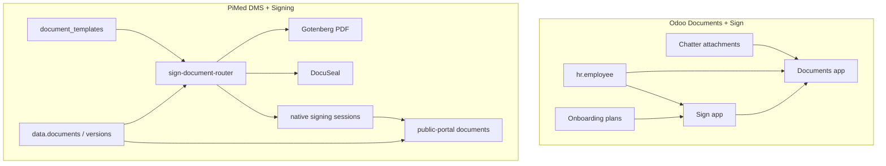
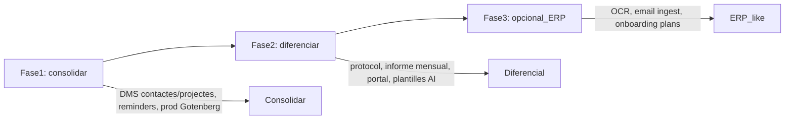

# Estudi comparatiu: Documents / Signatura PiMed vs Odoo

**Data:** 2026-07-13  
**Abast:** DMS, plantilles documentals, generació PDF, signatura electrònica, portal empleat  
**Referències Odoo:** [Documents](https://www.odoo.com/documentation/19.0/applications/productivity/documents.html), [Sign](https://www.odoo.com/documentation/19.0/applications/productivity/sign.html), [Sign validity](https://www.odoo.com/documentation/19.0/applications/productivity/sign/validity.html)

**Informes anteriors:** [Empleats](./estudi-empleats-pimed-vs-odoo.md) · [Assistència](./estudi-assistencia-timeoff-pimed-vs-odoo.md)

---

## Context i abast

Aquest estudi compara el **DMS i sistema de signatura** d'PiMed amb les apps **Odoo Documents** i **Odoo Sign** (ambdues Enterprise).

**Important:** A Odoo Documents i Sign són apps de productivitat separades però integrades al ERP (HR, Recruitment, Payroll, Expenses). PiMed combina DMS + plantilles + PDF + signatura (DocuSeal + nativa) en un **stack unificat** amb casos d'ús legals espanyols (registre horario, protocol d'assistència) i portal d'empleat sense compte Odoo.

###Referències PiMed

| Àrea | Fitxer |
|------|--------|
| DMS core | [`supabase/migrations/20260502210551_documents_core.sql`](../../supabase/migrations/20260502210551_documents_core.sql) |
| Plantilles + signing | [`supabase/migrations/20260522000001_dms_templates_signing_core.sql`](../../supabase/migrations/20260522000001_dms_templates_signing_core.sql) |
| Signatura nativa | [`supabase/migrations/20260609000003_native_signing.sql`](../../supabase/migrations/20260609000003_native_signing.sql) |
| Protocol assistència (G6) | [`supabase/migrations/20260908000001_track_g_phase6_protocol_dms.sql`](../../supabase/migrations/20260908000001_track_g_phase6_protocol_dms.sql) |
| Feature tenant-portal documents | [`apps/tenant-portal/src/features/documents/`](../../apps/tenant-portal/src/features/documents/) |
| Feature tenant-portal signing | [`apps/tenant-portal/src/features/signing/`](../../apps/tenant-portal/src/features/signing/) |
| Portal empleat documents | [`apps/public-portal/features/employee-portal/components/PortalDocumentsPage.tsx`](../../apps/public-portal/features/employee-portal/components/PortalDocumentsPage.tsx) |
| Plans signing | [`docs/plans/signing/`](../signing/) |
| Disseny producte | [`docs/product-design/19-dms-templates-signing-control-center-plan.md`](../../product-design/19-dms-templates-signing-control-center-plan.md) |

---

## Arquitectura conceptual

| Dimensió | Odoo | PiMed |
|----------|------|-------|
| Edició | Enterprise only (Documents + Sign) | Inclòs al SaaS multi-tenant |
| Model d'accés extern | Portal Odoo o enllaç Sign | Token portal + `/sign/:token` |
| Generació PDF | Upload manual o Sign sobre PDF | Gotenberg (HTML/DOCX → PDF) + cua async |
| Proveïdor signatura | Sign natiu (simple eIDAS) | DocuSeal (platform/BYO) + nativa (evidence-based) |
| Integració HR | File centralization per empleat | DMS per entitat + protocol G6 + informe mensual |

---

## 1. Emmagatzematge i gestió documental (DMS)

### PiMed (implementat)

| Funcionalitat | Detall |
|---------------|--------|
| Carpetes jeràrquiques | `document_folders` — global i embedded per entitat |
| Versions | `document_versions` — `native` o `external_link` |
| Metadades | Títol, permisos, `entity_type`/`entity_id`, caducitat, renovació |
| Tags | `document_tags` + assignacions, filtre a llistat |
| Categories | Vista alternativa a carpetes |
| Arxiu | Soft archive (`is_archived`) |
| Quota | `documents_committed_bytes` per tenant |
| Share links | Tokens públics amb comptador d'accés |
| Cerca | Client-side per títol + filtres tag/caducitat |
| RBAC | `required_permissions[]`, owner/manager, multi-site |
| Audit | Events `DOCUMENT_*`, versions, arxiu, tags |

**Rutes:** `/documents`, `/documents/:id`, `/documents/archived`

### Odoo Documents (Enterprise)

| Funcionalitat | Detall |
|---------------|--------|
| Seccions | All, Company, My Drive, Shared with me, Recent, Trash |
| Carpetes | Jerarquia il·limitada sota Company i My Drive |
| Versions | Download/upload versions |
| Tags | Manual + auto (centralization, AI, Sign post-sign) |
| Metadades | Owner, contact, linked record, chatter |
| Lock file | Prevenir edicions |
| Shortcuts | Multi-folder pointer |
| PDF split/merge | Nativo |
| Email alias | Ingestió per carpeta |
| Request files | Activity-based upload reminders |
| AI auto-sort | Classificació per prompt (Enterprise + IAP) |
| OCR | Factures, rebuts, CVs (IAP credits) |
| Spreadsheets | Documents Spreadsheet (Enterprise) |

### Comparativa DMS

| Capacitat | PiMed | Odoo |
|-----------|-------|------|
| Carpetes jeràrquiques | ✅ | ✅ |
| Versions | ✅ | ✅ |
| Tags | ✅ | ✅ |
| Arxiu / paperera | ✅ archive | ✅ trash amb retenció |
| Enllaços públics | ✅ share tokens | ✅ link sharing |
| Quota per tenant | ✅ | ⚠️ límit 64MB upload online |
| DMS per entitat (empleat) | ✅ tab embedded | ✅ HR centralization auto |
| OCR / AI classificació | ❌ | ✅ IAP credits |
| Email-to-folder | ❌ | ✅ |
| PDF split/merge | ❌ | ✅ |
| Spreadsheets integrats | ❌ | ✅ |
| Chatter per fitxer | ⚠️ EntityTimeline | ✅ |
| Multi-site scoping | ✅ | ✅ multi-company |

**Veredicte:** Odoo guanya en **productivitat general** (OCR, AI, email ingest, spreadsheets). PiMed guanya en **model multi-tenant SaaS**, quota, i **vincle explícit a entitats** amb permisos granulars.

---

## 2. Plantilles i generació de documents

### PiMed (implementat)

| Funcionalitat | Detall |
|---------------|--------|
| Tipus plantilla | DOCX (Docxtemplater) + HTML (LiquidJS) |
| Locales | Per idioma per plantilla |
| Platform vs tenant | `is_platform_default` — clonació per tenant |
| Variables schema | JSON per validació i UI |
| Signing roles schema | Rols per entitat (`employee`, `contact`, `user`, etc.) |
| Content blocks | Headers/footers (PAGE_HEADER, DOCUMENT_FOOTER, etc.) |
| Block mapping | Per plantilla |
| Context builder | Resolució nested d'entitats (empleat, site, tenant…) |
| Generació | `DocumentOrchestrator` — wizard unificat |
| Output | DOCX, HTML, PDF (sync/async) |
| PDF pipeline | Gotenberg + cua PGMQ `document_pdf_jobs` |
| PDF profiles | `pdf`, `pdfa2b`, `pdfa3b` |
| AI templates | `ai-template-generator`, wizard UI, chat integration |
| Seeds legals | Informe mensual assistència, protocol fitxatge |

**Rutes:** `/documents/templates`, `/settings/templates`

### Odoo

| Funcionalitat | Detall |
|---------------|--------|
| Plantilles Sign | PDF amb camps drag-drop |
| Model binding | Restrict a model Odoo (ex. `hr.employee`) |
| Auto-complete fields | Camps vinculats a camps del model |
| Post-sign filing | Auto-save a carpeta Documents + tags |
| QWeb reports | Informes PDF des de qualsevol model |
| Documents Spreadsheet | Plantilles de full de càlcul |

**No equivalent directe:** generació DOCX/HTML amb variables des de context d'entitats com a primera classe (Odoo usa QWeb o upload manual).

### Comparativa plantilles

| Capacitat | PiMed | Odoo |
|-----------|-------|------|
| Plantilles DOCX amb variables | ✅ Docxtemplater | ❌ |
| Plantilles HTML/Liquid | ✅ | ❌ |
| Generació PDF server-side | ✅ Gotenberg | ⚠️ QWeb / upload |
| Headers/footers configurables | ✅ content blocks | ⚠️ dins PDF |
| AI-assisted template creation | ✅ | ❌ |
| Plantilles vinculades a model ERP | ✅ entity types | ✅ model binding |
| PDF/A per arxiu legal | ✅ | ⚠️ |
| Wizard generació + signatura | ✅ DocumentOrchestrator | ⚠️ flux separat |

**Veredicte:** PiMed és **molt superior** en generació documental des de plantilles (DOCX/HTML → PDF). Odoo és superior en **plantilles Sign sobre PDF** i integració amb informes QWeb.

---

## 3. Signatura electrònica

### PiMed — dos camins (implementats)

#### DocuSeal (proveïdor extern)

| Aspecte | Detall |
|---------|--------|
| Modes | Platform (credits) o BYO (Vault key) |
| Webhook | HMAC + download signed PDF a DMS |
| Tracking | `signing_submissions` + `signing_events` |
| Centre de firmes | `SigningCenterPage` — llistat, filtres, detall |
| Notificacions | 4 modes: docuseal_auto, app_manual, app_auto_all, app_auto_sequential |

#### Signatura nativa (pròpia)

| Aspecte | Detall |
|---------|--------|
| Tipus | Presential (canvas) + remote (`/sign/:token`) |
| Sessions | `document_signing_sessions` |
| Evidències | `document_signature_evidences` (link_sent, viewed, drawn, signed) |
| Audit | `document_signatures_audit` + PDF audit via cua |
| Integritat | SHA-256 hash verification (`DocumentIntegrityPanel`) |
| Signatura seqüencial | ✅ multi-signer amb ordre |
| Camps posicionals | `signing_field_map`, `[[SIG:role]]` markers |
| Declinar | ✅ staging + decline |
| Nivell legal | Evidence-based — **no eIDAS qualificada** |

**Rutes:** `/documents/signing`, `/sign/:token` (públic)

### Odoo Sign (Enterprise)

| Aspecte | Detall |
|---------|--------|
| Nivell legal | **Simple electronic signature** (eIDAS) — no Advanced/Qualified |
| Multi-signer | Color-coded roles, ordre opcional |
| Envelopes | Múltiples PDFs en una sol·licitud |
| Templates | Reutilitzables amb camps drag-drop |
| Auth reforçada | SMS OTP, itsme®, Aadhaar (IAP credits) |
| Certificat digital | Upload `.p12`/`.pfx` opcional |
| Certificate of completion | Auto-generat amb hashes, IP, timestamps |
| Reminders | Interval en dies |
| Validity/expiry | Data límit |
| Decline | Via email link — cancel·la tot l'envelope |
| Shareable template link | NDAs massius |
| Post-sign | Auto-file a Documents + chatter al registre font |

### Comparativa signatura

| Capacitat | PiMed | Odoo |
|-----------|-------|------|
| Signatura simple (SES) | ✅ DocuSeal + nativa | ✅ Sign |
| Signatura qualificada (QES) | ❌ | ❌ |
| Multi-signer seqüencial | ✅ | ✅ |
| Signatura presencial (canvas) | ✅ nativa | ⚠️ draw/upload |
| Enllaç públic sense compte | ✅ `/sign/:token` | ✅ email link |
| Proveïdor extern (BYO) | ✅ DocuSeal BYO | ❌ |
| Signatura gratuïta (nativa) | ✅ sense crédits | ✅ inclòs Enterprise |
| Certificat de completitud | ✅ audit PDF | ✅ Certificate of completion |
| Evidències per signant | ✅ detallades | ✅ IP, geo, timestamps |
| Auth SMS/itsme | ❌ | ✅ IAP |
| Recordatoris automàtics | ⚠️ seqüencial app; no multi-stage MVP | ✅ interval dies |
| Centre de firmes unificat | ✅ Signing Center | ✅ Kanban Sign |
| Integritat / tamper detection | ✅ hash panel | ✅ signatory hash |
| Crédits / monetització | ✅ platform credits | ✅ Enterprise license |

**Veredicte:** Paritat alta en **signatura simple multi-part**. PiMed ofereix **doble camí** (DocuSeal + nativa gratuïta) i **portal token**. Odoo ofereix **auth reforçada** (SMS/itsme) i **certificate of completion** més estandarditzat legalment.

---

## 4. Portal d'empleat i autoservei documental

### PiMed (implementat)

| Funcionalitat | Detall |
|---------------|--------|
| Llistat documents assignats | `PortalDocumentsPage` |
| Lectura + acknowledge (L1) | Checkbox confirmació |
| Signatura digital (L2) | `employee_sign_url` |
| Protocol assistència (G6) | Bloqueig fitxatge si pendent + `required_before_punch` |
| Bulk onboarding protocol | Publish queue per lots |
| Identitat DNI | Gate abans d'accés (EP-ACC-9) |
| Informe mensual signatura | Integració attendance monthly report |
| Access logs | `PortalAccessPage` |

**Accés:** token + PIN — **sense compte ERP**

### Odoo

| Funcionalitat | Detall |
|---------------|--------|
| Portal Documents card | Viewer/Editor per ACL |
| Share links | Accés sense login complet |
| Sign email links | Signatura sense compte Odoo |
| File requests | Upload via activity reminder |
| Onboarding Document activity | Sol·licitud fitxer a nou empleat |
| Onboarding Signature activity | Sign template des del pla |

**Accés:** usuari portal Odoo o enllaços — **no portal token dedicat HR**

### Comparativa portal

| Capacitat | PiMed | Odoo |
|-----------|-------|------|
| Documents sense compte ERP | ✅ portal token | ⚠️ share link / sign link |
| Acknowledge + sign en un lloc | ✅ | ⚠️ separat |
| Bloqueig operatiu (no fitxar) | ✅ protocol G6 | ❌ |
| Assignació per empleat | ✅ `employee_portal_document_assignments` | ⚠️ onboarding plan |
| Signatura informe mensual assistència | ✅ plantilla legal | ❌ natiu |

**Veredicte:** PiMed és **clarament superior** per a empleats sense compte corporatiu amb fluxos legals integrats (protocol, informe mensual).

---

## 5. Integracions amb HR, assistència i altres mòduls

### PiMed

| Integració | Estat | Detall |
|------------|-------|--------|
| Empleats — tab Documents | ✅ | `EmployeeDetailPage` embedded DMS |
| Assistència — informe mensual | ✅ | Plantilla platform + `MonthlyReportSigningSection` |
| Assistència — protocol G6 | ✅ | Publish, acknowledge, sign, punch gate |
| Confirmació període | ✅ | Signatura com a part del flux |
| Contactes / Projectes — tab DMS | ❌ | Infra `entity_type` preparada, UI pendent |
| Automatització | ✅ | `generate-document`, `send-for-signing` handlers |
| AI Chat | ✅ | `propose_generate_document` → Orchestrator |
| Entity timeline | ⚠️ | Deep link a document, no adjunts DMS complets |

### Odoo

| Integració | Estat | Detall |
|------------|-------|--------|
| Employees — upload ID/visa/license | ✅ | Personal tab + Documents centralization |
| Onboarding plans | ✅ | Document + Signature activities |
| Recruitment — CV OCR | ✅ | Documents + IAP |
| Payroll — payslip filing | ✅ | Auto-tag + portal (localitzat) |
| Expenses — receipt OCR | ✅ | IAP credits |
| Accounting — invoice OCR | ✅ | Finance folder |
| Chatter — save to Documents | ✅ | Des de qualsevol registre |
| Sign from any record | ✅ | Chatter action |

### Comparativa integracions

| Capacitat | PiMed | Odoo |
|-----------|-------|------|
| HR employee filing | ✅ per entitat | ✅ auto centralization |
| Onboarding documental | ⚠️ protocol G6 (assistència) | ✅ plans complets |
| OCR factures/rebuts/CV | ❌ | ✅ |
| Payslip auto-filing | ❌ | ✅ |
| Signatura des de registre HR | ✅ orchestrator | ✅ chatter |
| Flux legal assistència ES | ✅ **diferencial** | ❌ |
| Automatització workflows | ✅ v1 blueprints | ✅ Studio + activities |

**Veredicte:** Odoo guanya en **amplitud ERP** (OCR, payslips, expenses, recruitment). PiMed guanya en **casos d'ús legals espanyols** (registre horario, protocol fitxatge).

---

## 6. Permisos, privacitat i governança

### PiMed

| Control | Detall |
|---------|--------|
| RBAC per carpeta/document | `required_permissions[]` |
| Multi-site | `site_id` — docs globals + per site |
| Owner/manager write | RLS Supabase |
| Share link expiry | Token amb comptador |
| Signing feature flag | `tenant_signing_enabled` per pla |
| Admin kill switch | `admin_disabled` per tenant |
| Signing credits | Platform governance (admin-portal) |
| Audit append-only | `signing_events`, evidences natives |

### Odoo

| Control | Detall |
|---------|--------|
| Viewer/Editor/None | Per usuari/contacte |
| Link access | Separat d'invites nominatives |
| Permission expiry | Per invite |
| Template ACL | Authorized users + groups |
| Lock file | Anti-edició |
| Multi-company | Company-scoped |
| Discoverable links | Hidden vs browsable |

### Comparativa privacitat

| Capacitat | PiMed | Odoo |
|-----------|-------|------|
| ACL granular per fitxer | ✅ | ✅ |
| Expiració permisos | ⚠️ share links | ✅ per invite |
| Governança SaaS multi-tenant | ✅ credits, flags, admin | ⚠️ per instància Odoo |
| Legal hold / DLP | ❌ | ❌ |
| Audit exportable | ⚠️ in-app | ⚠️ in-app |

---

## 7. Auditoria i traçabilitat

### PiMed

| Capa | Artefacte |
|------|-----------|
| DMS lifecycle | Triggers audit `DOCUMENT_*` |
| Signing events | `signing_events` append-only, idempotent webhook |
| Native evidence | Per-event: link_sent → signed |
| Audit PDF | DocuSeal download + native `process-audit-pdf-queue` |
| Integritat | `DocumentIntegrityPanel`, SHA-256 |
| Share access | `access_count`, `last_accessed_at` |
| Portal logs | `employee_portal_access_logs` |

### Odoo

| Capa | Artefacte |
|------|-----------|
| Chatter | Canvis i missatges per fitxer |
| Version history | Ordre d'uploads |
| Sign activity logs | Creation, views, signatures, refusals |
| Certificate of completion | Participants, hashes, verification method |
| Template analytics | In-progress vs signed counts |

**Veredicte:** Paritat en **auditoria operativa**. PiMed més detallat en **evidències natives per signant**; Odoo més estandarditzat en **certificate of completion**.

---

## 8. Automatització i workflows

### PiMed

| Mecanisme | Acció |
|-----------|-------|
| DocumentOrchestrator | Generar → PDF → signar (un wizard) |
| Automation v1 | `generate-document`, `send-for-signing` |
| Protocol publish queue | Bulk assignació protocol assistència |
| PDF job queue | Async Gotenberg + dead-letter |
| Notification modes | 4 estratègies d'enviament signants |
| AI chat | Proposta generació des de conversa |

**Exclòs MVP:** recordatoris multi-stage automàtics, cancel·lació massiva.

### Odoo

| Mecanisme | Acció |
|-----------|-------|
| File centralization | Auto-folder + tag per app |
| Email alias | Ingestió + activity |
| AI auto-sort | Classificar i moure |
| Actions on Select | Sign, create bill, move, tag |
| Onboarding plans | Document/Signature activities programades |
| Sign template post-sign | Auto-file a Documents |
| Studio automations | Regles avançades (Enterprise) |

**Veredicte:** Odoo més ric en **automatització general** (AI, email, centralization). PiMed més enfocat en **fluxos legals predefinits** (protocol, informe mensual).

---

## Matriu resum (semàfor)

| Àrea | PiMed | Odoo | Notes |
|------|-------|------|-------|
| DMS carpetes/versions | 🟢 | 🟢 | |
| Tags i cerca | 🟢 | 🟢 | |
| OCR / AI classificació | 🔴 | 🟢 | Odoo IAP |
| Email-to-folder | 🔴 | 🟢 | |
| Quota multi-tenant | 🟢 | 🟡 | |
| Plantilles DOCX/HTML | 🟢 | 🔴 | Diferencial PiMed |
| Generació PDF server | 🟢 | 🟡 | Gotenberg vs QWeb |
| PDF/A legal | 🟢 | 🟡 | |
| Signatura simple multi-part | 🟢 | 🟢 | |
| Signatura nativa gratuïta | 🟢 | 🟢 | |
| DocuSeal BYO | 🟢 | 🔴 | |
| Auth SMS/itsme | 🔴 | 🟢 | Odoo IAP |
| QES / firma qualificada | 🔴 | 🔴 | Cap dels dos |
| Centre de firmes | 🟢 | 🟢 | |
| Portal docs sense compte | 🟢 | 🟡 | Diferencial PiMed |
| Protocol assistència + punch gate | 🟢 | 🔴 | |
| Informe mensual signatura | 🟢 | 🔴 | |
| Onboarding documental HR | 🟡 | 🟢 | |
| OCR CV/rebuts/factures | 🔴 | 🟢 | |
| Payslip auto-filing | 🔴 | 🟢 | |
| Integració chatter ERP | 🟡 | 🟢 | |
| Automatització AI | 🟡 | 🟢 | |
| Audit / integritat | 🟢 | 🟢 | |
| Community edition | 🟢 | 🔴 | Odoo Enterprise only |

---

## Punts forts PiMed (posicionament competitiu)

1. **Stack unificat** — DMS + plantilles DOCX/HTML + PDF + signatura en un sol `DocumentOrchestrator`.
2. **Doble camí de signatura** — DocuSeal (legal/comercial) + nativa gratuïta (evidence-based).
3. **Generació PDF legal** — Gotenberg amb PDF/A, cua async, content blocks headers/footers.
4. **Portal empleat documental** — acknowledge, sign, protocol amb bloqueig de fitxatge, sense compte ERP.
5. **Casos d'ús legals ES** — informe mensual assistència, protocol fitxatge, confirmació període amb signatura.
6. **Multi-tenant SaaS** — credits, feature flags, admin governance per tenant.
7. **AI template generation** — assistent per crear plantilles Liquid/HTML.

## Punts forts Odoo (posicionament competitiu)

1. **DMS enterprise complet** — OCR, AI auto-sort, email ingest, spreadsheets, PDF tools.
2. **Integració ERP amplia** — HR, Payroll, Recruitment, Expenses, Accounting des de chatter.
3. **Sign madur** — templates PDF, envelopes, reminders, certificate of completion, SMS/itsme.
4. **File centralization** — auto-filing per empleat amb tags per tipus.
5. **Onboarding plans** — activitats Document + Signature programades.
6. **Self-service portal** — Documents card per empleats amb compte portal.

## Gaps principals PiMed respecte Odoo

1. **OCR / AI document processing** — factures, rebuts, CVs.
2. **Email-to-folder** — ingestió per alias.
3. **Onboarding plans** — workflow documental estructurat per incorporació.
4. **Payslip auto-filing** — arxiu automàtic nòmines.
5. **Auth reforçada signatura** — SMS OTP, itsme (equivalent eIDAS reforçat).
6. **PDF tools** — split, merge, lock.
7. **DMS embedded** a contactes/projectes (infra preparada, UI pendent).
8. **Recordatoris signatura multi-stage** — exclòs MVP.

## Gaps principals Odoo respecte PiMed

1. **Generació DOCX/HTML des de plantilles** — no és primera classe.
2. **Portal token HR** — empleat sense usuari no té centre documental unificat.
3. **Protocol assistència amb punch gate** — no existeix.
4. **Signatura informe mensual legal ES** — requereix customització.
5. **Signatura nativa gratuïta** — tot passa per Sign Enterprise (no BYO DocuSeal).
6. **PDF/A pipeline** — no documentat com a primera classe.
7. **Multi-tenant SaaS governance** — credits, entitlements per pla.

---

## Recomanacions estratègiques (roadmap)

1. **Fase 1 — Consolidar:** DMS embedded a contactes/projectes, recordatoris signatura, runbook Gotenberg producció.
2. **Fase 2 — Reforçar diferencial:** no copiar OCR d'Odoo de entrada; potenciar plantilles legals ES, protocol G6, portal, PDF/A, orchestrator.
3. **Fase 3 — Opcional ERP-like:** OCR rebuts/factures si cal competir amb Documents; onboarding plans documentals.

**Principi rector:** PiMed competeix com a **generador i signador de documents legals** integrat amb HR/assistència, no com a DMS enterprise generalista amb OCR.

---

## Següents comparatives

| Mòdul | Estat |
|-------|-------|
| Empleats / HR core | ✅ [estudi-empleats-pimed-vs-odoo.md](./estudi-empleats-pimed-vs-odoo.md) |
| Assistència / Time Off | ✅ [estudi-assistencia-timeoff-pimed-vs-odoo.md](./estudi-assistencia-timeoff-pimed-vs-odoo.md) |
| Documents / Signatura | ✅ aquest document |
| Nòmina | Pendent |
