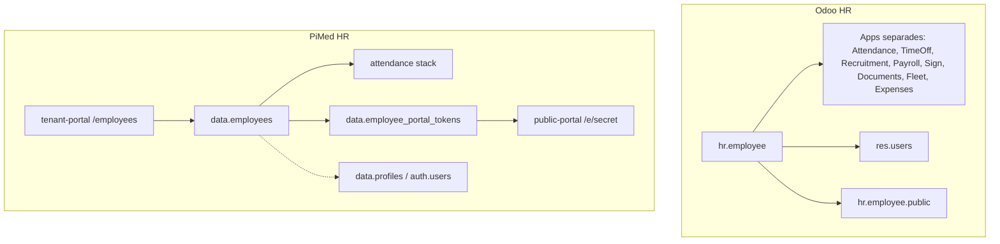
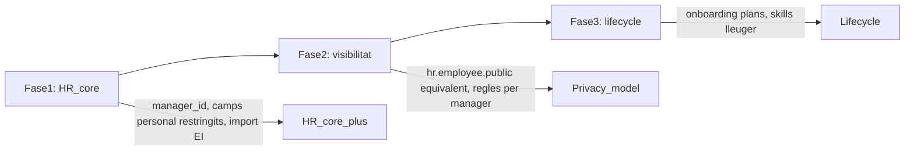

# Estudi comparatiu: Mòdul Empleats PiMed vs Odoo Employees

**Data:** 2026-07-13  
**Abast:** Mòdul Empleats / HR core  
**Referències Odoo:** [pàgina producte](https://www.odoo.com/es_ES/app/employees), [documentació Employees](https://www.odoo.com/documentation/saas-19.3/applications/hr/employees.html)

---

## Context i abast

Aquest estudi compara el que **PiMed ofereix avui** al tenant-portal / public-portal / Supabase amb el que ofereix **Odoo Employees** com a hub de RRHH.

**Important:** Odoo és modular. El mòdul *Employees* és el nucli; assistència, vacances, reclutament, nòmina, signatura, etc. són **apps separades** que s'integren al mateix registre d'empleat. PiMed també és modular però amb un enfocament diferent: **portal d'empleat sense compte Odoo/auth.users** i assistència legal espanyola profunda.

### Referències PiMed

| Àrea | Fitxer |
|------|--------|
| Esquema BD | [`supabase/migrations/20260504000001_employees_module.sql`](../../supabase/migrations/20260504000001_employees_module.sql) |
| UI detall empleat | [`apps/tenant-portal/src/features/employees/components/EmployeeDetailPage.tsx`](../../apps/tenant-portal/src/features/employees/components/EmployeeDetailPage.tsx) |
| API portal | [`supabase/functions/employee-portal-api/index.ts`](../../supabase/functions/employee-portal-api/index.ts) |
| Import planificat | [`docs/plans/employee-import/plan.md`](../employee-import/plan.md) |
| Portal access v2 | [`docs/plans/checkin/plan-employee-portal-access-v2.md`](../checkin/plan-employee-portal-access-v2.md) |

---

## Arquitectura conceptual

| Dimensió | Odoo | PiMed |
|----------|------|-------|
| Model d'accés empleat | Usuari Odoo amb permisos (o kiosk PIN/badge) | Token + PIN + identitat (DNI) **sense** compte d'usuari obligatori |
| Hub administratiu | ERP web complet | tenant-portal (React) per RRHH/managers |
| Autoservei empleat | Trossos del ERP (My Profile, Time Off, etc.) | public-portal dedicat (mòbil-first, offline parcial) |
| Multi-tenant | Multi-company dins un Odoo | Multi-tenant natiu amb RLS Supabase |
| Monetització mòduls | Edicions Community vs Enterprise | Plans + `portal_entitlements` + flags per tenant |

### Edicions Odoo rellevants

| App / capacitat | Community | Enterprise |
|-----------------|-----------|------------|
| Employees (core) | Sí | Sí |
| Recruitment, Time Off, Fleet, Attendances, Expenses | Sí | Sí |
| Appraisals, Payroll, Sign, Documents, Planning | No | Sí |

---

## 1. Fitxa d'empleat i camps de dades

### PiMed (implementat)

Camps principals a `data.employees`:

- **Identitat:** `full_name`, `email`, `phone`, `document_id` (DNI/NIE; obligatori per tokens de portal)
- **Organització:** `department_id`, `site_id`, `job_title`
- **Contracte:** `status` (active/inactive/terminated), `starts_on`, `ends_on`, `weekly_hours`
- **Vincle usuari:** `user_id` → `data.profiles` (opcional; **sense UI d'assignació**)
- **Extensió:** `metadata` jsonb (SS, categoria, conveni — **no exposat al formulari**)
- **Assistència:** `calendar_group_id`, `attendance_geo_enabled`, `attendance_work_profile`, consentiment geo

Formulari UI ([`employeeSchema.ts`](../../apps/tenant-portal/src/features/employees/schemas/employeeSchema.ts)): nom, contacte, document, càrrec, estat, dates, hores, departament, site, overrides d'assistència.

### Odoo Employees (core)

Molt més ric en camps, amb **separació explícita Work / Personal / Payroll / Settings**:

| Bloc | Exemples de camps | PiMed equivalent |
|------|-------------------|------------------|
| Work | foto, tags, manager, coach, work location, hores habituals per dia | Parcial: `job_title`, `site_id`, `weekly_hours` — **sense manager/coach/foto/tags** |
| Personal (restringit) | adreça, banc, contacte emergència, visat, família, llicència | **No implementat** (només `metadata` obert) |
| Payroll tab | contracte, cost employer, font work entries | Parcial via assistència (`payroll_locked_at`, export) — **sense nòmina integrada** |
| Settings | aprovadors per app, PIN/badge kiosk, cost horari | Parcial: PIN portal; **sense aprovadors configurables per empleat** |

**Veredicte:** Odoo guanya en **profunditat de fitxa HR clàssica**. PiMed guanya en **camps d'assistència operativa** (perfil mòbil, geo, calendari laboral) integrats al mateix registre.

---

## 2. Llistat, CRUD i vistes

| Funcionalitat | Odoo | PiMed |
|---------------|------|-------|
| Llistat empleats | Kanban, llista, filtres avançats | Llista amb cerca (nom/email/document/càrrec), filtres estat/dept/site |
| Crear/editar | Formulari complet multi-tab | Modal + pàgina detall (tab Info) |
| Baixa | Arxiu / contracte | `status=terminated` (sense UI delete) |
| Vistes per departament | Kanban dept amb KPIs integrats | Departaments en mòdul separat; llistat empleats filtrable |
| Directori públic intern | `hr.employee.public` | Tots els membres del tenant veuen empleats (RLS) — **sense model "públic restringit"** |
| Import massiu | CSV / integracions | **Planificat** — Holded/PayFit pendents |

### Pestanyes del detall d'empleat (PiMed)

| Tab | Funcionalitat | Visibilitat |
|-----|---------------|-------------|
| `info` | Perfil + overrides assistència + calendari | Tots; escriptura = owner/manager |
| `activity` | EntityTimeline (comentaris, audit) | Tots |
| `documents` | DMS per empleat | Tots |
| `timesheet` | Fitxatges, absències, revisió nòmina | owner/manager o propi empleat |
| `work_calendar` | Calendari laboral | Igual que timesheet |
| `portal_access` | Tokens, PIN, QR, logs | owner/manager |

---

## 3. Estructura organitzativa i organigrama

### Departaments

| | Odoo | PiMed |
|-|------|-------|
| CRUD departaments | Sí, amb manager i color | Sí: `name`, `code`, `parent_id`, geo override |
| Jerarquia | Arbre visual + KPIs | Jerarquia via `parent_id` — **sense vista arbre ni organigrama** |
| Manager de dept | Camp natiu | **No** (no hi ha `manager_id` a departaments ni a empleats) |

### Organigrama

- **Odoo:** automàtic des del camp Manager; Reporting → Organization Chart; drag-and-drop per reassignar (versions recents).
- **PiMed:** **no implementat** (mencionat només com a futur HRIS en docs Holded/PayFit).

**Gap clar:** organigrama i relacions jeràrquiques manager/subordinat.

---

## 4. Habilitats, certificacions i avaluacions

| Àrea | Odoo | PiMed |
|------|------|-------|
| Skills matrix | Tipus, nivells, cerca per skill | **No** |
| Historial laboral / formació | Tab Résumé | **No** |
| Certificacions amb caducitat | Sí + informes | **No** |
| Avaluacions / 360° | App Appraisals (Enterprise) | **No** |
| Gamificació / badges | Sí (Employees + eLearning) | **No** |

---

## 5. Portal d'empleat i autoservei

Aquest és el **diferencial més fort d'PiMed** respecte Odoo.

### PiMed (implementat i madur)

- **Accés sense login ERP:** token hash + PIN + portes d'identitat DNI
- **Hub tenant-wide:** pestanya "Accés al portal" amb overview, batch, QR, email
- **public-portal:** fitxatge, horari, historial, informe mensual, absències, documents, seguretat PIN, push, offline (Dexie outbox)
- **Entitlements:** pla + `employee_portal_enabled` + tiers CMS (`none`/`basic`/`advanced`)
- **CMS canal empleat:** anuncis/contingut per site/departament (F2 en curs)

### Odoo

- Autoservei = **usuari Odoo** amb permisos limitats (My Profile, Time Off, Expenses, etc.)
- Kiosk assistència amb PIN/badge (app Attendances)
- **No** hi ha portal públic token-based independent de l'ERP
- Onboarding/offboarding amb plans d'activitats (email, reunió, document, signatura)

| Capacitat autoservei | Odoo | PiMed |
|---------------------|------|-------|
| Fitxatge mòbil sense compte ERP | Kiosk / usuari Odoo | **Portal dedicat** |
| Confirmació període mensual | Via payroll/work entries | **Implementat** (period employee confirm) |
| QR / enllaç d'accés | No equivalent directe | **Sí** (QR, email, export etiquetes) |
| Dispositiu compartit | Kiosk mode | `shared_device` al token |
| Contingut RRHH / comunicacions | Documents / chatter | **tenant-content** canal empleat |

**Veredicte:** PiMed supera Odoo per a **empleats sense compte corporatiu** (obrera, temporal, subcontractat). Odoo supera PiMed en **workflows d'onboarding/offboarding** estructurats.

---

## 6. Assistència, absències i calendari laboral

| Funcionalitat | Odoo (apps separades) | PiMed |
|---------------|----------------------|-------|
| Fitxatge | Attendances + kiosk | Portal + estacions (DB preparada, UI pendent ST-0) + tenant-portal |
| Geo / presència | Presència configurable (login, IP, assistència) | Cascade geo tenant→dept→grup→empleat; perfils `fixed_site`/`mobile`/`hybrid`/`delivery` |
| Calendari laboral | Resource calendar / Planning | Calendar groups + vista per empleat |
| Absències / permisos | App Time Off (tipus, allocations, accrual) | `employee_absences` + panell al timesheet + portal |
| Timesheet / revisió | Timesheets / Project | `EmployeeTimesheetTab` profund: legal counters, compensation ledger, payroll review, signatura informe |
| Export nòmina | Payroll Enterprise | `export_payroll_period`, `payroll_locked_at` — **export/revisió, no càlcul nòmina** |
| Recordatoris fitxatge | Configurable | Cron + push queue |

**Veredicte:** PiMed és **més especialitzat en compliance laboral espanyol** i flux manager↔empleat per períodes. Odoo ofereix **ecosistema PTO més genèric** i integració nòmina nativa (Enterprise).

---

## 7. Documents, signatura i activitat

| | Odoo | PiMed |
|-|------|-------|
| Documents per empleat | Upload a fitxa + app Documents (Enterprise) | Tab Documents al detall + portal documents |
| Signatura electrònica | App Sign (Enterprise) | Integració signing al timesheet (informe mensual) |
| Timeline / chatter | Chatter al registre complet | `EntityTimeline` (comentaris, audit, mencions) |
| Onboarding documental | Activitat tipus Document al pla | **No** (CMS + documents manuals) |

---

## 8. Reclutament, flota, despeses, nòmina

| Mòdul Odoo (app separada) | PiMed |
|---------------------------|-------|
| Recruitment (pipeline, hire→employee) | **No** |
| Fleet (cotxes empresa) | **No** |
| Expenses (despeses + aprovador) | **No** |
| Payroll (nòmines, contractes, payslips) | **Parcial** — revisió/export assistència; integració Holded/PayFit planificada |
| Referrals | **No** |
| eLearning | **No** (CMS bàsic per contingut) |

---

## 9. Privacitat, permisos i rols

| | Odoo | PiMed |
|-|------|-------|
| Model dual públic/privat | `hr.employee` vs `hr.employee.public` | Un sol model; tots els membres del tenant llegeixen empleats |
| Camps sensibles restringits | Personal tab només HR Officer | `document_id` visible a managers; **sense granularitat per camp** |
| Manager veu només el seu equip | Record rules | **No** — visibilitat per tenant (+ rol owner/manager per escriptura) |
| Permís granular escritura | HR Officer / Admin | `owner`/`manager` o `hr.manage` (RLS; UI usa sobretot rol global) |
| Empleat edita el seu perfil | Configurable | **No** — edició només des del portal (PIN, no perfil HR) |

**Gap:** PiMed necessitaria un model de **visibilitat per rol/camp** si vol equivalència amb Odoo en entorns grans.

---

## 10. Reporting i analytics

| Informe | Odoo | PiMed |
|---------|------|-------|
| Retenció / headcount / departures | Employees Reporting | **No** dedicat |
| Certificacions | Sí | **No** |
| Organigrama | Sí | **No** |
| Assistència / absències | Apps pròpies | Informes dins mòdul attendance + portal mensual |
| KPIs per departament | Dashboard dept | **No** |

---

## Matriu resum (semàfor)

| Àrea | PiMed | Odoo | Notes |
|------|-------|------|-------|
| Fitxa HR bàsica | 🟡 | 🟢 | PiMed cobreix el mínim operatiu |
| Fitxa HR avançada (personal, banc, visat) | 🔴 | 🟢 | |
| Departaments | 🟡 | 🟢 | PiMed sense manager dept ni dashboard |
| Organigrama | 🔴 | 🟢 | |
| Skills / certificacions | 🔴 | 🟢 | |
| Portal empleat sense compte | 🟢 | 🔴 | Diferencial PiMed |
| Assistència legal / geo / perfils | 🟢 | 🟡 | PiMed més profund |
| Absències | 🟡 | 🟢 | Odoo Time Off més complet |
| Documents | 🟡 | 🟢 | Odoo Documents Enterprise |
| Signatura | 🟡 | 🟢 | Ambdós; Odoo més generalista |
| Reclutament | 🔴 | 🟢 | |
| Onboarding/offboarding plans | 🔴 | 🟢 | |
| Avaluacions | 🔴 | 🟢 | Enterprise |
| Nòmina integrada | 🔴 | 🟢 | Enterprise; PiMed export/revisió |
| Despeses / Flota | 🔴 | 🟢 | Apps separades Odoo |
| Privacitat granular | 🔴 | 🟢 | |
| Import empleats | 🔴 | 🟡 | PiMed planificat |
| Multi-idioma | 🟢 | 🟢 | ca/es/en a PiMed |
| Entitlements per pla | 🟢 | 🟡 | PiMed natiu multi-tenant SaaS |

---

## Punts forts PiMed (posicionament competitiu)

1. **Portal token-based** per a empleats sense email corporatiu ni compte SaaS — ideal per retail, hostaleria, obra, logística.
2. **Assistència + compliance** integrada al detall d'empleat (geo, perfils de treball, calendari, confirmació de període, ledger de compensació).
3. **Hub d'accés al portal** (overview, batch onboarding, identitat DNI, QR) — no té equivalent directe a Odoo.
4. **Arquitectura multi-tenant SaaS** amb entitlements per pla i canal CMS.
5. **Offline parcial** al portal (outbox fitxatges).

---

## Gaps principals respecte Odoo Employees (+ apps HR)

1. **Organigrama i manager/subordinat** — base per a aprovacions per equip i directori restringit.
2. **Camps HR privats** (emergència, banc, visat, família) amb visibilitat per rol.
3. **Skills i certificacions** — cerca de talent intern.
4. **Reclutament → empleat** — pipeline d'incorporació.
5. **Plans d'onboarding/offboarding** — activitats programades.
6. **Avaluacions de rendiment** — Appraisals.
7. **Reporting HR** (retenció, headcount, certificacions).
8. **Import massiu** (CSV, Holded, PayFit) — ja planificat.
9. **Nòmina end-to-end** — Odoo Enterprise; PiMed només pont d'export.

---

## Recomanacions estratègiques (roadmap)

Prioritat suggerida si l'objectiu és **competir amb Odoo en RRHH bàsic** sense perdre el diferencial de portal:

1. **Fase 1 — Paritat HR operativa (baix esforç, alt valor):** `manager_id` a empleats, camps personal amb RLS, UI vincle `user_id`, import CSV (plan EI0–EI2).
2. **Fase 2 — Privacitat i organització:** vista organigrama simple, directori "públic" vs "HR", manager veu només el seu equip.
3. **Fase 3 — Lifecycle (opcional, competir amb Odoo complet):** skills/certificacions lleugers, plans onboarding, reclutament bàsic.
4. **Mantenir diferencial:** no copiar el model "usuari Odoo per empleat"; reforçar portal, entitlements i assistència legal.

---

## Següents comparatives

| Mòdul | Estat |
|-------|-------|
| Assistència / Time Off (PiMed attendance vs Odoo Attendances + Time Off) | Pendent |
| Documents / Signatura (PiMed DMS vs Odoo Documents + Sign) | Pendent |
| Nòmina (PiMed export vs Odoo Payroll vs Holded/PayFit) | Pendent |
