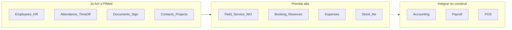

# Estudi: prioritat de mòduls tipus Odoo per a PiMed (verticals)

**Data:** 2026-07-22  
**Abast:** Catàleg d’apps Odoo → què prioritzar a PiMed segons arquetips / perfils sectorials  
**Tipus:** Priorització estratègica (no scorecard 1:1 d’un sol mòdul)

---

## Context i filtre

Odoo ven **desenes d’apps** pensades per a un ERP complet. PiMed es posiciona com a **capa operativa** per a autònoms i micro-equips (1–20), amb receptes sectorials — no com a Holded / Sage / Odoo.

El criteri no és “què té Odoo”, sinó:

1. **Multiplica valor en 2+ arquetips** (`field_service`, `practice`, `hospitality`, `workshop_maker`)
2. **Desbloqueja el “click” sectorial** (sense això l’arquetip no és creïble)
3. **No competeix amb el que ja s’ha decidit integrar** (comptabilitat, nòmina, POS)

### Referències PiMed

| Àrea | Fitxer |
|------|--------|
| Visió i posicionament | [`docs/product-design/01-vision-and-positioning.md`](../../product-design/01-vision-and-positioning.md) |
| Perfils sectorials / arquetips | [`docs/product-design/03-sector-profiles.md`](../../product-design/03-sector-profiles.md) |
| Mapa de mòduls | [`docs/product-design/05-modules-roadmap.md`](../../product-design/05-modules-roadmap.md) |
| Checklist ERP/CRM | [`docs/product-design/08-erp-crm-checklist.md`](../../product-design/08-erp-crm-checklist.md) |
| Estudis Odoo (HR / assistència / docs) | [`docs/plans/odoo/`](./) |
| Expenses (pla) | [`docs/plans/expenses/`](../expenses/) |
| Recruitment (pla) | [`docs/plans/recruitment/`](../recruitment/) |
| FSR (hostaleria) | [`docs/product-design/veriticals/FSR - Full Service Restaurant.md`](../../product-design/veriticals/FSR%20-%20Full%20Service%20Restaurant.md) |

---

## Ja cobert (no “implementar com Odoo”, aprofundir el diferenciat)

| App Odoo | Estat a PiMed | Nota |
|----------|---------------|------|
| Employees | Fort (EHR en curs) | Seguir amb compliance ES, no clonar fitxa ERP |
| Attendances + Time Off | Fort | Diferenciador legal (registre horari) |
| Documents + Sign | Fet | Avantatge vs Odoo en portal / signatura |
| Contacts / CRM light | Fet | Ops CRM, no HubSpot |
| Project | Fet | Base per work orders / comandes |
| Discuss / chatter | Timeline parcial | Ja en roadmap de plataforma |

**Conclusió:** el bloc RRHH + ops documental d’Odoo ja és l’aposta de PiMed. El ROI ara no és “més apps RRHH genèriques”, sinó **mòduls que fan creïbles els verticals**.

---

## Prioritat 1 — Mòduls que més importen (ordre recomanat)

### 1. Field Service / Work Orders (Odoo: Field Service)

- **Per què #1:** l’arquetip `field_service` és el Tier A més gran (electricista, lampista, clima…) i també alimenta `workshop_maker` a camp.
- **Impacte:** transforma Projects + Catalog + Calendar + Locations en “ordre de servei” (estat, checklist, materials, geo, tancament).
- **Sense això:** el sector “serveis al camp” queda com a CRM genèric.

### 2. Booking / Appointment (Odoo: Appointments / Calendar booking)

- **Per què #2:** desbloqueja `practice` (cites) i `hospitality` FSR (reserves); després `lodging` i `appointment_walkin`.
- **Impacte:** slots públics, capacitat d’Assets (taules / boxes), no-show, llista d’espera.
- **QSR vs FSR:** QSR pot viure més amb HR / temps; FSR **no** és producte sense reserves.

### 3. Expenses (Odoo: Expenses)

- **Per què #3:** transversal (camp + taller + micro-equip); ja planejat a [`docs/plans/expenses/`](../expenses/).
- **Impacte:** dietes / materials per projecte + OCR → pont natural cap a Holded / comptabilitat sense construir ERP.

### 4. Stock-lite + manteniments (Odoo: Inventory *mínim* + Maintenance light)

- **Per què #4:** `workshop_maker` és l’arquetip que més estressa la base (productes, estoc acabat, postvenda).
- **Abast correcte:** `stock_qty` + consum per línia de projecte + PM via Calendar — **no** inventari multi-magatzem / lots (❌ explícit a la checklist ERP).

### 5. Clinical / Professional Records (no és una app Odoo única; més aviat expedient / case files)

- **Per què #5:** fa creïble `practice` (expedient + DMS + metadata sectorial).
- **Abast:** plantilles per vertical (`clinical` / `legal` / `coaching`), no HIS / EMR regulat complet.

### 6. Recruitment / ATS (Odoo: Recruitment)

- **Per què #6 (després):** útil a `hospitality` (rotació alta) i Tier B; ja planejat, però **secundari** respecte a l’ops diària del client final.
- Completa el cicle HR després d’Employees + Attendance.

---

## Prioritat 2 — Valen la pena més tard (V2 / demanda)

| App Odoo | Quan | Motiu |
|----------|------|-------|
| Planning / Shifts (aprofundir) | Hospitality madur | Ja hi ha base de torns; aprofundir quan FSR / QSR ho demanin |
| Sales / CRM pipeline kanban | Quan Projects ho demani | Lead → quoted reutilitzant Projects |
| Website / eCommerce light | Portal públic madur | Ja hi ha public portal; no clonar Odoo Website |
| Helpdesk | Si SAT postvenda creix | Natural després de Field Service |
| Fleet | Només si demanda clara | Odoo Flota ❌ com a producte; “flota” a PiMed = estacions de fitxatge |
| Knowledge / eLearning | Baixa | No core del target |

---

## Integrar, no implementar

| App Odoo | Alternativa PiMed |
|----------|-------------------|
| Accounting / Invoicing | Holded / Quipu / Sage |
| Payroll | PayFit / gestoria / A3 |
| Point of Sale | TPV existent + labor % / ops |
| Manufacturing / MRP | Fora; taller = catàleg + stock-lite |
| Purchase (complet) | V2 només si `workshop_maker` ho exigeix |
| Marketing Automation | Brevo / Mailchimp |

Coherència de posicionament: **PiMed guanya a camp, horari legal i documents; el fiscal el fa un altre**.

---

## Lectura per arquetip

| Arquetip | Mòdul Odoo-equivalent més crític ara |
|----------|--------------------------------------|
| `field_service` | Field Service / Work Orders (+ Expenses) |
| `practice` | Appointments / Booking + expedient professional |
| `hospitality` | Booking / reserves (FSR) + Planning / HR (ja fort) |
| `workshop_maker` | Stock-lite + Work Orders mixt taller / camp |
| Transversal Tier B | Expenses → Recruitment |

---

## Recomanació executiva

1. **No continuar expandint el catàleg d’apps RRHH com Odoo** (Employees / Attendance / Documents ja són el moat); tancar EHR i passar a **ops verticals**.
2. **Ordre amb més ROI per als verticals:** Field Service → Booking → Expenses → Stock-lite → Expedients `practice` → Recruitment.
3. **Comptabilitat, nòmina, POS, MRP, flota i inventari profund:** zero prioritat de producte propi; només connectors.

---

## Següents passos possibles

- ~~Baixar Field Service a backlog~~ → fet: [`docs/plans/field-service/`](../field-service/) (2026-07-22).
- Contrastar Booking amb un vertical concret (`practice` / FSR) abans d’obrir implementació.
- Continuar la sèrie Odoo amb estudis puntuals (Booking, Stock-lite, Nòmina) quan es tanqui cadascun.
- Implementar FS-0…FS-5 i seguir estat a [`field-service/STATUS.md`](../field-service/STATUS.md).
