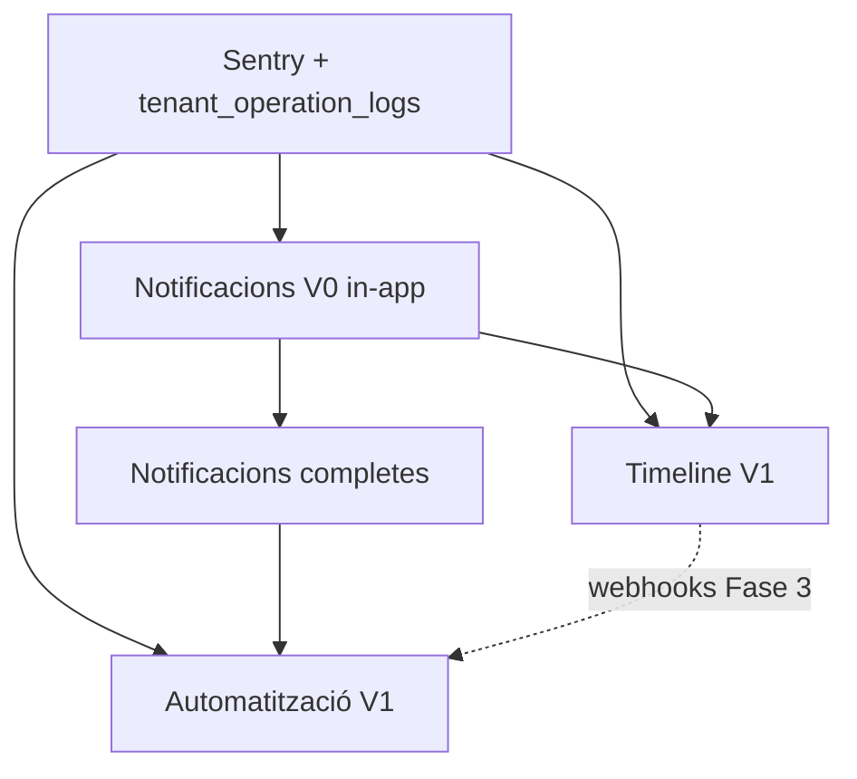

# Roadmap de plataforma — Prioritat i sprints (2026)

**Data:** Juny 2026  
**Estat:** Acord de direcció tècnica  
**Abast:** Ordre d'implementació i entregables per sprint de cinc grans línies de treball:

1. Gestió d'errors (Sentry + `tenant_operation_logs`)
2. Notificacions (V0 in-app → motor complet)
3. Timeline per entitats
4. Automatització

**Plans de referència:**

| Línia | Document |
|-------|----------|
| Errors / Sentry | [`docs/plans/Sentry/README.md`](Sentry/README.md) |
| Notificacions | [`docs/plans/notificacions/README.md`](notificacions/README.md) |
| Timeline | [`docs/plans/entity_timeline/plan.md`](entity_timeline/plan.md) |
| Automatització | [`docs/plans/automatitzacio/arquitectura-automatitzacio-v2.md`](automatitzacio/arquitectura-automatitzacio-v2.md) |

---

## Resum executiu

L'ordre recomanat equilibra **fiabilitat operativa**, **valor visible al producte** i **menys deute tècnic**:

```text
1. Sentry + tenant_operation_logs     (base transversal)
2. Notificacions V0 (in-app)          (pont per Timeline i Automatització)
3. Timeline V1                        (valor usuari ràpid)
4. Notificacions completes            (multicanal)
5. Automatització V1                  (el més complex; consumeix la resta)
```

**Durada estimada:** 8 sprints (~8–10 setmanes amb 1 equip petit), assumint paral·lelització limitada.

---

## Grafo de dependències



### Per què aquest ordre

| Ordre | Pla | Motiu principal |
|-------|-----|-----------------|
| **1** | Sentry + operation logs | Tot el async (cues, webhooks, IA, notificacions) necessita traçabilitat. Separació clara: bugs → Sentry; errors de negoci → `tenant_operation_logs` (no barrejar amb `audit_logs`). |
| **2** | Notificacions V0 | API única `NotificationService.send()` amb canal `in_app` desbloqueja mencions (Timeline) i alertes (Automatització) sense esperar OneSignal/Twilio. |
| **3** | Timeline V1 | Reutilitza `audit_logs` existent; valor visible per HR/gestors. Webhooks sortints queden per després d'automatització. |
| **4** | Notificacions completes | Resend → OneSignal → Twilio BYO; errors de canal van a `tenant_operation_logs`. |
| **5** | Automatització | Event bus + workflows + BAM; depèn d'events, notificacions i logs d'operació. |

### Alternativa (més valor visible abans)

Intercanvi acceptable: **1 → 3 → 2 → 4 → 5**, implementant Timeline amb `user_notifications` inline i refactoritzant al Sprint 3. Funciona però genera deute; **no recomanat** si es pot fer V0 abans.

---

## Mini-roadmap per sprints

Calendari orientatiu: **1 sprint = ~1 setmana**. Ajustar segons capacitat real de l'equip.

---

### Sprint 1 — Fundació d'errors (Sentry + operation logs)

**Objectiu:** Cap codi nou async sense destí clar per errors de sistema vs negoci.

| Entregable | Detall |
|------------|--------|
| Migració SQL | `data.tenant_operation_logs` (tenant_id, integration_type, status, message, payload_summary, correlation_id, created_at) + índexs + RLS manager+ |
| `SystemErrorTracker` | Facade agnòstic (Edge Functions `_shared/`): `captureException`, context obligatori `tenant_id` + `user_id` |
| Adapter Sentry | Només producció; local → console structured |
| `OperationLogService` | `logFailure` / `logSuccess` per processos asíncrons; mai barrejar amb `audit_logs` |
| Integració pilota | 1–2 Edge Functions crítiques (p.ex. `process-email-queue`, `ai-chat-turn`) migrades de `console.error` |
| Directrius dev | Secció a doc + regla Cursor: quan Sentry vs operation_logs vs HTTP 400 |

**Criteris d'acceptació:**
- [ ] Excepció no capturada a EF prod apareix a Sentry amb tenant/user
- [ ] Error de negoci (p.ex. Twilio sense saldo simulat) escriu a `tenant_operation_logs` sense trencar el flux principal
- [ ] Cap escriptura d'errors operatius a `audit_logs`

**Referència:** [`docs/plans/Sentry/README.md`](Sentry/README.md)

---

### Sprint 2 — Notificacions V0 (in-app)

**Objectiu:** API unificada mínima; safata al tenant-portal.

| Entregable | Detall |
|------------|--------|
| Migració SQL | `data.user_notifications` + índex unread |
| `NotificationService.send()` | Facade: `{ tenantId, userId, eventType, title, body, deepLink, channel: 'in_app' }` |
| RPCs | `get_user_notifications`, `mark_notification_read`, `mark_all_notifications_read` |
| UI tenant-portal | Icona campana + dropdown + badge unread |
| Integració errors | Fallades d'enviament futur → `OperationLogService` (encara sense canals externs) |
| Tests smoke | Crear notificació manual via RPC/service |

**Criteris d'acceptació:**
- [ ] Usuari veu notificacions in-app i pot marcar-les llegides
- [ ] `NotificationService` és l'única porta d'entrada (no INSERT directe des de features)
- [ ] Deep link preparat (URL relativa; consumida per Timeline al Sprint 4)

**Referència:** [`docs/plans/notificacions/README.md`](notificacions/README.md) (fase reduïda)

---

### Sprint 3 — Timeline V1 (backend + 2 entitats)

**Objectiu:** Timeline unificada audit + comentaris per empleats i contactes.

| Entregable | Detall |
|------------|--------|
| Migració SQL | `data.entity_comments` + índexs + RLS + helpers `can_view_entity` / `can_edit_entity` (employee, contact) |
| Índex audit | `idx_audit_logs_entity_timeline (tenant_id, entity_type, entity_id, created_at DESC)` |
| RPCs | `get_entity_timeline`, `insert/update/delete_entity_comment`, `get_entity_comment_replies`, `resolve_entity_comment_task` |
| Humanització | `message_key` + `message_vars` al RPC; registre i18n ~20 accions (EMPLOYEE_*, CONTACT_*, DOCUMENT_*) |
| Trigger mencions | `AFTER INSERT` → `NotificationService.send()` per `mentions[]` + reply-to-parent |
| UI components | `EntityTimeline`, `TimelineComposer`, `TimelineComment`, `TimelineEvent` |
| Integració pàgines | Tab **Activitat** a `EmployeeDetailPage`; secció Activitat a `ContactDetailPage` |
| Deep links | `?tab=activity&comment={id}` |

**Criteris d'acceptació:**
- [ ] Manager comenta, menciona @usuari, rep notificació in-app
- [ ] Events audit recents apareixen humanitzats (ca)
- [ ] Soft delete mostra "Comentari eliminat" i preserva fil de respostes
- [ ] Paginació per cursor amb >50 items

**Referència:** [`docs/plans/entity_timeline/plan.md`](entity_timeline/plan.md) — Fase 1

---

### Sprint 4 — Timeline V2 (tasques, més entitats, cerca)

**Objectiu:** Completar MVP timeline i preparar IA.

| Entregable | Detall |
|------------|--------|
| Entitats | Integració **project** + **document** |
| Tasques | Filtre "només pendents"; resoldre tasca → event audit `COMMENT_TASK_RESOLVED` |
| Adjunts | Reutilitzar `request-upload` / `confirm-upload` amb `source: entity_comment` |
| Cerca | Full-text comentaris per entitat (`to_tsvector`) |
| Widget (opcional) | `get_my_open_tasks` + llista sidebar/dashboard |
| Tool IA | `query_entity_timeline` (defineTool + RPC + permisos RBAC) |

**Criteris d'acceptació:**
- [ ] Tasca amb checkbox es resol i queda registrada a timeline
- [ ] Adjunt a comentari puja i es descarrega correctament
- [ ] IA pot resumir activitat recent d'un empleat (amb permisos)

**Referència:** [`docs/plans/entity_timeline/plan.md`](entity_timeline/plan.md) — Fase 2

---

### Sprint 5 — Notificacions completes (Resend + OneSignal)

**Objectiu:** Multicanal per usuaris interns; preferències bàsiques.

| Entregable | Detall |
|------------|--------|
| Esquema | `notification_preferences` per usuari/tenant; credencials Twilio BYO (estructura, sense UI completa encara) |
| Routing | `NotificationService`: in_app → OneSignal → Resend (fallback email) |
| OneSignal | SDK web tenant-portal; mapping `user_id` intern |
| Resend | Reutilitzar infra email per alertes transaccionals (mencions, tasques) |
| Timeline | Mencions poden enviar email si usuari ho té activat |
| UI | `/settings/notifications` — toggles per canal/event |
| Errors | Fallades Resend/OneSignal → `tenant_operation_logs` |

**Criteris d'acceptació:**
- [ ] Menció genera in-app + push (si activat) + email (si activat)
- [ ] Error de canal no trenca creació del comentari
- [ ] Admin tenant veu error a historial d'operacions

**Referència:** [`docs/plans/notificacions/README.md`](notificacions/README.md)

---

### Sprint 6 — Notificacions Twilio BYO + polish

**Objectiu:** Canal extern (SMS/WhatsApp) per clients del tenant.

| Entregable | Detall |
|------------|--------|
| Credencials BYO | Vault/encrypted Twilio SID, token, sender per tenant |
| Routing extern | Contactes amb telèfon → Twilio; usuaris app → OneSignal |
| UI tenant | Configuració Twilio a settings |
| Smoke | Enviament SMS de prova + log d'error si credencials invàlides |

**Criteris d'acceptació:**
- [ ] Tenant amb Twilio configurat pot enviar SMS transaccional
- [ ] Error Twilio (saldo/credencial) visible a operation logs, no a Sentry com a fatal

---

### Sprint 7 — Automatització V1 (event bus + 1 blueprint)

**Objectiu:** Primer workflow end-to-end sense Automation Center complet.

| Entregable | Detall |
|------------|--------|
| Migració SQL | `automation_workflows`, `workflow_runs`, `workflow_step_runs` (mínim) |
| Event bus | Trigger `AFTER INSERT` audit_logs rellevant → `pgmq.send('workflow_trigger_queue')` |
| Edge Function | `process-workflow-triggers` — busca workflows actius per event_type |
| Executor | `process-automation-queue` — 2–3 action handlers: `send_notification`, `send_email`, `noop` |
| Blueprint | "Onboarding empleat" (`EMPLOYEE_CREATED` → notificar manager → email benvinguda) |
| Observabilitat | Runs fallits → `tenant_operation_logs` + Sentry si bug |
| UI mínima | Llista runs recents (admin tenant), sense editor visual |

**Criteris d'acceptació:**
- [ ] Crear empleat dispara workflow i notifica manager
- [ ] Step fallit queda registrat i es pot reintentar manualment
- [ ] Cap workflow creua tenants

**Referència:** [`docs/plans/automatitzacio/arquitectura-automatitzacio-v2.md`](automatitzacio/arquitectura-automatitzacio-v2.md) — Capa 0–2 reduïda

---

### Sprint 8 — Automatització V2 (BAM + human approval)

**Objectiu:** Inbox d'aprovacions i Automation Center bàsic.

| Entregable | Detall |
|------------|--------|
| Step type | `HUMAN_APPROVAL` → workflow `WAITING_HUMAN` |
| BAM Inbox | UI pending approvals (aprovar/rebutjar) |
| Automation Center | Vista runs + steps + retry manual |
| Blueprint 2 | Flux amb aprovació (p.ex. contracte laboral) |
| Timeline webhooks | `tenant_webhooks` + `dispatch-webhook` (opcional si hi ha capacitat) |

**Criteris d'acceptació:**
- [ ] Workflow pausa fins aprovació humana i reprendeix després
- [ ] Manager veu inbox d'aprovacions pendents
- [ ] Webhook test envia payload signat (HMAC) si s'implementa

---

## Matriu sprint → plans

| Sprint | Sentry | Notificacions | Timeline | Automatització |
|--------|--------|---------------|----------|----------------|
| 1 | ●●● | | | |
| 2 | ● | ●●● | | |
| 3 | ● | ● | ●●● | |
| 4 | | ● | ●● | |
| 5 | ● | ●●● | ● | |
| 6 | ● | ●● | | |
| 7 | ● | ● | | ●●● |
| 8 | ● | ● | ● | ●●● |

Llegenda: ● = tocada / integració; ●●● = focus principal del sprint.

---

## Decisions obertes (cal tancar abans o durant Sprint 3)

| # | Decisió | Impacte | Recomanació |
|---|---------|---------|-------------|
| 1 | Qui pot comentar a timeline (tots els membres vs manager+)? | RBAC Sprint 3 | Tots els membres actius comenten; manager+ esborra alienes |
| 2 | Rich text als comentaris V1? | Composer Sprint 3 | Text pla + mencions; markdown Fase 2 |
| 3 | Email en mencions: Sprint 5 o abans? | Sprint 5 | Després de OneSignal/Resend routing |
| 4 | Timeline agregada tenant ("activitat avui") | Sprint 4+ | Opcional widget; no bloqueja MVP |
| 5 | Retenció legal comentaris (immutabilitat HR) | Migració | Soft delete V1; hard delete només admin |

---

## Riscos transversals

| Risc | Sprint afectat | Mitigació |
|------|----------------|-----------|
| Scope creep a Automatització | 7–8 | 1 blueprint; no editor visual fins V2 |
| Duplicació notification logic | 2–5 | `NotificationService` des del Sprint 2 |
| `audit_logs` massa gran per timeline | 3+ | Índex entity + cursor; filtre "només comentaris" |
| Sentry sense context tenant | 1 | Context obligatori al facade; rebutjar capture sense tenant en prod |
| Twilio BYO complexitat | 6 | Aïllat al final; errors sempre a operation_logs |

---

## Següents passos immediats

1. Validar ordre de sprints amb l'equip (1 setmana vs 2 setmanes per sprint).
2. Tancar decisió #1 (permisos comentaris) abans d'iniciar Sprint 3.
3. Crear issues/tickets per Sprint 1 amb checklist d'aquest document.
4. Executar Sprint 1 sense esperar plans detallats complets de Notificacions/Automatització (ja n'hi ha prou als README existents).

---

## Historial

| Data | Canvi |
|------|-------|
| 2026-06 | Document inicial — prioritat i 8 sprints derivats de l'anàlisi de dependències entre plans |
