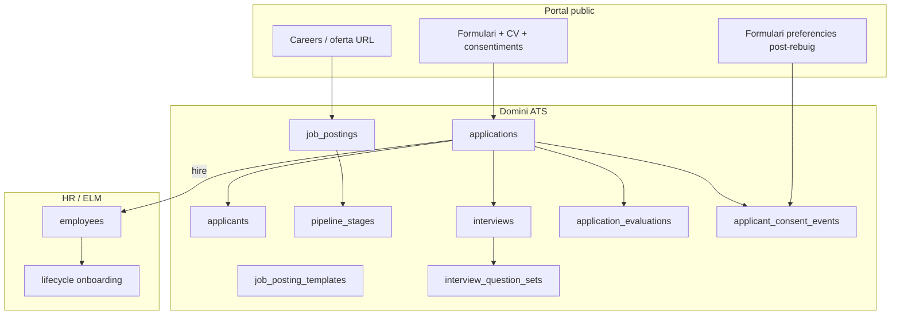

# Domini de dades, RLS i RGPD (REC-0, REC-4, REC-9, REC-10)

> **Pla pare:** [README.md](./README.md)  
> **Revisió 2026-07-21b:** correccions de retenció, CV, erasure_log, permisos, sync de visibilitat (feedback revisió externa).

---

## Model de dades (nucli)



### Taules (`data` schema)

| Taula | Descripció |
|-------|------------|
| `job_postings` | Oferta: títol, descripció, `status` (`draft` / `published` / `unlisted` / `expired` / `archived`), dates, `site_id`, `department_id`, `job_position_id`, `location_id`, guia seleccionador, skills, `public_slug` |
| `job_posting_public_sites` | M:N oferta ↔ `public_sites` (una oferta central pot publicar-se a un o més webs de marca) |
| `job_posting_templates` | Plantilla reutilitzable (guia, preguntes, etapes) |
| `applicants` | Persona (email únic/tenant): contacte, `email_verified_at`; **sense CV** (el CV viu a la candidatura) |
| `applications` | Candidatura: `stage_id`, `cv_storage_path` / `cv_document_id`, retenció per candidatura, `source`, `import_source_label`, `outcome_communicated_at`, `process_closed_at`, puntuacions internes |
| `recruitment_settings` | Polítiques rebuig, retenció (**obligatòria**), legal basis import, opcions formulari; override parcial per oferta |
| `pipeline_stages` | Etapes Kanban: `name`, `position`, `is_terminal_hire`, `is_terminal_reject` |
| `interviews` | Tipus (`phone`/`online`/`onsite`), agenda, notes, `question_set_id` |
| `interview_question_sets` | Plantilles de preguntes |
| `application_evaluations` | Qualificació estructurada |
| `applicant_consent_events` | Append-only: text legal versionat, preferències, talent pool; pot ser per `application_id` o per `applicant_id` |
| `applicant_data_requests` | Peticions de drets: tipus, estats, `fulfilled_via`, SLA |
| `applicant_erasure_log` | Pseudonimització (veure § erasure_log); **no** és anonimització |

### Estats d’oferta (nomenclatura)

| Estat | Significat | Dispara tancament de procés? |
|-------|------------|------------------------------|
| `draft` | Esborrany | No |
| `published` | Visible als `public_sites` vinculats | No |
| `unlisted` | Oberta internament, **no** publicada (abans malanomenat `closed_unlisted`) | **No** |
| `expired` | Caducada per `closes_at` (cron) | Segons `recruitment_settings.expire_closes_process` (default **sí**) |
| `archived` | Tancada definitivament | **Sí** sempre |

**Tancament de procés** = escriure `applications.process_closed_at` per a candidatures encara obertes +, si `rejection_notify_policy = on_posting_close`, encuar correus de resultat pendents.

### CV — decisió tancada

**El CV pertany a `applications`, no a `applicants`.**

- Cada candidatura pot tenir el seu propi fitxer (dues aplicacions = dos CVs possibles).
- `applicants` només guarda dades de persona (email, nom, telèfon, verify).
- Import CSV: columna CV → `application.cv_*` de la fila importada.
- Fitxa candidatura: mostra el CV d’aquella `application`.

### Camps clau a `applications`

| Camp | Tipus | Notes |
|------|-------|-------|
| `cv_storage_path` / `cv_document_id` | text/uuid | Storage privat |
| `retention_preference` | enum | `delete_on_process_end` \| `delete_after_months` |
| `retention_months` | int nullable | Només si `delete_after_months` |
| `purge_at` | timestamptz | **Calculat i persisit** (mai infinity); veure § retenció |
| `outcome_communicated_at` | timestamptz | NULL fins correu oficial de resultat |
| `process_closed_at` | timestamptz | NULL fins tancament de procés |
| `source` | enum | Detectat via query `?src=` a l’URL d’apply (veure § source) |
| `import_source_label` | text | Només `csv_import` |

### `candidate_visible_status` — no és camp writable

**No** és un camp desnormalitzat que l’aplicació pugui desincronitzar.

Regla (vista o columna generada / trigger BEFORE INSERT/UPDATE):

```
candidate_visible_status =
  CASE WHEN outcome_communicated_at IS NOT NULL THEN 'closed' ELSE 'open' END
```

- Escriptura només via `outcome_communicated_at` (RPC `communicate_application_outcome` / tancament d’oferta en lot).
- Import CSV, scripts admin i moviments de `stage_id` **no** poden posar `closed` al portal sense passar per `outcome_communicated_at`.
- Criteri d’acceptació: trigger o generated column a BD, no disciplina de capa d’aplicació.

### Detecció de `source` (REC-11)

| Valor | Mecanisme |
|-------|-----------|
| `web` | Apply sense `?src=` o `src=web` |
| `qr` | URL generada pel botó QR: `?src=qr` |
| `whatsapp` | URL del `wa.me` / botó WhatsApp: `?src=whatsapp` |
| `email` | Inbound REC-7 |
| `manual` | Alta interna tenant-portal |
| `csv_import` | Assistente import |

El KPI per font no és buit: el valor es desa a l’INSERT de l’application.

### Publicació oferta central → webs

- `job_postings.site_id NULL` = RRHH central (escop operatiu).
- Publicació web: taula `job_posting_public_sites` (M:N). L’usuari tria a quins `public_sites` surt l’oferta.
- `public_slug` únic per `(tenant_id, public_site_id)` o slug global de tenant + path per site — detall a migració; UI obliga a triar ≥1 site públic abans de `published`.

### Storage

- Bucket privat `recruitment-cvs` (path inclou `application_id`).
- Pujada pública via signed upload / Edge Function; **mai** lectura anon del CV.
- MVP: s'accepten PDFs digitals i se n'extreu només la capa de text quan existeix. Un PDF escanejat o una imatge es conserva per a revisió humana, sense OCR en el flux MVP.
- Futur: l'OCR de PDFs escanejats i imatges usa Tesseract en un microservei contenidoritzat separat, disponible únicament per tenants amb l'add-on de plans alts. El fitxer no s'envia a un LLM per fer OCR.

---

## RLS i permisos

### Permisos

| Permís | Abast |
|--------|--------|
| `recruitment.view` | Llistats, Kanban lectura, analytics agregats |
| `recruitment.manage` | Ofertes, pipeline, avaluacions, export/import CSV |
| `recruitment.interview` | Notes d’entrevista, question sets en curs |
| `recruitment.rights` | Safata Art. 15–21: aprovar/rebutjar peticions, veure `applicant_erasure_log`, executar purge manual |

`recruitment.rights` no es concedeix per defecte a tot `recruitment.manage`; típicament owner / rol RRHH sènior / DPO del tenant.

### Escop

1. **Tenant** sempre.
2. **Site** via `tenant_members.site_id` (com la resta de l’app).
3. **Departament (MVP):** columna opcional `recruitment_settings.enforce_department_scope` (default `false`). Si `true`, membres amb `department_ids` restringits només veuen ofertes/candidatures del seu departament (o sense `department_id`). Necessari per contractacions executives confidencials en empreses mitjanes/grans.

---

## Paquet legal (REC-0)

Pre-requisit del MVP públic (també per leads existents):

1. **Consentiment + Art. 13** als formularis (leads + candidatures).
2. **Cookies al public-portal:** avís informatiu d’essencials ara; **CMP diferit** fins que hi hagi cookies no essencials. Font canònica: [`../legal-compliance/README.md`](../legal-compliance/README.md) (no duplicar un segon CMP aquí).
3. **Plantilles legals:** font de veritat = Legal Center plataforma (`legal-compliance`); les pàgines CMS poden redirigir/incrustar, no mantenir un cos divergent.
4. **Retenció** — veure § retenció; **no prometre** al formulari res que el cron encara no executi (veure EXECUTION).
5. **Minimització:** IP prefix; RLS CV/notes.
6. **IA:** Art. 13 + DPA / transferències (veure [03-email-inbound-and-ai.md](./03-email-inbound-and-ai.md)).

---

## Retenció i purge

### Settings obligatoris del tenant

| Camp | Obligatori | Default seed |
|------|------------|--------------|
| `default_max_retention_months` | **SÍ** (`NOT NULL`) | `12` |
| `expire_closes_process` | SÍ | `true` |
| `rights_sla_days` | SÍ | `30` (Art. 12.3; pròrroga UI fins a 90) |

No existeix el camí `tenant_max_retention ? … : infinity`. El sostre **sempre** aplica.

### Preferències a l’alta (formulari)

Radio **obligatori** (sense “cap preferència”):

1. `delete_on_process_end` — esborrar aquesta candidatura en tancar el procés.
2. `delete_after_months` — N ∈ opcions del tenant (subconjunt ≤ `default_max_retention_months`).

Talent pool = opt-in **separat** (checkbox), amb `talent_pool_until` ≤ sostre tenant.

### Fórmula (sempre finita)

```
purge_at = LEAST(
  applied_at + (retention_months OR default_max_retention_months) * interval '1 month',
  CASE WHEN retention_preference = 'delete_on_process_end'
       AND process_closed_at IS NOT NULL
       THEN process_closed_at ELSE 'infinity'::timestamptz END,
  applied_at + default_max_retention_months * interval '1 month'
)
```

- `purge_at` es **persisteix** a `applications` i es recalcula quan canvia preferència / `process_closed_at` / settings.
- Cron diari: `WHERE purge_at <= now()` → purge d’aquella **application**.

### Granularitat de l’esborrat (decisió tancada)

| Nivell | Què s’esborra |
|--------|----------------|
| **1. Application** | CV, avaluacions, entrevistes, notes, consents lligats a `application_id`, fila `applications` (o soft-delete + anonimització camps) |
| **2. Applicant** | Només quan **no** queden `applications` actives **ni** talent pool vigent (`talent_pool_until > now()`). Llavors s’esborra/anonimitza `applicants` (contacte) |

Si el mateix email té A1 amb purge demà i A2 al talent pool fins d’aquí 6 mesos: es purga A1 (i el seu CV); l’`applicant` i A2 romanen.

Després de purge d’application: email `recruitment.retention_purge_fulfilled` + fila a `applicant_erasure_log` (scope `application` o `applicant`).

### `applicant_erasure_log` — pseudonimització, no anonimització

**Correcció:** un hash d’email **no** és “sense PII”.

| Camp | Notes |
|------|-------|
| `email_hmac` | `HMAC-SHA256(tenant_erasure_secret, lower(email))` — secret per tenant al Vault; sal/secret **no** compartit entre tenants |
| `erased_at` | timestamptz |
| `reason` | `retention_policy` \| `user_request` \| `admin` |
| `scope` | `application` \| `applicant` |
| `tenant_id` | |

A efectes RGPD això és **dada personal pseudonimitzada** (Art. 4.5): permet respondre “suprimides el dia X” sense CV ni email en clar, però **segueix sent dada personal**. Documentació i UI ho diuen així; no es ven com a anonimització. Retenció del log: configurable (p.ex. 3–5 anys) per demostrar compliment.

---

## Visibilitat candidat (REC-10)

### Què veu al portal

| Camp | Visible |
|------|---------|
| Títol oferta, data enviament | Sí |
| Estat | Només `open` / `closed` (derivat de `outcome_communicated_at`) |
| Etapa Kanban, resultat, notes, CV, PII | **No** |

### Política de rebuig

| Política | Comportament |
|----------|--------------|
| `on_decision` (default) | Descart terminal → RPC comunica → correu → `outcome_communicated_at` → portal `closed` |
| `on_posting_close` | Descart intern sense comunicar; en `archived` / `expired` (si flag) → correus lot |

### Abast per canal

| Canal | Abast | PII/CV |
|-------|--------|--------|
| Portal candidat | Totes candidatures del correu (metadades) | No |
| Correu acus / resultat | Només aquest procés | No |
| Export Art. 15 / portabilitat | Tot expedient ATS al tenant | Sí (correu, tras `recruitment.rights`) |

### Post-esborrat

| Situació | Portal | Petició accés |
|----------|--------|---------------|
| Dades existents | Llista obert/tancat | Export per correu |
| Ja suprimides | Candidatura desapareix | Correu `rights_access_after_erasure` (data + motiu via HMAC match) |
| Sense registre | “No hem trobat candidatures” | Mateix |

---

## Drets d’interessat (REC-9)

### Matriu RGPD Cap. III

| Art. | Dret | Cobertura |
|------|------|-----------|
| 12 | Facilitar exercici | Formulari + safata + plantilles; SLA `rights_sla_days` (default **30**, pròrroga documentada fins 90) |
| 13 | Informació recollida | Clàusula formulari |
| 14 | Informació si dades no venen de l’interessat | Obligatori en **import CSV** — veure [04-analytics-and-csv.md](./04-analytics-and-csv.md) |
| 15 | Accés | Export per correu (no UI amb PII) |
| 16–21, 7.3 | Rectificació… oposició / retirar consentiment | Safata + plantilles |
| 22 | Decisions automatitzades | IA assistiva; decisió humana |

### `applicant_data_requests.fulfilled_via`

Enum: `email_export` | `purge` | `field_update` | `restriction_flag` | `preference_update` | `rejected_with_reason`.

### Confirmació email

1. Alta amb `email_verified_at = NULL` + correu confirmació.
2. RRHH veu candidatura; drets/preferències només després de verify.
3. Flag “no verificat” a fitxa.

### Plantilles

| Event | Codi |
|-------|------|
| Petició rebuda | `recruitment.rights_request_ack` |
| Accés però ja esborrat | `recruitment.rights_access_after_erasure` |
| Accés/portabilitat | `recruitment.rights_access_fulfilled` |
| Altres fulfilled / rejected | `recruitment.rights_*` |
| SLA intern | `recruitment.rights_sla_reminder` (disparat a `created_at + rights_sla_days - 3d` si encara `pending_review`) |

Botons safata (requereixen `recruitment.rights`): **Aprovar i notificar** / **Rebutjar i notificar**.

**Nota:** el tenant és el responsable del tractament. PiMed aporta eines; la **base legal** de cada tractament (consentiment / interès legítim / obligació) és **configurable** a `recruitment_settings` pel DPO/tenant — no hardcoded al producte.

---

## Fora d’abast ATS

- Drets sobre dades d’**empleat** post-hire → canal HR/ELM.
- APIs job boards → [04-analytics-and-csv.md](./04-analytics-and-csv.md) (només CSV).
