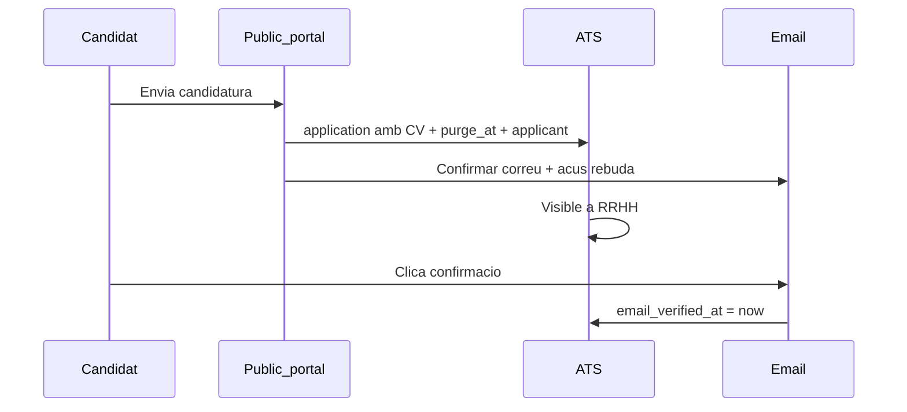
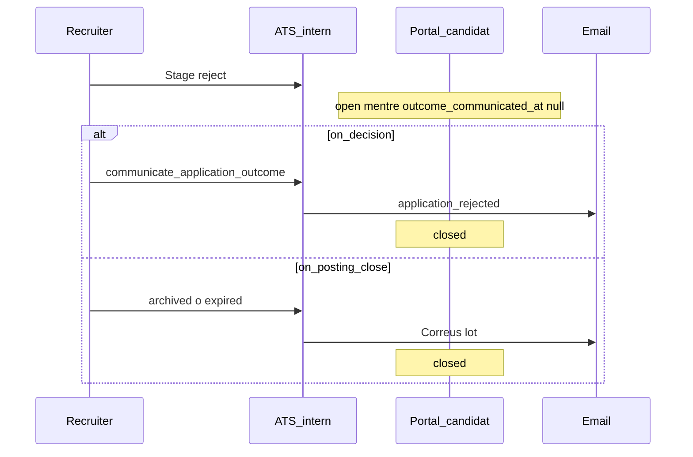

# Fluxos i superfícies (REC-2–REC-7)

> **Pla pare:** [README.md](./README.md) · **Domini/RGPD:** [01-domain-and-gdpr.md](./01-domain-and-gdpr.md)

---

## Multi-tenancy

```
Tenant
  ├─ Site(s) — local físic
  ├─ Department(s) — arbre lògic (+ scope opcional recruitment)
  ├─ job_postings.site_id NULL → RRHH central
  └─ public_sites — web marketing (≠ data.sites)
       └─ job_posting_public_sites (M:N) → Careers + apply
```

- Permisos: site-scoping + opcional department-scope ([01](./01-domain-and-gdpr.md)).
- Oferta: `department_id`, `job_position_id`, `location_id`, skills.
- Abans de `published`: cal ≥1 fila a `job_posting_public_sites`.

---

## Captura pública (REC-3)

### Superfícies

- «Treballa amb nosaltres» (ofertes `published` del `public_site`).
- Pàgina oferta + formulari.
- URL amb `?src=qr` / `?src=whatsapp` / default `web` (desat a `applications.source`).
- QR i WhatsApp generen aquestes URLs.

### Formulari

- Camps + **CV per candidatura** + Art. 13 + **preferència retenció obligatòria** (radio).
- Preferència de retenció **només es mostra si el cron de purge ja és actiu** (REC-3 inclou purge mínim — veure EXECUTION).
- Turnstile + honeypot + rate limit.
- Email verify + acus rebuda; notificació recrutadors.

### Flux alta



---

## Tenant-portal

### Navegació

- `/recruitment` — overview
- `/recruitment/postings` — ofertes
- `/recruitment/postings/:id` — Kanban / taula
- `/recruitment/applicants` — talent pool
- `/recruitment/rights` — safata RGPD (`recruitment.rights`)
- `/recruitment/settings` — polítiques, retenció obligatòria, transparència
- `/recruitment/analytics` — REC-11

### Ofertes

| Estat | Descripció | Tanca procés? |
|-------|------------|---------------|
| `draft` | Esborrany | No |
| `published` | Visible als webs vinculats | No |
| `unlisted` | Interna, no publicada | **No** |
| `expired` | Caducada per data | Si `expire_closes_process` (default sí) |
| `archived` | Tancada definitiva | **Sí** |

Accions: Copiar, plantilla, QR/print (`?src=qr`), WhatsApp (`?src=whatsapp`), export CSV.

### Pipeline

- Etapes tenant + override oferta.
- Kanban + taula.
- Fitxa: **CV de l’application**, timeline, avaluacions, entrevistes, consents, origen.
- Moure a etapa `is_terminal_reject` **no** canvia el portal; cal RPC `communicate_application_outcome` (o lot en arxivar).

### Entrevistes

- Tipus telèfon / online / presencial.
- Guia + question sets.
- Notes: RLS `recruitment.interview`.

### Rebuig amable

Després del correu oficial (`outcome_communicated_at`):

- Formulari preferències (esborrar / talent pool / avisos).
- Requereix email verificat.
- Estats: `pending_response` | `responded` | `expired_no_response`.

### Flux rebuig



---

## Safata drets

- Requereix `recruitment.rights` (no només `manage`).
- Termini: `rights_sla_days` (default 30).
- Aprovar / Rebutjar i notificar.
- Export accés només per correu al email verificat.

---

## Hire → onboarding (REC-6)

1. Crear `employees` des d’`applicant` + metadades de l’`application` (CV opcional a DMS empleat).
2. ELM → `onboarding`.
3. `application_id` a audit.
4. Opcional EC + Automation Center.
5. Correu següents passos → `outcome_communicated_at` → portal `closed`.

---

## Portal candidat

- Token + email verificat.
- Llista: oferta, data, open/closed (derivat).
- Drets + preferències post-resultat.
- Mai PII/CV/etapa/motiu.

---

## Integracions app

| Mòdul | Ús |
|-------|-----|
| departments, sites, locations | FK + scope |
| job_positions, skills | Requisits |
| public_sites | Carreres via M:N |
| DMS | CV per application |
| EC / Automation | Post-hire |

**No** confondre amb `shift_openings` (torns).
