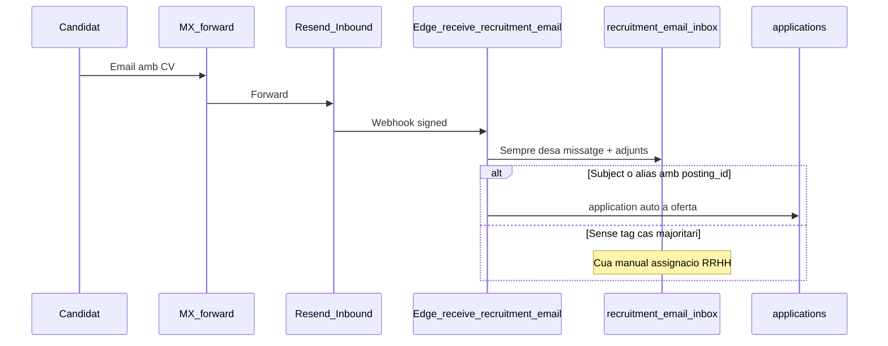

# Email inbound, outbound i IA (REC-5, REC-7, REC-8)

> **Pla pare:** [README.md](./README.md)

---

## Email outbound (implementat avui)

Arquitectura: [`docs/email.md`](../../email.md)

```
enqueue_email() → pgmq → process-email-queue → Resend
                      ↓
                 resend-webhook → estats lliurament
```

### Plantilles recruitment (seed + editables)

| Ús | Codi |
|----|------|
| Confirmació correu (alta) | `recruitment.email_verify` |
| Acus rebuda | `recruitment.application_received` |
| Art. 14 post-import CSV | `recruitment.art14_notice` |
| Rebuig / tancament | `recruitment.application_rejected` |
| Hire / següents passos | `recruitment.application_hired_next_steps` |
| Preferències post-rebuig | `recruitment.post_rejection_preferences` |
| Purge retenció | `recruitment.retention_purge_fulfilled` |
| Drets | `recruitment.rights_*` |

### BYO SMTP

- Només **outbound** quan s’implementi ([`email_byos_smtp.md`](../../email_byos_smtp.md)).
- **No** resol inbound.

---

## Email inbound (REC-7, post-MVP)

### Objectiu

Rebre CVs per correu → `application` amb `source=email`.

### Arquitectura



### Decisions tancades (un sol model)

| Decisió | Detall |
|---------|--------|
| Transport | Webhook plataforma (Resend Inbound), no IMAP |
| **Cas majoritari** | Email a `feina@…` **sense** tag → fila a `recruitment_email_inbox` (`unassigned`); RRHH assigna a una oferta (crea application) |
| Tag opcional | Subject `[posting:<uuid>]` **o** alias `feina+<shortid>@` (mateix resultat: auto-assign); no són dues arquitectures alternatives, són acceleradors del mateix inbox |
| Dedupe | email + `job_posting_id` quan s’assigna |
| Base legal | Configurable a settings (com CSV); Art. 14 si el remitent no ha passat pel formulari web |

### Operativa

- Forward MX → adreça inbound PiMed (SPF/DKIM).
- UI: safata “Correu rebut” amb assignar / descartar / demanar més info.

---

## Processament de CV i IA assist (REC-8, opcional)

Gated per IA del tenant (Vault).

### Nivells de processament

| Nivell | Abast | Disponibilitat | Dades que surten de PiMed |
|--------|-------|----------------|---------------------------|
| Text PDF local | Extreure la capa de text d'un PDF digital | MVP per a CV PDF compatibles | Cap |
| OCR Tesseract | Llegir PDFs escanejats i imatges | **Futur**; add-on de plans alts | Cap; microservei contenidoritzat propi |
| Estructuració LLM | Convertir text a proposta de skills, experiència, formació i idiomes | Opcional si IA tenant + DPA/transfer estan configurats | Només el text necessari, amb redacció aplicable |

- L'OCR no és una decisió de selecció ni una funcionalitat LLM: només converteix píxels en text.
- Al MVP, un PDF sense capa de text o una imatge queda disponible per revisió humana; no es deriva a OCR ni a un LLM automàticament.
- L'OCR futur s'executa en un microservei Tesseract contenidoritzat, com els serveis de processament de PDF. Es crida sempre via cua, amb `tenant_id`, límits de mida/pàgines, idempotència, quota de l'add-on, timeout, retry i DLQ.
- El tenant no pot activar l'OCR només amb una clau d'IA: ha de tenir l'add-on de plans alts actiu. La UI mostra la disponibilitat i el motiu quan no és elegible.

### Funcions

| Funció | Descripció |
|--------|------------|
| Extreure text PDF digital | Capa de text local; no puntua ni estructura el candidat |
| OCR CV escanejat/imatge | Tesseract contenidoritzat → text; futur, add-on de plans alts |
| Estructurar CV amb LLM | Text disponible → proposta de skills/experiència; humà confirma |
| Matching | Oferta ↔ candidat |
| Redacció | Esborranys correu / preguntes |
| Resum | Fitxa per entrevistador |

### Compliment (no només Art. 13 al candidat)

| Requeriment | Com |
|-------------|-----|
| Art. 13 al candidat | Clàusula al formulari / política: dades poden processar-se amb IA del tenant |
| **DPA** amb proveïdor LLM | El tenant (o PiMed com a processador) ha de tenir encàrrec de tractament; UI d’IA enllaça recordatori + checklist abans d’activar “IA en reclutament” |
| Transferències internacionals | Si el model no és UE/adequació: el tenant marca acceptació de transferència / SCC; sense acceptació → parse CV bloquejat |
| Categories especials | Abans d’enviar al LLM: **redacció** opcional (foto, dates naixement, camps configurables); default: no enviar foto; avís que el CV pot contenir dades sensibles |
| Art. 22 | IA assistiva; hire/reject humà |
| Traça | Ús per tenant als analytics IA |

Sense IA configurada o sense checklist DPA/transfer → funcions recruitment IA ocultes. L'extracció local de text d'un PDF digital no depèn d'IA externa; l'OCR Tesseract depèn exclusivament de l'add-on de plans alts.

---

## Notificacions

Notification engine per nova candidatura, SLA drets, entrevista. Email `requiresLegal` no es substitueix per WhatsApp.
