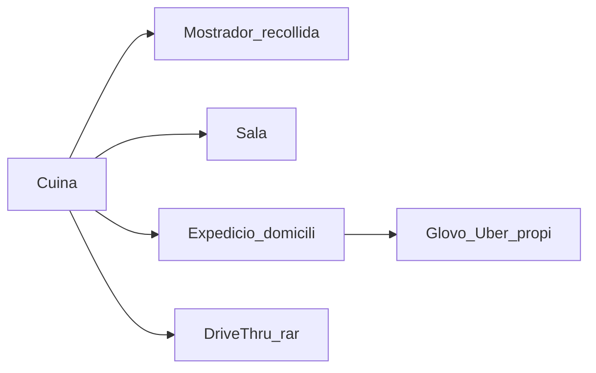

# Seed menjar ràpid (BurgerVista) + gap analysis de compra

Pla per generar seeds SQL manuals a `supabase/seeds/qsr_burgervista/` i documentar per què un operador de menjar ràpid (ES/CAT) compraria o descartaria PiMed.

**Estat:** implementat (`supabase/seeds/qsr_burgervista/`)  
**Càrrega:** només SQL Editor / `psql` manual (no `config.toml`)  
**Fitxatges:** YTD mostrejat (caps 100% / crew ~40%)  
**UUID prefix:** `a1…` · Password demo: `Test1234!`

**Guia operativa (càrrega, logins, proves):** [`guia-seed-burgervista.md`](guia-seed-burgervista.md)

---

## Correcció d’anàlisi de mercat

El primer esborrany sobreponderava el **drive-thru**. Al mercat objectiu (ES/CAT, Tier B):

| Canal | Freqüència real | Exemples |
|-------|-----------------|----------|
| Mostrador / recollida | Gairebé sempre | Kebab, burger, pizzeria |
| Sala / menjar al local | Sovint (variable) | Segons metres quadrats |
| **Domicili** (Glovo, Uber Eats, Just Eat, propi) | **Molt freqüent** | El kebab de barri també |
| Drive-thru / servei amb auto | **Minoritari** | Pocs locals; sol ser cadena amb solar gran |

**Conseqüència:** el seed i el gap analysis es centren en **domicili + mostrador + cuina**. El drive-thru queda com a detall opcional d’un sol local (Diagonal), no com a eix del cas.

El client tipus no és només “franquícia amb carril d’autos”: també és el **local de barri amb 8–15 persones**, dos torns, i la meitat de la feina del sopar sortint en bosses per a un rider.

---

## Objectiu doble d’aquest lot

1. **Seed demo ric** — 2 locals de menjar ràpid que es llegeixin com a restaurant real (cuina, mostrador, expedició a domicili).
2. **Mapa de decisió de compra** — README en llenguatge de client: què pot fer ja, què no, i què el faria descartar PiMed.

El seed **no arregla** forats de producte; els fa evidents.

## Decisions tancades

- Càrrega **manual** (SQL Editor). No a `config.toml`. Acme intacte.
- Fitxatges YTD mostrejats: caps 100% / crew ~40%.
- Password `Test1234!`. UUID prefix `a1…`.
- Marca demo: BurgerVista / Gestió Ràpida BCN (franquiciat amb 2 sites) — el **patró** ha de transferir també a un kebab multi-local.

---

## Qui és el client (persona)

**Marc**, 42 anys. 2 locals a Barcelona. ~18 persones. Central petita (ell + 2 admins); un director per local.

El que li importa cada setmana:

1. Compliment de fitxatge (Inspecció / conveni).
2. Gent a **cuina i mostrador** a dinar i sopar.
3. Que el **pic de domicili** (sopar, cap de setmana, pluja) no deixi la cuina sola ni les bosses sense preparar.
4. Obertura / tancament amb constància.
5. Uniforme + formació higiene abans de tocar menjar.
6. Mentalment: **€ personal vs € vendes** (mostrador + apps de delivery), encara que ho mirí al TPV/Excel.

No li pregunta primer pel drive-thru. Li pregunta: *“Quan Glovo em satura el sopar, tinc prou gent a expedició?”*

---

## Canals del local (model mental correcte)

Cada canal demana **rols i cobertura** diferents. L’app avui només té zones i rols genèrics sense concepte de canal.

---

## Què SÍ pot fer ja (i el seed ho demostra)

| Necessitat | App | Seed |
|------------|-----|------|
| 2 locals, un login CEO | Tenant + sites | 01 |
| Director per local | `tenant_members.site_id` | 01 |
| Fitxatge tauleta / portal | Stations + employee portal | 04, 10 |
| Pauses hostaleria | `tenant_pause_configs` | 03 |
| Festius + calendaris | Labor calendar | 03 |
| Planificar torns | shifts + slots | 05 |
| Cobrir forats | openings / claims | 05 |
| Uniformes, formació, checklists | Templates + docs | 08, 09 |
| Absències | absences | 06 |
| Historial fitxatges | punches YTD | 07 |

Creïble com a **control horari + planificació + RRHH ops**. Ha de semblar menjar ràpid, no taller Acme.

---

## Què necessitaria i NO tenim (sense jerga)

### 1) “Tinc Glovo i Uber. L’app entén el domicili?” — eix principal de canals

**Resposta directa (estat producte avui): NO.** PiMed **no** proporciona eines per gestionar la venda a domicili ni amb aggregadors (Glovo, Uber Eats, Just Eat) ni com a plataforma de delivery propi (comandes, riders, rutes de menjar, temps de lliurament, liquidacions d’apps).

| Capacitat de “venda a domicili” | Estat |
|----------------------------------|-------|
| Rebre / gestionar comandes Glovo–Uber–Just Eat | No |
| Pantalla de cuina / expedició d’orders | No |
| Assignar riders, rutes, ETA | No |
| Liquidacions / comissions d’apps | No |
| Canal “domicili” com a concepte de negoci del local | No |
| Fitxar i planificar **persones** que fan expedició o reparteixen | Parcial (labor genèric) |

**Compte amb el fals amic `delivery` a l’app:** existeix `attendance_work_profile = 'delivery'` i protocols associats, però és un perfil de **càlcul de jornada** pensat per personal itinerant / logística (rutes, parades) — documentat com a post-MVP i **no** és el mòdul de menjar a domicili d’un restaurant. Els “albarans de lliurament” del checklist ERP són de `field_service` (obra al client), no de kebab/burger. `webhook_delivery_*` = enviament tècnic de webhooks, no menjar.

**Què vol dir el client:** Al sopar hi ha pantalles d’aggregadors, bosses, riders, de vegades repartidor propi. Vol saber qui està a **expedició**, reforçar cuina quan puja el volum, i no barrejar-ho amb “sala”.

**Què pot fer PiMed avui (només capa laboral):** crear una zona “Expedició”, un rol, torns i fitxatges per a aquestes persones — com faria amb qualsevol altre lloc de feina. **No** veu comandes ni demanda real de les apps.

**Per què descartaria:** Si busca “l’eina on porto el Glovo + els riders”, PiMed no és candidate. Si busca “qui treballa a cuina/expedició i compleix horari”, encara pot encaixar, amb el domicili gestionat a Partner Center / TPV / app del rider.

**Al seed:** zona **Expedició / Domicili**, rol `expedicio`, coverage de pic, checklist — només la **capa de personal**. README: *no simulem comandes ni integració Glovo*.

**Camí de producte (fora d’aquest lot), sense convertir-se en Glovo:**

1. Canal `delivery` tipat + pack rols/coverage (labor).
2. Import manual/CSV de **volum de comandes o € per franja** (proxy de demanda) → lliga amb % laboral.
3. Repartidors **propis** com a empleats (fitxatge + torns; perfil `delivery` laboral si es madura) — no dispatch de comandes.
4. Integració aggregadors = Tier-3 / fora de focus (com el TPV).

---

### 2) “Vull mirar dinar i sopar per separat”

Franges (obertura → tancament) com a llenguatge de gestió. Avui: noms de torn lliures, no dimensió d’anàlisi.

**Deal-breaker lent:** al cap d’un mes torna a l’Excel de franges.

**Seed:** plantilla de torns clara + coverage per franja (incloent reforç domicili al sopar).

---

### 3) “Estic gastant massa en personal vs el que venem?”

% laboral = cost personal / vendes (mostrador + delivery + sala). Sense € de vendes, només hores.

**Deal-breaker freqüent** si busca eina de marge. Solució futura: vendes manuals/CSV o TPV; no ser el POS.

---

### 4) “On és el pack de restaurant / kebab / burger?”

Onboarding hospitality inclina a reserves/càtering; demo Acme = taller. Sense pack “menjar ràpid / takeaway / delivery”.

**Deal-breaker d’impressió (5 min).**

**Seed:** pack complet creat a mà (demostració + prova que avui no surt de l’onboarding).

---

### 5) Drive-thru / servei amb auto — secundari

Només relevant si el local el té. La majoria del segment objectiu **no**.

**Al seed:** Diagonal pot tenir zona DT residual per no perdre el cas “local amb auto”, però **no** és el diferenciat principal ni el nº3 del ranking de “per què no”. El diferenciat entre locals és més honest així:

| Seu | Què el fa especial al seed |
|-----|----------------------------|
| Eixample | Urbà: sala petita + mostrador + **domicili fort** |
| Diagonal | Més gran: mateix + domicili + **DT residual** (cas rar) |

---

### 6) Franquiciador vs franquiciat

1 tenant × N sites = Marc. No xarxa de marca. Deal-breaker només si compra la cadena.

**Prioritat baixa:** en molts casos basta un **acord comercial de descompte** + onboarding assistit. No cal un OS de franquícies per tancar el seed ni la majoria de vendes a franquiciats.

#### Anticipació de solució (si el comprador és la cadena)

| Nivell | Què | Quan |
|--------|-----|------|
| **0 — Comercial** | Descompte volum / master agreement; pack de plantilles de marca clonables a cada tenant | Ara / primer lead de cadena |
| **1 — Lleuger (recomanat com a anticipació)** | `brand_key` / `franchise_network_id` opcional al tenant; llibreria de plantilles/playbooks de marca; informe agregat **read-only** només a superadmin/partner (mai un franquiciat veu l’altre) | Quan la cadena demani “veure tots els locals” sense portal propi |
| **2 — Portal franquiciador** | Rol brand admin, push de protocols obligatoris, comparatives | Només si ho paguen |
| **3 — Tenant pare → fills** | Jerarquia RLS/billing complexa | Evitar fins a contracte gran |

Model mental que encaixa amb PiMed: **N tenants (un per franquiciat)** etiquetats amb la mateixa marca + pack compartit — no un sol tenant amb 200 sites de 40 socis (barreja empreses jurídiques).

**Al seed BurgerVista:** només el franquiciat Marc (1 tenant, 2 sites). README: *cadena = acord + N tenants; sense jerarquia en aquest lot*.

---

### 7) Propines

Secundari a ES/CAT en aquest segment.

---

### Altres

| Tema | Nota |
|------|------|
| Menors / horaris | Pack feble; molèstia |
| Qualificació graella | `qualifications` existeix; seed amb exemples |
| Demanda Glovo en temps real | Fora d’abast; proxy = coverage manual per franja |
| TPV enllaçat | Tier-3; lligat al % laboral |

---

## Quan DIRIA QUE NO (ranking corregit)

Per un operador de menjar ràpid a BCN (franquícia petita **o** kebab/burger de barri amb 2 locals):

1. **% laboral / marge** — no uneix personal amb vendes (incloent el que ve de les apps).
2. **Impressió 5 min** — demo/onboarding de taller, no de cuina + domicili.
3. **Domicili invisible** — el canal que més creix al barri no existeix al producte. *(abans estàvem posant aquí el drive-thru; era un error d’anàlisi)*
4. **Franges** — no pot gestionar el negoci en llenguatge dinar/sopar/pic delivery.
5. **Només si és la cadena** — no hi ha model multi-franquiciat. *(Prioritat baixa: solució comercial Nivell 0; anticipació tècnica Nivell 1 — veure §6.)*
6. **Drive-thru** — només si aquell local concret en depèn (minoria).
7. Propines, etc. — secundari.

**Quan DIRIA QUE SÍ:** dolor = Inspecció + caos de torns + paperassa, i accepta mirar el marge al TPV/Glovo Partner a part. Segment guanyable **ara** amb aquest seed.

---

## Disseny del seed (alineat al mercat)

### Zones per local

| Zona | Eixample | Diagonal |
|------|----------|----------|
| Cuina | sí | sí |
| Mostrador / recollida | sí | sí |
| Sala | sí (petita) | sí |
| **Expedició / domicili** | **sí (prioritari)** | **sí** |
| Magatzem | sí | sí |
| Servei amb auto | no | sí (residual) |

### Equip ≤10 / local (exemple)

Director; cap torn matí; cap torn tarda; 2 cuina; mostrador; **1 expedició/domicili**; sala o floater; part-time; (Diagonal: 1 persona amb rol DT en comptes de sala, o floater amb DT secundari).

### Torns + coverage

Obertura, Esmorzar, Dinar, Tarda, Sopar, Tancament.  
Coverage: a **Sopar** i **cap de setmana**, `required` extra a rol expedició + cuina (simula pic apps).  
Slots published 2 setmanes; openings/claims mostra.

### Pack documental

Protocol horari; entrega/retorn uniforme; formació higiene/al·lèrgens; checklist obertura; checklist tancament; **checklist expedició / tancament apps**; acollida.  
Documents ja generats + assignacions portal.

### Fitxers previstos

`supabase/seeds/qsr_burgervista/` → `01`…`11` + `seed.sql` + `00_readme.sql` (narrativa de compra amb **domicili al centre**).

| Fitxer | Contingut |
|--------|-----------|
| `00_readme.sql` | Logins, canals, gap analysis |
| `01_org_users.sql` | Tenant, 2 sites, CEO/admins/managers |
| `02_employees_roles.sql` | ≤10/local especialitzats |
| `03_calendars_pauses_holidays.sql` | Pauses, calendaris, festius |
| `04_locations_stations.sql` | Zones + stations + ALA |
| `05_shifts_planning.sql` | Torns, coverage pic domicili, slots |
| `06_absences.sql` | Vacances/absències |
| `07_attendance_punches.sql` | YTD mostrejat |
| `08_templates_qsr.sql` | Plantilles vertical |
| `09_documents_generated.sql` | Documents ja generats |
| `10_portals.sql` | Public sites + tokens |
| `11_skills.sql` | Catàleg skills QSR + assignacions |
| `seed.sql` | Entrypoint monòlit SQL Editor |

---

## Criteris d’acceptació

- SQL Editor post-`db reset` OK; Acme intacte
- En <5 min es llegeix com menjar ràpid amb **zona i rol de domicili**, no com a demo de drive-thru
- DT, si hi és, clarament secundari
- README: ranking “per què no” amb domicili per damunt del drive-thru
- Cap mentida: canals i franges són convenció de seed; no hi ha integració Glovo ni vendes

## Fora d’abast d’aquest lot

- Migracions (enums canal, daypart nadiu, integracions delivery/TPV)
- Taules de vendes / webhooks Glovo
- `config.toml` / substituir Acme

---

## Checklist d’implementació

- [x] Crear carpeta + README (logins, canals, gap analysis; domicili > drive-thru)
- [x] `01_org_users.sql`
- [x] `02_employees_roles.sql`
- [x] `03_calendars_pauses_holidays.sql`
- [x] `04_locations_stations.sql`
- [x] `05_shifts_planning.sql`
- [x] `06_absences.sql`
- [x] `07_attendance_punches.sql`
- [x] `08_templates_qsr.sql`
- [x] `09_documents_generated.sql`
- [x] `10_portals.sql`
- [x] `11_skills.sql`
- [x] `seed.sql` entrypoint monòlit
