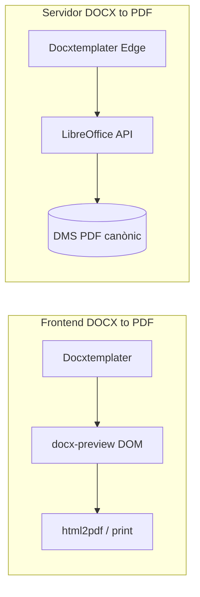

Per què no generar pdfs a partir de docx al frontend?

La pregunta és molt raonable: al frontend ja teniu **Docxtemplater** (omplir variables) i **docx-preview** (previsualització). El salt natural seria: *DOCX omplert → HTML al navegador → PDF*. El pla no ho descarta per caprici, sinó per limitacions estructurals.

## Què faria el camí frontend

Avui el flux seria aproximadament:

1. Docxtemplater al navegador (ja ho feu a [`DocxPreviewModal.tsx`](apps/tenant-portal/src/features/signing/components/DocxPreviewModal.tsx))
2. `docx-preview` converteix el DOCX a HTML/DOM per mostrar-lo
3. Alguna llibreria (`html2pdf.js`, `jspdf`, `window.print()`) genera el PDF des d’aquest DOM

És el mateix enfocament que es mencionava a [`plan-sistema-firma-propi.md`](docs/plans/signing/plan-sistema-firma-propi.md) (mammoth/html2pdf), adaptat al que ja teniu.

## Per què no és adequat com a solució principal

### 1. Fidelitat del document (el problema més greu)

`docx-preview` està pensat per **previsualitzar**, no per produir un PDF legalment fiable:

- Fonts personalitzades del tenant sovint **no es carreguen** al navegador
- Capçaleres/peus, numeració de pàgines, salts de pàgina i marges poden **desquadar**
- Taules complexes, imatges flotants i estils de Word es perden o es deformen
- El PDF resultant pot **variar segons navegador, SO i zoom**

Per a un albarà o pressupost que ha de coincidir amb la plantilla Word del tenant, això és un risc real — no un detall cosmètic.

LibreOffice (via CloudConvert/Gotenberg) interpreta el DOCX com Word, no com una aproximació HTML.

### 2. Inconsistència operativa i legal

Amb conversió al client:

- L’operari al mòbil genera un PDF diferent del manager al Chrome desktop
- No hi ha un **document canònic** al servidor abans de signar
- Per la firma pròpia cal `document_hash` SHA256 **abans** de signar — si el PDF es genera al client, el hash depèn del dispositiu de qui signa

El flux de firma propi necessita un PDF **determinista al servidor** per auditoria i integritat.

### 3. El PDF generat al client no encaixa bé al DMS

Si el PDF es crea al navegador:

- Cal pujar-lo manualment al bucket `documents`
- Cal gestionar errors de xarxa, reintents, mides grans
- El `sign-document-router` deixa de ser el punt únic de veritat
- Cada mòdul (DMS, empleats, contactes, projectes) hauria de reimplementar la mateixa lògica

Avui tot passa per un sol pipeline server-side; trencar això complica molt la integració transversal que voleu.

### 4. Límits tècnics del navegador

| Factor | Frontend | Servidor (LibreOffice) |
|---|---|---|
| DOCX de 5–15 MB | Risc de bloqueig/tab al mòbil | Gestió habitual |
| Temps de conversió | UI bloquejada 10–30 s | Async amb cua |
| Memòria | Limitada per pestanya | Recursos dedicats |
| DOCX amb imatges incrustades | Problemes freqüents | Suport natiu |

El servidor ja limita DOCX a 20 MB per memòria d’Edge Function ([`docx-renderer.ts`](supabase/functions/_shared/docx-renderer.ts)); al client el límit efectiu és encara més baix en dispositius febles.

### 5. La previsualització ≠ el document final

Això és clau: el que veu l’usuari a `DocxPreviewPane` **no és garantia** del PDF que sortiria amb html2pdf. Podríeu tenir:

- Preview correcta al wizard
- PDF final amb pàgines tallades, fonts incorrectes o espais diferents

Això genera més suport i desconfiança que no tenir PDF síncron.

## Quan SÍ tindria sentit al frontend

No és que sigui impossible; és que només és acceptable en casos molt limitats:

- Plantilles **molt simples** (text pla, sense capçaleres ni taules complexes)
- Ús **només de descàrrega** per l’usuari, sense desar al DMS ni signar
- MVP temporal mentre no hi ha API de conversió configurada
- HTML (no DOCX) petit — aquí el pla ja contempla síncron al servidor perquè Chromium/API ho fa bé

Per DOCX amb variables `[[...]]`, salts de pàgina i format corporatiu, el rendiment al client sol ser insuficient.

## Comparació directa

| Criteri | Frontend | Servidor |
|---|---|---|
| Fidelitat Word | Baixa–mitjana | Alta |
| Mateix resultat per tothom | No | Sí |
| Preparat per firma pròpia + hash | Difícil | Sí |
| Integració DMS centralitzada | Cal duplicar lògica | Ja existeix |
| Cost infra | Zero | API o Gotenberg |
| UX síncrona DOCX | Sembla ràpid, però inestable | Async amb notificació |

## Conclusió

**No generem PDF des de DOCX al frontend perquè:**

1. El que ja teniu al client (`docx-preview`) és una **vista prèvia**, no un motor de producció PDF
2. La **firma pròpia** necessita un PDF canònic al servidor
3. El **DMS i els mòduls transversals** necessiten un sol punt de generació fiable
4. La **qualitat i consistència** del document són crítiques per a ús comercial/legal

El pla manté HTML petit síncron al servidor (ràpid i consistent) i DOCX asíncron via API/LibreOffice precisament perquè DOCX és el format on el frontend més falla.

---

Si voleu, puc actualitzar el pla per afegir una **opció híbrida explícita**: frontend només com a *fallback offline* o *descàrrega ràpida* per plantilles simples, amb avís clar que no és vàlid per signatura ni per desar al DMS. Voleu incorporar-ho al pla?