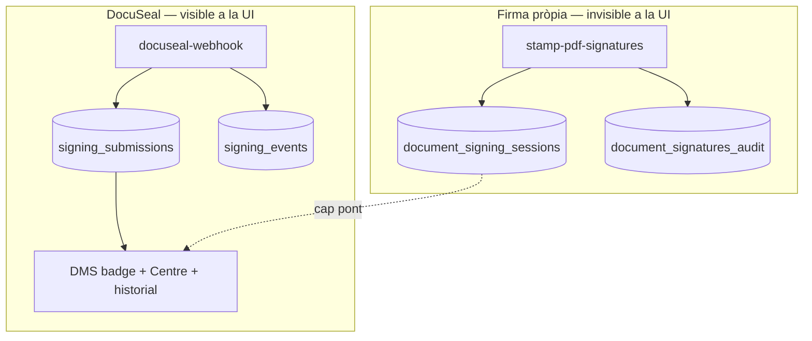

# Pla d'alineació: Firma pròpia ≈ DocuSeal

**Data:** 2026-06-15 (actualitzat 2026-06-15)  
**Estat:** Proposta — pendent d'aprovació  
**Decisions tancades:** `native_evidence_mode` per defecte = **`detached`**
**Relacionat:** [pla_pdf_i_firma_propia.plan.md](./pla_pdf_i_firma_propia.plan.md), [19-dms-templates-signing-control-center-plan.md](../../product-design/19-dms-templates-signing-control-center-plan.md)

---

## Objectiu

Que un document firmat amb **firma pròpia** es comporti igual que un firmat amb **DocuSeal** des del punt de vista de l'usuari del tenant-portal:

- Badge «Firmat» i icona de signatura al DMS
- Bloqueig de re-firma mentre hi ha una submissió oberta o completada
- Fila al **Centre de signatures** amb timeline, signants i enllaços a PDF firmat + auditoria
- Verificació d'integritat (hash) comprensible des de l'app
- Opció de configuració: evidències **dins** el PDF firmat **o** PDF d'auditoria **separat** (estil DocuSeal; **per defecte: separat**)
- Signatures **incrustades al document** (posició de les etiquetes DocuSeal), no només a la pàgina d'evidències
- Plantilla seed **«Test de firmes»** (HTML + DOCX) per a proves manuals i E2E

**Principi rector:** reutilitzar el que ja existeix (`signing_submissions`, `append_signing_event`, Centre de signatures, `process-audit-pdf-queue`) en lloc de duplicar UI o models paral·lels.

---

## Estat actual (bretxa)



| Funcionalitat | DocuSeal | Firma pròpia avui |
|---------------|----------|-------------------|
| `signing_submissions` | Sí, des de l'inici | **No** |
| Badge / icona firmat al DMS | Sí (`useDocumentVersionSubmissionsBatch`) | **No** |
| Bloqueig re-firma (`DocumentRow`) | Sí | **No** |
| Centre de signatures | Sí | **No** |
| Timeline d'esdeveniments | `signing_events` via webhook | `document_signature_evidences` (no exposat al centre) |
| PDF firmat al DMS | `result_document_version_id` | `document_signing_sessions.result_version_id` |
| PDF auditoria | `audit_trail_storage_path` (descarregat de DocuSeal) | `audit_version_id` / `audit_pdf_path` (worker existeix, **no enllaçat a la UI**) |
| Hash a la UI | No | No (només a BD i dins del PDF estampat) |
| Signatures dins el document (etiquetes) | Sí (tags DocuSeal al PDF/DOCX/HTML) | **No** — només pàgina d'evidències o posició fixa al peu |
| Crèdits | Platform consumeix | Gratuït |

**Conclusió:** el backend de firma pròpia és funcional; les bretxes principals són **integració amb el model de seguiment** (Centre/badges) i **estampació de signatures a la posició de les etiquetes** del document (com DocuSeal).

---

## Decisió d'arquitectura: «Submission Hub»

En lloc de crear una segona UI o una vista unificada nova, **estendre `signing_submissions` com a registre canònic de qualsevol procés de firma**, independentment del proveïdor.

### Per què aquesta via

| Alternativa | Pros | Contres |
|-------------|------|---------|
| **A. Submission Hub** (recomanada) | Reutilitza Centre, badges, realtime, historial, `append_signing_event` | Cal migració lleugera + pont native→submission |
| B. Vista SQL unificada | No toca `signing_submissions` | Duplica lògica de filtres, realtime, tipus TS; dos IDs a la UI |
| C. Només consultar sessions al frontend | Canvis mínims al backend | Doble codi a cada component; comportament divergent inevitable |

### Canvis al model de dades

**Nova columna** a `data.signing_submissions`:

```sql
signing_provider  text NOT NULL DEFAULT 'docuseal'
  CHECK (signing_provider IN ('docuseal', 'native'))

native_group_id   uuid NULL  -- = signing_group_id de document_signing_sessions
```

- `docuseal_submission_id` continua sent NULL per a native.
- `signers` JSONB: mateix esquema que DocuSeal (nom, email, rol, ordre, estat per signant).
- `notification_mode`: reutilitzar valors existents (`app_auto_sequential`, etc.) per a remota seqüencial.

**Relació:**

```
signing_submissions (1) ── native_group_id ──► document_signing_sessions (N)
document_signing_sessions (1) ──► document_signatures_audit (1 per signatura)
```

Les sessions natives **no desapareixen**: continuen sent la font de tokens públics, evidències tècniques i estampació PDF. La submission és la **cara visible** per al tenant.

---

## Hashes: clarificació i verificació

### Semàntica (important per a multi-signant seqüencial)

| Camp | Significat |
|------|------------|
| `document_hash_before` | SHA256 del PDF **immediatament abans** d'estampar la signatura d'aquest signant |
| `document_hash_after` | SHA256 del PDF **després** d'estampar (només a BD; no dins el fitxer per la paradoxa d'auto-referència) |

Per al **2n signant**, `hash_before` és el PDF ja signat pel 1r — **correcte** si el 2n signa sobre la versió que inclou la firma anterior.

Per al **signant final**, `hash_after` és la referència d'integritat del document lliurat.

### UI de verificació (Centre de signatures + detall)

Nova secció **«Integritat del document»** a `SigningSubmissionDetail`:

1. Mostrar `hash_before` (1r signant) i `hash_after` (últim signant del grup) amb text explicatiu.
2. Botó **«Comprovar fitxer»**:
   - Opció A: comprovar el PDF firmat ja descarregat del DMS (`result_file_path_or_url`).
   - Opció B: l'usuari puja un fitxer; es calcula SHA256 al client (`crypto.subtle.digest`) i es compara amb `hash_after`.
3. Resultat visual: ✓ coincideix / ✗ no coincideix + enllaç a l'auditoria.

**Dades:** RPC `api.get_signature_audit_for_submission(p_submission_id)` → llegeix `document_signatures_audit` via `native_group_id` / sessions (SECURITY DEFINER).

**DocuSeal:** inicialment només missatge «Verificació de hash disponible per a firma pròpia» o, si DocuSeal exposa hash al futur, mateix panell.

---

## Mode d'evidències: incrustat vs auditoria separada

### Com ho fa DocuSeal avui

- PDF firmat: signatures incrustades al document original.
- PDF auditoria: fitxer **separat** (`_audit.pdf`) amb timeline i metadades.

### Com ho fa la firma pròpia avui

- PDF firmat: pàgina extra amb bloc d'evidències + imatges de signatura.
- PDF auditoria: `process-audit-pdf-queue` ja el genera (HTML → Gotenberg PDF/A-3b) però **no es mostra** al tenant.

### Nova opció de configuració (admin PDF settings)

Afegir a `pdf_converter` (`system_settings`):

```json
{
  "native_evidence_mode": "detached"
}
```

**Default acordat: `detached`** — alineat amb DocuSeal (PDF firmat «net» + certificat d'auditoria separat). Els entorns existents amb comportament `embedded` es poden migrar explícitament si cal.

| Valor | PDF firmat | PDF auditoria | Cas d'ús |
|-------|------------|---------------|----------|
| **`detached` (default)** | Signatures **a les posicions de les etiquetes** del document; sense pàgina extra d'evidències | Sí, **font principal** d'auditoria a la UI | Paritat DocuSeal; document lliurable «net» |
| `embedded` | Pàgina d'evidències + signatura (comportament actual) | Sí, generat en paral·lel | Retrocompatibilitat / màxima transparència en un sol fitxer |
| `both` | Etiquetes al document **i** pàgina d'evidències | Sí | Màxima evidència (més pes) |

**Implementació a `stamp-pdf-signatures`:**

- Llegir `native_evidence_mode` de la config.
- **`detached` (default):** overlay de signatura(s) a les **coordenades de les etiquetes** (vegeu § Signatures incrustades); **no** cridar `addSignaturePage`.
- `embedded` / `both`: crida actual a `addSignaturePage` (pàgina extra).
- **Sempre** encuar `audit_certificate` via `process-audit-pdf-queue` (timeline, hashes, IP/UA).

**UI detall submission:** mateix bloc «Evidència de signatura» per DocuSeal i native — enllaços a PDF firmat + auditoria (`audit_trail_storage_path` o `audit_version_id` resolt).

---

## Signatures incrustades al document (paritat DocuSeal)

### Problema

Avui `stamp-pdf-signatures` afegeix una **pàgina nova** amb bloc d'evidències i imatges de signatura. DocuSeal, en canvi, col·loca la signatura **on indiquen les etiquetes** del document (HTML/DOCX/PDF). Amb `native_evidence_mode=detached`, cal replicar aquest comportament: el PDF firmat ha de mostrar les signatures **dins el document**, i les metadades (hash, IP, timeline) van al PDF d'auditoria separat.

### Convencions d'etiquetes (ja definides al sistema de plantilles)

| Format | Sintaxi signatura | Referència |
|--------|-------------------|------------|
| HTML | `<signature-field name="Firma" role="worker" required="true" style="width:150px;height:50px;display:inline-block;"></signature-field>` | `docs/help/plantilles-documentals.md`, `TemplateHtmlEditor` |
| DOCX | `{{Firma;type=signature;role=worker}}` | `docs/signing/template-system-redesign-plan.md` |
| PDF sense tags | Camps posicionals explícits (`use_explicit_fields`) | `buildDefaultSignatureFields` a `sign-document-router` |

També existeixen camps auxiliars (`date-field`, `text-field`, `initials-field`) que DocuSeal omple de forma interactiva; per a la firma pròpia, la **prioritat V1** és `signature-field` / `type=signature`.

### Flux de resolució de posicions

```mermaid
flowchart TD
  TPL[Plantilla HTML o DOCX amb etiquetes]
  GEN[sign-document-router: genera PDF signable]
  META[Persistir signing_field_map a submission/session]
  STAMP[stamp-pdf-signatures]
  OVER[Overlay imatge signatura a coordenades]
  AUDIT[process-audit-pdf-queue: certificat]

  TPL --> GEN
  GEN --> META
  META --> STAMP
  STAMP --> OVER
  STAMP --> AUDIT
```



| Pas | Descripció |
|-----|------------|
| 1. Extracció | En generar el PDF (HTML→Gotenberg o DOCX→Gotenberg), extreure mapa de camps des de `html_content` (DOM: `signature-field[role]`) o del DOCX (regex `;type=signature;role=`) |
| 2. Persistència | Guardar `signing_field_map` JSONB a `signing_submissions.metadata` i/o `document_signing_sessions` (page, x, y, w, h normalitzats 0–1, `role`, `field_name`) |
| 3. Resolució PDF | Si el PDF ve de Gotenberg sense coordenades natives, **localitzar placeholders** al PDF renderitzat (text anchor / caixa buida) o calcular posició des de l'HTML abans de la conversió (preferit: marques invisibles `data-sig-role` al HTML pre-Gotenberg) |
| 4. Estampació | `stamp-pdf-signatures`: per cada signant, `drawImage` a la pàgina i coordenades del mapa segons `signer_role`; fallback a `buildDefaultSignatureFields` si no hi ha mapa |
| 5. Seqüencial | Cada signant estampa només el seu camp; camps d'altres rols queden buits fins que signin |

**Nota tècnica:** la resolució de coordenades HTML→PDF és el punt més delicat. Estratègia recomanada per a V1:

1. Al renderitzar HTML per a firma, substituir cada `<signature-field>` per un `<div data-sig-role="worker" style="width:150px;height:50px;border:1px dashed #ccc;">&nbsp;</div>` amb mida fixa.
2. Després de Gotenberg, escanejar el PDF per trobar rectangles de la marca (o emmagatzemar offsets pre-calculats per mida de pàgina A4).
3. Alternativa més robusta (V1.1): generar el mapa de coordenades amb una passada pdf-lib sobre el PDF ja generat, cercant text placeholder `[[SIG:worker]]` invisible.

### Relació amb `use_explicit_fields`

El flag `use_explicit_fields` del router (DocuSeal) ja genera camps posicionals per a PDFs sense etiquetes. Per a firma pròpia, **reutilitzar la mateixa estructura de camps** (`areas: [{ page, x, y, w, h }]`) com a format intern del `signing_field_map`, independentment de l'origen (tags vs default).

### Criteri d'èxit

Generar un document des de la plantilla seed «Test de firmes», firmar amb firma pròpia (presencial o remota), i obtenir un PDF on les signatures apareixen **als requadres del document**, no en una pàgina annexa — equivalent visual a DocuSeal.

---

## Paritat UI i fluxos

### 1. Inici de firma (`sign-document-router` · `action=sign_native`)

| Pas | Acció |
|-----|-------|
| 1 | Crear `signing_submissions` amb `signing_provider='native'`, `status='pending'`, `signers[]`, `native_group_id` |
| 2 | Crear sessions (`document_signing_sessions`) com ara |
| 3 | `append_signing_event(submission_id, 'submission.created', ...)` |

Això fa que el Centre mostri la fila **des del primer moment** (com DocuSeal).

### 2. Esdeveniments durant el procés

| Event native | Equivalent DocuSeal | Acció |
|--------------|---------------------|-------|
| Link enviat | form.sent | `append_signing_event` + evidència |
| Token obert | form.opened | idem |
| Document vist | form.viewed | idem |
| Signatura dibuixada | — | event propi `signature.drawn` |
| Signatura completada (per signant) | form.completed | actualitzar `signers[i].status` |
| Grup complet | submission.completed | `status='completed'`, `result_document_version_id`, `completed_at` |

**Pipeline recomanat:** funció compartida `_shared/signing-completion.ts` cridada des de:

- `process-signing-token` (remota)
- `stamp-pdf-signatures` (presencial / post-stamp)
- Opcionalment una Edge Function `native-signing-events` que simuli el contracte del webhook (vegeu § Webhook intern)

### 3. Badge i bloqueig re-firma

**Cap canvi estructural** als components si hi ha submission:

- `useDocumentVersionSubmissionsBatch` ja consulta per `source_document_version_id` / `result_document_version_id`.
- `DocumentRow` / `DocumentDetailPage`: el diàleg «Document ja firmat» funciona amb `status === 'completed'`.
- Cal assegurar que `result_document_version_id` s'omple al completar el grup (no només `session.result_version_id`).

**Extra:** utilitzar `isCurrentVersionSigned` (ja definit però no usat a `DocumentDetailPage`) com a fallback per versions sense submission (documents antics).

### 4. Centre de signatures

| Element | Canvi |
|---------|-------|
| Llistat | Columna o filtre «Proveïdor» (DocuSeal / Firma pròpia) |
| Detall | Amagar «Comprovar DocuSeal» si `signing_provider='native'` |
| Detall | Mostrar «Comprovar integritat (hash)» si native |
| Detall | Enllaç públic de signatura: URL `/sign/:token` del signant actiu (remota) |
| Accions | «Eliminar sessió» → cancel·lar submission + sessions del grup |
| Realtime | Sense canvis (`signing_submissions` ja escoltat) |

### 5. DocumentOrchestrator

| Comportament | DocuSeal | Native (objectiu) |
|--------------|----------|-------------------|
| Després d'enviar | Navega / mostra link al centre (`submission_id`) | **Igual:** retornar `submission_id` i enllaç `/documents/signing/{id}` |
| Presencial completat | — | Tancar pad → toast + link al centre |
| Re-firma bloquejada | Via submission al row | Via submission (mateix) |

### 6. Crèdits

- DocuSeal platform: consumeix crèdit (sense canvis).
- Native: `signing_provider='native'` → sense consum; mostrar badge «Firma pròpia» al detall (informatiu).

---

## Webhook intern (opcional però recomanat)

**Problema:** `docuseal-webhook` centralitza transicions d'estat DocuSeal; la firma native té lògica dispersa a `process-signing-token` i `stamp-pdf-signatures`.

**Solució:** `supabase/functions/native-signing-webhook/index.ts` (o mòdul `_shared/native-signing-completion.ts`) amb contracte intern:

```typescript
// Pseudocodi
async function emitNativeSigningEvent(payload: {
  event_type: 'form.completed' | 'submission.completed' | ...
  submission_id: string
  native_group_id: string
  session_id?: string
  signer_email?: string
  result_version_id?: string
  audit_storage_path?: string
}) {
  await admin.rpc('append_signing_event', { ... })
  if (payload.event_type === 'submission.completed') {
    await admin.from('signing_submissions').update({ status: 'completed', ... })
  }
}
```

**No cal HTTP extern:** es crida com a funció des de les Edge Functions existents. El nom «webhook» reflecteix que **reutilitza la mateixa semàntica** que `docuseal-webhook` (events + estat), no que calgui un endpoint públic nou.

**Benefici:** un sol lloc per correus de confirmació, adjuntar auditoria al submission, i futurs hooks (Slack, auditoria global).

---

## Fases d'implementació

### Fase 0 — Documentació i acord (1 dia)

- [x] Aprovar default `native_evidence_mode` = **`detached`**
- [ ] Aprovar aquest pla
- [ ] Aprovar disseny plantilla seed «Test de firmes»

### Fase 1 — Submission Hub (backend, ~3–4 dies)

- [x] Migració: `signing_provider`, `native_group_id` a `signing_submissions` (`20260615000008`)
- [x] `sign-document-router` (`sign_native`): crear submission + event inicial + idempotència
- [x] `_shared/native-signing-completion.ts`: events + `on_native_signer_completed`
- [x] Integrar a `stamp-pdf-signatures` (via `recordNativeSignerCompleted`)
- [x] RPC `get_signature_audit_for_submission`
- [ ] Backfill opcional: submissions sintètiques per sessions `signed` existents (script one-off)

### Fase 2 — Paritat UI DMS (~2 dies)

- [x] `DocumentOrchestrator`: retornar `submission_id` per fluxos native; link al centre
- [ ] Verificar badges i bloqueig re-firma sense canvis de component (només dades — cal prova E2E)
- [ ] Wire `isCurrentVersionSigned` com a fallback

### Fase 3 — Centre de signatures (~2–3 dies)

- [x] Etiqueta proveïdor (llistat + detall: «Firma pròpia» / DocuSeal)
- [x] `SigningSubmissionDetail`: amagar «Comprovar DocuSeal» i «Eliminar sessió» si `signing_provider='native'`
- [x] Nota informativa native (evidències vs Fase 4 etiquetes al document)
- [x] Panell integritat + comprovació SHA256 client-side (`DocumentIntegrityPanel`)
- [x] Enllaços auditoria native (per signant + submission; PDF parcial en `in_progress`)

### Fase 4 — Mode evidències + signatures incrustades (~3–4 dies)

- [ ] `native_evidence_mode` a `pdf_converter_settings` (default **`detached`**) + Admin UI
- [ ] Extracció `signing_field_map` des de plantilla HTML/DOCX al generar PDF signable
- [ ] `stamp-pdf-signatures`: branca `detached` (overlay a etiquetes) / `embedded` / `both`
- [ ] Fallback `buildDefaultSignatureFields` quan no hi ha etiquetes
- [ ] Assegurar que `process-audit-pdf-queue` omple `audit_trail_storage_path` al submission

### Fase 4b — Seed «Test de firmes» (~1 dia)

- [x] Plantilla HTML `70000000-…-000015` + locale `71000000-…-000015` a `supabase/seed.sql`
- [x] Plantilla DOCX `72000000-…-000015` + locale `73000000-…-000015` a `supabase/seed.sql`
- [x] Fitxer `tmp/docx-seed/15-test-de-firmes-ca.docx` via `scripts/generate-docx-seed.mjs`
- [x] Etiquetes DocuSeal: `<signature-field>`, `<date-field>` (HTML); `{{…;type=signature;role=…}}` (DOCX)
- [ ] Pujar DOCX a Storage (`document-templates`) en entorns nous: `SUPABASE_SERVICE_ROLE_KEY=… node generate-docx-seed.mjs`

| Peça | ID proposat | Fitxer / ubicació |
|------|-------------|-------------------|
| Template HTML | `70000000-…-000015` | `supabase/seed.sql` |
| Locale HTML | `71000000-…-000015` | `html_content` inline al seed |
| Template DOCX | `72000000-…-000015` | `supabase/seed.sql` |
| Locale DOCX | `73000000-…-000015` | `tmp/docx-seed/15-test-de-firmes-ca.docx` |
| Generador | — | `scripts/generate-docx-seed.mjs` (afegir plantilla 15) |

**Contingut mínim de la plantilla:**

- Títol: **Test de firmes**
- Descripció: document de referència per a proves de signatura (DocuSeal + firma pròpia)
- **2 rols de signatura:** `worker` (Treballador/a) + `manager` (Responsable)
- Variables amb **sintaxi actual** (path-based + schema-based mixos, com a la resta del seed actualitzat):

```json
{
  "worker.full_name":  { "type": "string", "label": "Nom treballador/a", "required": true, "role": "worker", "order": 0 },
  "data_prova":        { "type": "date",   "label": "Data de la prova",  "required": true, "order": 1 },
  "notes":             { "type": "string", "label": "Notes de prova",    "required": false, "order": 2 }
}
```

```json
{
  "worker":  { "entity_type": "employee", "label": "Treballador/a",  "order": 0, "for_signing": true },
  "manager": { "entity_type": "employee", "label": "Responsable",    "order": 1, "for_signing": true }
}
```

**HTML** — cos amb variables i **etiquetes DocuSeal** al peu:

```html
<h1>Test de Firmes</h1>
<p>Document de prova generat el <strong>{{data_prova}}</strong>.</p>
<p>Treballador/a: <strong>{{worker.full_name}}</strong></p>
<p>Notes: {{notes}}</p>
<hr/>
<p>Signatura treballador/a:</p>
<signature-field name="FirmaTreballador" role="worker" required="true"
  style="width:180px;height:60px;display:inline-block;"></signature-field>
<p>Data signatura treballador/a:</p>
<date-field name="DataTreballador" role="worker" required="true"
  style="width:120px;height:24px;display:inline-block;"></date-field>
<p>Signatura responsable:</p>
<signature-field name="FirmaResponsable" role="manager" required="true"
  style="width:180px;height:60px;display:inline-block;"></signature-field>
```

**DOCX** — equivalents DocuSeal (contingut `[[worker.full_name]]` + tags interactius):

- `[[worker.full_name]]` per al nom (placeholder de contingut)
- `{{FirmaTreballador;type=signature;role=worker}}`
- `{{DataTreballador;type=date;role=worker}}`
- `{{FirmaResponsable;type=signature;role=manager}}`

**Actualització del seed existent:**

Les 14 plantilles HTML/DOCX actuals **no inclouen etiquetes de signatura** (només línies `____` al DOCX). No cal reescriure-les totes ara; la plantilla «Test de firmes» és el **cas de referència** per a desenvolupament i QA. Opcionalment, en una fase posterior, afegir `<signature-field>` a 2–3 plantilles HR reals (p.ex. contracte, vacances).

**Proves amb la plantilla:**

| Prova | DocuSeal | Firma pròpia |
|-------|----------|--------------|
| HTML → signar | ✓ | ✓ |
| DOCX → signar | ✓ | ✓ |
| 2 signants seqüencials | ✓ | ✓ |
| Signatures visibles **dins** el PDF | ✓ | ✓ (després Fase 4) |
| Auditoria separada (`detached`) | ✓ | ✓ |
| Centre de signatures | ✓ | ✓ (després Fase 1) |

### Fase 5 — Proves i rollout (~2 dies)

- [ ] E2E amb plantilla **«Test de firmes»**: presencial, remota, seqüencial 2 signants (HTML i DOCX)
- [ ] Comparar PDF firmat DocuSeal vs native (posició signatures, auditoria separada)
- [ ] Proves hash: fitxer correcte, fitxer alterat, 2n signant
- [ ] Documentar al runbook (`help.md`)

---

## Mapa de paritat final

| Funcionalitat | DocuSeal | Firma pròpia (objectiu) |
|---------------|----------|-------------------------|
| Fila al Centre | ✓ | ✓ via `signing_submissions` |
| Badge «Firmat» | ✓ | ✓ |
| Icona signatura (CheckCircle) | ✓ | ✓ |
| Bloqueig re-firma | ✓ | ✓ |
| PDF firmat descarregable | ✓ | ✓ |
| Signatures incrustades (etiquetes) | ✓ | ✓ |
| PDF auditoria separat | ✓ | ✓ (default `detached`) |
| Timeline esdeveniments | ✓ | ✓ via `signing_events` |
| Verificació hash a l'app | — | ✓ |
| Comprovació remota DocuSeal | ✓ | N/A (amagar botó) |
| Multi-signant seqüencial | ✓ | ✓ |
| Correu confirmació final | ✓ | ✓ (ja implementat) |
| Crèdits | ✓ platform | No consumeix |

---

## Fora d'abast ( aquest pla)

- Signatura qualificada / eIDAS (DocuSeal segueix sent l'opció «legalment reforçada»)
- Unificar `signing_submitters` normalitzat per a native (el JSON `signers` n'és prou de moment)
- Recordatoris automàtics multi-etapa per native
- Verificació hash per submissions DocuSeal (depèn de l'API DocuSeal)
- Migrar documents antics sense submission (backfill opcional, no bloquejant)

---

## Riscos i mitigacions

| Risc | Mitigació |
|------|-----------|
| Duplicar estat entre submission i sessions | Sessions = execució; submission = vista agregada; una funció de finalització única |
| Submissions huèrfanes si falla stamp | `status='error'` + `status_reason`; mateix patró que DocuSeal |
| Mode `detached` sense auditoria llesta | UI mostra «Auditoria en generació» amb polling del job (com PDF conversion) |
| Coordenades HTML→PDF imprecises | Marques `data-sig-role` pre-Gotenberg; fallback a camps posicionals per defecte |
| Confusió hash 2n signant | Text d'ajuda explícit a la UI (vegeu § Hashes) |
| Augmentar complexitat admin | Un sol selector «Mode evidències firma pròpia» amb 3 opcions clares |
| Plantilles seed sense tags | «Test de firmes» com a referència; no bloqueja la resta de plantilles |

---

## Referències de codi

| Àrea | Fitxer |
|------|--------|
| Router native | `supabase/functions/sign-document-router/index.ts` |
| Estampació | `supabase/functions/stamp-pdf-signatures/index.ts` |
| Firma remota | `supabase/functions/process-signing-token/index.ts` |
| Auditoria PDF | `supabase/functions/process-audit-pdf-queue/index.ts` |
| Webhook DocuSeal (patró) | `supabase/functions/docuseal-webhook/index.ts` |
| Events RPC | `api.append_signing_event` |
| Badges DMS | `apps/tenant-portal/src/features/signing/api/useDocumentVersionSubmissionsBatch.ts` |
| Centre | `SigningCenterPage.tsx`, `SigningSubmissionDetail.tsx` |
| Orquestrador | `DocumentOrchestrator.tsx` |
| Config PDF | `supabase/migrations/20260609000001_pdf_converter_settings.sql`, `AdminPdfSettings.tsx` |
| Seed plantilles | `supabase/seed.sql`, `scripts/generate-docx-seed.mjs`, `tmp/docx-seed/` |
| Convencions etiquetes | `docs/help/plantilles-documentals.md`, `docs/signing/template-system-redesign-plan.md` |
| Pla PDF + firma pròpia | `docs/plans/signing/pla_pdf_i_firma_propia.plan.md` |

---

## Següent pas recomanat

1. **Fase 1 (Submission Hub)** — desbloqueja Centre, badges i bloqueig re-firma.
2. **Fase 4b (Seed «Test de firmes»)** — es pot fer en paral·lel per tenir cas de prova estable.
3. **Fase 4 (Signatures incrustades + `detached`)** — paritat visual amb DocuSeal al PDF lliurat.
