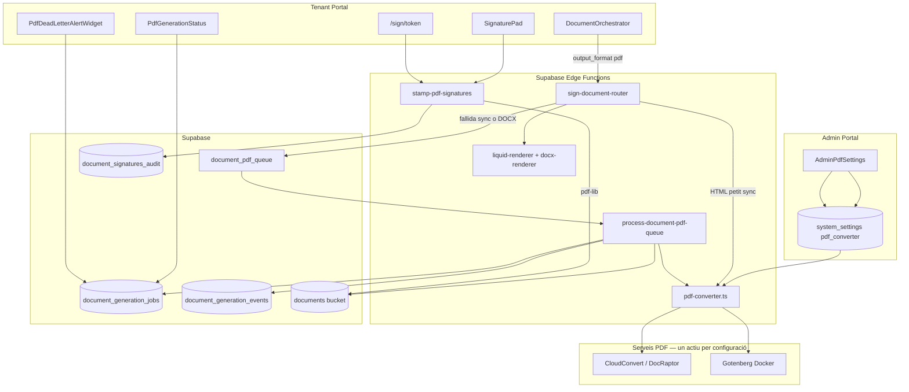
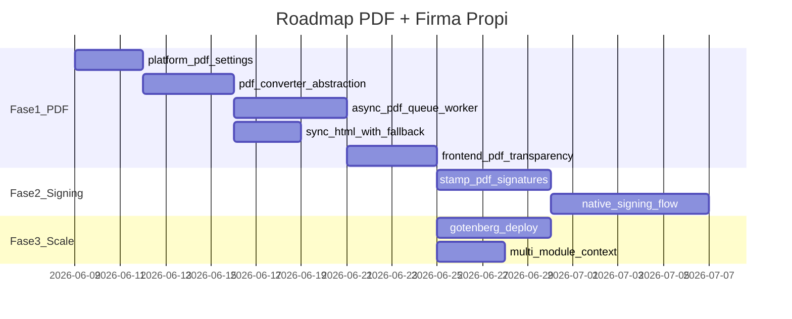

# Pla de Generació PDF i Integració amb Firma Propi

## Diagnòstic: per què encara no tenim PDF

El sistema actual **renderitza** plantilles correctament però **no converteix** a PDF en mode `generate_only`:

| Tipus plantilla | Què fa avui `generate_only` | Què promet la UI |
|---|---|---|
| HTML | Guarda `text/html` al DMS | "Generar PDF" (feature flag `VITE_SIGNING_HTML_PDF_OUTPUT`) |
| DOCX | Guarda DOCX omplert al DMS | "Generar PDF" |
| PDF font | Passa el PDF original sense canvis | OK |

**Causa arrel:** [`DocumentOrchestrator.tsx`](apps/tenant-portal/src/features/signing/components/DocumentOrchestrator.tsx) envia `action: 'generate_only'` però **no transmet cap `output_format`**. El router ([`sign-document-router/index.ts`](supabase/functions/sign-document-router/index.ts) línies 1285-1323) desa el mime type natiu de la plantilla.

La conversió només passa indirectament quan es signa amb DocuSeal (DocuSeal converteix HTML/DOCX → PDF internament).

### Per què NO fer-ho a Edge Functions

Ja documentat a [`template-system-redesign-plan.md`](docs/signing/template-system-redesign-plan.md) (V2, línia 259):

- Supabase Edge Functions: **~128 MB RAM**, timeout limitat, runtime Deno sense Chromium/LibreOffice
- DOCX ja té límit de **20 MB** per memòria ([`docx-renderer.ts`](supabase/functions/_shared/docx-renderer.ts))
- Puppeteer/wkhtmltopdf dins Deno = infra pesada, cold starts lents, no escala

**Conclusió:** la conversió PDF ha de ser un **servei extern dedicat**. Les Edge Functions fan d'**orquestrador** (render → convertir → desar DMS / estampar firmes).

---

## Arquitectura proposada



### Principis de disseny

1. **Render i convert són passos separats** — reutilitzar LiquidJS/Docxtemplater existents; la conversió és plug-in.
2. **Dos providers des del dia 1** — `ManagedApiProvider` i `GotenbergProvider`; el provider actiu es llegeix de `data.system_settings`, no d'una env var fixa.
3. **Commutació operativa des de admin-portal** — si Gotenberg cau, l'admin canvia a API gestionada sense redeploy; els jobs pendents/reintents usen el provider actiu en el proper intent.
4. **Reintents i DLQ com els correus** — `QueueRunner` + estat persistent a `document_generation_jobs` (patró [`email_logs`](supabase/migrations/20260415000002_email_system_core.sql) + [`process-email-queue`](supabase/functions/process-email-queue/index.ts)).
5. **Transparència per l'usuari tenant** — badges d'estat, timeline d'esdeveniments i alertes de fallida (patró [`EmailLogsTab`](apps/tenant-portal/src/features/email/components/EmailLogsTab.tsx) + [`DeadLetterAlertWidget`](apps/tenant-portal/src/features/email/components/DeadLetterAlertWidget.tsx)).
6. **Estampació de firmes SÍ a Edge** — `pdf-lib` per incrustar signatura + evidències ([`plan-sistema-firma-propi.md`](docs/plans/signing/plan-sistema-firma-propi.md)).
7. **Un sol pipeline per a tots els mòduls** — DMS, empleats, contactes, projectes passen pel mateix `DocumentOrchestrator` + `sign-document-router`.

---

## Configuració de plataforma (admin-portal)

### Model de dades

Reutilitzar [`data.system_settings`](apps/admin-portal/app/admin/actions/email-settings.ts) amb `module = 'pdf_converter'` (mateix patró que `rate_limiting` i email):

```json
{
  "active_provider": "gotenberg",
  "fallback_provider": "managed_api",
  "auto_fallback_on_error": true,
  "gotenberg": {
    "base_url": "https://gotenberg.internal.example.com",
    "timeout_ms": 60000,
    "health_check_path": "/health"
  },
  "managed_api": {
    "vendor": "cloudconvert",
    "timeout_ms": 45000
  },
  "retry": {
    "max_attempts": 5,
    "backoff_base_seconds": 60
  },
  "sync_html_max_kb": 500
}
```

**Claus API sensibles** (CloudConvert, etc.) → Supabase Vault o env vars del servidor (`CLOUDCONVERT_API_KEY`), **no** a `system_settings` en clar. L'admin-portal només configura URLs, vendor i provider actiu.

### UI admin-portal

Nova pàgina [`/dashboard/settings/pdf`](apps/admin-portal/app/dashboard/settings/email/page.tsx) (mateix layout que email):

| Control | Descripció |
|---|---|
| **Provider actiu** | Select: `gotenberg` \| `managed_api` |
| **Provider de reserva** | Select opcional per auto-fallback |
| **Auto-fallback** | Switch: si el provider actiu falla, reintentar amb el de reserva abans d'esgotar intents |
| **URL Gotenberg** | Input + botó "Provar connexió" (health check) |
| **Vendor API gestionada** | Select: `cloudconvert` \| `docraptor` |
| **Reintents** | `max_attempts`, `backoff_base_seconds` |
| **Estat del servei** | Badge en viu: Gotenberg reachable / API key configurada |

**Fitxers nous:**
- [`apps/admin-portal/app/admin/actions/pdf-settings.ts`](apps/admin-portal/app/admin/actions/pdf-settings.ts) — `getPdfConverterSettings` / `updatePdfConverterSettings` / `testGotenbergConnection`
- [`apps/admin-portal/components/dashboard/settings/AdminPdfSettings.tsx`](apps/admin-portal/components/dashboard/settings/AdminPdfSettings.tsx)

### Resolució del provider en runtime

[`pdf-converter.ts`](supabase/functions/_shared/pdf-converter.ts) llegeix la config via RPC `api.get_pdf_converter_config()` (SECURITY DEFINER, cache 60s en memòria de la instància Edge):

```typescript
async function resolvePdfConverter(adminClient): Promise<PdfConverter> {
  const cfg = await getPdfConverterConfig(adminClient)
  return cfg.active_provider === 'gotenberg'
    ? new GotenbergProvider(cfg.gotenberg)
    : new ManagedApiProvider(cfg.managed_api)
}
```

**Commutació en calent:** canviar `active_provider` a admin-portal afecta immediatament els **nous** jobs i els **reintents** pendents. Els jobs `processing` no s'interrompen.

**Escenari de caiguda de Gotenberg:**
1. Jobs fallen amb error de connexió → `status = 'failed'`, `attempt_count++`
2. Si `auto_fallback_on_error = true` → proper reintent usa `fallback_provider`
3. L'admin pot commutar manualment `active_provider = 'managed_api'` per forçar tots els reintents al proveïdor alternatiu
4. Alerta a admin-portal si health check de Gotenberg falla durant > N minuts

---

## Contracte API ampliat

Afegir a `RequestBody` de [`sign-document-router`](supabase/functions/sign-document-router/index.ts):

```typescript
output_format?: 'native' | 'pdf'  // default 'native' (comportament actual)
```

Mapping des del frontend:

| `OutputAction` UI | `action` | `output_format` |
|---|---|---|
| `generate_html` | `generate_only` | `native` |
| `generate_docx` | `generate_only` | `native` |
| `generate_pdf` | `generate_only` | `pdf` |
| `sign_docuseal` | `sign` | — (DocuSeal converteix) |
| `sign_native` (futur) | `sign_native` | `pdf` (genera + estampa) |

El frontend ([`DocumentOrchestrator.tsx`](apps/tenant-portal/src/features/signing/components/DocumentOrchestrator.tsx) línies 904-928) ha d'afegir `output_format: 'pdf'` quan `action === 'generate_pdf'`.

---

## Jobs, reintents i visibilitat (patró email)

### Taula `data.document_generation_jobs`

Inspirada directament en `email_logs`:

| Camp | Tipus | Notes |
|---|---|---|
| `id` | uuid | PK |
| `tenant_id` | uuid | RLS per membres |
| `status` | enum | `queued` \| `processing` \| `completed` \| `failed` \| `dead_letter` |
| `source_type` | text | `template_locale` \| `document_existing` |
| `source_template_locale_id` | uuid | nullable |
| `source_document_version_id` | uuid | nullable |
| `template_type` | text | `html` \| `docx` |
| `document_title` | text | |
| `intermediate_storage_path` | text | HTML/DOCX renderitzat (per reintent sense re-render) |
| `result_document_id` | uuid | nullable fins `completed` |
| `result_version_id` | uuid | nullable |
| `provider_used` | text | `gotenberg` \| `managed_api` — quin provider va executar l'intent |
| `attempt_count` | int | default 0 |
| `max_retries` | int | hereta de `system_settings.pdf_converter.retry.max_attempts` |
| `next_retry_at` | timestamptz | per reintents programats |
| `is_dead_letter` | boolean | default false; terminal després d'esgotar reintents |
| `last_error_code` | text | ex. `gotenberg_unreachable`, `conversion_timeout` |
| `last_error_message` | text | missatge llegible |
| `duration_ms` | int | nullable |
| `created_by` | uuid | usuari que va iniciar la generació |
| `idempotency_key` | text | UNIQUE(tenant_id, idempotency_key) — evita jobs duplicats |
| `metadata` | jsonb | context snapshot, folder_id, etc. |
| timestamps | | `created_at`, `updated_at`, `completed_at` |

### Taula `data.document_generation_events` (timeline)

Append-only, com `signing_events`:

- `job_id`, `event_type` (`queued`, `processing_started`, `provider_switched`, `retry_scheduled`, `completed`, `failed`, `dead_letter`)
- `payload` (jsonb): provider, attempt, error, duration_ms
- Visible a la UI de detall del job

### Worker i reintents

[`process-document-pdf-queue`](supabase/functions/process-document-pdf-queue/index.ts) amb [`QueueRunner`](supabase/functions/_shared/queue-runtime.ts):

```
queued → processing → completed     (èxit: arxiva missatge PGMQ)
queued → processing → failed        (reintentable: VT expira, backoff exponencial)
queued → processing → dead_letter   (esgotats max_retries: DLQ + notificació)
```

**Backoff:** 60s → 120s → 240s → 480s → DLQ (configurable des de admin).

**En fallida de conversió síncrona (HTML petit):** no retornar error 500 directament a l'usuari; crear job `queued` amb intermediate ja pujat i retornar HTTP 202 amb `job_id`. L'usuari veu "Generant PDF…" en lloc d'un error abrupte.

### UX transparent al tenant-portal

| On | Què veu l'usuari |
|---|---|
| **DocumentOrchestrator** (pas `process`) | Spinner + text d'estat: "Convertint a PDF (intent 2/5)…" via polling/realtime del job |
| **DocumentOrchestrator** (pas `done`) | Enllaç al document si `completed`; si `failed` encara reintentant → "El PDF s'està generant, t'avisarem" |
| **DocumentsPage / DocumentDetailPage** | Badge al document: `PDF pendent` / `PDF generant` / `PDF llest` / `PDF fallit` |
| **PdfGenerationJobsTab** (nou, sota DMS o Configuració) | Llistat filtrable per estat (com [`EmailLogsTab`](apps/tenant-portal/src/features/email/components/EmailLogsTab.tsx)) |
| **PdfDeadLetterAlertWidget** | Banner per owners/managers si hi ha jobs `dead_letter` en 7 dies (com email) |
| **Notificació inbox** | Quan job passa a `completed` o `dead_letter` |
| **Realtime** | Subscripció a `document_generation_jobs` per actualitzar badges sense refrescar |

**Regla de transparència:** l'usuari **mai** ha de veure un document al DMS com a PDF si encara està `queued`/`processing`/`failed`. Mentre el job no és `completed`, el document (si existeix) es mostra com a "pendent de conversió" o no es crea fins tenir el PDF (decisió: **no crear document al DMS fins `completed`** — evita confusió; el job és la font de veritat fins llavors).

---

## UX recomanada (equilibri escala / usabilitat)

| Escenari | Mode | Temps esperat | Comportament UI |
|---|---|---|---|
| HTML < 500 KB | **Síncron** (amb fallback a cua) | 2-8 s | Intent sync → si falla, job + polling |
| DOCX qualsevol mida | **Asíncron** | 10-60 s | Job `queued` → polling/realtime → notificació |
| HTML > 500 KB | **Asíncron** | 5-30 s | Mateix flux que DOCX |
| Provider caigut | **Reintents** | Variable | Badge "Reintentant…" + alerta si `dead_letter` |
| Tots els reintents esgotats | **Dead letter** | — | Alerta owner + opció "Reintentar manualment" (RPC) |

---

## Fase 1 — Infraestructura PDF + configuració admin (2-3 setmanes)

### 1.0 Configuració de plataforma (admin-portal)

1. Migració SQL: `INSERT` default a `data.system_settings` (`module = 'pdf_converter'`)
2. RPC `api.get_pdf_converter_config()` — lectura per Edge Functions (service_role + SECURITY DEFINER)
3. RPC `api.update_pdf_converter_config()` — només admin (via admin-portal server action)
4. UI [`AdminPdfSettings`](apps/admin-portal/components/dashboard/settings/AdminPdfSettings.tsx) amb selector de provider i test de connexió Gotenberg

### 1.1 Abstracció de conversió

Crear [`supabase/functions/_shared/pdf-converter.ts`](supabase/functions/_shared/pdf-converter.ts):

```typescript
interface PdfConverter {
  htmlToPdf(html: string, opts?: { pageSize?: string }): Promise<Uint8Array>
  docxToPdf(docx: Uint8Array): Promise<Uint8Array>
  readonly providerId: 'gotenberg' | 'managed_api'
}
```

Implementacions:
- `ManagedApiProvider` — CloudConvert (HTML + DOCX)
- `GotenbergProvider` — `POST /forms/chromium/convert/html`, `POST /forms/libreoffice/convert`

### 1.2 Camí síncron (HTML → PDF)

Dins `sign-document-router`, després del render LiquidJS:

1. Si `output_format === 'pdf'` i `mimeType === 'text/html'` i `size < sync_html_max_kb`
2. Intentar `pdfConverter.htmlToPdf(fullHtml)` amb provider actiu
3. Si èxit → `generateOnlyVersion()` amb `application/pdf`
4. Si fallida (timeout, provider down) → crear job `queued` + enqueuar a PGMQ → HTTP 202

### 1.3 Camí asíncron (DOCX → PDF i HTML gran)

1. Renderitzar plantilla (Docxtemplater o LiquidJS)
2. Pujar intermediate: `{tenant_id}/pdf-jobs/{job_id}/source.{docx|html}`
3. Crear `document_generation_jobs` (`status = queued`) + event `queued`
4. `pgmq.send('document_pdf_queue', { job_id, task: 'convert_to_pdf' })`
5. Retornar HTTP 202 `{ job_id, status: 'queued' }`

### 1.4 Worker de cua

Seguir [`docs/queues.md`](docs/queues.md):

- `pgmq.create('document_pdf_queue')` + cron cada 1 min
- [`process-document-pdf-queue`](supabase/functions/process-document-pdf-queue/index.ts) amb `QueueRunner`
- Handler `convert_to_pdf`:
  1. Llegeix config provider (pot differir de l'intent anterior si admin ha commutat)
  2. Si `auto_fallback_on_error` i intent > 1 amb error de provider → provar `fallback_provider`
  3. Converteix → puja PDF al DMS → `status = completed`
  4. En error → `attempt_count++`, `next_retry_at`, event `retry_scheduled`; si esgotat → `dead_letter` + notificació

### 1.5 Frontend tenant-portal

- [`DocumentOrchestrator.tsx`](apps/tenant-portal/src/features/signing/components/DocumentOrchestrator.tsx): `output_format`, gestió 202, polling/realtime
- Nou `PdfGenerationStatus` component (badges + timeline)
- `PdfDeadLetterAlertWidget` per owners/managers
- `PdfGenerationJobsTab` al DMS (opcional Fase 1, mínim: badges a DocumentsPage)
- Eliminar `VITE_SIGNING_HTML_PDF_OUTPUT` — `generate_pdf` visible quan `api.get_pdf_converter_config()` indica servei configurat
- Actualitzar [`docs/help/plantilles-documentals.md`](docs/help/plantilles-documentals.md)

### 1.6 Tests

- Matrix tests: `generate_only` + `output_format: pdf` per HTML i DOCX
- Test de commutació: job pendent amb `active_provider=gotenberg` → admin canvia a `managed_api` → reintent usa managed
- Test de DLQ: provider mock que sempre falla → `dead_letter` + notificació

---

## Fase 2 — Firma pròpia sobre PDF generat (2-3 setmanes)

Basat en [`plan-sistema-firma-propi.md`](docs/plans/signing/plan-sistema-firma-propi.md):

### 2.1 Estampació server-side (Edge Function)

[`stamp-pdf-signatures`](supabase/functions/stamp-pdf-signatures/index.ts) amb `pdf-lib`:

- Requereix job `completed` amb PDF al DMS
- Input: `document_version_id`, signatures, evidències
- Output: nova versió + `document_signatures_audit`

### 2.2 Signatura presencial i remota

1. Esperar job PDF `completed` abans de mostrar preview/signatura
2. `SignaturePad` + `document_signing_sessions` + `/sign/[token]`
3. Si job encara `processing` → UI bloqueja signatura amb missatge clar

### 2.3 Integració al DocumentOrchestrator

Opció `sign_native` visible quan `tenant_signing_config.native_signing_enabled = true` **i** el PDF està llest.

---

## Fase 3 — Multi-mòdul i escala (2 setmanes)

### 3.1 Context de projectes

- `project` a [`context-builder.ts`](supabase/functions/_shared/context-builder.ts)
- `DocumentsPage` a contactes i projectes

### 3.2 Gotenberg en producció

1. Desplegar Gotenberg (Docker) a Fly.io / Railway / VPS
2. Configurar URL a admin-portal
3. Validar fidelitat DOCX amb plantilles del seed
4. Documentar runbook: "Gotenberg caigut → commutar a managed_api a admin-portal"

**Nota:** Gotenberg i API gestionada coexisteixen des de Fase 1; la "migració" és operativa (canvi de provider actiu), no un canvi de codi.

---

## Decisions tècniques clau

| Decisió | Elecció | Alternativa descartada |
|---|---|---|
| Selecció de provider | `system_settings` + admin-portal UI | Env var per deploy (no commutable en calent) |
| Conversió PDF | Servei extern (managed o Gotenberg) | Puppeteer a Edge Function |
| Fallida de provider | Reintents + auto-fallback + commutació manual | Error 500 immediat a l'usuari |
| Estat dels jobs | `document_generation_jobs` com `email_logs` | Només logs a Edge Function |
| Visibilitat usuari | Badges + timeline + alertes dead_letter | Només toast genèric |
| HTML petit | Síncron amb fallback a cua | html2pdf.js al navegador |
| DOCX | Asíncron via cua | Síncron (timeout + UX pobre) |
| Document al DMS | Creat només quan PDF `completed` | Crear placeholder DOCX/HTML confús |

---

## Estimació de costos (ordre de magnitud)

| Volum mensual | API gestionada (CloudConvert) | Gotenberg autoallotjat |
|---|---|---|
| 100 PDFs | ~$1-5 | ~$5 fix (overkill) |
| 1.000 PDFs | ~$10-50 | ~$10-15 fix |
| 10.000 PDFs | ~$100-500 | ~$20-40 fix (2 instàncies) |

Amb commutació admin: començar amb `managed_api`, passar a `gotenberg` quan el volum ho justifiqui; si Gotenberg cau, tornar temporalment a `managed_api` sense perdre jobs (reintents automàtics).

---

## Riscos i mitigacions

| Risc | Mitigació |
|---|---|
| Gotenberg caigut | Auto-fallback + commutació manual admin; jobs queden `failed` amb reintents, no es perden |
| API gestionada caiguda | Mateix patró de reintents; si ambdós fallen → `dead_letter` + alerta |
| Fidelitat DOCX | LibreOffice (Gotenberg o CloudConvert); provar plantilles reals |
| Timeout Edge en sync | Fallback automàtic a cua async |
| Usuari confós per estat | Badges explícits; no crear document DMS fins PDF llest |
| Config errònia admin | Health check Gotenberg + validació API key al desar settings |
| PDF signat sense integritat | `document_hash` SHA256 abans d'estampar |

---

## Ordre d'implementació recomanat



**Prioritat immediata:** Fase 1 — config admin + cua amb reintents + visibilitat. És prerequisit per PDF fiable, commutació operativa i firma pròpia.
