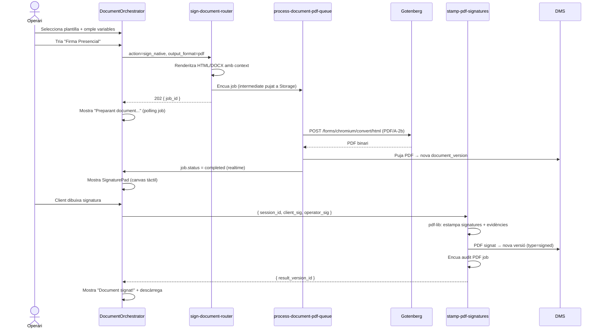
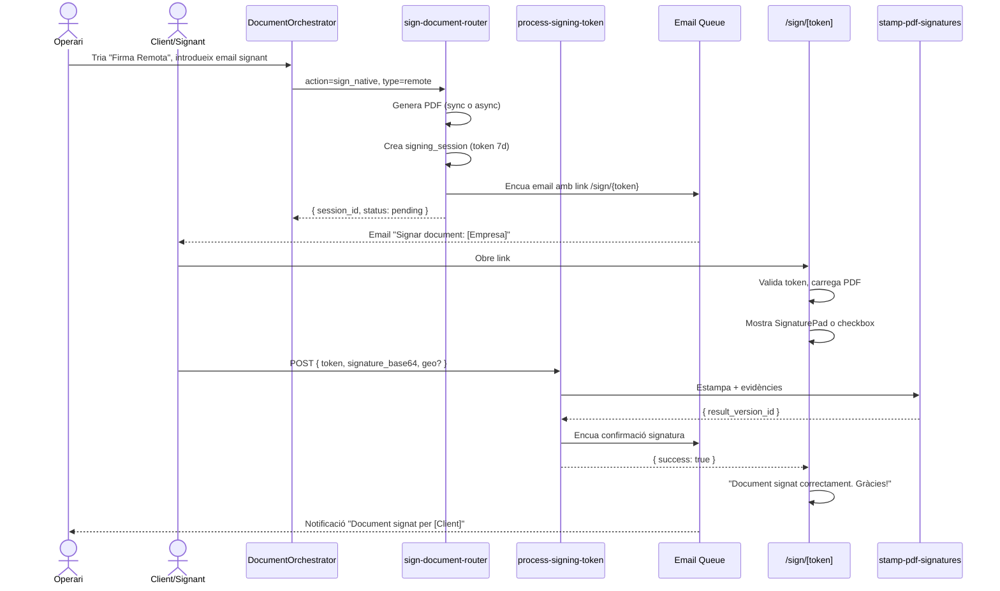
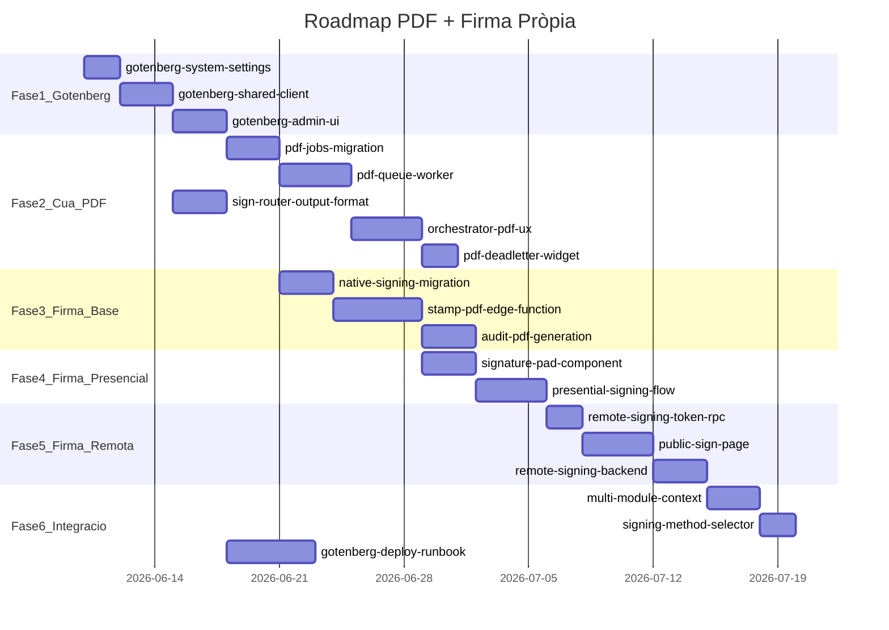

# PDF + Firma Pròpia — Pla Unificat

## Motivació i Principis Rectors

El sistema actual renderitza plantilles HTML i DOCX correctament però **no
converteix a PDF**. DocuSeal fa la conversió internament quan s'usa la via
de signatura, però no hi ha cap camí per a `generate_only` en PDF ni per a
la firma pròpia sense DocuSeal.

**Decisions de disseny inamovibles:**

| Decisió | Elecció | Raó |
|---|---|---|
| Proveïdor PDF | **Gotenberg exclusivament** | Autoallotjat, cost nul per volum, propietat de les dades |
| Fallback si Gotenberg cau | **Cua + format natiu** | No hi ha API gestionada de fallback |
| Funcionalitat opcional | **`pdf_enabled` desactivable** | Tot ha de funcionar sense PDF des de l'admin |
| Perfils de sortida | **PDF estàndard per no signats; PDF/A per signats/auditoria** | Redueix consum de Storage mantenint cobertura legal |
| Evidències signatura | **Mateixa pàgina del PDF** | Transparència per al signant; auditoria visual |
| PDF d'auditoria | **Generat asíncronament** | Com fa DocuSeal: document separat amb timeline complet |
| Arquitectura Edge | **Orquestrador, no convertidor** | Supabase Edge < 128 MB RAM; Gotenberg té Chromium+LibreOffice |
| Escalabilitat multi-tenant | **Fair scheduling + límits per tenant** | Evita que un tenant monopolitzi la cua |

---

## Arquitectura Global

```mermaid
flowchart TB
  subgraph admin [Admin Portal]
    APS[AdminPdfSettings\n/settings/pdf]
    APS -->|Server Action| SC[(system_settings\nmodule=pdf_converter)]
  end

  subgraph ui [Tenant Portal]
    DO[DocumentOrchestrator]
    PGS[PdfGenerationStatus\nbadges + polling]
    DLA[PdfDeadLetterAlertWidget]
    SP[SignaturePad\npresencial]
    PS[/sign/token\nremota]
  end

  subgraph edge [Supabase Edge Functions]
    SDR[sign-document-router]
    PDFW[process-document-pdf-queue\nQueueRunner]
    STAMP[stamp-pdf-signatures\npdf-lib]
    AUDITPDF[process-audit-pdf-queue]
    PST[process-signing-token]
    GotClient["gotenberg-client.ts\n_shared"]
  end

  subgraph gotenberg [Gotenberg Self-hosted]
    GL[Local :3007]
    GR[RPI + CF Tunnel]
    GV[VPS Hetzner + Caddy]
  end

  subgraph storage [Supabase DB + Storage]
    PGMQ_PDF[document_pdf_queue]
    PGMQ_AUDIT[audit_pdf_queue]
    Jobs[(document_pdf_jobs)]
    Events[(document_pdf_events)]
    Sessions[(document_signing_sessions)]
    Evidences[(document_signature_evidences)]
    AuditLog[(document_signatures_audit)]
    DMS[(documents bucket)]
  end

  APS --> SC
  SC --> GotClient
  DO -->|output_format=pdf| SDR
  SDR -->|HTML petit sync| GotClient
  SDR -->|fallida sync o DOCX| PGMQ_PDF
  PGMQ_PDF --> PDFW
  PDFW --> GotClient
  GotClient --> GL
  GotClient --> GR
  GotClient --> GV
  PDFW --> Jobs
  PDFW --> Events
  PDFW --> DMS
  PGS -.->|realtime/polling| Jobs
  DLA -.->|polling| Jobs

  SP -->|imatge base64| STAMP
  PS -->|token + evidències| PST
  PST --> STAMP
  STAMP -->|pdf-lib| DMS
  STAMP --> AuditLog
  STAMP -->|encua| PGMQ_AUDIT
  PGMQ_AUDIT --> AUDITPDF
  AUDITPDF --> GotClient
  AUDITPDF --> DMS
```

---

## Entorns Gotenberg i Configuració

El microservei `gotenberg-pdf-generator` funciona en tres entorns progressius:

| Entorn | docker-compose | URL | Autenticació |
|---|---|---|---|
| Local dev | `docker-compose.local.yml` | `http://localhost:3007` | Cap |
| Staging (RPI) | `docker-compose.rpi.yml` | `https://pdf-staging.domini.com` | CF Zero Trust Service Token (`CF-Access-Client-Id` + `CF-Access-Client-Secret`) |
| Producció (VPS) | `docker-compose.prod.yml` | `https://pdf.domini.com` | Bearer Token via Caddy |

Tots els endpoints permesos (configurats al `Caddyfile`):
- `POST /forms/chromium/convert/html` — HTML → PDF
- `POST /forms/libreoffice/convert` — DOCX/ODT → PDF
- `POST /health` — health check (en producció, Caddy bloqueja mètodes no-POST)

### Política de perfils PDF i impacte a Storage

| Cas d'ús | Perfil recomanat | Motiu |
|---|---|---|
| Generació documental sense firma (`generate_only`) | `pdf` (estàndard) | Menys pes i menor cost de Storage |
| Document signat (presencial/remot) | `pdfa2b` | Conservació i prova legal bàsica a llarg termini |
| Certificat/annex d'auditoria | `pdfa3b` | Permet adjuntar JSON d'evidències |

Estimació orientativa de pes:
- `pdf` base = 1.0x
- `pdfa2b` = 1.10x a 1.35x
- `pdfa3b` = 1.20x a 1.60x (pot pujar més amb adjunts)

Conclusió operativa: **sí**, PDF/A omple Storage abans; per això el pla força PDF/A només en fluxos signats i auditories.

### Paràmetres PDF estàndard del projecte

```typescript
// Per a documents de signatura: PDF/A-2b (arxiu + firma digital admesa)
// Per a documents d'auditoria: PDF/A-3b (permet adjuntar fitxers XML)
const SIGNING_PDF_PARAMS = {
  pdfFormat: 'PDF/A-2b',
  paperWidth: '8.27',   // A4
  paperHeight: '11.69',
  marginTop: '1.5',
  marginBottom: '1.5',
  marginLeft: '1.5',
  marginRight: '1.5',
}
```

### Config a `data.system_settings` (module = 'pdf_converter')

```json
{
  "pdf_enabled": true,
  "gotenberg_url": "http://host.docker.internal:3007",
  "gotenberg_auth_type": "none",
  "gotenberg_auth_secret_ref": "vault://pdf/gotenberg/service-token",
  "unsigned_pdf_profile": "pdf",
  "signed_pdf_profile": "pdfa2b",
  "audit_pdf_profile": "pdfa3b",
  "paper_size": "A4",
  "sync_html_max_kb": 500,
  "timeout_ms": 60000,
  "keep_native_when_pdf_disabled": true,
  "retention": {
    "intermediate_days": 7,
    "job_events_days": 90,
    "audit_pdf_years": 5
  },
  "retry": {
    "max_attempts": 5,
    "backoff_base_seconds": 60
  }
}
```

**`gotenberg_auth_type`**: `"none"` | `"bearer"` | `"cf_service_token"`  
**`gotenberg_auth_secret_ref`**: referència a secret (Vault/env). No es guarda el secret en clar a BD.

---

## Base de Dades — Noves Taules

### `data.document_pdf_jobs` (patró email_logs)

| Camp | Tipus | Notes |
|---|---|---|
| `id` | uuid | PK |
| `tenant_id` | uuid | RLS per membres |
| `status` | enum | `queued \| processing \| completed \| failed \| skipped \| dead_letter` |
| `source_type` | text | `template_locale \| document_existing` |
| `source_ref_id` | uuid | template_locale_id o document_version_id |
| `template_type` | text | `html \| docx` |
| `document_title` | text | |
| `intermediate_path` | text | HTML/DOCX renderitzat pujat a Storage (per reintent sense re-render) |
| `result_document_id` | uuid | nullable fins `completed` |
| `result_version_id` | uuid | nullable |
| `output_profile` | text | `pdf \| pdfa2b \| pdfa3b` |
| `priority` | int | `0` normal; >0 crític |
| `attempt_count` | int | default 0 |
| `max_retries` | int | de system_settings |
| `next_retry_at` | timestamptz | |
| `is_dead_letter` | boolean | default false |
| `last_error_code` | text | `gotenberg_unreachable \| timeout \| conversion_error` |
| `last_error_message` | text | |
| `duration_ms` | int | |
| `gotenberg_url_used` | text | per diagnosi (URL real usada en l'intent) |
| `created_by` | uuid | |
| `idempotency_key` | text | UNIQUE(tenant_id, idempotency_key) |
| `locked_at` | timestamptz | lock operatiu addicional a VT de PGMQ |
| `locked_by` | text | worker_id |
| `metadata` | jsonb | folder_id, context snapshot, etc. |
| `size_input_bytes` | bigint | mida del document intermediate |
| `size_output_bytes` | bigint | mida del PDF resultant |
| `created_at`, `updated_at`, `completed_at` | timestamptz | |

**Enum `data.pdf_job_status`:** `queued`, `processing`, `completed`, `failed`, `skipped`, `dead_letter`

### `data.document_pdf_events` (timeline append-only)

| Camp | Tipus | Notes |
|---|---|---|
| `id` | uuid | PK |
| `job_id` | uuid | FK document_pdf_jobs |
| `event_type` | text | `queued \| processing_started \| completed \| failed \| retry_scheduled \| skipped \| dead_letter` |
| `payload` | jsonb | attempt, error, duration_ms, gotenberg_url |
| `created_at` | timestamptz | |

### `data.document_signing_sessions`

| Camp | Tipus | Notes |
|---|---|---|
| `id` | uuid | PK |
| `tenant_id` | uuid | |
| `document_version_id` | uuid | PDF que es signarà |
| `signing_token` | text | UNIQUE, UUID v4 + salt, 64 chars |
| `signing_type` | text | `presential \| remote` |
| `status` | text | `pending \| opened \| viewed \| signed \| expired \| cancelled` |
| `signer_name` | text | |
| `signer_email` | text | nullable (presencial no requereix) |
| `signer_role` | text | |
| `operator_user_id` | uuid | usuari que inicia (presencial) |
| `expires_at` | timestamptz | default +7 dies |
| `ip_address` | text | IP del signant (remota) |
| `user_agent` | text | |
| `geolocation` | jsonb | `{lat, lon, accuracy}` |
| `timestamps` | jsonb | `{opened_at, viewed_at, signed_at}` |
| `signature_image_path` | text | Storage path de la imatge canvas |
| `result_version_id` | uuid | PDF estampat resultant |
| `audit_version_id` | uuid | PDF d'auditoria resultant |
| `created_at`, `updated_at` | timestamptz | |

### `data.document_signature_evidences`

Taula de recollida d'evidències per a cada sessió. Un registre per event:

| Camp | Tipus | Notes |
|---|---|---|
| `id` | uuid | |
| `session_id` | uuid | FK signing_sessions |
| `event_type` | text | `link_sent \| link_opened \| document_viewed \| signature_drawn \| signed` |
| `ip_address` | inet | |
| `user_agent` | text | |
| `geolocation` | jsonb | |
| `metadata` | jsonb | |
| `created_at` | timestamptz | |

### `data.document_signatures_audit`

Registre final un cop el document ha estat signat (una fila per signatura):

| Camp | Tipus | Notes |
|---|---|---|
| `id` | uuid | |
| `tenant_id` | uuid | |
| `document_id` | uuid | |
| `session_id` | uuid | |
| `signer_name`, `signer_email`, `signer_role` | text | |
| `timestamp_signed` | timestamptz | |
| `ip_address` | text | |
| `user_agent` | text | |
| `geolocation` | jsonb | |
| `signature_image_path` | text | path Storage (xifrat i no públic) |
| `document_hash_before` | text | SHA256 del PDF original |
| `document_hash_after` | text | SHA256 del PDF estampat |
| `audit_pdf_path` | text | Storage path del PDF d'auditoria |
| `created_at` | timestamptz | |

---

## Edge Functions

### `_shared/gotenberg-client.ts`

```typescript
interface GotenbergConfig {
  url: string                                         // ex: http://localhost:3007
  authType: 'none' | 'bearer' | 'cf_service_token'
  authSecretRef?: string                              // referència a secret (Vault/env)
  timeoutMs: number
  defaultUnsignedProfile: 'pdf'
  signedProfile: 'pdfa2b'
  auditProfile: 'pdfa3b'
}

interface GotenbergClient {
  htmlToPdf(html: string, opts?: PdfOptions): Promise<Uint8Array>
  docxToPdf(docx: Uint8Array, filename: string): Promise<Uint8Array>
  health(): Promise<boolean>
}

// Construeix capçaleres per entorn:
// 'none'             → cap capçalera extra
// 'bearer'           → Authorization: Bearer <token>
// 'cf_service_token' → CF-Access-Client-Id + CF-Access-Client-Secret
```

La URL es pot sobreescriure per variable d'entorn `GOTENBERG_URL` per facilitar
el dev local sense necessitat de cridar la BD.

### `sign-document-router` — Canvis

Nous camps a `RequestBody`:
```typescript
output_format?: 'native' | 'pdf'   // default 'native'
output_profile?: 'pdf' | 'pdfa2b' | 'pdfa3b' // opcional; backend valida segons use-case
```

Taula de routing ampliada:

| `action` | `output_format` | Comportament |
|---|---|---|
| `generate_only` | `native` | Igual que ara (HTML/DOCX al DMS) |
| `generate_only` | `pdf` + HTML < 500KB | Síncron: renderitza → Gotenberg sync → PDF al DMS (perfil per defecte: `pdf`) |
| `generate_only` | `pdf` + HTML ≥ 500KB | Asíncron: renderitza → puja intermediate → crea job → 202 |
| `generate_only` | `pdf` + DOCX | Asíncron sempre → crea job → 202 |
| `sign` | — | DocuSeal (sense canvis) |
| `sign_native` (nou) | `pdf` | Generació PDF prèvia obligatòria (perfil forçat `pdfa2b`) → session presencial/remota |

**Si `pdf_enabled = false`:** `output_format: 'pdf'` s'ignora silenciosament i
desa en format natiu. El frontend ha de mostrar un missatge explicatiu.

### `process-document-pdf-queue`

Worker amb `QueueRunner`. Handler `convert_to_pdf`:

```
1. Llegeix config Gotenberg (RPC get_pdf_converter_config, cache 60s)
2. Si pdf_enabled = false → marcar job `skipped` (no DLQ) + event + conservar format natiu
3. Baixa intermediate (HTML/DOCX) de Storage
4. Crida gotenberg-client (htmlToPdf o docxToPdf)
5. Èxit → puja PDF al DMS → crea document_version → job.status='completed' → event
6. Error connexió → job.status='failed', next_retry_at (backoff exp) → event
7. Esgotats max_retries → is_dead_letter=true → notificació owner via ctx.emitNotification
```

**Backoff:** exponencial amb jitter (60s → 2min → 4min → 8min → 16min → DLQ)

### `process-gotenberg-callback` (webhook)

Quan el mode webhook estigui activat per conversions llargues:

1. `process-document-pdf-queue` crea la petició a Gotenberg amb `callback_url` + `job_id`.
2. Gotenberg envia callback a `process-gotenberg-callback` en completar la conversió.
3. El callback valida autenticitat (HMAC/signature + nonce + timestamp anti-replay).
4. Recupera el resultat, el puja al DMS i marca `document_pdf_jobs.status='completed'`.
5. En error de callback, es registra event i es manté política de reintent per polling de seguretat.

Nota operativa: es manté compatibilitat amb mode pull/polling; webhook i polling poden conviure per robustesa.

### Escalabilitat multi-tenant (obligatori)

Per suportar molts tenants i volum alt de PDFs sense starvation:

1. Fair scheduling: processar per rondes de `tenant_id` (round-robin), no FIFO global pur.
2. Límit global de concurrència: ex. 8 conversions simultànies per entorn.
3. Límit per tenant: ex. màxim 2 conversions simultànies per `tenant_id`.
4. Backpressure: si un tenant supera llindar de jobs `queued`, retornar 429 funcional (o 202 amb delay explícit) al frontend.
5. Separació de càrrega: cua o prioritat diferenciada per HTML lleuger vs DOCX pesat.
6. Idempotència reforçada: evitar doble publicació de versions per reprocessament (UNIQUE per `idempotency_key` + comprovació de resultat existent abans d'escriure).
7. Observabilitat: mètriques per tenant (`queued`, `processing`, `p95_duration_ms`, `dead_letter_rate`).

### Límits recomanats de generació PDF (valors inicials)

Configuració inicial segura per començar en producció i ajustar per mètrica real:

| Tipus de límit | Valor inicial | Comentari |
|---|---:|---|
| Concurrència global worker PDF | 8 | Ajustar a 4-6 en RPI, 8-16 en VPS |
| Concurrència per tenant | 2 | Evita monopoli d'un sol tenant |
| Batch size QueueRunner | 20 | Redueix overhead de lectura sense saturar CPU |
| Visibility timeout (VT) | 180s | Ha de superar timeout de conversió + marge |
| Timeout HTML sync | 25s | Si falla o excedeix, fallback a cua |
| Timeout DOCX async | 90s | Conversió més pesada (LibreOffice) |
| Max retries | 5 | Amb backoff exponencial + jitter |
| Jobs en cua per tenant (hard cap) | 300 | A partir d'aquí, backpressure |
| Jobs en cua per tenant (warning) | 150 | Notificació preventiva |

Backpressure recomanat:
- Si `queued_per_tenant >= 300`: rebutjar noves conversions PDF amb error funcional `quota_exceeded`.
- Si `queued_per_tenant` entre 150 i 300: acceptar però forçar mode async i mostrar ETA orientativa.

Límits mensuals suggerits per pla (soft quota + alerta):

| Pla | PDFs no signats (`pdf`) | PDFs signats (`pdfa2b`) | Certificats (`pdfa3b`) |
|---|---:|---:|---:|
| Starter | 500/mes | 150/mes | 150/mes |
| Growth | 3.000/mes | 1.000/mes | 1.000/mes |
| Scale | 15.000/mes | 5.000/mes | 5.000/mes |

Regla de cost per Storage:
- Els límits de documents signats han de ser sempre més baixos que els no signats perquè `pdfa2b` i `pdfa3b` pesen més.
- Comptabilitzar quota en bytes i en nombre de documents per evitar abusos amb fitxers molt grans.

Mètriques objectiu per tuning (setmanal):
- `p95_duration_ms` < 20.000 per HTML i < 60.000 per DOCX.
- `dead_letter_rate` < 1%.
- `oldest_msg_age_sec` < 300 en càrrega normal.

### `stamp-pdf-signatures`

Usa `pdf-lib` (disponible a Deno):

```typescript
// Input
interface StampInput {
  session_id: string
  operator_signature_base64?: string  // PNG; null si operari no té signatura configurada
  client_signature_base64: string     // PNG del canvas
  evidences: EvidenceBlock
}

// Procés:
// 1. Baixa PDF original de DMS (per session.document_version_id)
// 2. Calcula SHA256 del PDF original (document_hash_before)
// 3. pdf-lib: afegeix pàgina final amb bloc d'evidències + imatges signatures
// 4. Calcula SHA256 del PDF estampat (document_hash_after)
// 5. Puja PDF estampat al DMS → nova document_version (type='signed')
// 6. Insereix fila a document_signatures_audit
// 7. Actualitza signing_session.result_version_id + status='signed'
// 8. Encua job a audit_pdf_queue (generació PDF auditoria asíncrona)
// 9. Retorna { result_version_id, audit_job_id }
```

### `process-audit-pdf-queue`

Genera el PDF d'auditoria (format DocuSeal "certificate of completion"):

**Contingut del PDF d'auditoria:**
- Capçalera: nom del document, data de signatura, identificador únic de sessió
- Resum del procés: timestamps de cada event (link enviat, obert, document vist, signat)
- Dades del signant: nom, email, rol, IP, User-Agent, geoloc (si disponible)
- Hash SHA256 del document original i del document signat (prova d'integritat)
- Imatge de la signatura manuscrita (canvas PNG)
- Peu de pàgina: advertència legal ("signatura electrònica simple...")
- Format: PDF/A-3b (permet adjuntar el JSON d'evidències com a fitxer embedded)

**Flux:**
1. Llegeix signing_session + signature_evidences de BD
2. Renderitza template HTML d'auditoria (plantilla interna de la plataforma)
3. Crida gotenberg-client (htmlToPdf, PDF/A-3b)
4. Puja al DMS → nova document_version (type='audit')
5. Actualitza signing_session.audit_version_id

### `process-signing-token` (firma remota)

```
POST /functions/v1/process-signing-token
Body: { token, signature_base64, accept_geolocation, lat?, lon? }

1. Valida token (signing_sessions WHERE signing_token = token AND status != 'signed' AND expires_at > now())
2. Recull IP (req.headers['x-real-ip'] o CF-Connecting-IP), User-Agent
3. Crea evidence 'signed'
4. Crida stamp-pdf-signatures
5. Envia email confirmació signatura al signer i al tenant
6. Retorna { success: true, result_version_id }
```

---

## Frontend — DocumentOrchestrator

### Selecció de format de sortida (`select_output` step)

```
OutputAction:
  'generate_html'      → action=generate_only, output_format=native (HTML)
  'generate_docx'      → action=generate_only, output_format=native (DOCX)
  'generate_pdf'       → action=generate_only, output_format=pdf      ← NOU (visible si pdf_enabled)
  'sign_docuseal'      → action=sign (DocuSeal)
  'sign_native_presential' → action=sign_native, type=presential      ← NOU
  'sign_native_remote'     → action=sign_native, type=remote          ← NOU
```

`'generate_pdf'`, `'sign_native_*'` **visibles condicionalment:**
- `generate_pdf`: `pdf_enabled === true` (llegit de config via hook)
- `sign_native_*`: `pdf_enabled && native_signing_enabled`

Si `pdf_enabled = false` i l'usuari tria `generate_pdf`:
```
{t('orchestrator.pdfDisabled', 'La generació PDF no està activada. Contacteu l\'administrador.')}
```

### Gestió resposta 202 (job asíncron)

```typescript
// handleProcess rep { job_id, status: 'queued' }
setStep('process')
setPdfJobId(job_id)

// Realtime com a camí principal + polling adaptatiu de seguretat:
// 0-30s cada 3s, 30-120s cada 10s, >120s cada 30s
// mentre status = queued | processing → spinner
// quan completed → setStep('done'), mostra document
// quan dead_letter → mostra error + "S'ha notificat l'administrador"
```

### Pas `select_signers` per firma nativa

- Mode presencial: mostra SignaturePad directament en pantalla completa (modal gran)
- Mode remota: formulari amb email + nom + rol → botó "Enviar a Signar"

### `PdfGenerationStatus` (badges)

Reutilitza el patró visual de `EmailLogsTab`:

| Estat | Badge | Missatge |
|---|---|---|
| `queued` | gris animat | "PDF a la cua..." |
| `processing` | blau parpellejant | "Convertint a PDF (intent N/M)..." |
| `completed` | verd | "PDF llest" + botó descàrrega |
| `failed` + reintents | taronja | "Reintentant... (N/M)" |
| `dead_letter` | vermell | "Error: contacteu l'administrador" |

---

## Flux de Firma Presencial (end-to-end)



## Flux de Firma Remota (end-to-end)



---

## Pàgina Pública `/sign/[token]`

- **Ruta pública** (sense autenticació de l'app)
- **No usa `supabase-js` amb clau anon directament** — crida a Edge Function `process-signing-token` que valida el token
- Intercanvi inicial de token: la pàgina canvia el token d'enllaç per un token efímer de sessió i neteja la URL via `history.replaceState`
- **Esdeveniments registrats:**
  - En carregar la pàgina: `link_opened`
  - Quan el PDF es renderitza completament: `document_viewed`
  - En enviar la signatura: `signed`
- **Contenidors d'evidències visibles** al peu:
  - "En signar aquest document, accepteu que la vostre signatura té validesa..."
  - "Data: [timestamp] | IP: [anonimitzada parcialment: 192.168.x.x]"
- **Expiració del token:** si `expires_at` passat → pàgina "Enllaç caducat. Contacteu [empresa]."
- **Token ja usat:** si `status = signed` → pàgina "Document ja signat el [data]. Podeu sol·licitar una còpia a [empresa]."

---

## Configuració Admin-Portal (`/dashboard/settings/pdf`)

Segueix el mateix layout que la pàgina de configuració d'email.

### Seccions

**1. Estat del servei**
- Badge "Gotenberg: Accessible ✓ / No accessible ✗" (crida health check en temps real)
- Versió de Gotenberg (de la resposta del health)

**2. Configuració de Gotenberg**
- URL del servei (ex: `http://localhost:3007` o `https://pdf-staging.domini.com`)
- Tipus d'autenticació: Cap / Bearer Token / Cloudflare Service Token
- Secret per referència (Vault/env) o input tipus password només per actualitzar el secret; mai es persisteix en clar a BD
- Botó "Provar connexió" (crida `api.test_gotenberg_connection` RPC)

**3. Configuració PDF**
- Perfil documents no signats: `pdf` (estàndard, recomanat)
- Perfil documents signats: `pdfa2b`
- Perfil certificat d'auditoria: `pdfa3b`
- Mida de pàgina: A4 / A3 / Carta
- Màrgens (slider per a top/bottom/left/right)
- Límit HTML síncron: slider 100KB–2MB (default 500KB)

**4. Firma Pròpia**
- Toggle "Activar firma nativa" (`native_signing_enabled`)
- Dies de validesa del token de firma remota (default 7)
- Textos legals personalitzables (peu de pàgina de la pàgina de signatura pública)

**5. Controls de sistema**
- Toggle "Activar generació PDF" (`pdf_enabled`) — si OFF, tot funciona en format natiu
- Botó "Reintentar jobs dead_letter" (RPC `api.retry_pdf_dead_letters`)

---

## Retenció i gestió de Storage

Política recomanada per controlar creixement (especialment amb PDF/A):

| Artefacte | Retenció | Notes |
|---|---|---|
| Intermedis HTML/DOCX (`intermediate_path`) | 7 dies | Només per reintents/forensics tècnica |
| `document_pdf_events` operatius | 90 dies | Es poden agregar mètriques i purgar detall antic |
| PDFs no signats (`pdf`) | segons política DMS del tenant | És el volum principal; evitar PDF/A aquí |
| PDFs signats (`pdfa2b`) | 2-5 anys configurable | Necessari per prova i compliment |
| PDF d'auditoria (`pdfa3b`) | 2-5 anys configurable | Pot ser més pesat; només en fluxos de firma |

Controls addicionals:
- Quota de Storage per tenant + alertes al 80%/95%.
- Job de purga nocturn per intermedis i events caducats.
- Report mensual de bytes per perfil (`pdf`, `pdfa2b`, `pdfa3b`).

---

## Gestió de Caiguda de Gotenberg

| Escenari | Comportament |
|---|---|
| Gotenberg no arranca | Health check falla → badge vermell a admin-portal |
| Petició síncrona falla (HTML petit) | Fallback automàtic a cua asíncrona → 202 al frontend |
| Job en cua + Gotenberg cau | Jobs queden `failed` amb `next_retry_at` (backoff exp) |
| Esgotats max_retries | `is_dead_letter=true` + notificació owner |
| Arreglen Gotenberg + reintentar | Admin clica "Reintentar dead letters" → jobs tornen a `queued` |
| `pdf_enabled=false` des d'admin | nous requests fan downgrade a natiu; jobs pendents passen a `skipped` (sense DLQ) |

**No hi ha API gestionada de fallback.** Si Gotenberg cau, els treballs queden
en cua fins que es recuperi o l'admin els reintenta manualment.

---

## Consideracions Legals i de Seguretat

### Validesa de la firma

La firma pròpia generada per aquest sistema és una **signatura electrònica
simple** (no avançada ni qualificada) tal com defineix el Reglament eIDAS.
Té validesa com a prova d'acceptació en contextos comercials (albarans,
pressupostos, parts de feina) però **no substitueix** una signatura qualificada
per a actes jurídics que la requereixin.

**Evidències recollides que reforcen la validesa:**
- Hash SHA256 del document original (integritat)
- Timestamp segur (servidor, no client)
- IP del signant (geolocalització aproximada)
- User-Agent del dispositiu
- Imatge de la signatura manuscrita digital
- Timeline d'events (enviat, obert, vist, signat)

### Seguretat del token

- Token de 64 chars (UUID v4 + salt de 32 chars hex): impredictible
- Expirat en 7 dies (configurable)
- Un sol ús: un cop `status=signed` el token no es pot reuse
- Minimitzem exposició a logs: token d'enllaç només per bootstrap i substitució immediata per token efímer de sessió
- L'Edge Function `process-signing-token` valida a BD, no en memòria

### Privacitat

- IP parcialment anonimitzada en la UI pública (darrer octet mascat)
- Geolocalització opcional (sol·licitud explícita al navegador)
- La imatge de la signatura s'emmagatzema xifrada (Storage Supabase, no pública)

---

## Relació amb DocuSeal

DocuSeal segueix sent l'opció recomanada per a:
- Signatures legalment vinculants que requereixin traçabilitat d'eIDAS
- Workflows multi-signant amb ordre i delegació
- Tenants amb volum alt de signatures i necessitat de certificació externa

La firma pròpia complementa DocuSeal per a:
- Documents interns (parts de feina, albarans, acceptació de servei)
- Situacions presencials in-situ (firma al taulell amb tàctil)
- Reducció de costos per a volums alts de documents no crítics
- Tenants sense accés o configuració de DocuSeal

**Selector de mètode** al `DocumentOrchestrator` (visible si ambdós actius):
```
┌──────────────────────────────────────────┐
│ Com vols signar el document?             │
│                                          │
│ ● Firma Pròpia (Presencial)              │
│   El client signa in-situ al dispositiu  │
│                                          │
│ ○ Firma Pròpia (Remota per email)        │
│   S'envia un link al client per signar   │
│                                          │
│ ○ DocuSeal (Firma Avançada)              │
│   Certificació eIDAS, multi-signant      │
└──────────────────────────────────────────┘
```

---

## Ordre d'Implementació Recomanat



**Prioritat immediata (Setmana 1):**
1. `gotenberg-system-settings` — unblocks tot
2. `gotenberg-shared-client` — unblocks sign-router i worker
3. `sign-router-output-format` — primer PDF generat manualment testejable

---

## Fitxers Nous Previstos

| Fitxer | Propòsit |
|---|---|
| `supabase/migrations/YYYYMMDD_pdf_converter_settings.sql` | system_settings + RPCs |
| `supabase/migrations/YYYYMMDD_document_pdf_jobs.sql` | taules pdf_jobs + pdf_events |
| `supabase/migrations/YYYYMMDD_native_signing.sql` | signing_sessions + evidences + audit |
| `supabase/functions/_shared/gotenberg-client.ts` | client Gotenberg multi-entorn |
| `supabase/functions/process-document-pdf-queue/index.ts` | worker cua PDF |
| `supabase/functions/stamp-pdf-signatures/index.ts` | estampació pdf-lib |
| `supabase/functions/process-audit-pdf-queue/index.ts` | worker PDF auditoria |
| `supabase/functions/process-signing-token/index.ts` | firma remota pública |
| `apps/admin-portal/app/admin/actions/pdf-settings.ts` | Server Actions admin |
| `apps/admin-portal/components/dashboard/settings/AdminPdfSettings.tsx` | UI settings PDF |
| `apps/tenant-portal/src/features/signing/components/SignaturePad.tsx` | canvas signatura |
| `apps/tenant-portal/src/features/signing/components/PdfGenerationStatus.tsx` | badges + polling |
| `apps/tenant-portal/src/features/signing/components/PdfDeadLetterAlertWidget.tsx` | alerta DLQ |
| `apps/tenant-portal/src/pages/PublicSignPage.tsx` | /sign/[token] pàgina pública |
| `apps/tenant-portal/src/features/signing/api/usePdfJobStatus.ts` | hook polling/realtime |
| `apps/tenant-portal/src/features/signing/api/usePdfConverterConfig.ts` | hook config PDF |


<br><br><br>

Totes les fases implementades. Aquí tens el resum complet del que s'ha fet:

---

## Resum de la implementació

### Fase 1 — Infraestructura Gotenberg ✅

| Fitxer | Contingut |
|--------|-----------|
| `supabase/migrations/20260609000001_pdf_converter_settings.sql` | Mòdul `pdf_converter` a `data.system_settings` + RPCs `get_pdf_converter_config`, `update_pdf_converter_config`, `retry_pdf_dead_letters` |
| `supabase/functions/_shared/gotenberg-client.ts` | Client multi-entorn (`htmlToPdf`, `docxToPdf`, `health`); autenticació `none` / `bearer` / `cf_service_token` |
| `apps/admin-portal/app/admin/actions/pdf-settings.ts` | Server Actions per llegir/escriure config + test de connexió live |
| `apps/admin-portal/components/dashboard/settings/AdminPdfSettings.tsx` | UI amb 5 seccions: connexió, auth, PDF, firma pròpia, controls de sistema |
| `apps/admin-portal/app/dashboard/settings/pdf/page.tsx` | Ruta `/dashboard/settings/pdf` |

### Fase 2 — Cua de generació PDF ✅

| Fitxer | Contingut |
|--------|-----------|
| `supabase/migrations/20260609000002_document_pdf_jobs.sql` | Enum `pdf_job_status`, taules `document_pdf_jobs` + `document_pdf_events`, RLS, PGMQ, pg_cron cada minut, RPCs |
| `supabase/functions/process-document-pdf-queue/index.ts` | Worker QueueRunner amb handler `convert_to_pdf`, backoff exponencial, DLQ |
| `supabase/functions/process-gotenberg-callback/index.ts` | Webhook amb validació HMAC-SHA256 + anti-replay |
| `sign-document-router` (modificat) | `output_format`, `output_profile`, camí síncron HTML (<500KB) + fallback a cua asíncrona, `sign_native` |
| `usePdfConverterConfig.ts` | Hook React Query que llegeix config PDF |
| `usePdfJobStatus.ts` | Hook amb realtime + polling adaptatiu (3s/10s/30s) |
| `PdfGenerationStatus.tsx` | Badges d'estat: queued/processing/completed/failed/dead_letter |
| `PdfDeadLetterAlertWidget.tsx` | Widget d'alerta per a jobs fallits |

### Fase 3 — Infraestructura de firma pròpia ✅

| Fitxer | Contingut |
|--------|-----------|
| `supabase/migrations/20260609000003_native_signing.sql` | `document_signing_sessions`, `document_signature_evidences`, `document_signatures_audit` + RPCs + pg_cron per expirar sessions |
| `supabase/functions/stamp-pdf-signatures/index.ts` | `pdf-lib` per estampar signatures + bloc d'evidències + SHA256 + nova versió al DMS |
| `supabase/functions/process-audit-pdf-queue/index.ts` | Genera PDF d'auditoria (HTML template → Gotenberg PDF/A-3b) |

### Fase 4 — Firma Presencial ✅

| Fitxer | Contingut |
|--------|-----------|
| `SignaturePad.tsx` | Canvas tàctil/ratolí, suavitzat, exporta PNG base64 |
| `DocumentOrchestrator.tsx` (modificat) | `sign_native_presential` → SignaturePad integrat; polling PDF job fins `completed` |

### Fase 5 — Firma Remota ✅

| Fitxer | Contingut |
|--------|-----------|
| `supabase/functions/process-signing-token/index.ts` | Valida token, recull evidències, crida stamp-pdf, envia emails confirmació |
| `apps/tenant-portal/src/pages/PublicSignPage.tsx` | Pàgina pública `/sign/:token` sense auth; registra `link_opened`, `document_viewed`, `signed`; layout mínim |
| `App.tsx` (modificat) | Ruta pública `/sign/:token` |

### Fase 6 — Integració ✅

- **`DocumentOrchestrator`**: opcions `sign_native_presential` i `sign_native_remote` visibles condicionalment si `pdf_enabled && native_signing_enabled` (llegit via `usePdfConverterConfig`)
- **`sign-document-router`**: branca `sign_native` completa: genera PDF (pdfa2b), crea sessió, encua email remota
- **Sidebar admin-portal**: link "PDF & Firma" afegit

### Fitxers restants del pla (pendents futurs)
- Runbook operatiu (Gotenberg local → RPI → VPS)
- Política de retenció i purga Storage
- Fair scheduling multi-tenant avançat