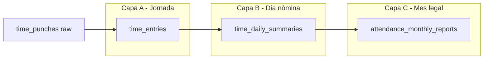

# 15. Control horari - Arquitectura, sincronitzacio i fluxos

Aquest document defineix com ha de funcionar el sistema de control horari dins
Supabase: captura offline, sincronitzacio, processament i calcul d'hores.

> **Actualitzat:** 2026-07-09 — §15.9 tres capes d'estat (jornada / dia nòmina / mes legal).  
> **Estat d'implementació:** [`docs/plans/checkin/STATUS.md`](../plans/checkin/STATUS.md)  
> **Calendari laboral (detall operatiu):** [`docs/help/horaris/calendaris-laborals.md`](../help/horaris/calendaris-laborals.md)

---

## 15.1 Arquitectura proposada

```text
React PWA
  |- IndexedDB local outbox
  |- cache local de fitxatges recents i referencia minima
  `- Supabase client
       |- RPC api.record_time_punch(...)
       |- RPC api.sync_time_punches(batch jsonb)
       |- api.time_punches / api.time_entries / api.time_daily_summaries
       `- Realtime opcional per refrescar estat

Postgres
  |- data.time_punches          raw immutable
  |- data.time_entries          intervals processats
  |- data.time_daily_summaries  resum laboral/payroll
  |- data.work_schedules        plantilles horaries
  |- data.holidays              festius nacionals/locals
  |- data.employee_absences     vacances/incidencies
  `- PGMQ attendance_recompute_queue
       `- process-attendance-queue
```

La captura ha de ser rapida i tolerant a fallades. El calcul pot ser eventual
sempre que el frontend mostri clarament si l'estat es provisional.

---

## 15.2 Offline amb IndexedDB i Supabase

### Compatibilitat

IndexedDB continua sent l'opcio correcta per fitxatges de camp. Supabase no
substitueix IndexedDB; Supabase nomes rep operacions quan hi ha connexio.

La diferencia amb JCM:

- Abans: IndexedDB imitava la colleccio `punches` i Firestore tenia listeners.
- Ara: IndexedDB es una **cua d'operacions** amb contracte estable i idempotent.

### Estructura local recomanada

```ts
type LocalAttendanceOp = {
  id: string;                 // UUID v7: client_op_id
  tenant_id: string;
  site_id: string;
  employee_id: string;
  kind: 'time_punch.record';
  payload: {
    direction: 'in' | 'out';
    punch_type: string;
    occurred_at: string;      // ISO client time
    device_public_id: string;
    location_id?: string;
    geo?: unknown;
    location_permission: 'granted' | 'denied' | 'timeout' | 'error' | 'notrequired';
    comment?: string;
    source: 'manual' | 'station' | 'qr' | 'barcode';
  };
  created_at: string;
  attempts: number;
  status: 'pending' | 'syncing' | 'synced' | 'rejected' | 'quarantined';
  server_id?: string;
  last_error?: string;
};
```

Object stores recomanats:

| Store | Proposit |
|---|---|
| `attendance_ops` | Outbox pendent de sincronitzar. |
| `attendance_cache` | Ultims fitxatges i resums per UI offline. |
| `reference_cache` | Employee, tenant actiu, site, locations assignades, horari d'avui/dema. |
| `sync_state` | Ultim sync, server clock offset aproximat, errors. |

### Drainer de sincronitzacio

1. Escolta `online`, foreground i un interval moderat.
2. Comprova connectivitat contra Supabase, no contra Google.
   - Opcio: `health` Edge Function existent.
   - Opcio: RPC lleugera `api.ping()`.
3. Envia lots petits: 10-25 operacions.
4. Crida `api.sync_time_punches(p_batch jsonb)`.
5. Rep resultat per item:

```json
{
  "client_op_id": "...",
  "status": "accepted|duplicate|rejected|needs_review",
  "time_punch_id": "uuid|null",
  "message": "..."
}
```

6. Marca localment com `synced`, `rejected` o `quarantined`.
7. Refresca `api.my_attendance_today` o `api.time_daily_summaries`.

---

## 15.3 Idempotencia i ordre

### Clau d'idempotencia

Cada fitxatge porta `client_op_id` generat abans de desar localment.

Regla de base de dades:

```sql
UNIQUE (tenant_id, client_op_id)
```

Si el mobil reenvia el mateix fitxatge, el servidor retorna `duplicate` amb
l'`time_punch_id` original. No s'ha de crear cap segon registre.

### Timestamp oficial

Guardar sempre dos temps:

- `occurred_at`: hora del dispositiu, la que descriu quan l'usuari diu que ha
  fitxat.
- `received_at`: hora del servidor quan Postgres rep el registre.

Per payroll, el calcul base usa `occurred_at`, pero marca anomalies si:

- `abs(occurred_at - received_at)` supera un llindar configurable.
- El dispositiu informa un `clock_offset_ms` sospitos.
- El lot arriba amb molt retard.

---

## 15.4 Flux: registrar fitxatge online

1. Frontend resol context: `tenant_id`, `site_id`, `employee_id`, dispositiu,
   location assignada i ultim estat conegut.
2. Genera `client_op_id`.
3. Captura GPS si esta habilitat.
4. Desa l'operacio a IndexedDB com `pending`.
5. Crida `api.record_time_punch(...)` o el batch `api.sync_time_punches`.
6. El servidor:
   - valida pertenenca al tenant;
   - valida que l'empleat pot fitxar;
   - valida dispositiu/location si aplica;
   - insereix `data.time_punches`;
   - escriu audit `TIME_PUNCH_RECORDED`;
   - encua recomputacio del dia.
7. Frontend marca l'operacio com `synced` i refresca estat.

---

## 15.5 Flux: registrar fitxatge offline

1. Frontend no bloqueja l'usuari per manca de xarxa.
2. Desa l'operacio a IndexedDB amb `status='pending'`.
3. Mostra estat local provisional.
4. Quan torna la connexio, el drainer envia el lot.
5. El servidor accepta, duplica o rebutja cada operacio.
6. Si es rebutja, queda en quarantena local i es mostra una notificacio per
   revisio.

Cap fitxatge offline ha de desapareixer automaticament. Si no es pot pujar,
l'usuari o un manager l'ha de veure com a pendent/rebutjat.

---

## 15.6 Flux: estacio fixa

### Model recomanat

Una estacio fixa es un `attendance_device` amb:

- `kind='fixed_station'`.
- `site_id` obligatori.
- `location_id` obligatori si el tenant requereix zones.
- `device_secret_hash` o autenticacio equivalent.
- estat `active/suspended`.

L'estacio no hauria d'actuar com un usuari normal amb permisos globals. Pot
usar una sessio especial amb permis `attendance.punch_station` i device binding.

### Identificacio d'empleats

Opcions suportades:

1. **Seleccio manual**: nomes empleats assignats a la location de l'estacio,
   incloent herencia de locations pare.
2. **QR**: token curt signat pel servidor.
3. **Codi de barres**: mateix contracte que QR, format diferent.

Important: no portar el secret al frontend com fa JCM amb `punchIdGenerator`.
El token ha de ser emes pel servidor:

```text
api.issue_attendance_identity_token(method)
api.resolve_attendance_identity_token(token, device_public_id)
```

El payload signat ha d'incloure `tenant_id`, `employee_id`, `user_id?`, `exp`,
`nonce` i metode (`qr`/`barcode`).

---

## 15.7 Flux: processar fitxatges

La recomputacio converteix raw punches en intervals i resum diari.

Trigger recomanat: des de `api.record_time_punch` / `api.sync_time_punches`
s'encua un missatge a `attendance_recompute_queue`:

```json
{
  "task": "recompute_attendance_day",
  "tenant_id": "uuid",
  "site_id": "uuid",
  "employee_id": "uuid",
  "work_date": "2026-05-04",
  "idempotency_key": "att-employee-date"
}
```

El worker:

1. Carrega punches del dia i, si cal, marge del dia anterior/posterior per
   torns nocturns.
2. Ordena per `occurred_at`, `received_at`, `id`.
3. Emparella `IN -> OUT`.
4. Detecta anomalies:
   - doble `IN` seguit;
   - doble `OUT` seguit;
   - `IN` sense `OUT`;
   - `OUT` sense `IN`;
   - durada negativa o massa llarga;
   - timestamp client sospitos;
   - device/location no autoritzats.
5. Reescriu `time_entries` derivats d'aquell dia.
6. Calcula `time_daily_summaries`.
7. Genera notificacio si cal revisio.

---

## 15.8 Calendari laboral

### Regla de resolucio del dia

La prioritat ha de ser explicita i server-side. **La implementació actual** combina dues capes:

**A) Assistència (`api.resolve_work_day`)** — capes prèvies (màxima prioritat):

```text
0a. Absència aprovada (employee_absences, status = approved)
0b. Override legacy (employee_day_overrides) — force_holiday / force_work
```

**B) Calendari laboral per data** — `data.resolve_labor_calendar_for_employee` /
`data.resolve_schedule_planner_day` (mateix ordre a UI i backend):

```text
1. Override empleat
2. Override grup @local (grup + site)
3. Override local (site)
4. Override grup global (grup sense site)
5. Override empresa (tenant)
6. Festiu assignat (calendaris importats)
7. Indefinit (cap capa)
```

**C) Horari setmanal base (paral·lel)** — `work_schedules` +
`employee_schedule_assignments` defineixen plantilles per dia de setmana; el
calendari per data (overrides + festius) és el que resol el dia concret `D` per
a assistència i planificador visual.

Documentació completa de la cascada, camps de sortida (`day_type`, `work_intervals`,
`planned_minutes`, `source`) i mapatge a `time_daily_summaries`:
[`docs/help/horaris/calendaris-laborals.md`](../help/horaris/calendaris-laborals.md).

Això substitueix la barreja actual de `Schedules.tipo = VACACIONES/FIESTAS`.
Els festius i vacances no son horaris; son excepcions sobre un calendari de
treball.

### Pauses dins la jornada

Màquina d'estats al client:

```text
outside → PUNCH_IN → working
working → BREAK_START:<type> → on_pause:<type>
working → PUNCH_OUT → outside
on_pause:<type> → BREAK_END → working
```

- Cada pausa es registra com a `time_punches` (`break_start` / `break_end`) amb
  `pause_type` i snapshot `pause_counts_as_work`.
- La configuració per tenant viu a `tenant_pause_configs` (seed per arquetip).
- Pausa oberta sense `break_end` → anomalia `PAUSE_NOT_CLOSED`; resolució manual
  traçable (manager o empleat) sense alterar raw.
- **Absència parcial** (visita mèdica, permís per hores) → `employee_absences`,
  no és una pausa.

### Unitats de calcul

- **Expected intervals**: trams on s'espera treball, per exemple
  `08:00-14:00` i `16:00-18:00`.
- **Worked intervals**: `time_entries` derivats dels fitxatges.
- **Valid regular minutes**: interseccio entre worked i expected.
- **Break minutes**: pauses dins la jornada amb `counts_as_work = false`.
- **Pause-as-work minutes**: pauses amb `pause_counts_as_work = true` (conveni).
- **Overtime minutes**: worked fora d'expected si esta permes o aprovat.
- **Absence paid minutes**: minuts previstos coberts per absencia pagada
  (`employee_absences.counts_as_worked = true`).
- **Payroll minutes**: regular + overtime aprovat + absencies pagades segons
  politica.

### Exemple

Horari: `08:00-14:00 | 16:00-18:00`.

Fitxatges: `07:55 IN`, `14:05 OUT`, `16:10 IN`, `18:40 OUT`.

Resultat possible:

| Camp | Valor |
|---|---:|
| worked_minutes | 520 |
| expected_minutes | 480 |
| regular_minutes | 470 |
| early_minutes | 5 |
| late_minutes | 40 |
| overtime_minutes | 40 si permes/aprovat; 0 si no |
| anomaly | entrada tarda 10 min tard |

---

## 15.9 Aprovació, tres capes d'estat i nòmina

El control horari separa **tres capes independents** d'estat. Cada capa té la seva taula, semàntica i accions. No barrejar `approved` (dia nòmina) amb «tancat» (mes legal) ni amb «jornada tancada» (entrada/sortida).

### Les tres capes

| Capa | Taula | Camp `status` | Valors | Significat operatiu | UI (català) |
|------|-------|---------------|--------|---------------------|-------------|
| **A — Jornada** | `data.time_entries` | `status` | `open`, `closed`, `adjusted`, `missing` | Interval IN→OUT del dia: obert sense sortida, tancat, ajustat pel gestor, o sense registre | Jornada oberta / tancada / ajustada / sense registre |
| **B — Dia nòmina** | `data.time_daily_summaries` | `status` | `draft`, `approved`, `exported` | Revisió gestor per dia abans d'exportar nòmina | Revisió pendent / Aprovat nòmina / Exportat nòmina |
| **C — Mes legal** | `data.attendance_monthly_reports` | `status` | `draft`, `employee_confirmed`, `manager_approved`, `signed`, `archived` | Registre mensual RD 8/2019: confirmació empleat, tancament gestor, signatura DMS | Esborrany / Confirmat empleat / **Tancat per nòmina** / Signat / Arxivat |



**Regla clau:** les capes evolucionen en ordre lògic (fitxatges → jornada → dia → mes), però **no comparteixen valors**. Un dia pot tenir jornada `closed` (capa A) i encara `draft` (capa B). Un mes pot estar `employee_confirmed` (capa C) mentre alguns dies segueixen en `draft` (capa B) fins que el gestor els aprova o tanca en bloc.

### Transicions per capa

**Capa A — Jornada** (`time_entries`)

- Es crea/actualitza a cada recomputació (`recompute_attendance_worker`) a partir de `time_punches`.
- `open` → l'empleat encara no ha fitxat sortida (o pausa oberta sense tancar).
- `closed` → parell IN/OUT vàlid (pot tenir anomalies).
- `adjusted` → el gestor ha aplicat `api.adjust_time_entry` (raw immutable).
- `missing` → dia laborable sense fitxatges ni absència que cobreixi el dia.

**Capa B — Dia nòmina** (`time_daily_summaries`)

1. Després de cada recomputació: `status = 'draft'` (provisional fins revisió).
2. Gestor revisa anomalies i ajusta si cal.
3. Gestor aprova el dia: `api.approve_time_day` → `status = 'approved'`.
4. Export nòmina només llegeix dies aprovats (`api.export_payroll_days` / `export_payroll_period`).
5. En exportar: `status = 'exported'` + `payroll_locked_at`.

**Capa C — Mes legal** (`attendance_monthly_reports`)

1. Empleat confirma el registre del mes (`api.confirm_attendance_month` o portal EP8) → `employee_confirmed`.
   - Validació: `api.validate_attendance_month_employee_confirm` (bloquejos `PERIOD_NOT_ENDED`, `OPEN_TIME_ENTRY`, …).
2. Gestor tanca per nòmina (`api.approve_attendance_month`) → `manager_approved`.
   - Validació: `api.validate_attendance_month_close` (mes closable, sense jornades obertes, …).
3. Generació document + hash (`api.export_attendance_month` + Edge `generate-attendance-report`).
4. Signatura digital via mòdul documents → `signed`.
5. Arxivat després del cicle legal → `archived`.

**Esmenes post-tancament (F1):** després del tancament (`manager_approved` o posterior), el gestor pot registrar esmenes documentades a `attendance_monthly_report_amendments` (motiu, dia opcional, detall). Apareixen a Activitat (`ATTENDANCE_MONTH_AMENDMENT_REGISTERED`) sense reobrir l'export de nòmina extern.

La confirmació empleat (capa C) **no substitueix** l'aprovació diària (capa B): l'empleat atesta el contingut consolidat del mes; el gestor segueix revisant i aprovant dies abans d'exportar.

### On es mostra cada capa a la UI

| Pantalla | Capa A | Capa B | Capa C |
|----------|--------|--------|--------|
| Fitxatge (`/attendance`) | Estat local jornada | — | — |
| Fitxatges de l'equip (`AllTimeEntriesPage`, `PayrollReviewDaysTable`) | Columna «Jornada» | Columna «Dia nòmina» | — |
| Detall dia (`AttendanceDayDetailDialog`) | Timeline + estat entrada | Secció aprovació | — |
| Registre mensual (`MonthlyAttendanceReportPanel`, portal EP8) | Columna «Jornada» | Hint / enllaç a Fitxatges | Badge estat mes |
| Timesheet empleat (`EmployeeTimesheetTab`) | Calendari (tipus dia) | Llista (quan hi ha summary) | Pestanya Mes |

Component compartit: `AttendanceLayerStatusBadge` + claus i18n `status_layers.*` (`apps/tenant-portal`).

### Confusions habituals (evitar)

| Error | Correcte |
|-------|----------|
| «El dia està aprovat» parlant d'una jornada `closed` | `closed` és capa A; «aprovat» és capa B (`approved`) |
| «El mes està tancat» amb un dia encara `draft` | `manager_approved` (capa C) pot coexistir amb dies `draft` fins al tancament en bloc (config `attendance_monthly_bulk_approve_days_on_close`) |
| Exportar nòmina des de `time_punches` | Només des de `time_daily_summaries` amb `status = 'approved'` (o marcats `exported`) |
| Confirmació empleat = aprovació gestor | Són passos diferents de la capa C (`employee_confirmed` vs `manager_approved`) |

### Flux recomanat (dia) — capes A i B

1. `time_daily_summaries.status = 'draft'` després de cada recomputació.
2. Manager revisa anomalies (jornada capa A + resum capa B).
3. Manager crea ajustos si cal (`adjust_time_entry`; raw immutable).
4. Manager aprova el dia: `status = 'approved'` (`api.approve_time_day`).
5. Export payroll només llegeix dies aprovats (`api.export_payroll_days`).
6. Quan s'exporta, marcar `status = 'exported'` i `payroll_locked_at`.

Qualsevol canvi posterior a un dia exportat requereix un ajust explícit amb audit d'alta severitat.

### Flux recomanat (mes — RD 8/2019) — capa C

1. Empleat confirma registre mensual (`attendance_monthly_reports.status = employee_confirmed`).
2. Manager aprova / tanca per nòmina (`manager_approved`).
3. Generació document amb hash (`api.export_attendance_month` + Edge Function `generate-attendance-report`).
4. Signatura digital via mòdul documents — plantilla plataforma + UI + trigger `signed`.

**Referències operatives:** terminologia i tracks d'implementació a [`docs/plans/checkin/plan-monthly-close-approval.md`](../plans/checkin/plan-monthly-close-approval.md) §A1; estat d'implementació a [`STATUS.md`](../plans/checkin/STATUS.md).

---

## 15.10 Realtime

Supabase Realtime es util per:

- veure ultim fitxatge en dashboard;
- refrescar una estacio quan un empleat acaba de fitxar en un altre dispositiu;
- rebre notificacions d'anomalies.

Pero no ha de ser la garantia de sincronitzacio. La garantia es:

- IndexedDB outbox;
- RPC idempotent;
- resposta per item;
- recomputacio server-side.

---

## 15.11 Decisions tecniques

| Decisio | Resolucio |
|---|---|
| IndexedDB amb Supabase? | Si. Necessari per camp/mobil. |
| Direct insert a taules `data.*`? | No per fitxatge. Usar RPC per validacio, idempotencia i recomputacio. |
| Cal PGMQ? | Si per recomputacio i notificacions, no per bloquejar la captura. |
| Realtime substitueix sync? | No. Es nomes UX. |
| Geofencing V1? | Configurable per tenant/site: `off` / `informative` / `warn` / `block`. Per defecte: `informative`. |
| Payroll des de raw? | No. Des de `time_daily_summaries` aprovats. |
| Estacions fixes | Identitat tecnica (`device_secret_hash`); no llicencia TenantMember. |
| Torns nocturns V1? | Si. `work_date` = dia d'inici; recompute carrega marge day±1. |
| Festius | Nager.Date (ES + CCAA) + override manual. |
| QR/barcode estacio | V2. V1 = seleccio manual. |
| Arrodoniment payroll | Configurable: `real_minute` / `15_min` / `30_min`. Per defecte: `real_minute`. |
| Hores extra | Configurable: `auto_if_allowed` / `approval_required`. Per defecte: `approval_required`. |
| Retencio raw | 4 anys minim (RDL 8/2019). |
| Export V1 | CSV generic + PDF resum mensual + format A3/Sage (A3/Sage pendent UI). |
| Pauses | `time_punches` break_start/end; no taula `pause_sessions` separada. |
| Tauler manager | `mv_today_site_status` + `api.get_today_dashboard_rows` (context horari esperat). |
| Planificador torns UI | TanStack Table + CSS Grid (custom). |
