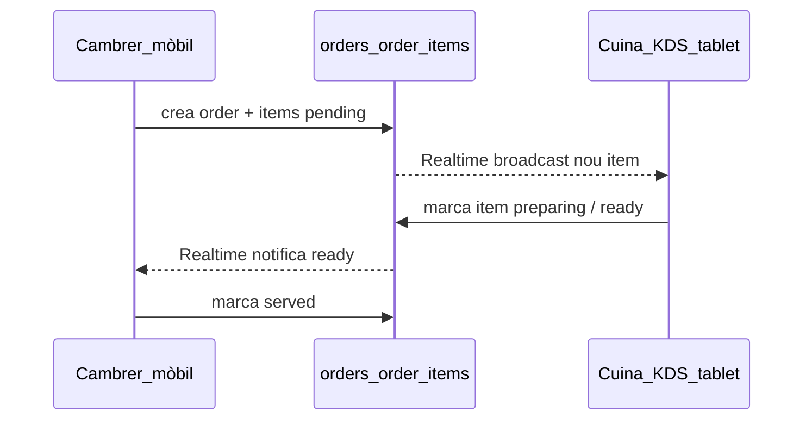

# Mancances

Aquest document és el **punt de partida per a les funcionalitats noves d'un FSR** (Full Service Restaurant: restaurant amb cambrers, reserves i carta). No conté dades de seed — per a això vegeu [`docs/plans/seeds/plan-fsr-seed.md`](../../plans/seeds/plan-fsr-seed.md) — sinó l'anàlisi de què li falta al producte per servir aquest vertical de veritat, en el mateix esperit que [`QSR - Quick Service Restaurant..md`](QSR%20-%20Quick%20Service%20Restaurant..md).

**Pla de producte tech-first (Sala mòbil + KDS + Guest Table OS + reserves):** [`docs/plans/FSR/README.md`](../../plans/FSR/README.md). Aquell pack defineix el wedge (bucle de transparència en viu + HR al mateix tenant), el roadmap per fases i l'aposta de prioritzar servei/QR/ETA (Fase 1–2) abans del tancament comercial de reserves (Fase 3–4). Aquest document de mancances es manté com a gap analysis; el camí d'implementació viu al pack FSR.

**Escenari de referència:** "Cal Ferran", restaurant de cuina mediterrània, 1 sol local, ~40 comensals/11 taules, servei de dinar i sopar, ~12 empleats (cuina + sala).

**Quan diria que NO (per ordre de gravetat):**

1. **No hi ha motor de reserves amb capacitat** — el dolor és el més bàsic i el més gran; sense això no hi ha producte per a aquest client.
2. **No hi ha carta/menú gestionable** — segon bloqueig d'impressió immediata.
3. **No hi ha reserva online a la web** — competidors directes (TheFork, Resengo, Covermanager) ho tenen com a mínim.
4. **No hi ha plànol de sala / floor plan** — els maîtres ho esperen visualment, no en llista.
5. **No hi ha gestió de comandes de cuina (KDS)** — útil i factible, però no bloqueja la primera venda si el dolor principal és RRHH/torns.
6. **No-show, dipòsits, llista d'espera** — importants per restaurants amb molta demanda, però secundaris per a una primera venda.

**Quan diria que SÍ (avui, amb honestedat):** només si el seu dolor principal és **control horari + nòmina + RRHH del personal de sala/cuina** i accepta portar reserves, carta i comandes fora de PiMed (paper, TheFork, Google My Business, TPV extern). És un "sí" molt més feble que el cas QSR.

---

## 1. Reserves amb calendari i capacitat

**Què vol el client:** veure les reserves d'avui en un calendari, amb la taula assignada, i que el sistema li digui si té taula lliure per a N persones a una hora donada.

**Què té l'app:** un calendari genèric (`data.calendar_events`) que mostra esdeveniments de qualsevol mòdul (tasques, torns...). **No té** concepte de reserva: no hi ha `party_size`, no hi ha vincle a una taula, no hi ha estat `confirmed / seated / no-show / cancelled`, ni comprovació de capacitat, solapament o combinació de taules.

**Per què descartaria:** és la funció **nº1** que ve a buscar un restaurant amb cambrers. Sense això, l'eina no serveix per operar la sala; com a molt serveix per fitxatges i nòmina. Cada reserva l'hauria de comprovar a ull mirant un paper o un Excel — exactament el que vol deixar de fer.

### Disseny de producte mínim (recomanat)

1. **`data.reservations`**: `tenant_id`, `site_id`, `table_id`/`location_id`, `party_size`, `start_at`, `duration_min`, `status` (`requested/confirmed/seated/completed/no_show/cancelled`), `contact_id`, `channel` (`phone`/`walk_in`/`online`), `notes`, `deposit_amount?`.
2. **Taules amb capacitat real**: afegir `capacity` a `data.assets` (o a `data.locations.metadata` amb validació), més suport per combinar taules per a grups grans.
3. **Comprovació de disponibilitat**: RPC que, donat `site_id + start_at + party_size`, retorni taules lliures (sense solapament, respectant turn-time).
4. **Vista de calendari de sala**: reserves del dia agrupades per franja i taula.

### Ordre pragmàtic

| Fase | Què | Valor |
|------|-----|-------|
| **A** | `reservations` + taules amb `capacity` + vista de calendari intern (sense web) | Demo creïble per a un FSR |
| **B** | Comprovació automàtica de disponibilitat + combinació de taules | Deixa de dependre de paper/Excel |
| **C** | Floor plan visual (drag&drop) | Experiència esperada per un maître |
| **D** | No-show tracking, llista d'espera, dipòsit per a grups grans | Gestió avançada |

---

## 2. Carta i menú del dia

**Què vol el client:** la seva carta, amb el menú del dia diferent cada dia de la setmana, gestionable sense tocar codi.

**Què té l'app:** `data.catalog_items` — pensat per pressupostos/facturació (SKU, preu, IVA, categoria lliure). No té secció de carta, no té foto, al·lèrgens, ni disponibilitat per dia de la setmana ni rotació automàtica.

**Per què descartaria:** un restaurant sense carta digital gestionable és com una app de torns sense calendari. Se'n va a Wix/Square o simplement no canvia d'eina.

### Disseny de producte mínim (recomanat)

1. Extensió de `catalog_items` (o taula nova `data.menu_items`) amb: `section` (entrants/principals/postres/menú del dia), `day_of_week[]`, `allergens[]`, `photo_url`, `is_menu_dia`.
2. Gestió d'estat (`available`/`sold_out` del dia) — habitual en un servei amb producte fresc.
3. Vista d'edició de carta pensada per a un xef/maître, no per a un comptable (llenguatge, no SKU/IVA en primer pla).

---

## 3. Publicació de la carta i horaris a la web pública

**Què vol el client:** que la seva carta i els seus horaris surtin a la seva pàgina web, i que es mantingui sola quan canvia el menú del dia.

**Què té l'app:** portal públic (`public_sites` + `public_pages`) amb blocs `paragraph`/`heading`/`image`/`html`. No hi ha bloc "menú" que llegeixi el catàleg, ni horaris d'obertura exposats al públic (`calendar_business_hours` és una clau de setting sense forma definida ni lectura pública).

**Per què descartaria:** avui hauria de re-escriure HTML a mà cada vegada que canvia el menú — el contrari del que ven "web que es manté sola".

### Disseny de producte mínim (recomanat)

1. Nou tipus de bloc a `public_pages.content`: `menu_block` que llegeix `catalog_items`/`menu_items` filtrat per secció i dia.
2. Exposició pública de `calendar_business_hours` (o equivalent) amb una forma definida i lectura des del portal.
3. Regeneració automàtica de la pàgina en desar canvis a la carta (sense passos manuals).

---

## 4. Reserva online pública

**Què vol el client:** que els clients puguin reservar des de la web, no només trucar.

**Què té l'app:** `data.public_leads` (formulari nom/email/telèfon/missatge) — pensat per captar contactes comercials, no per reservar taula amb data/hora/persones.

**Per què descartaria:** avui qualsevol competidor petit (TheFork, Resengo, Covermanager) ofereix reserva online amb confirmació automàtica. Sense això, PiMed sembla una eina de nòmines amb una web enganxada.

### Disseny de producte mínim (recomanat)

Depèn directament del punt 1 (`data.reservations` + disponibilitat): un widget al `public_site` que consulti disponibilitat real i creï una reserva en estat `requested` → confirmació automàtica o manual pel maître. Recordatoris automàtics (SMS/email 2h abans) reaprofitant el motor de notificacions ja existent.

---

## 5. Gestió de cuina i comandes (KDS): cambrer + cuina — **factible i d'alt valor**

**Què vol el client:** que els cambrers prenguin nota a les taules amb el mòbil, i que cuina vegi les comandes en una tablet/kiosk i vagi marcant les que estan llestes. És a dir, gestionar la feina de cuina i el seu estat.

**Què té l'app avui:** res d'aquest domini. No hi ha `orders`/`order_items`, no hi ha KDS, no hi ha dispositiu genèric per a comandes (`data.attendance_devices` és només per fitxatges), i el portal d'empleat només té HR/torns.

**Per què és factible (a diferència d'altres gaps):** reaprofita patrons ja existents al codi:

- Patró de **dispositiu aparellat** amb secret + PIN + `site_id`/`location_id` (`data.attendance_devices`) es pot clonar per a un nou tipus de dispositiu `kitchen_display`, en lloc de forçar-lo dins l'esquema d'attendance.
- **Supabase Realtime** ja s'usa en producció per a altres dominis (`useNotificationsRealtime`, `usePdfJobStatus`) — el mateix mecanisme (`postgres_changes`/broadcast) serveix per notificar la cuina en viu sense feina nova d'infraestructura.
- El **portal d'empleat** (`apps/public-portal`, `data.employee_portal_tokens`) ja és mòbil-first i sense `auth.users` — és la base natural per afegir una pantalla "Prendre comanda" sense construir autenticació nova.

**Flux:** cambrer obre l'app al mòbil (extensió del portal d'empleat) → selecciona taula → afegeix plats de la carta → envia comanda → cuina veu la comanda en una tablet/kiosk amb els items i els va marcant `pending → preparing → ready` → cambrer veu que està llesta i serveix → marca `served`.

### Disseny de producte mínim (recomanat)

1. **`data.orders`** (taula, comensals, estat, cambrer, timestamps) + **`data.order_items`** (plat, quantitat, notes, estat individual `pending/preparing/ready/served/cancelled`, `catalog_item_id`).
2. Vista/pantalla de cuina (KDS): llista d'items pendents per estació (cuina, barra), amb Realtime.
3. Vista de cambrer al portal d'empleat (afegir a `portalNavConfig.ts`): taules → carta → enviar comanda.
4. **Sense pagament** en aquest flux: el compte es cobra després, com avui, per caixa/TPV extern — és més senzill que l'autoservei (punt 6).

### Ordre pragmàtic

| Fase | Què | Valor |
|------|-----|-------|
| **A** | `orders`/`order_items` + vista de cambrer al portal + KDS bàsic (llista, sense Realtime) | Demo creïble |
| **B** | Realtime cuina↔cambrer | Experiència fluida, zero "anar a preguntar" |
| **C** | Estacions múltiples (cuina/barra/postres), notes i al·lèrgens per item | Cuines amb més volum |

---

## 6. Autoservei tipus QSR: kiosk/tablet/mòbil del client + pagament — **amb matisos**

**Què vol el client:** oferir un sistema similar al de grans franquícies QSR: el client entra, va a un kiosk (o tablet a la taula, o el seu propi mòbil), fa la comanda, paga, cuina ho prepara i el cambrer ho serveix.

**Per què té matisos (a diferència del punt 5):**

1. **Pagament per transacció**: avui Stripe només gestiona subscripcions SaaS (`data.billing_addons`). Cobrar el client final requereix un flux nou (Stripe Checkout/PaymentIntent per comanda), gestió d'IVA per línia, propines, possible split de compte — no és una extensió menor.
2. **Accés anònim/públic**: el client no és un empleat; no té token de portal ni PIN. Cal un flux d'autenticació lleugera per sessió de taula (QR amb token d'un sol ús per taula/servei), diferent del model `employee_portal_tokens`.
3. **Seguretat i frau**: cal evitar que un client edite comandes d'una altra taula, dupliqui pagaments, o abusi de la sessió.
4. **Maquinari**: tablet per taula té cost (compra/manteniment/robatori); "mòbil del client" evita maquinari però depèn de connexió/QR i cobertura de xarxa al local.
5. **Impacte en el rol del cambrer**: en un FSR (a diferència de QSR), el cambrer és part de l'experiència (recomanacions, maridatges, atenció). L'autoservei complet pot xocar amb el posicionament "restaurant amb cambrers". Recomanable com **opcional/complement** (ex. només per demanar una segona ronda de begudes) més que substitut total del cambrer.
6. **Compliance de pagaments**: PCI-DSS, gestió de reemborsaments/anul·lacions, factura simplificada — abast notablement més gran que el punt 5.

**Recomanació:** tractar-ho com a **fase 2 opcional**, reaprofitant el mateix `data.orders`/`data.order_items` del punt 5 com a base, afegint-hi `channel` (`waiter` \| `self_service`), `session_token` per taula, i `payment_status`/`payment_intent_id`. No dissenyar-lo com a sistema separat.

### El que NO cal fer (de moment)

- Construir un TPV/POS complet
- Suportar tots els mètodes de pagament del dia 1 (començar amb targeta via Stripe)
- Substituir el cambrer — posicionar-ho com a complement

---

## Relació amb els altres documents

- **Pla implementació tech-first** (Sala, KDS, Guest Table OS, reserves, seguretat): [`docs/plans/FSR/README.md`](../../plans/FSR/README.md).
- **Seed de dades** (empleats, torns, calendaris, absències, fitxatges + simulacions etiquetades de reserves/carta/web amb les eines existents): [`docs/plans/seeds/plan-fsr-seed.md`](../../plans/seeds/plan-fsr-seed.md).
- **Vertical QSR** (mancances de franquícia de menjar ràpid: marge/% laboral, drive-thru/domicili, propines, model franquiciat): [`QSR - Quick Service Restaurant..md`](QSR%20-%20Quick%20Service%20Restaurant..md).
- **Pla evolutiu web + CMS (TCMS-2 + paquet FSR)**: [`docs/plans/content/plan-tenant-content-tcms2-fsr.md`](../../plans/content/plan-tenant-content-tcms2-fsr.md). El pack FSR Fase 4B **no** bloqueja per TCMS-2.

## Fora d'abast (de moment, en qualsevol dels punts anteriors)

- Cap migració SQL, cap taula nova, cap canvi de codi — aquest document és anàlisi i recomanació.
- Integracions amb TheFork/Resengo/Covermanager o TPV de cuina de tercers.
