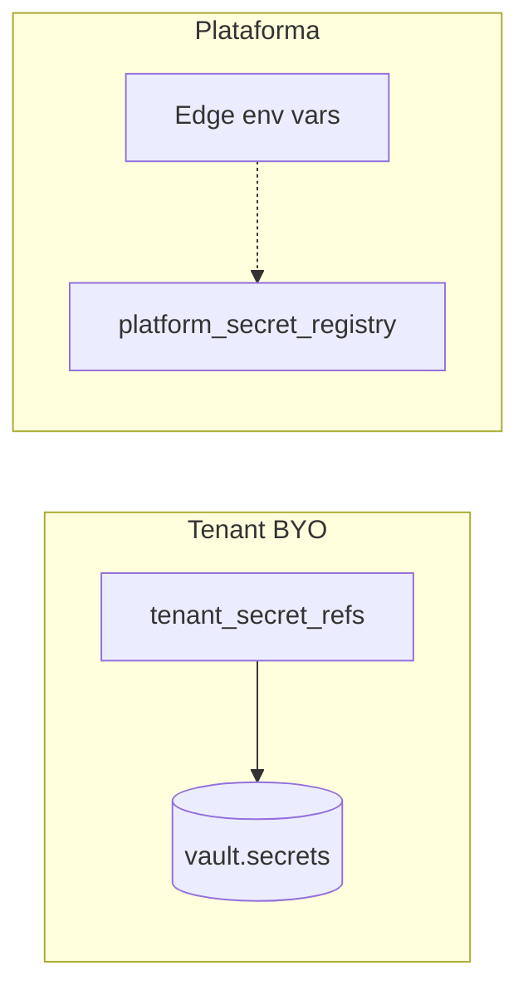
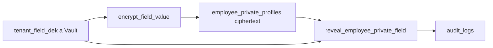

# Disseny — sistema unificat de secrets

## Principis

1. **Un mecanisme per tenant BYO:** Supabase Vault (`vault.secrets`) com a font de veritat.
2. **Metadades centralitzades:** `data.tenant_secret_refs` (versió, rotació, estat).
3. **Plataforma:** env vars operatives + `data.platform_secret_registry` (sense valors).
4. **Audit:** `data.secret_access_log` en cada lectura via `api.get_tenant_secret`.
5. **Mínima exposició:** valors desencriptats només en memòria a Edge Functions.

## Decisió: sense `TENANT_SECRETS_MASTER_KEY` a V1

pgsodium (Vault) ja xifra secrets en repòs. Afegir AES-256 per sobre seria redundànt i augmentaria complexitat sense benefici de seguretat mesurable.

**No KDF per tenant:** l'aïllament ve de `vault.secrets.id` independent per secret.

## Dominis

## RPCs unificades

| RPC | Accés | Ús |
|-----|-------|-----|
| `api.get_tenant_secret` | service_role | Lectura + audit log |
| `api.upsert_tenant_secret` | owner/manager | Crear/actualitzar |
| `api.rotate_tenant_secret` | owner/manager / admin | Rotació atòmica |
| `api.revoke_tenant_secret` | owner/manager / admin | Revocar |
| `api.list_tenant_secrets` | owner/manager | UI sense valors |

RPCs específiques (Twilio, AI, etc.) deleguen internament a `get_tenant_secret` per compatibilitat.

## Rotació

| Tipus | Mecanisme |
|-------|-----------|
| Secret BYO individual | `rotate_tenant_secret` + alerta `SECRET_ROTATION_DUE` |
| Secret plataforma | Manual a Supabase Dashboard + `log_platform_secret_rotation` |
| Clau mestre pgsodium | Runbook manual (emergència) |

## Excepció documentada

`api.get_docuseal_key_for_signing` retorna plaintext amb JWT owner/manager (no service_role). Pendent migració futura.

## Field-level PII (envelope DEK)

**Amenaça coberta:** dumps/backups de files sense accés a Vault; lectures de ciphertext sense helpers.

**No cobreix:** compromís `service_role` / `SECURITY DEFINER` de decrypt; usuari amb `employees.private.reveal`.

| Peça | Contracte |
|------|-----------|
| DEK | `ensure_tenant_field_dek` — un per tenant (`provider=default`) |
| Camps | IBAN + NSS (`iban_*` / `ssn_*`); no document_number |
| Reveal ACL | Només `employees.private.reveal` o `*` (no heretat de view/manage ni rol manager sol) |
| Write | `jwt_can_manage_employee_private` + flags set/clear |
| Rotació | `rotate_tenant_field_dek` dual-key (service_role) |

**Prohibit:** segona DEK per mòdul; BYO upsert/rotate/revoke sobre `tenant_field_dek`; ciphertext a vistes api.

## Capa TypeScript

`supabase/functions/_shared/crypto/kms-provider.ts` — abstracció per migració futura a KMS extern.
