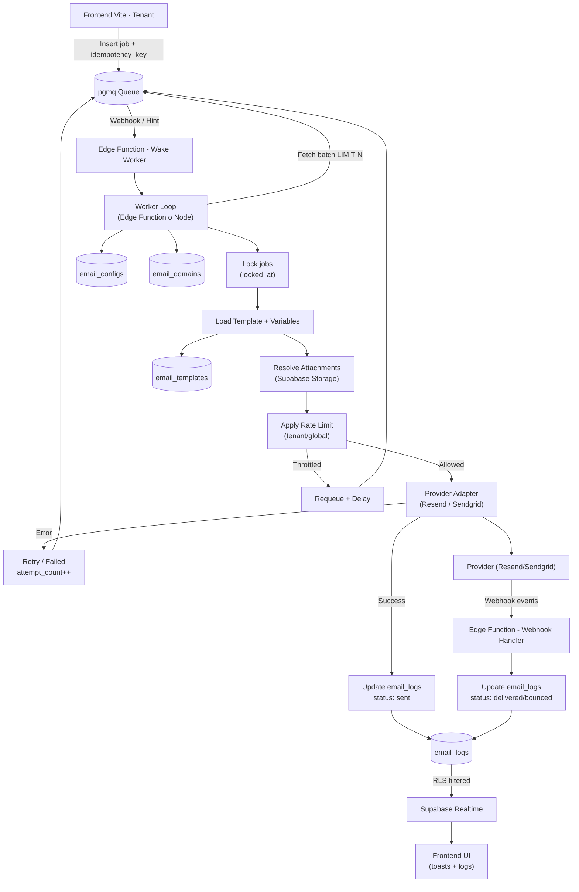
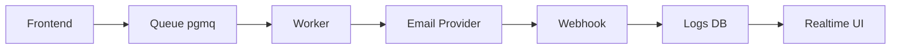

DONE

***

> **Rol:** Eres un Principal Staff Engineer y Arquitecto de Bases de Datos experto en el ecosistema Supabase/PostgreSQL.
>
> **Objetivo:** Basándote en el diseño de una arquitectura de envío de emails SaaS asíncrona, debes generar el **Esquema de Base de Datos y las Políticas RLS**. El sistema debe ser ultra-resiliente, evitar envíos duplicados y soportar concurrencia real de alto volumen.
>
> **Reglas Arquitectónicas Críticas (De obligado cumplimiento):**
>
> 1. **Modelo Pull e Idempotencia Estricta:** El worker procesará la cola (`pgmq`) en lotes. Es **obligatorio** impedir los envíos duplicados creando una constraint `UNIQUE` compuesta por `(tenant_id, idempotency_key)` en la tabla de logs.
> 2. **Máquina de Estados Segura:** Define explícitamente el ciclo de vida del correo usando un tipo `ENUM` (`queued`, `processing`, `sent`, `delivered`, `bounced`, `failed`). El diseño debe contemplar o establecer las bases para evitar transiciones de estado inválidas (ej. pasar de `failed` a `sent`).
> 3. **Concurrencia y Dead Letter Queue (DLQ):** La estructura asíncrona debe contemplar el procesamiento concurrente mediante campos como `locked_at`, `attempt_count` y `next_retry_at`. El modelo debe permitir identificar mensajes fallidos definitivos (ej. cuando se alcanza el `attempt_count` máximo con estado `failed`) para enviarlos a una DLQ.
> 4. **Integridad del Feedback Loop:** Debe existir un índice único (preferiblemente parcial, cuando no sea NULL) sobre `provider_message_id` para evitar inconsistencias y duplicados cuando entren los eventos de los webhooks de Resend/Sendgrid.
> 5. **Control de Inserción (Ownership):** El frontend de la aplicación (usuario autenticado) **NO** insertará directamente en la tabla de logs. El frontend solo encolará tareas en `pgmq`. La tabla de logs será gestionada e insertada exclusivamente por los procesos internos (workers/webhooks) usando `service_role`.
> 6. **Consistencia de Dominio:** El esquema debe sentar las bases para validar que el dominio de `from_email` corresponda a un custom domain verificado del tenant, o en su defecto, al dominio base de la plataforma.
> 7. **Retención de Datos:** El diseño debe prepararse para una limpieza masiva eficiente (vía `pg_cron`), incluyendo índices sobre la fecha de creación (`created_at`).
> 8. **Actores del Sistema (RLS):**
>    - **Usuario Autenticado (Frontend):** Las políticas deben permitir que el usuario lea su propio historial (`tenant_id = auth.uid()`) e inserte datos válidos en las tablas que le corresponden (configuración, plantillas) sin necesidad de privilegios elevados, pero impidiendo la modificación directa de estados o logs.
>    - **Service Role (Worker y Webhooks):** Tiene acceso total por defecto, pero el esquema debe estar diseñado asumiendo que este rol será el único que mueva los estados.
>    - **Backoffice (Prisma):** Conexión TCP directa (bypass RLS).
>
>El worker DEBE ejecutar todas las operaciones bajo un contexto de tenant, inyectando request.jwt.claims en la sesión de PostgreSQL para que RLS aplique correctamente.
>El sistema debe ser seguro frente a ejecución accidental cross-tenant incluso usando service_role.
>
> **Entregables que debes generar en esta fase:**
>
> 1. **Modelo de Datos Completo (SQL DDL):** Escribe el código SQL ejecutable para crear:
>    - `email_configs` (Rate limits, retención, proveedor por defecto).
>    - `email_domains` (Registro y validación de dominios).
>    - `email_templates` (Plantillas de usuario).
>    - `email_logs` (Historial del ciclo de vida del email con actualizaciones de estado controladas, idempotencia y rastreo de errores).
>    - *Asegúrate de incluir claves foráneas y todos los índices necesarios para rendimiento.*
> 2. **Políticas RLS:** Sentencias SQL completas y restrictivas según los actores definidos.
> 3. **Payload de la Cola (Esquema JSON):** Diseña un JSON exhaustivo que ilustre qué datos insertará Vite en `pgmq` para disparar un envío. Debe soportar:
>    - `idempotency_key` (obligatorio).
>    - Envío basado en template (ID) o contenido directo (raw HTML/text).
>    - Tipo de email (`transactional` o `bulk`).
>    - Prioridad opcional.
>
> Escribe código SQL limpio, profesional, idempotente (usando `IF NOT EXISTS` u `OR REPLACE`) y listo para ejecutarse en el editor SQL de Supabase.

***

### Siguientes pasos

Como bien proponías, la verdadera prueba de fuego será el código que la IA te devuelva. Lanza este prompt y **pega aquí el SQL resultante**. 

Haremos una auditoría de código juntos para revisar:
* Si ha creado correctamente el índice parcial en `provider_message_id`.
* Si las políticas de RLS realmente bloquean la inserción de logs desde el frontend.
* Si ha implementado bien la estructura de concurrencia (`locked_at`).

¡A por ello!


Perfecto, esto es justo lo que necesitas ahora: **visualizar el sistema para validar que no hay agujeros conceptuales antes de implementar**.

Te hago un diagrama Mermaid claro, separando responsabilidades y reflejando exactamente la arquitectura que hemos definido (cola + worker + feedback loop + RLS).

---

# 🧭 Diagrama Mermaid — Arquitectura Email SaaS (Asíncrona y Multi-tenant)



---

# 🧠 Cómo leer este diagrama (lo importante)

## 🔵 1. Entrada desacoplada (clave)

* El frontend **NO envía emails**
* Solo hace:

```text
INSERT → pgmq
```

👉 Esto elimina:

* timeouts
* problemas de concurrencia
* bloqueos

---

## 🟣 2. Worker (el corazón del sistema)

El worker hace:

* batch processing (`LIMIT N`)
* locking (`locked_at`)
* rate limiting
* retries

👉 Aquí está toda la inteligencia

---

## 🟡 3. Control de flujo (lo que evita que explote)

* `Rate Limit` → evita bloqueo del provider
* `Requeue + Delay` → evita saturación
* `attempt_count` → controla retries

---

## 🔴 4. Feedback loop (lo que la mayoría olvida)

* Provider → webhook → Edge Function
* Actualiza:

  * delivered
  * bounced

👉 Esto es lo que convierte tu sistema en **realmente fiable**

---

## 🟢 5. Realtime seguro

* `email_logs` filtrado por RLS
* Frontend recibe:

  * historial
  * eventos en vivo

👉 Sin fugas entre tenants

---

# ⚙️ Versión simplificada (por si quieres explicar al equipo)



---

# 🚀 Detalle PRO (lo que diferencia esto de un sistema básico)

Este diagrama incorpora:

* ✅ Idempotencia (aunque no visible, está en DB)
* ✅ Concurrencia controlada
* ✅ Rate limiting
* ✅ Retry automático
* ✅ Feedback loop real
* ✅ Multi-tenant seguro (RLS)

---

# 🧭 Siguiente paso recomendado

Ahora que tienes esto claro visualmente, lo ideal es:

👉 Hacer un segundo diagrama más técnico de:

* **estructura del mensaje en la cola**
* **ciclo de estados (state machine)**

o

👉 pasar ya a:

* SQL generado por la IA
* revisión crítica

---

Si quieres, en el siguiente paso te hago:

👉 diagrama Mermaid SOLO de la state machine (`email_logs`)
que es donde más bugs suelen aparecer.
