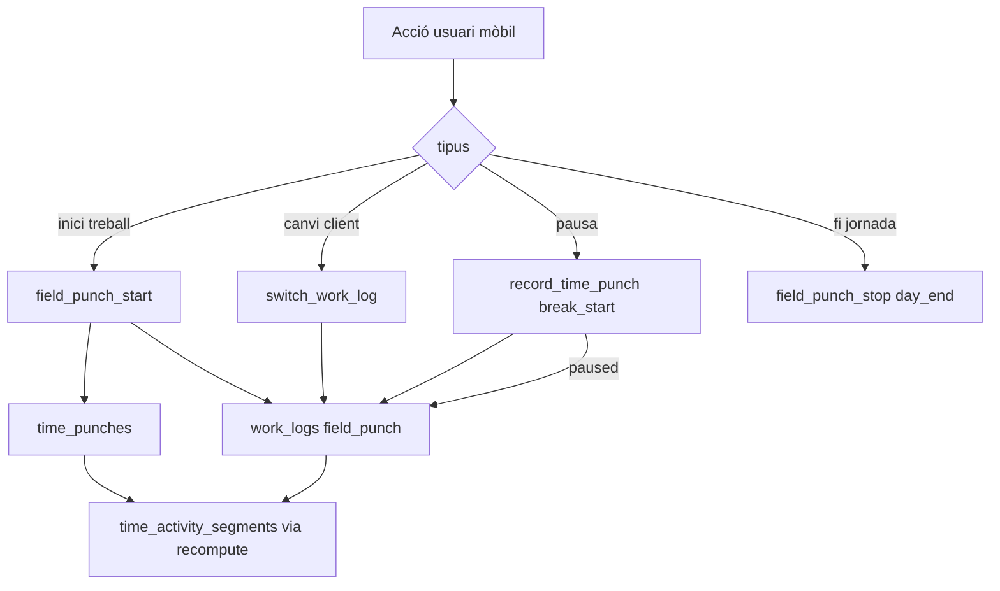
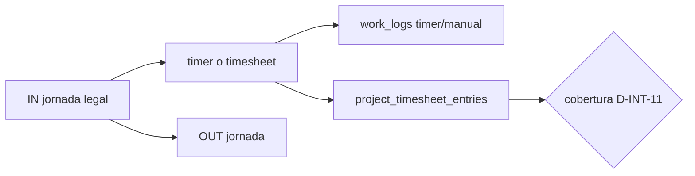

# Mòdul Projects Genèric — Pla d'implementació v2

> **Creat**: 6 de maig de 2026  
> **Versió**: 2.1 (integració control horari D-INT-1…12)  
> **Destí final**: `prompts/projectes/plan.md`  
> **Integració compartida:** [`prompts/shared/work-logs-time-attendance-integration.md`](../shared/work-logs-time-attendance-integration.md)  
> **Control horari / Track G:** [`docs/plans/checkin/plan-effective-work-time.md`](../../docs/plans/checkin/plan-effective-work-time.md)

---

## Changelog

| Versió | Data | Canvis |
|--------|------|--------|
| 1.0 | 2026-05-06 | Primer esquelet de fases |
| 2.0 | 2026-05-06 | Fusió fases 1+2, afegit `asset_id` a scope, spike offline explícit, customer portal convertit a nota d'arquitectura |
| 2.1 | 2026-07-04 | Integració control horari: `entry_mode`, `switch_work_log`, timesheet, D1 matisat — veure doc compartit D-INT |

---

## 1. Estat actual del mòdul (allò que JA existeix)

Abans de planificar, és crític saber el punt de partida real per no repetir feina.

| Component | Estat | Referència |
|-----------|-------|-----------|
| `data.departments` DDL + RLS + audit | ✅ Complet | `20260502000001` |
| `data.projects` DDL + RLS + visibilitat multi-condició | ✅ Complet | `20260502000001` |
| `data.tasks` DDL + RLS | ✅ Complet | `20260502000001` |
| `data.project_members` DDL + RLS | ✅ Complet | `20260502000001` |
| `data.project_lines` (pressupost) | ✅ Complet | `20260503000006` |
| `data.can_access_project()` helper | ✅ Complet | `20260502000001` |
| `data.my_department_ids()` helper | ✅ Complet | `20260502000001` |
| `api.create_project()` RPC transaccional | ✅ Complet | `20260502000001` |
| `api.projects`, `api.tasks`, `api.departments` vistes | ✅ Complet | `20260502000001` |
| Audit triggers (CREATED/UPDATED/STATUS_CHANGED/DELETED) | ✅ Complet | `20260502000001` |
| Cua `project_events` (pgmq.create) | ✅ Existent però **sense worker** | `20260502000001 L198` |
| Worker `process-project-events` | ❌ **No existeix** | — |
| `data.projects.asset_id` FK | ❌ **No existeix** (location_id sense FK real) | `20260502000001` |
| Frontend CRUD hooks (`useProjects`, etc.) | ❌ **Buit** | `src/features/projects/api/` |
| `data.work_logs`, `project_expenses`, `project_materials` | ❌ **No existeix** | — |
| Outbox IndexedDB (offline) | ❌ **No existeix** al repo | — |
| i18n `projects.json` (complet) | ⚠️ Parcial (solo línies de pressupost) | `src/locales/ca/projects.json` |

**Resum**: backend sòlid al ~65%, frontend buit, execució de camp (work_logs) i offline pendents de zero.

---

## 2. Decisions d'arquitectura tancades

Decisions preses i **no reobrir** durant la implementació:

### D1 — `work_logs` separat de `time_punches` (matisat v2.1)

`data.work_logs` i `data.time_punches` són taules **separades** amb **contractes compartits**.

- `time_punches` → control horari legal, nòmina, calendari, segments Track G.
- `work_logs` → imputació/facturació per projecte, GPS obra, despeses/materials.

**Comparteixen:** geo JSONB, `client_op_id`, outbox offline, audit.

**Matís per `entry_mode` (D-INT-2, veure doc compartit):**

| `entry_mode` | Relació amb `time_punches` |
|--------------|----------------------------|
| `field_punch` | **Síncron** — una acció UI escriu ambdós (RPC composta; D-INT-1). `break_start`/`break_end` pausen el work_log actiu (D-INT-8). |
| `timer` | **Independent** — timer web per projecte; jornada legal per IN/OUT separats. |
| `manual` | **Independent** — timesheet setmanal retrospectiva (D-INT-9). |

**No** fusionar taules. **No** inferir segments des de `timer`/`manual`.

### D2 — Vinculació documental polimòrfica, sense taules noves
Tots els documents adjunts a projectes i fitxatges de camp usen la infraestructura DMS existent:
- `data.documents.entity_type = 'project'` / `entity_id = {project_id}`
- `data.documents.entity_type = 'work_log'` / `entity_id = {work_log_id}`
- **Prohibit** crear taules `project_photos`, `work_log_attachments` o similars.

### D3 — Encolament asíncron **sempre des de RPC SQL**
Mai des de TypeScript directament, mai des de triggers de negoci. Sempre dins la mateixa transacció que el INSERT de negoci. Patró: `INSERT INTO data.* → log_audit_event() → pgmq.send()`.

### D4 — Calendari via `data.calendar_events`
Quan un projecte té `planned_start`, l'RPC crea transaccionalment un registre a `data.calendar_events`. **Cap referència** a `app.calendar_events` (nomenclatura antiga/desfasada).

### D5 — Arquetips/verticals via config, no via schema fork
Un únic schema `data.projects`. Les diferències entre `field_service`, `practice`, etc. es modulen via `data.sector_profiles.labels`, configuració de workflow, i permisos. Cap branca SQL per arquetip.

### D6 — Offline V1 amb outbox IndexedDB genèric
L'offline s'implementa des del primer tall del mòdul, no com a add-on posterior. Es construeix com a servei transversal reutilitzable per time-attendance.

### D7 — Customer portal: compatibilitat garantida per DMS polimòrfic
El model `entity_type/entity_id` del DMS ja és compatible amb el futur customer portal sense cap canvi addicional. **No és una fase independent**; és una propietat arquitectònica garantida per D2.

---

## 3. Contractes compartits obligatoris

### 3.1 Payload de geolocalització (geo JSONB)

Idèntic per `work_logs.check_in_geo`, `work_logs.check_out_geo` i `time_punches.geo`:

```typescript
interface GeoPayload {
  latitude: number;           // -90..90
  longitude: number;          // -180..180
  accuracy_meters: number;    // confiança en metres
  altitude_meters?: number;
  heading_degrees?: number;   // 0-360, null si estàtic
  speed_mps?: number;
  source: 'gps' | 'network' | 'hybrid';
  timestamp: string;          // ISO8601 hora del dispositiu
}
```

**Regles de validació (RPC server-side)**:
- `accuracy_meters > 100` → afegir `anomaly_codes[] += 'HIGH_UNCERTAINTY'` (no bloquejar)
- `abs(device_time - server_time) > 5min` → afegir `'CLOCK_SKEW'` (no bloquejar)
- Coordenades fora de rang → `RAISE EXCEPTION` (bloquejar)
- `location_permission = 'denied'` però `geo != NULL` → `RAISE EXCEPTION`

### 3.2 Model d'idempotència (client_op_id)

Idèntic per `work_logs` i `time_punches`:

```sql
client_op_id  uuid  NOT NULL,
UNIQUE (tenant_id, client_op_id)
```

- El frontend genera un UUID v7 **abans** de desar localment.
- El servidor retorna `{ status: 'accepted' | 'duplicate' | 'rejected', server_id }` per item.
- En `duplicate`: retorna l'`id` existent. No crea nou registre.

### 3.3 Model d'outbox IndexedDB (operacions offline)

```typescript
interface LocalFieldOp {
  id: string;                  // UUID v7 = client_op_id
  tenant_id: string;
  site_id: string;
  kind:
    | 'worklog.start'
    | 'worklog.stop'
    | 'worklog.switch'           -- switch_work_log (D-INT-6)
    | 'worklog.note'
    | 'punch.in'               -- reservat per time-attendance
    | 'punch.out'
    | 'field_punch.start'      -- D-INT-1: punch + work_log atòmic
    | 'field_punch.stop';
  payload: {
    project_id?: string;
    task_id?: string;
    geo?: GeoPayload;
    notes?: string;
    direction?: 'in' | 'out'; // per punches
    occurred_at: string;       // ISO8601 hora del dispositiu
  };
  created_at: string;
  attempts: number;
  status: 'pending' | 'syncing' | 'synced' | 'rejected' | 'quarantined';
  server_id?: string;
  last_error?: string;
}
```

**Màquina d'estats**:
```
pending → syncing → synced
                  ↘ rejected (validació server)
                  ↘ quarantined (≥3 intents fallits)
```

**Regles de drainer**:
1. Comprova connectivitat contra l'endpoint `/health` de Supabase (no Google).
2. Envia lots de màxim 25 operacions.
3. Processa cada resultat de forma independent (un error no bloqueja la resta).
4. Backoff: 30s → 60s → 300s entre reintents de lots fallits.

---

## 4. Roadmap per fases

### FASE 0 — Baseline (1 dia, en paral·lel amb tot)
> Feina de context, no blocant. Es fa el primer dia i s'actualitza incrementalment.

**Tasques:**
- [ ] Refrescar `prompts/projectes/prompt.md` eliminant referències desfasades:
  - Eliminar `app.calendar_events` → substituir per `data.calendar_events`
  - Eliminar `data.events` → substituir per `data.log_audit_event()`
  - Eliminar patró de encolament des de TypeScript
  - Actualitzar `start_work_log` perquè accepti `client_op_id` (idempotència)
- [ ] Ampliar `src/locales/ca/projects.json` amb estructura base de keys (`projects.list.*`, `projects.form.*`, `projects.status.*`, `projects.worklog.*`)

**Criteri de done**: el prompt és coherent amb el codebase i no es pot generar codi desfasat seguint-lo.

---

### FASE 1 — Extensions backend P0 (3–4 dies)
> Tanca la deuta existent i afegeix l'`asset_id` que el prompt original necessitava.

**Tasques:**
- [ ] **Migració** `20260506000001_project_extensions.sql`:
  - `ALTER TABLE data.projects ADD COLUMN asset_id uuid REFERENCES data.assets(id) ON DELETE SET NULL`
  - Actualitzar `api.projects` vista per incloure `asset_id`
  - Afegir trigger de consistència tenant en `asset_id` (patró `validate_*`)
  - `NOTIFY pgrst, 'reload schema'`
- [ ] **Migració** `20260506000002_work_logs.sql` (veure secció 5):
  - `data.work_logs` + `data.project_expenses` + `data.project_materials`
  - RLS, audit triggers, RPCs `api.start_work_log`, `api.stop_work_log`, `api.sync_work_log_ops`
- [ ] Regenerar `database.types.ts` amb la comanda oficial

**Criteri de done**: `supabase db reset` funciona net, les RPCs es poden cridar amb `supabase db test`.

---

### FASE 2 — Worker async (P0, 1–2 dies)
> Tanca el deute crític: els missatges a `project_events` s'acumulen sense ser processats.

**Tasques:**
- [ ] **Edge Function** `supabase/functions/process-project-events/index.ts`:
  ```typescript
  const runner = new QueueRunner({
    queueName: 'project_events',
    handlers: {
      PROJECT_CREATED: async (payload, ctx) => {
        // 1. Notificació in-app als membres del projecte
        // 2. Si planned_start → crear data.calendar_events (si no existeix ja)
        return { success: true }
      },
    },
    db: createAdminClient(),
  })
  ```
- [ ] **Migració** `20260506000003_project_events_cron.sql`:
  ```sql
  SELECT cron.schedule('process-project-events', '*/3 * * * *',
    $$ SELECT net.http_post(url := current_setting('app.supabase_url') || '/functions/v1/process-project-events', ...) $$
  );
  ```
- [ ] Afegir `verify_jwt = false` per `process-project-events` al `config.toml`
- [ ] Actualitzar taula de cues actives a `docs/product-design/09-async-infrastructure.md` i al agent `async-infra`

**Criteri de done**: `project_events` surt al `SELECT * FROM cron.job` i el worker retorna `BatchSummary` correcte en prova manual.

---

### FASE 3 — Frontend CRUD base (3–4 dies)
> Desbloqueja la UI completament buida. Segueix el patró dels departaments.

**Tasques:**
- [ ] Hooks: `useProjects`, `useCreateProject`, `useUpdateProject`, `useDeleteProject` (copiar patró de `src/features/departments/api/`)
- [ ] Hooks: `useTasks`, `useCreateTask`, `useUpdateTask`
- [ ] Components: `ProjectList`, `ProjectForm`, `ProjectDetail`, `TaskList`, `TaskForm`
- [ ] Rutes a `src/pages/` i registre al router
- [ ] Tots els strings amb `t('key', 'Fallback en Català')`
- [ ] Afegir keys noves a `src/locales/ca/projects.json`

**Criteri de done**: un `owner` pot crear, editar i eliminar un projecte i les seves tasques desde la UI.

---

### FASE 4 — Spike offline (2 dies, PoC)
> Validació tecnològica **abans** de construir la UI d'operari. El repo no té cap precedent d'IndexedDB.

**Tasques:**
- [ ] Instal·lar i avaluar `dexie` (recomanat) o `idb-keyval` per a l'outbox
- [ ] Implementar `src/lib/field-ops-db.ts`: store `operations`, `sync_state`, `reference_cache`
- [ ] Implementar `src/hooks/useFieldSync.ts`: drainer bàsic (online/offline detection + batch push)
- [ ] Prova end-to-end: crear work_log offline, tornar a posar connexió, validar que arriba al servidor
- [ ] Documentar resultat del spike (quin lib, quines limitacions iOS/PWA, llatència observada)

**Criteri de done**: un fitxatge offline sincronitza correctament quan es restaura la connexió. Resultat documentat.

---

### FASE 5 — UI d'operari de camp (4–5 dies)
> Requereix Fase 1 + Fase 4. Per **`entry_mode = field_punch`** (D-INT-1, D-INT-6, D-INT-7).

**Tasques:**
- [ ] Component `WorkLogCard` / **`FieldPunchCard`**: estat jornada + projecte actiu + GPS
- [ ] Hook unificat: RPC **`field_punch_start`** / **`switch_work_log`** / **`field_punch_stop`** (no start+stop separats en mobile)
- [ ] **`useGeoCapture`** compartit amb control horari
- [ ] Indicadors sync outbox: `pending`, `syncing`, `synced`, `rejected`, `quarantined`
- [ ] Alerta per operació `quarantined`
- [ ] **Declaració de gap (D-INT-7):** diàleg «Ara vas a…?» en tancar treball
- [ ] **`switch_work_log`:** canvi de projecte atòmic
- [ ] UI work_log «pausat» quan `break_start` (D-INT-8)
- [ ] Vista `ProjectDetail`: tasques + inici treball field_punch

**Criteri de done:** operari mobile dia multi-obra amb gaps declarats; un sol tap per canvi de client.

---

### FASE 5b — UI timesheet d'oficina (3–4 dies)
> Per **`entry_mode IN ('timer', 'manual')`** (D-INT-9 … D-INT-11).

**Tasques:**
- [ ] Vista setmanal (dies × projectes)
- [ ] Timer web start/stop per projecte
- [ ] Cel·les hores manuals + `api.upsert_timesheet_entries`
- [ ] Indicador cobertura vs `worked_minutes` (avís < 80%)
- [ ] Aprovació timesheet setmanal (independent control horari)

**Criteri de done:** consultor imputa setmana; avís cobertura sense bloquejar aprovació legal.

---

### FASE 6 — Sector profiles i etiquetes dinàmiques (2 dies)
> Fa que `field_service` digui "Ordre de servei" i `practice` digui "Expedient" sense canviar codi.

**Tasques:**
- [ ] Llegir `data.sector_profiles.labels` al context del tenant (ja es carrega via `api.my_tenant`)
- [ ] Implementar `useSectorLabels()` hook: retorna labels efectius del tenant (fallback a clau genèrica)
- [ ] Substituir textos hardcoded ("Projecte", "Obra", etc.) per `t(key, sectorLabel)` als components de projectes
- [ ] Validar amb `field_service` (hauria de mostrar "Ordre de servei") i `generic` (hauria de mostrar "Projecte")

**Criteri de done**: canviant el `sector_profile` del tenant, la UI adapta les etiquetes sense cap deploy.

---

### FASE 7 — Acabats i qualitat (1–2 dies)
> Tanca tasques pendents i assegura coherència global.

**Tasques:**
- [ ] Bulk operations RPC: `api.bulk_update_task_status(task_ids, new_status)` (desbloqueja Kanban)
- [ ] Integrar `asset_id` a `ProjectForm` amb selector de l'actiu (via `api.assets` vista existent)
- [ ] Afegir `type-aware` a la política UPDATE de `data.projects` (work_order necessita `site_id NOT NULL`)
- [ ] Actualitzar `docs/product-design/10-implemented-modules.md` amb les noves taules i RPCs
- [ ] Regenerar `database.types.ts` definitiu

**Criteri de done**: tests e2e passen, `database.types.ts` sincronitzat, `10-implemented-modules.md` actualitzat.

---

## 5. Disseny de les taules noves (Fase 1)

### `data.work_logs`

```sql
CREATE TABLE data.work_logs (
  id                      uuid        PRIMARY KEY DEFAULT gen_random_uuid(),
  tenant_id               uuid        NOT NULL REFERENCES data.tenants(id)   ON DELETE CASCADE,
  site_id                 uuid        NOT NULL REFERENCES data.sites(id)      ON DELETE CASCADE,
  project_id              uuid        NOT NULL REFERENCES data.projects(id)   ON DELETE CASCADE,
  task_id                 uuid                 REFERENCES data.tasks(id)      ON DELETE SET NULL,
  worker_id               uuid        NOT NULL REFERENCES data.profiles(id),
  client_op_id            uuid        NOT NULL,
  entry_mode              text        NOT NULL DEFAULT 'timer'
                          CHECK (entry_mode IN ('field_punch', 'timer', 'manual')),
  -- Vincle opcional al punch legal quan entry_mode = field_punch (D-INT-1, D-INT-4)
  time_punch_in_id        uuid        REFERENCES data.time_punches(id),
  time_punch_out_id       uuid        REFERENCES data.time_punches(id),
  status                  varchar(20) NOT NULL DEFAULT 'open'
                          CHECK (status IN ('open', 'paused', 'closed')),
  check_in                timestamptz NOT NULL,
  check_out               timestamptz,
  check_in_geo            jsonb,
  check_out_geo           jsonb,
  check_in_received_at    timestamptz NOT NULL DEFAULT now(),
  check_out_received_at   timestamptz,
  location_permission     text        NOT NULL DEFAULT 'notrequired'
                          CHECK (location_permission IN ('granted','denied','timeout','error','notrequired')),
  anomaly_codes           text[]      NOT NULL DEFAULT '{}',
  notes                   text,
  created_at              timestamptz NOT NULL DEFAULT now(),
  updated_at              timestamptz NOT NULL DEFAULT now(),
  UNIQUE (tenant_id, client_op_id),
  -- Regla: un treballador no pot tenir dos logs oberts al mateix temps per al mateix tenant
  CONSTRAINT one_open_log EXCLUDE USING gist (
    worker_id WITH =,
    tenant_id WITH =,
    tstzrange(check_in, check_out) WITH &&
  ) WHERE (status = 'open')
);

CREATE INDEX idx_work_logs_project     ON data.work_logs (project_id, check_in DESC);
CREATE INDEX idx_work_logs_worker      ON data.work_logs (worker_id, check_in DESC);
CREATE INDEX idx_work_logs_tenant_date ON data.work_logs (tenant_id, (check_in::date) DESC);
CREATE INDEX idx_work_logs_open        ON data.work_logs (tenant_id, worker_id) WHERE status = 'open';
CREATE INDEX idx_work_logs_entry_mode  ON data.work_logs (tenant_id, entry_mode, check_in DESC);
```

**Migració sobre codi existent:** afegir `entry_mode DEFAULT 'timer'` (filas actuals = timer); nous field_service usen `field_punch`.

### `data.project_timesheet_entries` (nova — D-INT-9)

```sql
CREATE TABLE data.project_timesheet_entries (
  id                uuid PRIMARY KEY DEFAULT gen_random_uuid(),
  tenant_id         uuid NOT NULL REFERENCES data.tenants(id),
  employee_id       uuid NOT NULL REFERENCES data.employees(id),
  project_id        uuid NOT NULL REFERENCES data.projects(id),
  task_id           uuid REFERENCES data.tasks(id),
  work_date         date NOT NULL,
  duration_minutes  int NOT NULL CHECK (duration_minutes >= 0),
  entry_mode        text NOT NULL CHECK (entry_mode IN ('timer', 'manual')),
  client_op_id      uuid NOT NULL,
  notes             text,
  created_at        timestamptz NOT NULL DEFAULT now(),
  UNIQUE (tenant_id, client_op_id)
);
```

### `data.project_expenses` (revisió D-INT-12)

**Estat al codi:** `project_id NOT NULL`. **Proposta (pendent aprovació):** Opció A del doc compartit §6.

```sql
CREATE TABLE data.project_expenses (
  id           uuid        PRIMARY KEY DEFAULT gen_random_uuid(),
  tenant_id    uuid        NOT NULL REFERENCES data.tenants(id)   ON DELETE CASCADE,
  project_id   uuid                 REFERENCES data.projects(id)  ON DELETE CASCADE,  -- nullable proposat
  expense_scope text       NOT NULL DEFAULT 'project'
                          CHECK (expense_scope IN ('project', 'employee_personal')),
  work_log_id  uuid                 REFERENCES data.work_logs(id) ON DELETE SET NULL,
  amount_cents integer     NOT NULL CHECK (amount_cents >= 0),
  currency     char(3)     NOT NULL DEFAULT 'EUR',
  description  text        NOT NULL,
  category     text,
  receipt_document_id uuid,  -- FK a data.documents (entity_type='project_expense')
  created_by   uuid        NOT NULL REFERENCES data.profiles(id),
  created_at   timestamptz NOT NULL DEFAULT now()
);
```

### `data.project_materials`

```sql
CREATE TABLE data.project_materials (
  id           uuid        PRIMARY KEY DEFAULT gen_random_uuid(),
  tenant_id    uuid        NOT NULL REFERENCES data.tenants(id)   ON DELETE CASCADE,
  project_id   uuid        NOT NULL REFERENCES data.projects(id)  ON DELETE CASCADE,
  work_log_id  uuid                 REFERENCES data.work_logs(id) ON DELETE SET NULL,
  name         text        NOT NULL,
  quantity     numeric(10,3) NOT NULL DEFAULT 1,
  unit         text,
  unit_price_cents integer,
  is_billable  boolean     NOT NULL DEFAULT true,
  catalog_item_id uuid,    -- FK a data.catalog_items si ve del catàleg
  created_by   uuid        NOT NULL REFERENCES data.profiles(id),
  created_at   timestamptz NOT NULL DEFAULT now()
);
```

### RPCs principals

```sql
-- Existents (timer/manual; mantenir per compatibilitat UI web actual)
api.start_work_log(...)   -- entry_mode per defecte 'timer'; param p_entry_mode opcional
api.stop_work_log(...)

-- NOU: field_punch atòmic (D-INT-1) — escriu time_punch + work_log
api.field_punch_start(
  p_client_op_id     uuid,
  p_project_id       uuid,
  p_task_id          uuid DEFAULT NULL,
  p_timestamp        timestamptz,
  p_geo              jsonb DEFAULT NULL,
  p_location_perm    text DEFAULT 'notrequired',
  p_punch_type       text DEFAULT 'in',  -- 'in' | 'day_start' segons política
  p_notes            text DEFAULT NULL
) RETURNS jsonb  -- { work_log_id, punch_id, segment_preview? }

api.field_punch_stop(
  p_log_id           uuid,
  p_timestamp        timestamptz,
  p_geo              jsonb DEFAULT NULL,
  p_gap_kind         text DEFAULT NULL,  -- D-INT-7: travel | break_unpaid | break_paid | day_end | null→UNCLASSIFIED
  p_client_op_id     uuid
) RETURNS jsonb

-- NOU: canvi de projecte (D-INT-6)
api.switch_work_log(
  p_current_log_id   uuid,
  p_next_project_id  uuid,
  p_next_task_id     uuid DEFAULT NULL,
  p_gap_kind         text DEFAULT NULL,
  p_timestamp        timestamptz,
  p_geo              jsonb DEFAULT NULL,
  p_client_op_id     uuid
) RETURNS jsonb
-- Transacció: stop_work_log(current) + registra gap + start_work_log(next, field_punch)
-- Audit: PROJECT_SWITCH

-- NOU: timesheet setmanal (D-INT-9)
api.upsert_timesheet_entries(
  p_week_start date,
  p_entries    jsonb  -- TimesheetEntry[]
) RETURNS jsonb
```

**`TimesheetEntry` (TypeScript):**

```typescript
interface TimesheetEntry {
  project_id: string
  task_id?: string
  work_date: string          // ISO date
  duration_minutes: number
  entry_mode: 'timer' | 'manual'
  notes?: string
  client_op_id: string
}
```

```sql
-- Batch offline (existent, ampliar kinds)
api.sync_work_log_ops(p_batch jsonb)
```

### Audit events

| Acció | entity_type | Quan |
|-------|-------------|------|
| `WORK_LOG_STARTED` | `work_log` | `api.start_work_log` acceptat |
| `WORK_LOG_STOPPED` | `work_log` | `api.stop_work_log` / `field_punch_stop` |
| `PROJECT_SWITCH` | `work_log` | `api.switch_work_log` (D-INT-6) |
| `WORK_LOG_REJECTED` | `work_log` | `api.sync_work_log_ops` rebutja un ítem |
| `PROJECT_EXPENSE_ADDED` | `project_expense` | Insert a `project_expenses` |
| `PROJECT_MATERIAL_ADDED` | `project_material` | Insert a `project_materials` |

---

## 6. Compatibilitat futura (notes d'arquitectura)

### Customer portal
El model `entity_type/entity_id` del DMS ja permet compartir documents de projectes de forma segura:
- `entity_type = 'project'` → foto d'obra, informe de visita, pressupost
- `entity_type = 'work_log'` → foto de l'operari in-situ

Quan el customer portal s'implementi, el `resource_type='project_document'` del `data.customer_shares` podrà apuntar directament a un `data.documents.id` amb `entity_type='project'`. Cap canvi d'esquema necessari.

---

## 7. Integració amb Control Horari (D-INT-1 … D-INT-12)

> **Font de veritat compartida:** [`prompts/shared/work-logs-time-attendance-integration.md`](../shared/work-logs-time-attendance-integration.md)

### 7.1 Resum decisions (no reobrir)

Veure taula D-INT al document compartit. Punts crítics per a implementació projectes:

- **D-INT-1:** UI mobile = una acció → RPC composta (no `useWorkLog` + `recordPunch` separats com avui).
- **D-INT-3:** Timesheet/timer **no** passen pel motor Track G de segments.
- **D-INT-8:** `break_start`/`break_end` gestionats a `record_time_punch`, no al frontend.
- **D-INT-10/11:** Aprovació timesheet projectes ≠ aprovació legal diària.

### 7.2 Flux UI mobile (`field_service`)



### 7.3 Flux UI web oficina (`timer` / `manual`)



### 7.4 Regla de cobertura (D-INT-11)

Setting tenant: `require_full_project_coverage` (default `false`).

```
coverage_pct = sum(work_logs.duration + timesheet_entries.duration) / worked_minutes × 100
```

Si `coverage_pct < 80` → avís empleat + manager. **No** bloqueja `approve_time_day` per defecte.

### 7.5 `break_start` i work_log actiu (D-INT-8)

Documentat al [`docs/plans/checkin/plan.md`](../../docs/plans/checkin/plan.md) §integració — la lògica viu a `record_time_punch`, no a `WorkLogCard`.

### 7.6 Escletxes respecte codi actual

| Avui | Cal evolucionar cap a |
|------|------------------------|
| `useWorkLog` → només `start_work_log` | `field_punch_*` / `switch_work_log` per mobile |
| `WorkLogCard` independent de `PunchPage` | Pantalla unificada camp o orquestrador |
| Outbox `field-ops-db` vs `attendanceDb` | Drainer unificat o batch RPC (doc compartit §7) |
| `work_logs` sense `entry_mode` | Migració + default `timer` |

---

## 8. Compatibilitat Time Attendance (legacy §6)

### Time Attendance (referència ràpida)
`data.work_logs` i `data.time_punches` coexistiran a la mateixa UI mòbil quan **`entry_mode = field_punch`** (v2.1):
- L'outbox IndexedDB gestionarà `field_punch.*`, `worklog.switch`, i `punch.*` (doc compartit).
- `useGeoCapture` compartit.
- **v2.0 «no cal sincronitzar»** → matisat: sincronització **explícita** per `field_punch` via RPC composta; `timer`/`manual` resten independents.

---

## 9. Riscos i mitigacions

| Risc | Probabilitat | Impacte | Mitigació |
|------|-------------|---------|-----------|
| IndexedDB amb comportament diferent a iOS/Safari | Alta | Mitja | Spike explícit (Fase 4) + fallback graceful si IndexedDB no disponible |
| Constraint `EXCLUDE gist` no disponible sense `btree_gist` | Mitja | Alta | Comprovar extensió al local setup; alternativa: constraint via trigger BEFORE INSERT |
| `asset_id` FK incompatible amb schema existent de `data.assets` | Baixa | Baixa | Verificar schema de `20260502000002` abans de la migració |
| Offline queue creix sense límit en dispositius sense connexió llarga | Baixa | Mitja | Cap de 500 ops locals; alertar usuari si supera llindar |
| `project_events` worker falla per missatges legacy sense camp `task` | Mitja | Baixa | Afegir `defaultTask: 'PROJECT_CREATED'` al `QueueRunnerConfig` |

---

## 10. Resum de dependències

```
Fase 0 (Baseline)  ──────────────────────────────── paral·lel a tot
       │
       ▼
Fase 1 (Backend SQL)
  ├── Fase 2 (Worker async)    ← P0, asap
  └── Fase 3 (Frontend CRUD)
         │
         ▼
       Fase 4 (Spike offline)
         │
         ▼
       Fase 5 (UI operari field_punch)
         │
         ▼
       Fase 5b (UI timesheet oficina)
         │
         ▼
       Fase 6 (Sector labels)
         │
         ▼
       Fase 7 (Acabats)
```

**Estimació total**: ~18–22 dies de treball efectiu (no continu).  
**MVP field_service funcional** (Fases 0–5): ~14–16 dies.
