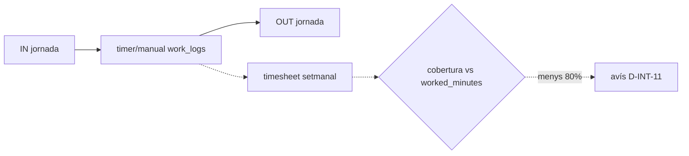
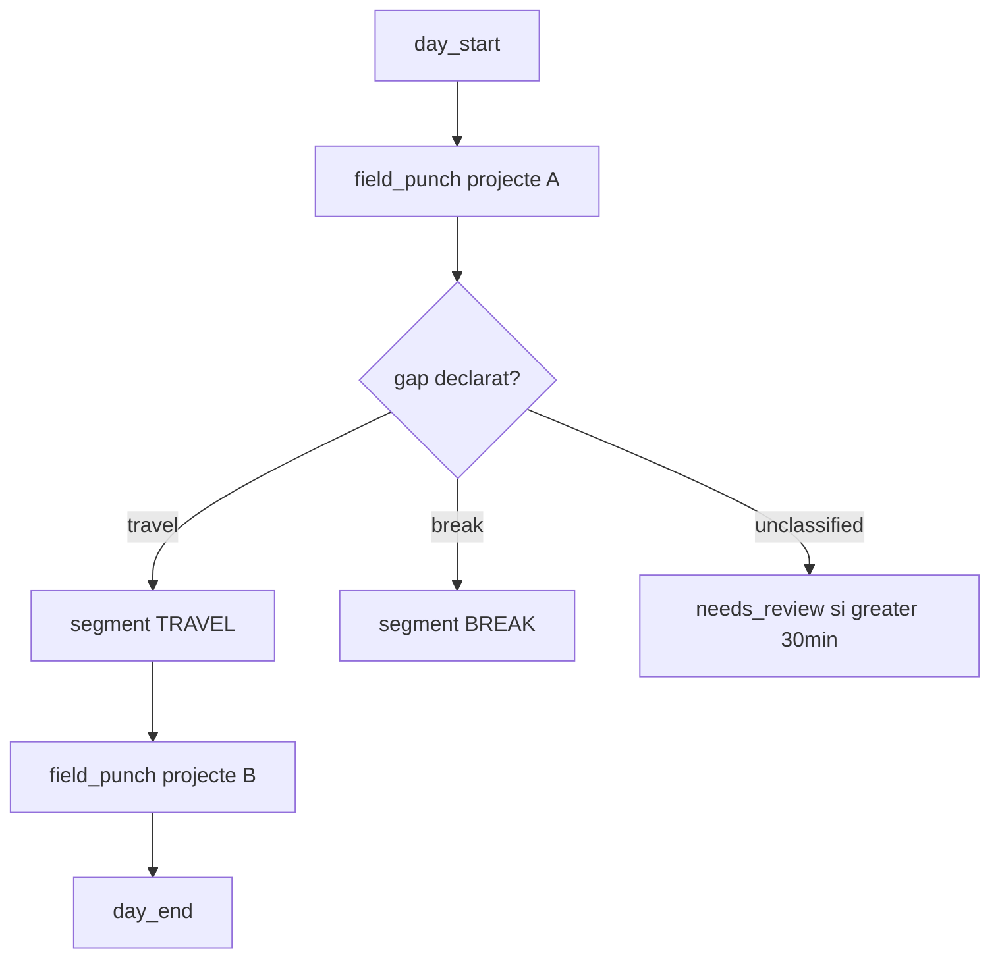

# Integració `work_logs` ↔ Control horari (`time_punches` + Track G)

> **Creat:** 2026-07-04  
> **Estat:** decisions tancades per a planificació — **sense implementació encara**  
> **Referències:**
> - [`prompts/projectes/plan.md`](../projectes/plan.md) — mòdul Projectes v2
> - [`docs/plans/checkin/plan-effective-work-time.md`](../../docs/plans/checkin/plan-effective-work-time.md) — Track G v4.2
> - [`docs/plans/checkin/plan.md`](../../docs/plans/checkin/plan.md) — Control Horari v3
> - [`docs/product-design/18-employee-portal-architecture.md`](../../docs/product-design/18-employee-portal-architecture.md) — portal empleat

> **Nota sobre rutes:** el prompt extern referenciava `prompts/attendance/*`. Al repositori, els plans vigents del control horari viuen a **`docs/plans/checkin/`**.

---

## 1. Resum de decisions D-INT-1 … D-INT-12

| ID | Decisió | Resum |
|----|---------|-------|
| **D-INT-1** | Un sol fitxatge visible | L'usuari fa **una acció**; el sistema escriu a `time_punches` i/o `work_logs` segons `entry_mode`. UI unificada. |
| **D-INT-2** | Tres `entry_mode` | `field_punch` (camp+legal), `timer` (web), `manual` (timesheet). |
| **D-INT-3** | Segments només de `field_punch` | `timer`/`manual` **no** alimenten `time_activity_segments`. |
| **D-INT-4** | `work_log_id` als segments | Segment WORK amb `field_punch` porta FK al `work_log`; hereta projecte/tasca/geo. |
| **D-INT-5** | `site_id` organitzatiu | A mobile, `time_punches.site_id` = base empresa; localització física via `work_log` + `project.asset_id`. **No** taula `work_locations`. |
| **D-INT-6** | `switch_work_log` atòmic | stop + gap opcional + start en una RPC. |
| **D-INT-7** | Gap declarat per l'empleat | TRAVEL/BREAK/day_end; sense declaració → `UNCLASSIFIED` → `needs_review` si > 30 min. |
| **D-INT-8** | Pausa legal pausa work_log | `break_start` → `work_log.status = paused` (només `field_punch`); `break_end` repren. |
| **D-INT-9** | Timesheet setmanal oficina | `upsert_timesheet_entries` per `timer`/`manual`. |
| **D-INT-10** | Aprovacions separades | Control horari (diari/mensual) ≠ aprovació timesheet projectes (setmanal). |
| **D-INT-11** | Cobertura imputació | Avís si imputació < 80% de `worked_minutes`; **no** bloqueja aprovació legal per defecte. |
| **D-INT-12** | Despeses i segments | `project_expenses.work_log_id` nullable; `expense_ref_id` a segments TRAVEL; veure §6. |

---

## 2. Matriu `entry_mode` vs sistemes afectats

| | `time_punches` | `time_activity_segments` | Timesheet (`project_timesheet_entries`) | `project_expenses` |
|---|:---:|:---:|:---:|:---:|
| **`field_punch`** | Vinculat (RPC composta) | **Sí** (WORK + gaps) | No | Opcional (via `work_log_id`) |
| **`timer`** | Independent (jornada IN/OUT separada) | **No** | **Sí** | Opcional |
| **`manual`** | Independent | **No** | **Sí** | Opcional |

**Billable vs nòmina:**

| Mètrica | Font principal | Consumidor |
|---------|----------------|------------|
| `worked_minutes` / `paid_minutes` | `time_daily_summaries` (Track G) | Nòmina D2 |
| Hores imputades projecte | `work_logs` + timesheet entries | Facturació / marges |
| Despeses client | `project_expenses` | Facturació |
| Indemnitzacions nòmina | `allowances` D2 | Gestoria |

---

## 3. Diagrama de flux per perfil

### 3.1 `fixed_site` sense projectes (oficina estàndard)

Sense `work_logs` obligatoris.

### 3.2 `fixed_site` amb projectes (consultoria, agència)

Aprovació control horari i aprovació timesheet **independents** (D-INT-10).

### 3.3 `mobile_peripatetic` (instal·lador, SAT)

RPC **`switch_work_log`** implementa FP1→FP2 sense dues accions UI.

---

## 4. UX per perfil — botons

| Acció | `fixed_site` | `mobile_peripatetic` |
|-------|--------------|----------------------|
| Inici jornada | Entrada (IN) | Iniciar jornada (`day_start` + legal) |
| Inici treball en projecte | Timer start (web) | Iniciar treball + projecte (`field_punch`) |
| Canvi de projecte | Nou timer (pot solapar*) | `switch_work_log` + declaració gap |
| Pausa | Pausa (+ pausa work_log si field) | Pausa (+ pausa work_log actiu) |
| Fi projecte | Timer stop | Fi treball + «Ara vas a…?» |
| Fi jornada | Sortida (OUT) | Finalitzar jornada (`day_end` + legal) |

\* Solapament timer només si el tenant ho permet; per defecte un sol `work_log` obert (constraint existent).

---

## 5. Regles de validació compartides

1. **Un sol `work_log` obert** per `(worker_id, tenant_id)` — constraint `one_open_log` ja a [`20260506000005_work_logs.sql`](../../supabase/migrations/20260506000005_work_logs.sql).
2. **Gap `UNCLASSIFIED` > 30 min** → `time_daily_summaries.needs_review = true` + `consolidation_meta.unclassified_gaps[]`.
3. **`break_start` sense work_log actiu** → comportament attendance normal (no error).
4. **`switch_work_log` sense `p_gap_kind`** → gap `UNCLASSIFIED` (D-INT-7).
5. **`field_punch` start** → RPC composta ha d'escriure `time_punch` + `work_log` en **mateixa transacció** (D-INT-1) — **pendent implementació** (avui són RPCs separades).
6. **Segments** només es deriven de `work_logs` amb `entry_mode = 'field_punch'` (D-INT-3).

---

## 6. D-INT-12 — `project_expenses.project_id` nullable (**adoptada al pla de despeses**)

**Estat actual al codi:** `project_id NOT NULL` a [`20260506000005_work_logs.sql`](../../supabase/migrations/20260506000005_work_logs.sql).  
**Producte:** Opció A adoptada a [`docs/plans/expenses/`](../../docs/plans/expenses/) (EXP-1) — implementació pendent (fase EX0).

| Opció | Descripció | Pros | Contres |
|-------|------------|------|---------|
| **A (adoptada)** | `project_id` nullable + `expense_scope` enum (`project`, `employee_personal`) | Un sol flux despeses; `work_log_id` opcional | Semàntica mixta a una taula |
| **B** | Taula `employee_expenses` separada | Clara separació personal vs projecte | Duplicació UI/export |
| **C** | Projecte «intern» fictici per despeses personals | No canvia NOT NULL | Hack de dades; informes brutsos |

**Decisió:** **Opció A** — nullable `project_id` + `expense_scope`. Despeses km vinculades a segment TRAVEL via `time_activity_segments.expense_ref_id → project_expenses.id`. Detall de modes, informes i reemborsament: pla de despeses.

---

## 7. Escletxes conegudes (codi actual vs decisions)

| Escletxa | Estat avui | Acció planificada |
|----------|------------|-------------------|
| `start_work_log` / `stop_work_log` **sense** `time_punch` | RPCs independents | Nova RPC **`api.field_punch_start`** / integració a D-INT-1 |
| **`entry_mode`** absent a `work_logs` | No existeix | Migració Fase Projects+G1b |
| **`time_activity_segments`** | No existeix | Track G1b |
| Outbox **dual** (`attendanceDb` + `field-ops-db`) | Dos stores IndexedDB | Unificar drainer o RPC batch **`sync_field_day_ops`** |
| `worker_id` → `profiles` vs `employee_id` | work_logs usa profiles | Mapping documentat a RPC; no barrejar IDs a UI |
| `WorkLogCard` només crida work_log | UI dual implícita | Refactor Fase 5 projectes + PunchPage mobile |
| Inferència `day_start`/`day_end` sense punch | No implementat | Opcional Fase G2b; preferir punch explícit si política ho exigeix |

---

## 8. Esdeveniments d'audit / automatitzacions

| Event | Quan | Ús |
|-------|------|-----|
| `WORK_LOG_STARTED` | `start_work_log` / `field_punch_start` | Ja previst al pla projectes |
| `WORK_LOG_STOPPED` | `stop_work_log` | Idem |
| `PROJECT_SWITCH` | `switch_work_log` | Notificar manager, workflows |
| `WORK_LOG_CLOSED` | tancament + gap day_end | Tancament obra |

Veure [`docs/plans/checkin/plan.md`](../../docs/plans/checkin/plan.md) §integració.

---

## 9. Fixtures de prova

Esborranys SQL: [`supabase/tests/attendance_work_logs_integration_fixtures.sql`](../../supabase/tests/attendance_work_logs_integration_fixtures.sql)

---

*Fi del document compartit — referenciar des de plans de Projectes i Control horari abans d'implementar.*
